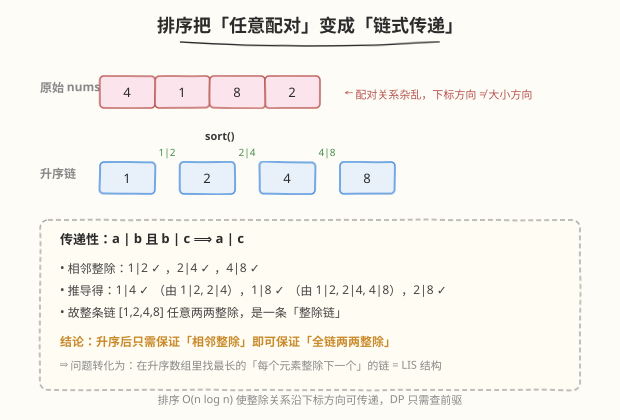
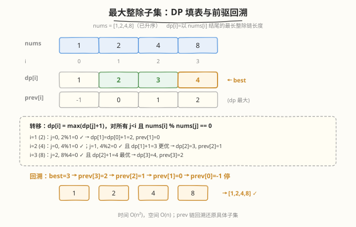

# 最大整除子集

- **题目名称**：最大整除子集
- **链接**：[368. 最大整除子集](https://leetcode.cn/problems/largest-divisible-subset/)
- **难度**：中等
- **标签**：动态规划、排序

## 1. 题目概述

给定一个由**无重复正整数**组成的集合 `nums`，返回其**最大整除子集** `answer`：子集中任意一对元素 `(answer[i], answer[j])` 都满足 `answer[i] % answer[j] == 0` 或 `answer[j] % answer[i] == 0`。若有多个有效解，返回任意一个即可。

**示例 1**：

```text
输入：nums = [1,2,3]
输出：[1,2]
解释：[1,3] 也被视为正确答案。
```

**示例 2**：

```text
输入：nums = [1,2,4,8]
输出：[1,2,4,8]
```

**约束条件**：

- `1 <= nums.length <= 1000`
- `1 <= nums[i] <= 2 * 10^9`
- `nums` 中的所有整数**互不相同**

> ⚠️ 要求返回**具体子集**而非仅长度，因此需像 [300. 最长递增子序列](../0201-0300/300_最长递增子序列.md) 那样额外维护前驱数组回溯还原。

---

## 2. 解题思路

### 2.1 暴力思路（枚举所有子集）

枚举所有 `2^n` 个子集，逐个检查两两整除关系。`n=1000` 时完全不可行。

### 2.2 核心观察：排序把「任意配对」变成「链式传递」



**关键洞察一**：若把子集**升序排序**为 $a_1 < a_2 < \dots < a_k$，则任意配对 $(a_i, a_j)\,(i<j)$ 的整除条件等价于 $a_j \bmod a_i = 0$（小模大必非 0，只需检查大能否被小整除）。

**关键洞察二（传递性）**：整除关系在升序序列上有**链式传递性**——

$$a_i \mid a_{i+1} \text{ 且 } a_{i+1} \mid a_{i+2} \;\Longrightarrow\; a_i \mid a_{i+2}$$

因此一个升序子集**两两整除** $\iff$ **相邻元素整除** $\iff$ 每个元素能整除下一个。整个子集是一条「整除链」。

> 💡 这正是 [300. 最长递增子序列](../0201-0300/300_最长递增子序列.md) 的结构同构：LIS 要求 `nums[j] < nums[i]`，本题要求 `nums[i] % nums[j] == 0`。排序后，本题的整除链与 LIS 的递增链在算法骨架上完全一致——都是「`dp[i]` = 以 `nums[i]` 结尾的最长链长度，往前找一个合法前驱接上」。

### 2.3 状态定义与转移

**定义**：`dp[i]` = 以 `nums[i]` 结尾（作为最大元素）的最大整除子集的大小。

**转移**：

```text
dp[i] = max(dp[j] + 1)   对所有 j < i 且 nums[i] % nums[j] == 0
dp[i] = 1                若没有满足条件的 j（自身单独成集）
```

**前驱**：`prev[i]` = 使 `dp[i]` 取得最大值的 `j`（无前驱时为 `-1`），用于回溯还原子集。

**答案**：`dp` 中的最大值所在位置 `best`，从 `best` 沿 `prev` 链回溯即得子集。

### 2.4 算法流程

1. **排序** `nums` 升序
2. 初始化 `dp[i]=1`，`prev[i]=-1`
3. 双重循环：`i` 从 `0` 到 `n-1`，`j` 从 `0` 到 `i-1`
   - 若 `nums[i] % nums[j] == 0` 且 `dp[j]+1 > dp[i]`：`dp[i]=dp[j]+1`，`prev[i]=j`
4. 找 `dp` 最大值下标 `best`
5. 从 `best` 沿 `prev` 回溯收集 `nums[best]`，逆序即为结果

### 2.5 示例演算

`nums = [1,2,4,8]`（已升序）：

| i | nums[i] | 检查 j | dp[i] | prev[i] |
|---|---------|--------|-------|---------|
| 0 | 1 | — | 1 | -1 |
| 1 | 2 | j=0: 2%1=0 ✓ | 2 | 0 |
| 2 | 4 | j=0: 4%1=0 ✓; j=1: 4%2=0 ✓ (dp[1]+1=3 更优) | 3 | 1 |
| 3 | 8 | j=2: 8%4=0 ✓ (dp[2]+1=4 最优) | 4 | 2 |

`best=3`，回溯链 `3 → 1 → 0`（即 `prev[3]=2 → prev[2]=1 → prev[1]=0 → prev[0]=-1`），收集 `nums[3],nums[2],nums[1],nums[0] = [8,4,2,1]`，逆序得 `[1,2,4,8]` ✓。



---

## 3. 参考代码

### C++

```cpp
class Solution {
public:
    vector<int> largestDivisibleSubset(vector<int>& nums) {
        sort(nums.begin(), nums.end());
        int n = nums.size();
        vector<int> dp(n, 1), prev(n, -1);
        int best = 0;
        for (int i = 1; i < n; i++) {
            for (int j = 0; j < i; j++) {
                if (nums[i] % nums[j] == 0 && dp[j] + 1 > dp[i]) {
                    dp[i] = dp[j] + 1;
                    prev[i] = j;
                }
            }
            if (dp[i] > dp[best]) best = i;
        }
        vector<int> ans;
        while (best != -1) {
            ans.push_back(nums[best]);
            best = prev[best];
        }
        return ans;
    }
};
```

### Python

```python
class Solution:
    def largestDivisibleSubset(self, nums: List[int]) -> List[int]:
        nums.sort()
        n = len(nums)
        dp = [1] * n
        prev = [-1] * n
        best = 0
        for i in range(1, n):
            for j in range(i):
                if nums[i] % nums[j] == 0 and dp[j] + 1 > dp[i]:
                    dp[i] = dp[j] + 1
                    prev[i] = j
            if dp[i] > dp[best]:
                best = i
        ans = []
        while best != -1:
            ans.append(nums[best])
            best = prev[best]
        return ans
```

---

## 4. 复杂度分析

| 维度 | 复杂度 | 说明 |
|------|--------|------|
| 时间复杂度 | `O(n²)` | 排序 `O(n log n)` + 双重循环 `O(n²)`，瓶颈在 DP |
| 空间复杂度 | `O(n)` | `dp` 与 `prev` 数组 |

> 💡 `n ≤ 1000` 时 `O(n²)` 完全够用。本题也存在类似 LIS 的 `O(n log n)` 潜在优化思路（按整除关系维护链尾最小值），但实现复杂且收益有限，面试中 `O(n²)` DP 是标准解法。

---

## 5. 扩展：为什么必须先排序？

若不排序，`nums[i] % nums[j] == 0` 只能说明 `nums[j]` 整除 `nums[i]`（`nums[j]` 是较小者），但 `j` 与 `i` 的大小关系不确定，无法保证「链式传递」成立——可能出现 `a|b`、`b|c` 但 `a` 排在 `c` 之后导致 DP 漏接。

排序后，`j < i` 必有 `nums[j] <= nums[i]`，`nums[i] % nums[j] == 0` 严格表达「`nums[j]` 整除 `nums[i]`」，整除链方向与下标方向一致，传递性可直接沿下标链应用。

---

## 6. 面试要点

1. **为什么排序后只需检查相邻整除，而非两两？**

   - 升序链上整除关系可传递：$a\mid b$ 且 $b\mid c \Rightarrow a\mid c$。
   - 因此「整条链两两整除」$\iff$「每个元素整除下一个」。DP 中 `nums[i] % nums[j] == 0` 即「`nums[j]` 整除 `nums[i]`」，把 `i` 接在 `j` 后，链性质自动延伸到 `i` 与链上所有前驱。

2. **和 [300. 最长递增子序列](https://leetcode.cn/problems/longest-increasing-subsequence/) 的关系？**

   - 结构同构：都是「`dp[i]` = 以 `nums[i]` 结尾的最长链」，往前找合法前驱接上。
   - 区别在于「合法前驱」的判定：LIS 是 `nums[j] < nums[i]`，本题是 `nums[i] % nums[j] == 0`。
   - 本题必须排序（LIS 不需要排序，因为下标顺序已蕴含原序）；本题要求返回具体子集，需像 LIS 还原版一样维护 `prev`。

3. **为什么要维护 `prev` 数组？**

   - 题目要求返回**具体子集**而非长度。`dp[i]` 只记录大小，`prev[i]` 记录转移来源，回溯即可还原构成。
   - 找 `dp` 最大值下标 `best` 后，沿 `prev` 链一路回溯到 `-1`，逆序输出即得升序子集。

4. **`nums[i]` 高达 `2*10^9` 会有问题吗？**

   - 不会。只做取模与比较，无溢出风险（C++ `int` 范围约 `2.1*10^9`，恰好覆盖；若担心可改 `long long`）。
   - 题目保证元素互不相同，无需去重。

5. **能否返回任意一个最优解？为什么？**

   - 题目允许任意最优解。当存在多个 `j` 使 `dp[j]+1` 相同时，`prev[i]` 记录**第一个**满足严格大于的 `j`（代码用 `>` 而非 `>=`），自然得到其中一个解；改成 `>=` 则会取最后一个，仍是合法最优解。

---

## 7. 同类练习题

- [300. 最长递增子序列](https://leetcode.cn/problems/longest-increasing-subsequence/)（[题解](../0201-0300/300_最长递增子序列.md)）：DP + 前驱回溯的母题，结构同构
- [377. 组合总和 IV](https://leetcode.cn/problems/combination-sum-iv/)（[题解](377_组合总和IV.md)）：DP 求方案数（计数型，对比本题求具体方案）
- [279. 完全平方数](https://leetcode.cn/problems/perfect-squares/)（[题解](../0201-0300/279_完全平方数.md)）：DP 求最小数量，承接「前驱复用」思想
