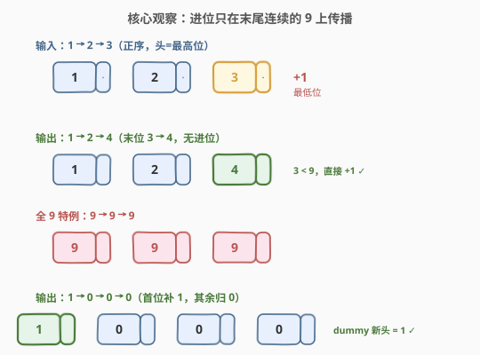
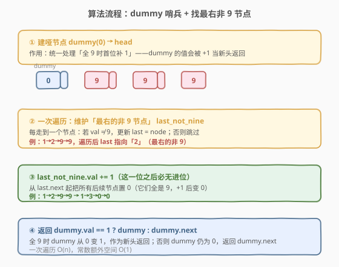
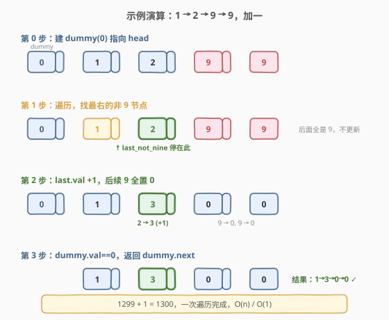

# LeetCode 给单链表加一 题解

## 1. 题目概述

- **标题 / 题号**：给单链表加一（#369，medium）
- **链接**：https://leetcode.cn/problems/plus-one-linked-list/
- **难度**：中等
- **标签**：链表、数学、模拟

**题意**：用一个**非空单链表**表示一个非负整数，链表的每个节点存储**一位数字**。数字按照**正序方式存储**——最高位在链表头，最低位在链表尾。请在该整数的基础上**加一**，返回结果链表。

可以假设该整数除了数字 `0` 本身之外，不包含任何前导零。

**示例 1**：

```text
输入：head = [1,2,3]
输出：[1,2,4]
解释：链表表示数字 123，加一后得到 124。
```

**示例 2**：

```text
输入：head = [9,9,9]
输出：[1,0,0,0]
解释：链表表示数字 999，加一后得到 1000，位数增加一位。
```

**约束**：

- 链表节点数在范围 `[1, 100]` 内
- `0 <= Node.val <= 9`
- 题目数据保证链表表示的数字没有前导零（除了数字 `0` 本身）

> 💡 这道题是 [66. 加一](../0001-0100/66_加一.md) 的**链表版**——核心套路完全一致（进位只在末尾连续的 9 上传播），难点在于链表是**正序存储**：加 1 发生在**尾节点**（最低位），而进位需要**向头节点方向**传播。单链表无法回溯前驱，所以不能像数组那样「从尾到头」反着扫。需要换一个视角：一次正向遍历，定位「最右的非 9 节点」即可。

## 2. 解题思路

### 2.1 暴力思路：反转链表加一再反转

最直觉的做法：先把链表反转成「逆序」（头=最低位），套用 [2. 两数相加](../0001-0100/2_两数相加.md) 的逐位进位模板加一，再把结果反转回正序。

```text
reverse(head)          # 1→2→3 变 3→2→1（头=个位）
从头扫描 +1 进位        # 3→4，无进位，得 4→2→1
reverse(result)        # 反转回 1→2→4
```

> ⚠️ 缺点：需要**两次反转**，共 3 次完整遍历，指针操作多、易出错。而且没有利用「加一」的特殊性——只加 1 而非加任意数，进位链的结构远比通用加法简单。面试官会追问「能否一遍扫完、不反转？」

另一种暴力是把链表还原成整数再 `+1`。但节点数可达 100，对应整数高达 $10^{100}$，远超 64 位整型，与 66 题同理不可行。

### 2.2 核心观察：找最右的非 9 节点



承接 66 题的关键洞察——**加 1 的进位只在末尾连续的 9 上传播**：

- 某位为 9 时，$9+1=10$，该位置 0、进位 1 继续向高位传播；
- 某位 $<9$ 时，加 1 后 $<10$，**不产生进位**，更高位完全不变。

把这条性质平移到正序链表上：**从左到右遍历一次**，记住「最右边那个值 $\ne 9$ 的节点」`last_not_nine`：

- 遍历结束后，`last_not_nine` 就是会被 $+1$ 影响的「最高位」；
- 把 `last_not_nine.val += 1`，然后把 `last_not_nine` 之后的所有节点（必然全是 9）置 0——它们对应「连续 9 加 1 后归 0」的进位链；
- 若整条链全是 9（找不到非 9 节点），需要在**最前面新加一个值为 1 的头节点**，原链全部归 0。

> 💡 **为什么一遍正向扫就行**：虽然进位是从低位往高位传播（向左），但我们并不需要真的「传播」进位——只要知道**进位链的起点和终点**。起点是尾节点，终点（向左能影响到的最远位置）恰好是「最右的非 9 节点」。一次遍历就能定位这个终点，事后直接修改即可，无需回溯。

**用哑节点统一「全 9」特例**：建一个 `dummy(0)` 指向 `head`，把它也纳入「找最右非 9」的扫描。因为 `dummy.val = 0 < 9`，它**永远是合法的 `last_not_nine`**。于是：

- **普通情况**：`last_not_nine` 落在原链某个节点，`+1` 后 `dummy` 仍为 0，返回 `dummy.next`；
- **全 9 情况**：`last_not_nine` 落在 `dummy`，`dummy.val` 从 0 变 1，原链全置 0，**直接返回 `dummy` 作为新头**——无需单独 `new` 新节点、无需特判。

### 2.3 算法流程图



**完整步骤**：

1. **建哑节点**：`dummy = ListNode(0)`，`dummy.next = head`。
2. **遍历找最右非 9**：`node = dummy`，`last_not_nine = dummy`；从 `dummy` 起向右扫描，每遇到 `node.val != 9` 就更新 `last_not_nine = node`，直到 `node.next == null` 停止。
3. **加 1**：`last_not_nine.val += 1`。
4. **后续全置 0**：从 `last_not_nine.next` 起向右扫，把每个节点 `val = 0`。
5. **返回**：`dummy.val == 1 ? dummy : dummy.next`（全 9 时 `dummy` 从 0 变 1，作为新头；否则返回原头）。

> ⚠️ 第 4 步「后续全置 0」不是多余的——`last_not_nine` 之后的节点必然全是 9（否则 `last_not_nine` 还会往后更新），它们对应进位链上「$9+1=10$ 写 0 进 1」的位置，必须显式归 0。漏掉这一步会得到 `1→3→9→9` 这种错误结果。

### 2.4 示例演算

以 `head = [1, 2, 9, 9]`（表示 1299，加一得 1300）为例：



| 步骤 | 操作 | `last_not_nine` | 链表状态 |
|------|------|-----------------|----------|
| 0 | 建 `dummy(0)→1→2→9→9` | dummy | `0→1→2→9→9` |
| 1 | 从左扫，遇 1 非 9 更新，遇 2 非 9 更新，遇 9、9 跳过 | 节点「2」 | `0→1→2→9→9` |
| 2 | `last_not_nine.val += 1`（2→3），后续 9、9 全置 0 | 节点「3」 | `0→1→3→0→0` |
| 3 | `dummy.val == 0`，返回 `dummy.next` | — | `1→3→0→0` ✓ |

对照全 9 的 `head = [9, 9, 9]`：扫描时原链全是 9，`last_not_nine` 始终停在 `dummy`；第 2 步 `dummy.val` 从 0 变 1，后续 `9→0, 9→0, 9→0`；第 3 步 `dummy.val == 1`，直接返回 `dummy`，结果 `1→0→0→0`。两种情况共用同一套代码，无任何特判分支。

> 💡 一次遍历定位 + 一次遍历置 0，总共两次遍历，但都是正向扫描、无反转。常数额外空间（仅 `dummy` 一个新节点）。

## 3. 参考代码

### C++

```cpp
// 给单链表加一.cpp —— dummy 哨兵 + 找最右非 9 节点
// 编译: g++ -O2 -std=c++17 给单链表加一.cpp -o plus_one_linked_list
struct ListNode {
    int val;
    ListNode* next;
    ListNode() : val(0), next(nullptr) {}
    ListNode(int x) : val(x), next(nullptr) {}
    ListNode(int x, ListNode* n) : val(x), next(n) {}
};

class Solution {
public:
    ListNode* plusOne(ListNode* head) {
        ListNode dummy(0);
        dummy.next = head;

        // 第 1 步：从 dummy 起，找最右的「非 9」节点
        ListNode* last_not_nine = &dummy;
        for (ListNode* node = &dummy; node != nullptr; node = node->next) {
            if (node->val != 9) {
                last_not_nine = node;
            }
        }

        // 第 2 步：该位 +1
        last_not_nine->val += 1;

        // 第 3 步：之后的所有节点（必然全是 9）置 0
        for (ListNode* node = last_not_nine->next; node != nullptr; node = node->next) {
            node->val = 0;
        }

        // 第 4 步：全 9 时 dummy 从 0 变 1，作为新头返回
        return (dummy.val == 1) ? &dummy : dummy.next;
    }
};
```

### Python

```python
from typing import Optional

class ListNode:
    def __init__(self, val=0, next=None):
        self.val = val
        self.next = next

class Solution:
    def plusOne(self, head: Optional[ListNode]) -> Optional[ListNode]:
        dummy = ListNode(0)
        dummy.next = head

        # 第 1 步：从 dummy 起，找最右的「非 9」节点
        last_not_nine = dummy
        node = dummy
        while node:
            if node.val != 9:
                last_not_nine = node
            node = node.next

        # 第 2 步：该位 +1
        last_not_nine.val += 1

        # 第 3 步：之后的所有节点（必然全是 9）置 0
        node = last_not_nine.next
        while node:
            node.val = 0
            node = node.next

        # 第 4 步：全 9 时 dummy 从 0 变 1，作为新头返回
        return dummy if dummy.val == 1 else dummy.next
```

> 💡 **写法要点**：`dummy` 把「全 9 时新增头节点」这一特例**折叠进主流程**——因为 `dummy.val = 0` 恒非 9，它永远是 `last_not_nine` 的下界，无需 `if (all_nine)` 分支。这是链表题用哑节点统一边界的经典套路，与 [2. 两数相加](../0001-0100/2_两数相加.md) 用 `dummy` 统一首节点创建、[19. 删除倒数第 N 个节点](../0001-0100/19_删除倒数第N个节点.md) 用 `dummy` 统一删除头节点同理。

## 4. 复杂度分析

| 维度 | 复杂度 | 说明 |
|------|--------|------|
| **时间复杂度** | $O(n)$ | 两次正向遍历：第 1 次定位 `last_not_nine` 走满 $n+1$ 个节点（含 `dummy`），第 2 次置 0 最多走 $n$ 个节点，合计 $O(n)$ |
| **空间复杂度** | $O(1)$ | 仅新建 1 个 `dummy` 节点 + 几个指针变量，常数额外空间；结果在原链表上原地修改 |

> ⚠️ 本题是**原地修改**输入链表。若要求不破坏输入，需先复制一份链表再操作，空间升至 $O(n)$。面试时说清「是否允许修改输入」即可。

## 5. 扩展：反转链表解法与通用加法

### 5.1 反转链表解法

虽然不如「找最右非 9」优雅，但反转法是**通用加法**的直接套用，思路直白：

```python
def plusOne(self, head):
    def reverse(h):
        prev = None
        while h:
            nxt = h.next
            h.next = prev
            prev, h = h, nxt
        return prev

    rev = reverse(head)          # 逆序，头=最低位
    carry, node = 1, rev
    while node and carry:
        s = node.val + carry
        node.val = s % 10
        carry = s // 10
        node = node.next
    if carry:                    # 仍有进位，追加新节点（在逆序链表尾）
        rev.next = ListNode(1)   # 注意 rev 现在指向逆序链表头
    return reverse(rev)
```

三次遍历（反转 + 加一 + 反转），$O(n)$ 时间、$O(1)$ 空间，但代码量和出错概率都高于「找最右非 9」法。**面试建议**：先讲最优的「找最右非 9」法，再提一句「也可反转后套用通用加法模板」作为对照，体现对两种思路的取舍。

### 5.2 与 66 题数组加一的对照

| 维度 | [66. 加一](../0001-0100/66_加一.md)（数组） | 369 题（链表） |
|------|------------------------------------------|----------------|
| 存储顺序 | 正序（头=最高位） | 正序（头=最高位） |
| 扫描方向 | 从右向左（数组可随机访问） | 从左向右（链表只能正向遍历） |
| 核心套路 | 末尾连续 9 置 0，首个非 9 +1 | 找最右非 9 节点 +1，后续 9 置 0 |
| 全 9 特例 | `digits.insert(begin, 1)` | `dummy` 哨兵自动成新头 |
| 时间 | $O(n)$ | $O(n)$ |
| 空间 | $O(1)$（原地） | $O(1)$（原地 + 1 个 dummy） |

两题的**算法内核完全同构**——都是「定位进位链终点 + 该位 +1 + 进位链归 0 + 全 9 时补头」。差别仅在数据结构：数组可倒着扫，链表只能正着扫，于是把「找首个非 9」改写成「找最右非 9」。掌握这层对应关系，链表加法题即可一眼看穿。

## 6. 面试要点

1. **为什么不能反转后套用通用加法模板就够了，还要学「找最右非 9」法？**

   - 反转法需要 3 次遍历 + 大量指针翻转操作，代码冗长、易错；「找最右非 9」法只需 2 次正向遍历、无指针翻转，更简洁高效。
   - 更重要的是，「找最右非 9」利用了「加一」的特殊性（只加 1，进位链结构简单），体现了对问题的**针对性优化**——面试官考察的正是这种「不套通用模板、针对具体问题找更优解」的思维。

2. **为什么用 dummy 哨兵？它解决了什么问题？**

   - 「全 9」时需要在链表最前面新加一个值为 1 的头节点，这与普通情况的「返回原头」逻辑不一致，需要特判。
   - 引入 `dummy(0)` 指向 `head` 后，`dummy.val = 0` 恒非 9，永远是合法的 `last_not_nine` 下界。全 9 时 `dummy.val` 被加成 1，直接作为新头返回；普通情况 `dummy.val` 仍为 0，返回 `dummy.next`。**特例被折叠进主流程**，代码无 `if (all_nine)` 分支。

3. **第 3 步「后续全置 0」能否省略？为什么？**

   - 不能。`last_not_nine` 之后的节点必然全是 9（否则 `last_not_nine` 还会往后更新），它们对应进位链上「$9+1=10$ 写 0」的位置。若不显式归 0，链表会保留原来的 9，得到 `1→3→9→9` 这种错误结果。
   - 这一步本质上是在「补上进位链的写 0 操作」——只是因为所有 9 都变成 0，统一置 0 即可，无需逐位判断。

4. **如果要求不能修改输入链表怎么办？**

   - 先复制一份链表（$O(n)$ 空间），再在副本上执行原地算法。复制时注意只复制节点值与 next 关系，不共享节点对象。
   - 或者改用反转法在副本上操作，本质相同。关键是在面试时**主动说明**「原地算法会修改输入，如需保留输入可先复制」。

5. **进位最多传播多少位？与 66 题数组版的复杂度一致吗？**

   - 进位最多传播 $n$ 位（全 9 链表），最坏 $O(n)$。平均情况下末尾连续 9 的长度期望很小（每位为 9 概率 $1/10$），但链表只能正向遍历，无法像数组那样「遇非 9 即停」提前终止第 1 次扫描——必须扫满整条链才能确定「最右非 9」。所以即使平均进位链很短，时间仍是 $O(n)$。
   - 这点与 66 题数组版略有差异：数组可从末尾倒扫、遇非 9 立即返回，平均 $O(1)$；链表版无论如何都要扫满一次。结构限制所致，无法规避。

> 💡 **一句话总结**：369 题是 66 题的链表镜像——同构的「找进位链终点 +1、进位链归 0、全 9 补头」内核，只因链表只能正向遍历，把「倒扫找首个非 9」改写成「正扫找最右非 9」。`dummy` 哨兵把全 9 特例折叠进主流程，一遍定位、一遍置 0，$O(n)$ 时间、$O(1)$ 空间。核心是「针对加一特殊性优化，不套通用加法模板」的思维。

## 同类练习题

| # | 题目 | 与本题的关联 |
|---|------|-------------|
| 66 | [加一](https://leetcode.cn/problems/plus-one/)（[题解](../0001-0100/66_加一.md)） | 数组版「加一」，与本题同构，倒扫找首个非 9 +1、全 9 首位补 1 |
| 2 | [两数相加](https://leetcode.cn/problems/add-two-numbers/)（[题解](../0001-0100/2_两数相加.md)） | 链表逆序存储的通用加法模板，逐位相加 + carry，哑节点统一首节点 |
| 445 | [两数相加 II](https://leetcode.cn/problems/add-two-numbers-ii/) | 链表正序存储的两数相加，需先反转/入栈对齐低位，是本题的「通用加法」进阶版 |
| 415 | [字符串相加](https://leetcode.cn/problems/add-strings/)（[题解](../0401-0500/415_字符串相加.md)） | 字符串大数加法通用模板，双指针从右逐位相加 + 进位，本题的反转解法即其链表映射 |
| 206 | [反转链表](https://leetcode.cn/problems/reverse-linked-list/)（[题解](../0201-0300/206_反转链表.md)） | 反转法解法的基石，指针翻转基础模板 |
