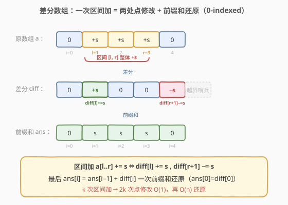
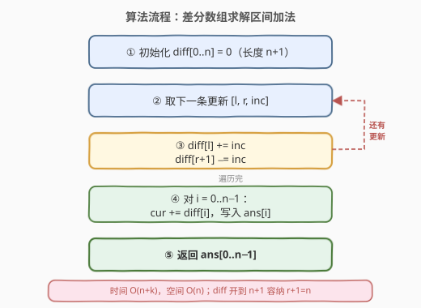
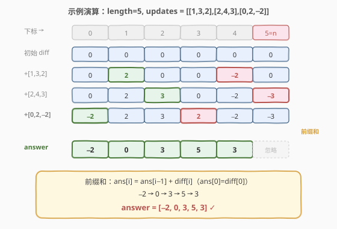

# 区间加法

- **题目名称**：区间加法
- **链接**：[370. 区间加法](https://leetcode.cn/problems/range-addition/)
- **难度**：中等
- **标签**：数组、差分数组、前缀和

## 1. 题目概述

给定一个长度为 `length` 的整数数组，初始时每个元素都为 `0`。再给定 `k` 个更新操作，每个操作表示为一个三元组 `[startIndex, endIndex, inc]`，含义是把数组下标 `startIndex` 到 `endIndex`（**包含两端，0-indexed**）的每个元素都加上 `inc`。请返回所有更新操作执行完毕后的最终数组。

**示例 1**：

```text
输入：length = 5, updates = [[1,3,2],[2,4,3],[0,2,-2]]
输出：[-2,0,3,5,3]
解释：
初始状态 : [ 0, 0, 0, 0, 0]
操作 [1,3,2] 后 : [ 0, 2, 2, 2, 0]
操作 [2,4,3] 后 : [ 0, 2, 5, 5, 3]
操作 [0,2,-2] 后 : [-2, 0, 3, 5, 3]
```

**示例 2**：

```text
输入：length = 10, updates = [[2,4,6],[5,6,8],[1,9,-4]]
输出：[0,-4,2,2,2,4,4,-4,-4,-4]
```

**约束条件**：

- $1 \le \text{length} \le 10^5$
- $0 \le \text{updates.length} \le 10^4$
- $0 \le \text{startIndex} \le \text{endIndex} < \text{length}$
- $-1000 \le \text{inc} \le 1000$

> ⚠️ 注意：每个更新是**区间加**操作（对一段连续下标都加 `inc`），且所有更新操作给出后才**一次性**返回最终数组——这正是**差分数组**的典型应用场景（离线、纯区间加、最后一次性查询）。

---

## 2. 解题思路

### 2.1 暴力思路

对每条更新 `[l, r, inc]`，循环把 `ans[l..r]` 每个元素都加 `inc`。共 `k` 条更新、每条最长 $O(n)$，总时间 $O(k \cdot n)$。在 $k, n = 10^4, 10^5$ 时可达 $10^9$ 量级，必然超时。

### 2.2 核心观察：差分数组



差分数组 `diff` 是原数组 `a` 的「相邻差」：$\text{diff}[i] = a[i] - a[i-1]$（约定 $a[-1]=0$）。反过来，`a` 就是 `diff` 的**前缀和**：$a[i] = \text{diff}[0] + \text{diff}[1] + \dots + \text{diff}[i]$。

于是「把 `a[l..r]` 整体加 `inc`」这个区间操作，可以拆成两处**点修改**：

$$
\text{diff}[l]\;{+}{=}\;\text{inc},\qquad \text{diff}[r+1]\;{-}{=}\;\text{inc}
$$

直观理解：在 `l` 处「开启」一个 `+inc` 的贡献，它在后续前缀和里一直生效；到 `r+1` 处「关闭」，用一个 `-inc` 把它抵消。这样 `l..r` 之间每个位置的前缀和都多了 `inc`，而 `r+1` 及以后恢复原值。

> 💡 **关键转化**：`k` 次区间加 → `2k` 次点修改（$O(1)$ 每次），最后再做**一趟前缀和**即可还原最终数组。这正是「离线、纯区间加、最后一次性查询」的最佳模板。本题与 [1109. 航班预订统计](../1101-1200/1109_航班预订统计.md) 是同一模板的 0-indexed 版本。

### 2.3 算法流程图



> ⚠️ **下标与边界**：本题是 **0-indexed**。`r+1` 可能等于 `n`（当 `r = n-1` 时），所以 `diff` 要开到长度 `n+1`（下标 `0..n`），让 `diff[r+1] -= inc` 不越界。下标 `n` 处的值在最后前缀和还原时**不写入答案**（答案只取 `0..n-1`），它的作用仅是承接最后一个 `-inc`，保证写入合法。

### 2.4 示例演算

以 `length = 5, updates = [[1,3,2],[2,4,3],[0,2,-2]]` 为例，差分数组取下标 `0..5`（`5 = n` 用于承接 `r+1` 的 `-inc`）：



| 步骤 | 操作 | diff[0] | diff[1] | diff[2] | diff[3] | diff[4] | diff[5] |
|------|------|---------|---------|---------|---------|---------|---------|
| 初始 | — | 0 | 0 | 0 | 0 | 0 | 0 |
| 1 | 加 [1,3,2]：diff[1]+=2, diff[4]−=2 | 0 | 2 | 0 | 0 | −2 | 0 |
| 2 | 加 [2,4,3]：diff[2]+=3, diff[5]−=3 | 0 | 2 | 3 | 0 | −2 | −3 |
| 3 | 加 [0,2,−2]：diff[0]+=−2, diff[3]−=−2 | −2 | 2 | 3 | 2 | −2 | −3 |

最后对 `diff[0..4]` 求前缀和（`ans[i] = ans[i-1] + diff[i]`，`ans[0] = diff[0]`）：

- `ans[0] = −2`
- `ans[1] = −2 + 2 = 0`
- `ans[2] = 0 + 3 = 3`
- `ans[3] = 3 + 2 = 5`
- `ans[4] = 5 + (−2) = 3`

最终答案为 `[-2, 0, 3, 5, 3]`，`diff[5] = −3` 落在 `n` 之外被忽略。

> 💡 **第三步的细节**：`[0,2,-2]` 中 `inc = -2`，所以 `diff[r+1] -= inc` 即 `diff[3] -= (-2) = diff[3] + 2`，相当于在 `r+1` 处「抵消」一个负贡献，本质仍是「在 `r+1` 关闭 `+inc` 这个贡献」。无论 `inc` 正负，公式 `diff[l]+=inc, diff[r+1]-=inc` 永远成立。

---

## 3. 参考代码

### C++

```cpp
class Solution {
  public:
    vector<int> getModifiedArray(int length, vector<vector<int>>& updates) {
        vector<int> diff(length + 1, 0); // 0-indexed，多开一位容纳 diff[r+1]
        for (auto& u : updates) {
            int l = u[0], r = u[1], inc = u[2];
            diff[l] += inc;
            diff[r + 1] -= inc;
        }
        vector<int> ans(length);
        int cur = 0;
        for (int i = 0; i < length; ++i) {
            cur += diff[i];
            ans[i] = cur;
        }
        return ans;
    }
};
```

### Python

```python
class Solution:
    def getModifiedArray(self, length: int, updates: List[List[int]]) -> List[int]:
        diff = [0] * (length + 1)  # 0-indexed，多开一位容纳 diff[r+1]
        for l, r, inc in updates:
            diff[l] += inc
            diff[r + 1] -= inc
        ans = []
        cur = 0
        for i in range(length):
            cur += diff[i]
            ans.append(cur)
        return ans
```

> 💡 Python 也可用 `itertools.accumulate` 一行还原前缀和：`ans = list(accumulate(diff))[:length]`，语义完全等价。

---

## 4. 复杂度分析

| 维度 | 复杂度 | 说明 |
|------|--------|------|
| 时间复杂度 | $O(n + k)$ | $k = \text{len(updates)}$：遍历更新做 $2k$ 次点修改 $O(k)$，再扫一遍 `diff` 求前缀和 $O(n)$ |
| 空间复杂度 | $O(n)$ | 差分数组长度 $n+1$（不计返回的 `ans`）；若直接在答案数组上原地标记可省去 `diff` |

> 💡 若更新次数与数组长度同级（本题 $k \approx 10^4, n \approx 10^5$），$O(n+k)$ 把总时间从暴力的 $O(k \cdot n) \approx O(n^2)$ 压缩到线性。

---

## 5. 扩展：差分数组的适用边界

差分数组适合**「离线 + 纯区间加 + 最后一次性查询」**的场景：每次区间加 $O(1)$，但查询任意单点是 $O(n)$（要重算前缀和）。

- **在线查询**：若「区间加」与「单点查询」交替进行，差分数组每次查询都要 $O(n)$ 重建，不再高效。此时应改用**树状数组（BIT）维护差分序列**：区间加转化为两次单点更新 $O(\log n)$，单点查询即差分前缀和 $O(\log n)$。
- **二维区间加**：可推广到**二维差分**，对子矩阵加常数用四个角点修改 $O(1)$，再二维前缀和还原。
- **区间加 + 区间查询**：差分配合树状数组维护「差分」和「下标×差分」两项，可做到区间加、区间和均为 $O(\log n)$。

> 💡 判断是否该用差分数组的一个信号：**所有修改都先给完、最后才读结果**——这种离线形态正是差分的舒适区。

---

## 6. 面试要点

1. **为什么是 `diff[l] += inc, diff[r+1] -= inc`？**
   - 因为原数组是差分数组的前缀和。在 `l` 加 `inc`，会让 `l` 及之后所有前缀和都多 `inc`；在 `r+1` 减 `inc`，恰好把这份多余的贡献从 `r+1` 起抵消，于是只有 `l..r` 区间净增 `inc`。

2. **数组为什么开到 `n+1`？**
   - 本题 0-indexed，且 `r+1` 最大可达 `n`（当 `r = n-1` 时）。开 `n+1` 保证 `diff[r+1] -= inc` 不越界。虽然下标 `n` 处的值不影响 `0..n-1` 的答案，但写入时必须合法。

3. **当 `inc` 为负数时公式还成立吗？**
   - 完全成立。`inc = -2` 时 `diff[l] += -2`（在 `l` 开启一个 `-2` 贡献），`diff[r+1] -= -2` 即 `diff[r+1] += 2`（在 `r+1` 用 `+2` 抵消）。公式 `diff[l]+=inc, diff[r+1]-=inc` 对任意符号的 `inc` 都正确，无需分类讨论。

4. **查询与修改交替（在线）怎么办？**
   - 差分支持 $O(1)$ 区间加，但单点查询要 $O(n)$。改用树状数组维护 `diff`：区间加做两次单点更新，单点查询做一次前缀和，均为 $O(\log n)$。

5. **差分与前缀和是什么关系？**
   - 互为逆运算。若 `diff` 是 `a` 的差分（`diff[i]=a[i]-a[i-1]`），则 `a` 是 `diff` 的前缀和。所以「对 `a` 做区间加」等价于「对 `diff` 做两点修改」——这正是把 $O(n)$ 区间操作降为 $O(1)$ 的本质。

---

## 7. 同类练习题

- [1109. 航班预订统计](https://leetcode.cn/problems/corporate-flight-bookings/)（[题解](../1101-1200/1109_航班预订统计.md)）：差分数组 1-indexed 版本，模板完全一致，对照 0-indexed 与 1-indexed 的下标偏移
- [1094. 拼车](https://leetcode.cn/problems/car-pooling/)：差分数组判断任意时刻车上人数是否超过容量，区间加后取前缀和最大值
- [1893. 检查是否区域内所有整数都被覆盖](https://leetcode.cn/problems/check-if-all-the-integers-in-a-range-are-covered/)：区间标记 + 前缀和判断是否全覆盖
- [1854. 人口最多的年份](https://leetcode.cn/problems/maximum-population-year/)：出生 +1、死亡 −1，差分后前缀和取最大值
- [303. 区域和检索 - 数组不可变](https://leetcode.cn/problems/range-sum-query-immutable/)（[题解](../0301-0400/303_区域和检索 - 数组不可变.md)）：前缀和的另一面，对比「前缀和」与「差分」互为逆运算
