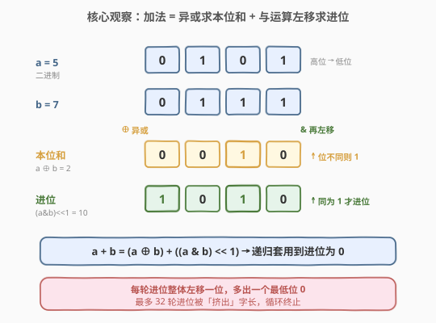
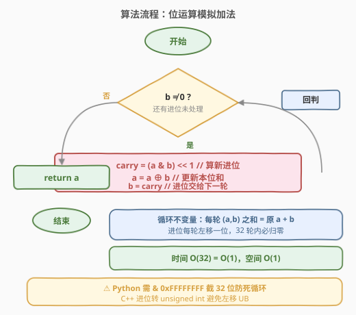
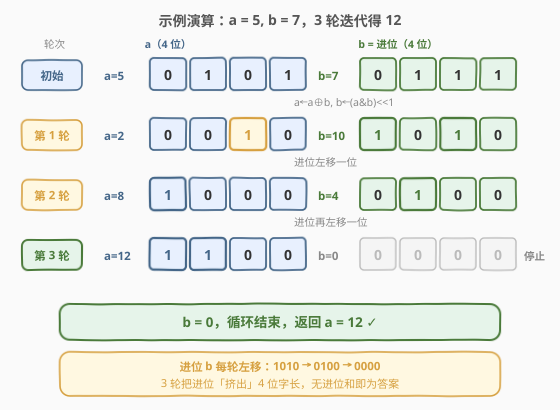

# 两整数之和

- **题目名称**：两整数之和
- **链接**：[371. 两整数之和](https://leetcode.cn/problems/sum-of-two-integers/)
- **难度**：中等
- **标签**：位运算、数学

## 1. 题目概述

给定两个整数 `a` 和 `b`，**不使用** 运算符 `+` 和 `-`，计算并返回两数之和。

**示例 1**：

```text
输入：a = 1, b = 2
输出：3
```

**示例 2**：

```text
输入：a = 2, b = 3
输出：5
```

**约束条件**：

- $-1000 \le a, b \le 1000$

> ⚠️ **看似简单的约束，藏着语言陷阱**：题目范围虽小，但加法的本质是「逐位相加 + 进位」。一旦用位运算模拟，就必须直面「负数在内存中如何表示」——C++ 的 `int` 是固定 32 位补码，而 Python 整数是无限精度，负数带「无限前导 1」，直接套公式会死循环。这个差异是本题最大的考点（见第 3 节 Python 代码的注解）。

---

## 2. 解题思路

### 2.1 暴力思路：用语言内置运算

最「暴力」的做法是直接调用 `+`——但题目明确禁止。退一步，能否用其它内置运算绕开？比如 `a - (-b)`、`sum([a, b])`、`math.fsum`、甚至 `operator.add`。这些都属于「钻题意空子」，面试官会立刻追问：「请用位运算实现」。所以真正的解法必须回到加法的二进制本质。

> 💡 转机在于：把「加法」拆成两件互不干扰的事——**本位和**（不考虑进位时每一位的结果）与**进位**（哪些位会向高位进 1）。这两件事恰好分别对应**异或**和**按位与左移**。

### 2.2 核心观察：半加器分解——异或得本位和、与运算左移得进位



观察一位二进制加法的真值表（即数字电路中的「半加器」），$a, b \in \{0, 1\}$：

| $a$ | $b$ | 本位和 $a \oplus b$ | 进位 $a \mathbin{\&} b$ |
|-----|-----|---------------------|--------------------------|
| 0 | 0 | 0 | 0 |
| 0 | 1 | 1 | 0 |
| 1 | 0 | 1 | 0 |
| 1 | 1 | 0 | 1 |

可以看到：

- **本位和**（该位「不考虑进位」的相加结果）恰好等于 $a \oplus b$（异或）——「相同为 0，不同为 1」。只有 $1+1$ 这一行本位和为 0（因为 $1+1=10$，本位是 0，进 1）。
- **进位** 恰好等于 $a \mathbin{\&} b$（按位与）——「同为 1 才进 1」，且这个进位要作用到**更高一位**，所以整体左移一位：$(a \mathbin{\&} b) \ll 1$。

于是任意两个整数的加法可以分解为：

$$a + b = (a \oplus b) + \big((a \mathbin{\&} b) \ll 1\big)$$

> 💡 **关键转化**：右端还是出现了一个 `+`，但它把「加法」变成了「**两个新的数相加**」——一个是「无进位和」$s = a \oplus b$，一个是「进位」$c = (a \mathbin{\&} b) \ll 1$。对这两个新数**再套用同一分解**，即令 $a \leftarrow s$、$b \leftarrow c$，循环往复。**当进位 $c = 0$ 时，无进位和就是最终答案**。

为什么循环一定会停？因为每一轮进位都会**整体左移一位**，多出一个最低位的 `0`。对 $k$ 位整数，最多 $k$ 轮后进位就被「挤出」字长变成 `0`。32 位整数至多迭代 32 次。

### 2.3 算法流程图



算法只需一个循环，反复用异或更新本位和、用与运算左移更新进位：

1. 只要 $b \neq 0$（还有进位未处理）：
   - 计算新进位 `carry = (a & b) << 1`；
   - 更新本位和 `a = a ^ b`；
   - 把进位交给下一轮 `b = carry`。
2. 循环结束时 `b = 0`，`a` 即为两数之和。

> ⚠️ **正确性**：每轮把 $(a, b)$ 替换为 $(a \oplus b,\ (a \mathbin{\&} b) \ll 1)$，由半加器分解知这两者之和等于原来的 $a + b$，故**和值在迭代中不变**（循环不变量）。又因进位每轮严格左移至少一位，有限位整数必有 $b = 0$ 之时，此时 $a + b = a + 0 = a$，循环终止且 `a` 即为答案。

### 2.4 示例演算

以 $a = 5,\ b = 7$（预期 $5 + 7 = 12$）为例，展示 3 轮迭代如何把进位「逐步挤出去」：



为清晰起见用 4 位二进制展示（高位在前）：

| 轮次 | $a$（二进制） | $b$（二进制） | $a \oplus b$ | $(a \mathbin{\&} b) \ll 1$ |
|------|---------------|---------------|--------------|----------------------------|
| 初始 | 5 (`0101`) | 7 (`0111`) | — | — |
| 1 | 5 → 2 (`0010`) | 7 → 10 (`1010`) | `0010` | `1010` |
| 2 | 2 → 8 (`1000`) | 10 → 4 (`0100`) | `1000` | `0100` |
| 3 | 8 → 12 (`1100`) | 4 → 0 (`0000`) | `1100` | `0000` |

第 3 轮后 $b = 0$，循环结束，$a = 12$ ✓。注意每一轮进位 $b$ 的最低位都变成 `0`（`1010`→`0100`→`0000`），正是「左移挤进位」的直观体现：3 轮把进位彻底移出 4 位字长。

> 💡 把这个过程想象成「把进位像气泡一样往高位挤」：异或负责算出当前位该是几，与运算左移负责把溢出的 `1` 搬到更高位，直到没有溢出为止。

---

## 3. 参考代码

### C++

```cpp
class Solution {
  public:
    int getSum(int a, int b) {
        while (b != 0) {
            // 注意：用 unsigned 承载进位，避免对有符号负数左移的未定义行为
            unsigned int carry = (unsigned int)(a & b) << 1;
            a = a ^ b;          // 本位和
            b = carry;          // 进位交给下一轮
        }
        return a;
    }
};
```

> ⚠️ **为什么进位要转 `unsigned int`？** C++ 中对**有符号负数**左移是**未定义行为**（UB）。`a & b` 可能是负数（符号位为 1），直接 `<< 1` 会触发 UB。先转成 `unsigned int` 再左移，行为由无符号运算良定义。赋回 `b`（`int`）时按位复制，补码语义不变。

### Python

```python
class Solution:
    def getSum(self, a: int, b: int) -> int:
        MASK = 0xFFFFFFFF   # 32 位掩码
        MAX  = 0x7FFFFFFF   # 32 位最大正数
        while b != 0:
            carry = (a & b) << 1
            a = (a ^ b) & MASK
            b = carry & MASK
        # 若结果超出 32 位正数上界，按补码还原为负数
        return a if a <= MAX else ~(a ^ MASK)
```

> ⚠️ **Python 的「无限精度」陷阱**：Python 整数没有固定字长，负数采用「无限前导 `1`」的补码形式（如 `-1` 是 `...111111`）。若不加掩码，进位会不断向高位蔓延**永不归零**，`while b != 0` 死循环。解法是用 `& 0xFFFFFFFF` 把 $a, b$ 截到 32 位，让进位能在 32 轮内「挤出」字长。
>
> 末尾 `~(a ^ MASK)` 是把 32 位补码还原成 Python 负数：当 `a > 0x7FFFFFFF`（最高位为 1）时它是负数。`a ^ MASK` 取低 32 位的反，再 `~` 取整体反，恰好得到对应的 Python 负整数（等价写法 `a - (1 << 32)`）。力扣范围 $[-1000, 1000]$ 多为正数，但面试官常会追问负数输入，这步处理不可省。

也可借助 Python 的位长截断写得更紧凑（语义等价）：

```python
class Solution:
    def getSum(self, a: int, b: int) -> int:
        a &= 0xFFFFFFFF
        b &= 0xFFFFFFFF
        while b:
            a, b = a ^ b, ((a & b) << 1) & 0xFFFFFFFF
        return a if a < 0x80000000 else ~(a ^ 0xFFFFFFFF)
```

---

## 4. 复杂度分析

| 维度 | 复杂度 | 说明 |
|------|--------|------|
| 时间复杂度 | $O(1)$ | 每轮进位左移一位，32 位整数至多迭代 32 次必终止，为常数级 |
| 空间复杂度 | $O(1)$ | 仅用 `a`、`b`、`carry` 三个变量原地迭代 |

> 💡 严格说迭代次数等于「最长进位链长度」，最坏 32 次（如 `a = -1, b = 1` 需要逐位把 32 个 `1` 全部消掉）。但无论输入如何都是 $O(32) = O(1)$，且无需额外空间，这是位运算模拟法的固有优势。

---

## 5. 扩展：从半加器到全加器、再到硬件加法器

本题实现的本质是一个**串行进位加法器**（Ripple-Carry Adder）的软件模拟。把视野放大：

| 层级 | 含义 | 与本题的对应 |
|------|------|--------------|
| **半加器** | 1 位加法，输入 $a, b$，输出本位和 $a \oplus b$、进位 $a \mathbin{\&} b$ | 本题每一轮做的就是这个 |
| **全加器** | 1 位加法 + 低位进位输入 $c_{\text{in}}$，输出和 $a \oplus b \oplus c_{\text{in}}$、新进位 | 多位加法的基础单元 |
| **串行进位加法器** | 把 $n$ 个全加器串起来，低位进位逐位传到高位 | 本题循环「进位左移」即模拟进位逐位传递 |
| **超前进位加法器**（CLA） | 预先算出各级进位，减少等待 | 软件模拟无需此优化 |

> 💡 **另一条思路——递归版**：半加器分解 $a+b = (a \oplus b) + ((a \mathbin{\&} b) \ll 1)$ 天然递归。把循环换成一行递归即可，但本质相同、且 Python 仍需掩码：

```python
class Solution:
    def getSum(self, a: int, b: int) -> int:
        MASK = 0xFFFFFFFF
        if b == 0:
            return a if a <= 0x7FFFFFFF else ~(a ^ MASK)
        return self.getSum((a ^ b) & MASK, ((a & b) << 1) & MASK)
```

---

## 6. 面试要点

1. **为什么 $a \oplus b$ 是「无进位和」，$(a \mathbin{\&} b) \ll 1$ 是「进位」？**

   - 逐位看真值表：$0+0=0$、$0+1=1$、$1+0=1$ 三种情况不产生进位，本位结果与异或一致；唯独 $1+1=10$，本位为 0、向高位进 1。异或恰好在这四种情况下给出本位和（`0,1,1,0`），按位与恰好给出进位标志（`0,0,0,1`），再左移一位即把进位对齐到高位。

2. **循环为什么一定会终止？**

   - 每轮进位 $b \leftarrow (a \mathbin{\&} b) \ll 1$ 整体左移至少一位，最低位补 `0`。$k$ 位整数至多左移 $k$ 次后进位变为 `0`。32 位整数最多 32 轮，故必然终止。这是「循环不变量：和值不变 + 进位单调左移归零」共同保证的。

3. **Python 中负数输入为什么会死循环？如何解决？**

   - Python 整数无限精度，负数补码有无限前导 `1`，`(a & b) << 1` 会不断向高位产生新的 `1`，`b` 永不为 0。解决：每步用 `& 0xFFFFFFFF` 截断到 32 位，强制进位在 32 轮内移出字长；最后用 `~(a ^ MASK)` 把最高位为 1 的结果还原成 Python 负数。

4. **C++ 中为什么要用 `unsigned int` 承载进位？**

   - C++ 规定对有符号负整数左移是未定义行为。`a & b` 可能为负（符号位 1），直接 `<< 1` 触发 UB，结果不可预期。转成 `unsigned int` 后左移由无符号运算良定义，赋回 `int` 时按位复制，补码值不变。本题 C++ 不需掩码是因为 `int` 本身就是 32 位补码，自然在字长内终止。

5. **能否不用循环（递归 / 一行）实现？**

   - 可以。把循环换成递归：`b == 0` 时返回 `a`，否则递归调用 `getSum(a^b, (a&b)<<1)`。语义完全等价，复杂度相同。面试中递归版更能展示「把公式翻译成代码」的能力，但循环版更省栈空间、更贴近硬件实现。

---

## 7. 同类练习题

- [191. 位 1 的个数](https://leetcode.cn/problems/number-of-1-bits/)（[题解](../0001-0100/191_位1的个数.md)）：用 `n & (n-1)` 抹最低设置位，同为位运算基础母题，配合本题打牢「按位思考」基本功
- [371 剑指 Offer 对应题：不用加减乘除做加法](https://leetcode.cn/problems/bu-yong-jia-jian-cheng-chu-zuo-jia-fa-lcof/)：与本题完全等价的剑指 Offer 版，面试原题形式
- [29. 两数相除](https://leetcode.cn/problems/divide-two-integers/)：同样禁用运算符（`*`/`/`/`%`），用位运算 + 减法模拟除法，是「位运算模拟算术」的姊妹题
- [50. Pow(x, n)](https://leetcode.cn/problems/powx-n/)：快速幂用「平方 + 位判断」把 $O(n)$ 降到 $O(\log n)$，与本题同属「把算术运算翻译成位运算」的套路
- [136. 只出现一次的数字](https://leetcode.cn/problems/single-number/)：异或的消去律 $x \oplus x = 0$，与本题「异或即无进位和」互为补充，展示异或的两种核心用法
