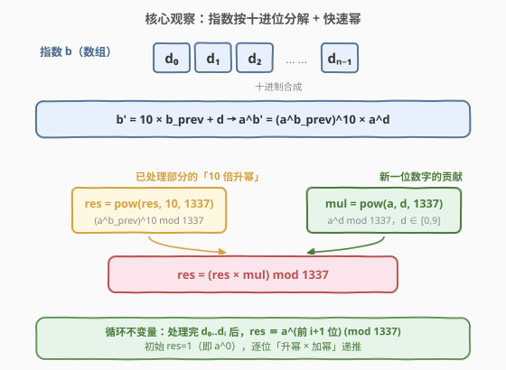
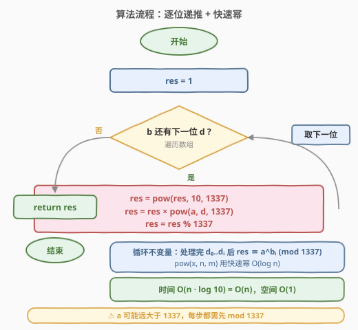

# LeetCode 超级次方 题解

## 1. 题目概述

- **标题 / 题号**：超级次方（#372，medium）
- **链接**：https://leetcode.cn/problems/super-pow/
- **难度**：中等
- **标签**：数学、快速幂

**题意**：你的任务是计算 $a^b \bmod 1337$，其中 $a$ 是一个正整数，$b$ 是一个非常大的正整数，**以数组形式给出**（每一位是一个 $0$–$9$ 的数字，不含前导零）。

**示例 1**：

```text
输入：a = 2, b = [3]
输出：8
```

**示例 2**：

```text
输入：a = 2, b = [1,0]
输出：1024
```

**示例 3**：

```text
输入：a = 1, b = [4,3,3,8,5,2]
输出：1
```

**示例 4**：

```text
输入：a = 2147483647, b = [2,0,0]
输出：1198
```

**约束**：

- $1 \le a \le 2^{31}-1$
- $1 \le b.\text{length} \le 2000$
- $0 \le b[i] \le 9$
- $b$ 不含前导 $0$

> ⚠️ **真正的难点是「指数太大」**：$b$ 数组最多 $2000$ 位，意味着 $b$ 本身可达 $10^{2000}$，**根本无法放进任何整型**。即便用快速幂 $O(\log b)$，$\log_2 b \approx 6644$ 次乘法虽不算多，但 $b$ 这个数本身就无法表示。所以必须找到一种**不显式构造 $b$、却能逐步计算 $a^b \bmod 1337$** 的方法——这正是本题的核心考点。

## 2. 解题思路

### 2.1 暴力思路：把 $b$ 还原成整数再快速幂

最直觉的做法是先把数组还原成一个整数 $B$，再做快速幂 $a^B \bmod 1337$。但 $b.\text{length}$ 可达 $2000$，$B$ 会突破所有原生整型的表示范围（C++ 的 `__int128` 也只能到约 $10^{38}$，Python 虽有大整数但 $10^{2000}$ 参与运算代价巨大）。这条路堵死。

退一步，能否借助**欧拉定理**把指数缩小？由于 $1337 = 7 \times 191$，$\varphi(1337) = 6 \times 190 = 1140$。当 $\gcd(a, 1337) = 1$ 时，$a^{1140} \equiv 1 \pmod{1337}$，理论上可把指数模 $1140$ 后再算。但要把 $b$ 模 $1140$ 仍需逐位处理（高精度取模），而且 $a$ 与 $1337$ 不互素时还要分情况讨论，代码并不简洁。

> 💡 转机：与其「先合成 $b$ 再算 $a^b$」，不如**把指数的合成过程与幂的计算过程融合**——每读入一位数字，就同步更新当前的幂。这只需一个简单递推式，且天然支持高精度指数。

### 2.2 核心观察：指数按十进位分解——「升幂 × 加幂」递推



设数组 $b = [d_0, d_1, \dots, d_{n-1}]$。定义 $b_i$ 为**前 $i+1$ 位数字拼成的数**：

$$b_0 = d_0, \qquad b_{i+1} = 10 \cdot b_i + d_{i+1}$$

例如 $b = [1, 0, 2]$：$b_0 = 1$、$b_1 = 10$、$b_2 = 102$。这正是「读入一位新数字 $=$ 把已有数左移一位（×10）再加上新数字」的常规十进制合成过程。

把这条递推代入指数，用幂的运算法则 $a^{x+y} = a^x \cdot a^y$ 与 $a^{xy} = (a^x)^y$：

$$a^{b_{i+1}} = a^{10 \cdot b_i + d_{i+1}} = \big(a^{b_i}\big)^{10} \cdot a^{d_{i+1}}$$

再配合取模的乘法同余律 $(xy) \bmod m = ((x \bmod m) \cdot (y \bmod m)) \bmod m$，记 $\text{res}_i = a^{b_i} \bmod 1337$，得到递推：

$$\text{res}_{i+1} = \Big(\big(\text{res}_i\big)^{10} \bmod 1337\Big) \cdot \Big(a^{d_{i+1}} \bmod 1337\Big) \bmod 1337$$

> 💡 **关键转化**：每一步只用到「当前 res 的 10 次方」和「$a$ 的某一位数字次方」。$d_{i+1} \in [0,9]$ 是个位数，$a^{d_{i+1}} \bmod 1337$ 用快速幂 $O(\log d_{i+1}) = O(1)$ 即可；$\text{res}_i^{10} \bmod 1337$ 同样是固定指数 $10$ 的快速幂。**整个过程从不显式构造 $b$，却精确算出了 $a^b \bmod 1337$**。

**循环不变量**：处理完 $d_0, \dots, d_i$ 后，$\text{res} \equiv a^{b_i} \pmod{1337}$。初始 $\text{res} = 1 = a^0$（即 $b_{-1} = 0$ 的情形），递推 $n$ 步后 $\text{res} = a^{b_{n-1}} = a^b \bmod 1337$。

### 2.3 算法流程图



算法只需一次遍历数组 + 两点快速幂调用：

1. 初始化 $\text{res} = 1$（对应 $a^0 = 1$）。
2. 遍历数组 $b$ 中每一位数字 $d$：
   - $\text{res} = \text{pow}(\text{res}, 10, 1337)$ —— 把已处理部分升 $10$ 次幂（对应「左移一位」）。
   - $\text{res} = \text{res} \cdot \text{pow}(a, d, 1337) \bmod 1337$ —— 再补上「新数字 $d$」对应的幂。
3. 数组遍历完毕，$\text{res}$ 即为 $a^b \bmod 1337$。

其中 $\text{pow}(x, n, m)$ 是带模快速幂：$O(\log n)$ 时间，$O(1)$ 空间。本题里 $n \le 10$，单次调用为常数时间。

> ⚠️ **为何先升幂后加幂的顺序不能反？** 递推式 $a^{b_{i+1}} = (a^{b_i})^{10} \cdot a^{d_{i+1}}$ 中，$(a^{b_i})^{10}$ 对应「老结果升 10 次幂」，$a^{d_{i+1}}$ 对应「新数字的幂」。若先乘 $a^d$ 再整体 10 次方，会得到 $((a^{b_i}) \cdot a^d)^{10} = a^{10 b_i + 10 d}$，这与 $a^{10 b_i + d}$ 不符。顺序必须严格遵循公式。

### 2.4 示例演算

以 $a = 2,\ b = [1, 0]$（预期 $2^{10} = 1024$）为例，展示 $2$ 轮递推如何把指数从 $0$ 「左移加数字」到 $10$：

![示例演算：a = 2, b = [1, 0]，结果 1024](../images/superpow_example_walkthrough.svg)

| 轮次 | 当前位 $d$ | $\text{res}^{10} \bmod 1337$ | $a^d \bmod 1337$ | 新 $\text{res}$ |
|------|------------|------------------------------|-------------------|-----------------|
| 初始 | — | — | — | $1$ |
| 1 | $1$ | $1^{10} = 1$ | $2^1 = 2$ | $1 \cdot 2 = 2$ |
| 2 | $0$ | $2^{10} = 1024$ | $2^0 = 1$ | $1024 \cdot 1 = 1024$ |

两轮结束，$\text{res} = 1024 = 2^{10} = 2^{[1,0]}$ ✓。

> 💡 把这个递推想象成「模拟十进制拼数字」：每读一位 $d$，先把已积累的指数**左移一位**（×10，对应 $\text{res}^{10}$），再把新数字 $d$ **加到个位**（对应 $\times a^d$）。指数的合成与幂的更新同步进行，无需把 $b$ 真的拼出来。

## 3. 参考代码

### C++

```cpp
class Solution {
  public:
    int superPow(int a, vector<int>& b) {
        const int MOD = 1337;
        long long res = 1;
        for (int d : b) {
            res = powmod(res, 10, MOD) * powmod(a, d, MOD) % MOD;
        }
        return (int)res;
    }

  private:
    long long powmod(long long x, int n, int m) {
        long long r = 1 % m;
        x %= m;
        while (n > 0) {
            if (n & 1) r = r * x % m;
            x = x * x % m;
            n >>= 1;
        }
        return r;
    }
};
```

> ⚠️ **几个易错点**：
> 1. `a` 可能高达 $2^{31}-1$，远大于 $1337$，所以 `powmod` 内部第一步必须 `x %= m`，否则 `x * x` 会立即溢出。
> 2. 中间乘法用 `long long` 承接，避免 `int × int` 溢出（$1336^2 \approx 1.78 \times 10^6$ 本可放进 `int`，但 `long long` 更稳妥、可移植）。
> 3. `powmod` 里 `r = 1 % m` 而非 `r = 1`，是为了兼容 $m = 1$ 的退化情形（本题 $m = 1337$ 不必担心，但作为通用模板加上更安全）。

### Python

```python
class Solution:
    def superPow(self, a: int, b: List[int]) -> int:
        MOD = 1337
        res = 1
        for d in b:
            res = pow(res, 10, MOD) * pow(a, d, MOD) % MOD
        return res
```

> 💡 Python 内置三参数 `pow(base, exp, mod)` 即带模快速幂，C++ 实现的 `powmod` 就是它的等价物。Python 代码因此异常简洁——但这并不意味着可以跳过理解递推式：面试官一定会追问「为什么这样做是对的」。

## 4. 复杂度分析

| 维度 | 复杂度 | 说明 |
|------|--------|------|
| 时间复杂度 | $O(n)$ | 遍历 $b$ 数组 $n$ 位，每位调用两次指数 $\le 10$ 的快速幂，单次 $O(\log 10) = O(1)$，总计 $O(n)$ |
| 空间复杂度 | $O(1)$ | 仅用 `res` 与若干临时变量，不用额外存大整数 |

> 💡 与「先合成 $b$ 再快速幂」对比：那条路即便能表示 $b$，也需要 $O(\log b) = O(n)$ 次乘法（因 $\log_2(10^n) = n \log_2 10 \approx 3.3 n$），渐进时间相同——但**合成 $b$ 本身就要 $O(n)$ 高精度运算且 $b$ 无法放入原生整型**。本题递推法把「合成」与「求幂」合二为一，是渐进最优且实现最简的方案。

## 5. 扩展：欧拉定理降幂与互素陷阱

某些题解会借助**欧拉定理**进一步降幂：因 $1337 = 7 \times 191$，$\varphi(1337) = 6 \times 190 = 1140$，当 $\gcd(a, 1337) = 1$ 时有

$$a^b \equiv a^{b \bmod 1140} \pmod{1337}$$

从而可先把 $b$ 数组对 $1140$ 取模（逐位 `r = (r * 10 + d) % 1140`），把指数压到 $1140$ 以内再快速幂。

| 情形 | $\gcd(a, 1337)$ | 是否能直接用 $b \bmod 1140$ | 说明 |
|------|------------------|------------------------------|------|
| 1 | $= 1$（互素） | ✅ 可以 | 欧拉定理直接适用 |
| 2 | $\neq 1$（$a$ 含因子 $7$ 或 $191$） | ⚠️ 不能简单模 | 需用**扩展欧拉定理**：$a^b \equiv a^{b \bmod \varphi(m) + \varphi(m)} \pmod m$（当 $b \ge \varphi(m)$ 时） |

> ⚠️ **陷阱**：若 $a$ 与 $1337$ 不互素（如 $a = 7, 191, 1337$ 的倍数），直接用 $b \bmod 1140$ 会出错。例如 $a = 7, b = 1140$ 时 $a^b \bmod 1337 = 0$（因 $7^{1140}$ 显然是 $7$ 的倍数，模 $1337 = 7 \times 191$ 也未必为 $0$，需具体算），而 $a^{b \bmod 1140} = a^0 = 1$，两者不等。扩展欧拉定理的修正项 $+\varphi(m)$ 正是为消除这个差异。

**结论**：欧拉降幂能把指数压小，但需处理互素与非互素两种情形，代码反而更复杂。本题数组长度仅 $2000$，$O(n)$ 递推法已经足够快，**无需降幂**——递推法是更优雅、更不易错的首选。欧拉定理的价值在于**理论分析**与**指数无法逐位处理**的场景（如 $b$ 以其他形式给出且极大）。

```python
class Solution:
    def superPow(self, a: int, b: List[int]) -> int:
        MOD, PHI = 1337, 1140
        e = 0
        for d in b:
            e = (e * 10 + d) % PHI
        return pow(a, e + PHI, MOD) % MOD
```

> 上面这版用扩展欧拉定理（$+\varphi(m)$ 修正），对 $b \ge \varphi(m)$ 恒成立（本题 $b$ 数组无前导零且长度 $\ge 1$，构造的 $b \ge 1$，但不一定 $\ge 1140$，故严格说还需判断；这是为何递推法更稳的原因）。

## 6. 面试要点

1. **为什么不能直接把 $b$ 还原成整数再快速幂？**

   - $b$ 数组可达 $2000$ 位，$b \approx 10^{2000}$，远超任何原生整型（`long long` 上界约 $9.2 \times 10^{18}$，`__int128` 约 $1.7 \times 10^{38}$）。Python 虽有大整数但参与幂运算代价巨大。必须找一种**不显式表示 $b$** 的方法。

2. **递推式 $\text{res}_{i+1} = \text{res}_i^{10} \cdot a^{d_{i+1}} \bmod 1337$ 是怎么来的？**

   - 由十进制合成 $b_{i+1} = 10 b_i + d_{i+1}$，代入指数得 $a^{b_{i+1}} = a^{10 b_i + d_{i+1}} = (a^{b_i})^{10} \cdot a^{d_{i+1}}$。两边模 $1337$，记 $\text{res}_i = a^{b_i} \bmod 1337$，由乘法同余律即得递推式。

3. **循环不变量是什么？如何证明正确性？**

   - 不变量：处理完 $d_0, \dots, d_i$ 后，$\text{res} \equiv a^{b_i} \pmod{1337}$。归纳：初始 $\text{res} = 1 = a^0$ 成立；设第 $i$ 步成立，则第 $i+1$ 步由递推式 $\text{res}_{i+1} \equiv \text{res}_i^{10} \cdot a^{d_{i+1}} \equiv (a^{b_i})^{10} \cdot a^{d_{i+1}} = a^{10 b_i + d_{i+1}} = a^{b_{i+1}}$ 成立。终止时 $i = n-1$，$\text{res} = a^{b_{n-1}} = a^b$。

4. **为什么先 `pow(res, 10)` 再乘 `pow(a, d)`？顺序能换吗？**

   - 不能。递推式是 $(a^{b_i})^{10} \cdot a^{d_{i+1}}$，先升幂（对应老指数 ×10）后加幂（对应加新数字 $d$）。若颠倒，会得到 $((a^{b_i}) \cdot a^d)^{10} = a^{10 b_i + 10 d}$，指数变成 $10 b_i + 10 d$ 而非 $10 b_i + d$，错误。

5. **$a$ 很大（如 $a = 2^{31}-1$）时如何避免溢出？**

   - 快速幂内部第一步 `x %= m` 把 $a$ 压到 $[0, m)$，之后所有乘法都在 $m^2$ 量级（$1336^2 \approx 1.78 \times 10^6$），C++ 用 `long long` 承接即可。Python 原生大整数无溢出问题，但仍需取模避免数变大拖慢运算。

6. **能否用欧拉定理降幂？有什么陷阱？**

   - $1337 = 7 \times 191$，$\varphi(1337) = 1140$。当 $\gcd(a, 1337) = 1$ 时 $a^b \equiv a^{b \bmod 1140} \pmod{1337}$。但 $a$ 与 $1337$ 不互素时（$a$ 是 $7$ 或 $191$ 的倍数）直接模 $1140$ 会出错，需用扩展欧拉定理 $a^b \equiv a^{b \bmod \varphi(m) + \varphi(m)} \pmod m$（$b \ge \varphi(m)$ 时）。递推法天然规避了这个分类讨论，更稳。

## 同类练习题

| # | 题目 | 与本题的关联 |
|---|------|-------------|
| 50 | [Pow(x, n)](https://leetcode.cn/problems/powx-n/) | 快速幂母题，本题的 `powmod` 即其带模版，先打牢「平方 + 位判断」的 $O(\log n)$ 套路 |
| 371 | [两整数之和](https://leetcode.cn/problems/sum-of-two-integers/)（[题解](../0301-0400/371_两整数之和.md)） | 同为「把算术运算拆解到更底层」的思维（加法拆成位运算），与本题「指数合成拆成递推」互为镜像 |
| 326 | [3 的幂](https://leetcode.cn/problems/power-of-three/) | 判断 $n$ 是否为 $3$ 的幂，与本题同属「幂运算」家族，对照「判定」与「计算」两种问法 |
| 231 | [2 的幂](https://leetcode.cn/problems/power-of-two/) | 用 $n \mathbin{\&} (n-1) = 0$ 判定，位运算视角的幂；与 50、372 一起构成「幂」主题的三种考法 |
| 204 | [计数质数](https://leetcode.cn/problems/count-primes/) | 埃氏筛，与本题扩展中 $1337 = 7 \times 191$ 的质因数分解、欧拉函数 $\varphi(1337) = 1140$ 的推导同源 |
