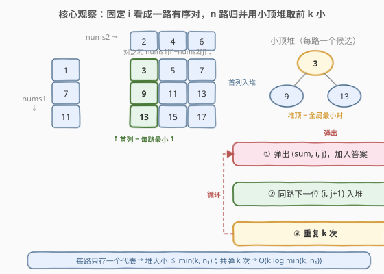
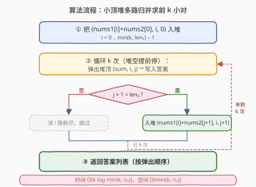
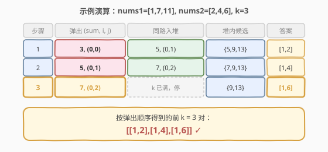

# 查找和最小的K对数字

- **题目名称**：查找和最小的K对数字
- **链接**：[373. 查找和最小的K对数字](https://leetcode.cn/problems/find-k-pairs-with-smallest-sums/)
- **难度**：中等
- **标签**：堆、优先队列、多路归并、二分查找

## 1. 题目概述

给定两个**升序排序**的整数数组 `nums1` 和 `nums2`，以及一个整数 `k`。定义一个对 `(u, v)`，其中 `u` 取自 `nums1`，`v` 取自 `nums2`。请返回**和 `u + v` 最小的前 `k` 个对**。

**示例 1**：

```text
输入：nums1 = [1,7,11], nums2 = [2,4,6], k = 3
输出：[[1,2],[1,4],[1,6]]
解释：所有对按和升序排列为
       [1,2]=3, [1,4]=5, [1,6]=7, [7,2]=9, [7,4]=11, [11,2]=13, [7,6]=13, [11,4]=15, [11,6]=17
       返回前 3 个。
```

**示例 2**：

```text
输入：nums1 = [1,1,2], nums2 = [1,2,3], k = 2
输出：[[1,1],[1,1]]
解释：和最小的前 2 对都是 [1,1]（来自 nums1 的两个不同的 1）。
```

**示例 3**：

```text
输入：nums1 = [1,2], nums2 = [3], k = 3
输出：[[1,3],[2,3]]
解释：所有可能的对只有 2 个，不足 k 个时全部返回。
```

**约束条件**：

- `1 <= nums1.length, nums2.length <= 10^5`
- `-10^9 <= nums1[i], nums2[i] <= 10^9`
- `nums1` 和 `nums2` 均按升序排列
- `1 <= k <= 10^4`
- `k * (nums1.length + nums2.length) <= 10^6`

> ⚠️ 注意：和相同的对按其天然弹出顺序即可，题目**不要求字典序**；当总数不足 `k` 个时返回全部。两个数组都已升序——这是破题的关键性质。

---

## 2. 解题思路

### 2.1 暴力思路

枚举所有 $m \times n$ 个对，按和排序后取前 $k$ 个。时间 $O(mn \log(mn))$，空间 $O(mn)$。当 $m, n$ 到 $10^5$ 时乘积 $10^{10}$，**直接超时超内存**，必须利用「两数组有序」的性质。

### 2.2 核心观察：小顶堆多路归并



把每个 $i \in [0, m)$ 看成**一路**有序对序列：

$$\big(\text{nums1}[i]+\text{nums2}[0],\ \text{nums1}[i]+\text{nums2}[1],\ \ldots,\ \text{nums1}[i]+\text{nums2}[n-1]\big)$$

因为 `nums2` 升序，**固定 $i$ 时，对之和随 $j$ 单调递增**——这正是「每路内部有序」。于是问题转化为经典的 **「多路归并取前 k 小」**：

- 维护一个**小顶堆**，初始把**每路首对**（即 `(nums1[i]+nums2[0], i, 0)`）入堆；
- 堆顶就是当前各路未取部分中的**全局最小对**。弹出堆顶、加入答案；
- 弹出后，把**同路的下一位** `(i, j+1)` 补入堆，保持堆中始终是每路当前的候选最小；
- 重复 `k` 次（或堆提前空），即得前 `k` 小对。

> 💡 **关键不变式**：堆大小始终 $\le \min(k, m)$（见 2.4 节的剪枝），所以每次弹出/入堆都是 $O(\log \min(k, m))$。这正是把「在 $mn$ 个对里找前 k 小」降到 $O(k \log \min(k, m))$ 的核心。

### 2.3 算法流程图



> ⚠️ **边界**：当某路 `j + 1 == n` 时，该路已耗尽，不再补位（堆自然缩小）。若堆在 `k` 次前已空（即对总数 `< k`），提前返回已有答案即可。

### 2.4 示例演算

以 `nums1 = [1,7,11], nums2 = [2,4,6], k = 3` 为例，初始堆为每路首对之和 `{3, 9, 13}`：



| 步骤 | 弹出 (sum, i, j) | 同路入堆 | 堆内候选 | 答案 |
|------|------------------|----------|----------|------|
| 1 | 3, (0,0) | 5, (0,1) | {5,9,13} | [1,2] |
| 2 | 5, (0,1) | 7, (0,2) | {7,9,13} | [1,4] |
| 3 | 7, (0,2) ← 完成 | k 已满，停 | {9,13} | [1,6] |

弹出序列对应答案 `[[1,2],[1,4],[1,6]]`。

> 💡 **剪枝：初始只入堆前 $\min(k, m)$ 路**。若第 `k` 小对的 `i = i₀`，则对每个 `i < i₀`，`(nums1[i], nums2[0])` 都比它小（`nums1` 升序保证 `nums1[i] <= nums1[i₀]`，且 `nums2[0]` 是 `nums2` 最小值）。故 `i₀` 之前至少有 `i₀` 个更小的对，得 `i₀ <= k - 1`。初始只入堆 $i \in [0, \min(k, m))$ 即可，把堆大小从 $m$ 降到 $\min(k, m)$，显著优化 $m \gg k$ 的场景（如 $m = 10^5, k = 10$）。

---

## 3. 参考代码

### C++

```cpp
class Solution {
  public:
    vector<vector<int>> kSmallestPairs(vector<int>& nums1, vector<int>& nums2, int k) {
        int m = nums1.size(), n = nums2.size();
        // 小顶堆：元素为 (sum, i, j)
        auto cmp = [](const auto& a, const auto& b) { return a[0] > b[0]; };
        priority_queue<array<int, 3>, vector<array<int, 3>>, decltype(cmp)> pq(cmp);

        // 剪枝：只入堆前 min(k, m) 路
        for (int i = 0; i < min(k, m); ++i) {
            pq.push({nums1[i] + nums2[0], i, 0});
        }

        vector<vector<int>> ans;
        while (!pq.empty() && (int)ans.size() < k) {
            auto [sum, i, j] = pq.top();
            pq.pop();
            ans.push_back({nums1[i], nums2[j]});
            if (j + 1 < n) {
                pq.push({nums1[i] + nums2[j + 1], i, j + 1});
            }
        }
        return ans;
    }
};
```

### Python

```python
class Solution:
    def kSmallestPairs(self, nums1: List[int], nums2: List[int], k: int) -> List[List[int]]:
        m, n = len(nums1), len(nums2)
        # 小顶堆：元素为 (sum, i, j)
        heap = [(nums1[i] + nums2[0], i, 0) for i in range(min(k, m))]
        heapq.heapify(heap)

        ans = []
        while heap and len(ans) < k:
            _, i, j = heapq.heappop(heap)
            ans.append([nums1[i], nums2[j]])
            if j + 1 < n:
                heapq.heappush(heap, (nums1[i] + nums2[j + 1], i, j + 1))
        return ans
```

---

## 4. 复杂度分析

| 维度 | 复杂度 | 说明 |
|------|--------|------|
| 时间复杂度 | $O(k \log \min(k, m))$ | 共弹出 `k` 次，每次弹出/入堆为 $O(\log \min(k, m))$（堆大小 $\le \min(k, m)$）；最坏 `k = 10^4`，$\log$ 项很小 |
| 空间复杂度 | $O(\min(k, m))$ | 堆中至多存放每路一个代表元素；不计输出答案 |

> 💡 题目约束 $k \times (m + n) \le 10^6$，保证 $O(k \log \min(k, m))$ 在最坏情况下约 $10^4 \times 14 \approx 1.4 \times 10^5$ 次操作，远低于时限。

---

## 5. 扩展：二分答案——对值域二分 + 计数（仅求第 k 小和）

当 `k` 很大或题目改为「只求第 `k` 小的和值」而非返回所有对时，可换用**对值域二分**，做到 $O(m \log n \log W)$，$W$ 为值域宽度：

**思路**：答案落在 $[\text{nums1}[0]+\text{nums2}[0],\ \text{nums1}[m-1]+\text{nums2}[n-1]]$ 之间。二分 `mid`，统计 `和 <= mid` 的对数 `cnt`：

- 对每个 `i`，在 `nums2` 中**二分**找最大的 `j` 使 `nums1[i] + nums2[j] <= mid`，累加 `j + 1`；
- 若 `cnt < k`，令 `lo = mid + 1`；否则 `hi = mid`。

| 解法 | 时间 | 空间 | 适用 |
|------|------|------|------|
| 小顶堆多路归并 | $O(k \log \min(k, m))$ | $O(\min(k, m))$ | 需要前 `k` 个对本身（**本题**） |
| 二分值域 + 计数 | $O(m \log n \log W)$ | $O(1)$ | 只需第 `k` 小的「和值」，或 `k` 极大 |

> ⚠️ 本题要求**返回所有 k 个对**而非仅和值，二分找到阈值后仍需枚举所有 `<= 阈值` 的对（可能多于 `k` 个，需截断），实现复杂且常数大，**不推荐用于本题**。堆解法天然按弹出顺序得到答案，更直接。

---

## 6. 面试要点

1. **为什么固定 `i` 看成一路，而不是固定 `j`？**
   - 两种都可以，关键看哪个数组更短。固定 `i` 时堆大小 $\le \min(k, m)$，固定 `j` 时 $\le \min(k, n)$。**选较短数组做外层**更优：初始入堆 $\min(k, \min(m, n))$ 路。

2. **堆里为什么要存坐标 `(i, j)`？**
   - 弹出后需知道这是哪一路（`i`），才能把**同路下一位** `(i, j+1)` 补入堆。只存和无法定位补位来源。

3. **为什么初始只入堆前 $\min(k, m)$ 路就够？**
   - 第 `k` 小对的 `i₀` 必满足 `i₀ <= k - 1`：对每个 `i < i₀`，`(nums1[i], nums2[0])` 都比它小（`nums1` 升序 + `nums2[0]` 是 `nums2` 最小），至少 `i₀` 个更小对挤在它前面。故 `i₀ >= k` 时不可能进入前 `k`。

4. **和相同时怎么处理？**
   - 堆按 `sum` 排序，相同 `sum` 的对按弹出顺序自然处理，**题目不要求字典序**，故无需额外比较器。若题目改为要求字典序，可在堆元素中按 `(sum, i, j)` 三元组字典序比较。

5. **若 $k \times (m + n) > 10^6$ 怎么办？**
   - 题目约束保证不会如此，但若取消约束，堆解法在 `k` 极大时退化。此时改用「二分值域 + 计数」先求第 `k` 小和值 $v^\star$，再枚举所有 `<= v^\star` 的对截前 `k` 个，可降到 $O(m \log n \log W + k)$。

---

## 7. 同类练习题

- [378. 有序矩阵中第K小的元素](https://leetcode.cn/problems/kth-smallest-element-in-a-sorted-matrix/)（[题解](../0301-0400/378_有序矩阵中第K小的元素.md)）：行列皆有序矩阵的第 k 小，同样是「多路归并 + 小顶堆」模板，本题的姊妹题
- [23. 合并 K 个升序链表](https://leetcode.cn/problems/merge-k-sorted-lists/)（[题解](../0001-0100/23_合并K个升序链表.md)）：k 路归并鼻祖，堆中存链表节点指针，套路完全一致
- [264. 丑数 II](https://leetcode.cn/problems/ugly-number-ii/)（[题解](../0201-0300/264_丑数II.md)）：三路归并 + 小顶堆（或三指针），多路归并的简化版
- [1439. 有序矩阵中的第 k 个最小数组和](https://leetcode.cn/problems/find-the-kth-smallest-sum-of-a-matrix-with-sorted-rows/)：每行有序，逐行归并 + 堆，是本题的多行扩展困难版
- [719. 找出第 K 小的数对距离](https://leetcode.cn/problems/find-k-th-smallest-pair-distance/)（[题解](../0701-0800/719_找出第K小的数对距离.md)）：数对距离第 k 小，**无序**数组用「二分答案 + 双指针计数」，对比本题「**有序**数组用堆归并」，形成互补
