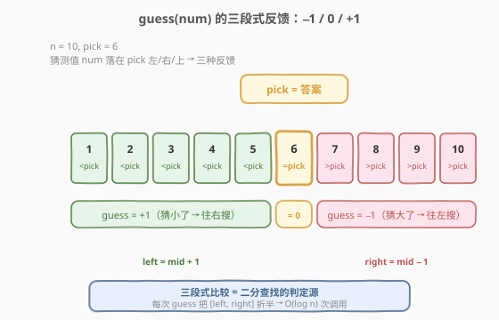
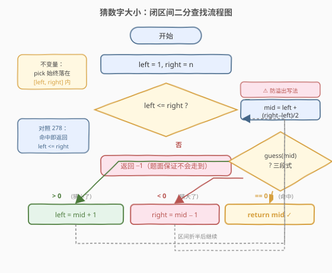
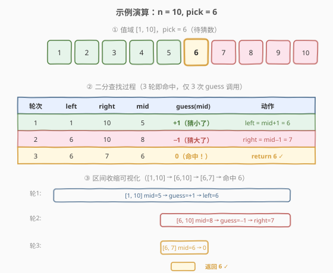

# LeetCode 猜数字大小 题解

## 1. 题目概述

- **标题 / 题号**：猜数字大小（#374，easy）
- **链接**：https://leetcode.cn/problems/guess-number-higher-or-lower/
- **难度**：简单
- **标签**：二分查找、交互

**题意**：我们在玩一个猜数字游戏。游戏规则如下：

- 系统从 `1` 到 `n` 之间随机选择一个整数 `pick`（你不知道它的值）；
- 你每次猜一个数 `num`，调用预定义 API `guess(num)`，它会返回：
  - `−1`：`num > pick`（你猜的数**比 pick 大**）；
  - `1`：`num < pick`（你猜的数**比 pick 小**）；
  - `0`：`num == pick`（猜中了）。
- 你的任务是**返回 `pick`**，并**尽量减少调用 `guess` 的次数**。

**示例 1**：

```text
输入：n = 10, pick = 6
输出：6
```

**示例 2**：

```text
输入：n = 1, pick = 1
输出：1
```

**示例 3**：

```text
输入：n = 2, pick = 1
输出：1
```

**约束**：

- `1 <= n <= 2^31 - 1`
- `1 <= pick <= n`

> 💡 本题的核心是「**在有序值域 `[1, n]` 上做精确匹配的二分查找**」：`guess(num)` 是一个**三段式比较器**，把值域切成「比 pick 小 / 等于 pick / 比 pick 大」三段。这正是 [704. 二分查找](../0001-0100/704_二分查找.md) 的母题模板——只不过「比较」从 `nums[mid]` 与 `target` 的值比较，换成了 `guess(mid)` 与 `0` 的函数调用比较。

## 2. 解题思路

### 2.1 暴力思路：线性扫描

从 `1` 到 `n` 依次调用 `guess`，返回首个使 `guess(num) == 0` 的 `num`。最坏需要 `n` 次调用。当 $n = 2^{31}-1 \approx 21$ 亿时，线性扫描会超时——题目明确要求**尽量减少调用次数**。

> ⚠️ 暴力法浪费了「值域天然有序、`guess` 给出三段式比较反馈」这一**单调性**，而这正是二分查找的基石。

### 2.2 核心观察：三段式比较 = 二分查找



关键洞察：值域 `[1, n]` 天然有序，而 `guess(num)` 返回的不是「是/否」布尔值，而是**三段式比较结果**——`+1`（猜小了）、`0`（命中）、`−1`（猜大了）。这与 `nums[mid]` 和 `target` 比较返回 `<` / `==` / `>` 完全同构：每次取中点 `mid` 调用 `guess(mid)`，根据三段式反馈就能丢掉一半值域。

形式化：设 `pick` 唯一存在于 `[1, n]` 中。我们要找 `pick`。

- 取 `mid = left + (right - left) / 2`
- 若 `guess(mid) == 0`：`mid` 就是 `pick`，**直接返回 `mid`**；
- 若 `guess(mid) < 0`（即 `−1`）：`mid > pick`，`pick` 在 `mid` 左侧，收缩右界 `right = mid - 1`；
- 若 `guess(mid) > 0`（即 `+1`）：`mid < pick`，`pick` 在 `mid` 右侧，收缩左界 `left = mid + 1`。

> 💡 **与 278 的对照**：[278. 第一个错误的版本](../0201-0300/278_第一个错误的版本.md) 的 `isBadVersion` 是**布尔判定**（找「首个 true」的边界），用 `left < right` + `right = mid` 模板保留候选；本题 `guess` 是**三段式比较**（找「等于 0」的精确命中），用 `left <= right` + `right = mid - 1` 模板命中即返回。两者都是二分查找，区别在于判定是布尔还是三段式、目标是找边界还是找精确点——母题都是 [704](../0001-0100/704_二分查找.md)。

### 2.3 算法流程图



**循环不变量**：**`pick` 始终落在闭区间 `[left, right]` 内**（前提：题目保证 `pick ∈ [1, n]`，初始即满足）。每轮调用一次 `guess(mid)`，根据三段式反馈收缩区间或直接命中返回。

**步骤**：

1. `left = 1, right = n`（值域从 1 开始）；
2. 取 `mid = left + (right - left) / 2`（向下取整，**防溢出**）；
3. 调用 `guess(mid)`：
   - 返回 `0`：`mid == pick`，**返回 `mid`**；
   - 返回 `−1`：`mid > pick`，`pick` 在左侧，`right = mid - 1`；
   - 返回 `+1`：`mid < pick`，`pick` 在右侧，`left = mid + 1`；
4. 当 `left <= right` 不成立时退出（题目保证 `pick ∈ [1, n]`，正常情况会在循环内命中返回）。

> ⚠️ **为什么 `mid` 必须用 `left + (right - left) / 2`？** 本题 $n$ 可达 $2^{31}-1$，`left + right` 在 C++/Java 中会**整数溢出**得到负数，传入 `guess` 会越界或语义错乱。差值写法保证中间结果不超过 `right`，安全。这是本题最常见的踩坑点，与 278 完全一致。

### 2.4 示例演算

以 `n = 10, pick = 6` 为例，值域为 `[1, 2, 3, 4, 5, 6, 7, 8, 9, 10]`，`pick = 6`：



| 轮次 | left | right | mid | guess(mid) | 动作 |
|------|------|-------|-----|------------|------|
| 1 | 1 | 10 | 5 | +1（5 < 6，猜小了） | left = mid+1 = 6 |
| 2 | 6 | 10 | 8 | −1（8 > 6，猜大了） | right = mid−1 = 7 |
| 3 | 6 | 7 | 6 | 0（命中！） | **返回 6** |

三轮折半即命中 `6`，仅调用 3 次 API。对比线性扫描需 6 次（从 1 猜到 6），$n$ 越大优势越显著：$O(\log n)$ vs $O(n)$。$n = 2^{31}-1$ 时最多约 31 次调用即可在 21 亿个候选中定位 `pick`。

## 3. 参考代码

### C++

```cpp
/**
 * Forward declaration of guess API.
 * @param  num   your guess
 * @return       -1 if num > pick, 1 if num < pick, otherwise 0
 *               (assume pick is fixed and num is in [1, n])
 * int guess(int num);
 */

class Solution {
  public:
    int guessNumber(int n) {
        int left = 1, right = n;
        while (left <= right) {
            int mid = left + (right - left) / 2;
            int g = guess(mid);
            if (g == 0) {
                return mid;
            } else if (g < 0) {
                right = mid - 1;
            } else {
                left = mid + 1;
            }
        }
        return -1;
    }
};
```

### Python

```python
# The guess API is already defined for you.
# @param num, your guess
# @return -1 if num > pick, 1 if num < pick, otherwise 0
# def guess(num: int) -> int:

class Solution:
    def guessNumber(self, n: int) -> int:
        left, right = 1, n
        while left <= right:
            mid = left + (right - left) // 2
            g = guess(mid)
            if g == 0:
                return mid
            elif g < 0:
                right = mid - 1
            else:
                left = mid + 1
        return -1
```

> ⚠️ **三个易错点**：
> 1. **`mid` 防溢出**：`left + (right - left) / 2` 而非 `(left + right) / 2`。$n \le 2^{31}-1$ 时 `left + right` 可达 $2^{32}-2$，在 32 位有符号整数下溢出。Python 不溢出但保持同一写法便于跨语言记忆。
> 2. **`guess` 返回值的符号语义**：`−1` 表示**你猜的数比 pick 大**（`num > pick`），不是「pick 比 num 小」的反向解读——容易混淆。记忆口诀：`guess` 的返回值描述的是「`num` 相对 `pick` 的位置」——`−1` = num 在 pick 右边（大了），`+1` = num 在 pick 左边（小了），`0` = 重合。
> 3. **`return -1` 兜底**：题目保证 `pick ∈ [1, n]`，循环内必然命中返回，末尾的 `return -1` 仅为编译期语义完整（部分语言的「函数所有路径必须有返回值」要求）。无需写成 `return left`，因为本模板不在循环外用 `left` 作为答案（与 278/35 不同）。

## 4. 复杂度分析

| 维度 | 复杂度 | 说明 |
|------|--------|------|
| 时间复杂度 | $O(\log n)$ | 每轮区间折半，共 $\lceil \log_2 n \rceil$ 轮；$n = 2^{31}-1$ 时仅约 31 次 |
| 空间复杂度 | $O(1)$ | 仅 `left` / `right` / `mid` / `g` 四个变量 |
| API 调用次数 | $O(\log n)$ | 每轮调用一次 `guess`，与时间复杂度一致；最坏等于二分轮数 |

> 💡 $n = 2^{31}-1 \approx 21$ 亿时，$\log_2 n \approx 31$，即**最多 31 次 `guess` 调用**即可在 21 亿个候选中定位 `pick`。对比线性扫描的 21 亿次，这是「对数级」与「线性级」的鸿沟——二分查找在值域搜索场景的标志性优势。

## 5. 扩展：与 278 两种二分模板的对照

本题使用「`left <= right` + 命中即返回 + `right = mid - 1` / `left = mid + 1`」闭区间模板（与 [704. 二分查找](../0001-0100/704_二分查找.md) 一致），而 [278. 第一个错误的版本](../0201-0300/278_第一个错误的版本.md) 使用「`left < right` + `right = mid`」模板找边界。两者都是二分查找，但目标不同：

| 维度 | 本题（374，精确匹配） | 278（找首个坏版本） |
|------|----------------------|---------------------|
| 判定形式 | 三段式 `guess(mid) ∈ {−1, 0, +1}` | 布尔 `isBadVersion(mid) ∈ {false, true}` |
| 目标 | 找 `pick`（精确等于） | 找首个 `true`（下界 / 边界） |
| 区间语义 | `[left, right]`，命中即返回 | `[left, right]`，退出时 `left == right` 为答案 |
| 命中时收缩 | 直接 `return mid`（不继续） | `right = mid`（保留候选，继续找更早的） |
| 不命中收缩 | `right = mid - 1` / `left = mid + 1`（排除 mid） | `left = mid + 1`（仅排除好版本侧） |
| 终止条件 | `left > right`（区间空，未命中）或命中返回 | `left == right`（区间收缩到单点） |
| 母题 | 704 二分查找（精确匹配） | 35 lower_bound（找下界） |

> 💡 **选择建议**：当判定是**三段式比较**且目标是**精确命中**时，用 `left <= right` 闭区间模板最自然——命中即返回，干净利落。当判定是**布尔谓词**且目标是**找首个满足条件的边界**时，用 `left < right` + `right = mid` 模板更自然——无需处理「命中后继续找左边界」的细节。两种模板都源自 704，关键是「判定形式 × 目标类型 × 区间定义」三者自洽。

## 6. 面试要点

1. **为什么用二分而不是线性扫描？**

   - 值域 `[1, n]` 天然有序，`guess(num)` 给出三段式比较反馈，本质就是「比较 `num` 与 `pick` 的大小关系」。有序 + 可比较 = 二分可行的充要条件——每轮取中点即可丢掉一半值域，把 $O(n)$ 降到 $O(\log n)$。$n$ 可达 21 亿，线性扫描不可行。

2. **`mid = left + (right - left) / 2` 为什么不能写成 `(left + right) / 2`？**

   - 本题 $n \le 2^{31}-1$，`left + right` 最大可达 $2(2^{31}-1) = 2^{32}-2$，超过 32 位有符号整数上界 $2^{31}-1$，溢出为负数。传入 `guess` 会越界或语义错乱。差值写法保证中间结果 $\le \text{right} \le n$，不溢出。这是本题**最高频的踩坑点**，与 278 同源。

3. **`guess` 返回 `−1` 和 `+1` 的语义容易记混，怎么记？**

   - `guess(num)` 描述的是「**`num` 相对 `pick` 的位置**」：`−1` = `num` 在 `pick` 右边（猜大了，往左搜），`+1` = `num` 在 `pick` 左边（猜小了，往右搜），`0` = 重合。不要反向解读成「pick 相对 num 的位置」。记忆口诀：「`−1` 大了往左，`+1` 小了往右」。

4. **循环条件为什么是 `left <= right` 而不是 `left < right`？**

   - 本题是**精确匹配**，命中即返回。`left <= right` 保证 `left == right` 时（区间收缩到单点）仍会进入循环取 `mid = left` 并调用 `guess`——若该值就是 `pick`，直接返回；若不是，根据反馈 `right = mid - 1` 或 `left = mid + 1` 使 `left > right` 退出。若用 `left < right`，会在 `left == right` 时提前退出，漏掉「最后单点就是 `pick`」的判定，需要额外在循环外返回 `left`——多此一举。278 用 `left < right` 是因为它的目标是「找边界」而非「精确命中」，模板与目标要匹配。

5. **本题和 278 第一个错误的版本是什么关系？**

   - 同属「交互式二分查找」家族，都是调用预定义 API 做判定。区别：本题 `guess` 是**三段式比较**（找精确等于），278 `isBadVersion` 是**布尔判定**（找首个 true 的边界）。母题都是 704 二分查找，模板选择由「判定形式 × 目标类型」决定：三段式精确匹配用 `left <= right` 闭区间模板，布尔找边界用 `left < right` + `right = mid` 模板。会一道即会一类。

## 同类练习题

| # | 题目 | 与本题的关联 |
|---|------|-------------|
| 704 | [二分查找](https://leetcode.cn/problems/binary-search/)（[题解](../0001-0100/704_二分查找.md)） | 闭区间二分母题，判定从 `guess(mid)` 换成 `nums[mid]` 与 `target` 的值比较，模板同构 |
| 278 | [第一个错误的版本](https://leetcode.cn/problems/first-bad-version/)（[题解](../0201-0300/278_第一个错误的版本.md)） | 同为交互式二分，对照「布尔判定找边界」与「三段式比较找精确命中」两种模板的差异 |
| 35 | [搜索插入位置](https://leetcode.cn/problems/search-insert-position/)（[题解](../0001-0100/35_搜索插入位置.md)） | `lower_bound` 找下界，体会「精确匹配」与「找边界」目标的区别 |
| 69 | [x 的平方根](https://leetcode.cn/problems/sqrtx/) | 在答案值域上二分找「最大的平方 ≤ x」，同为防溢出的经典场景 |
| 375 | [猜数字大小 II](https://leetcode.cn/problems/guess-number-higher-or-lower-ii/) | 本题的进阶变体，从「最小化调用次数」升级为「最小化保证猜中的金额」，改用区间 DP |
