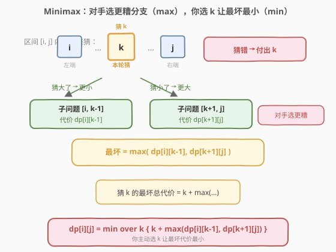
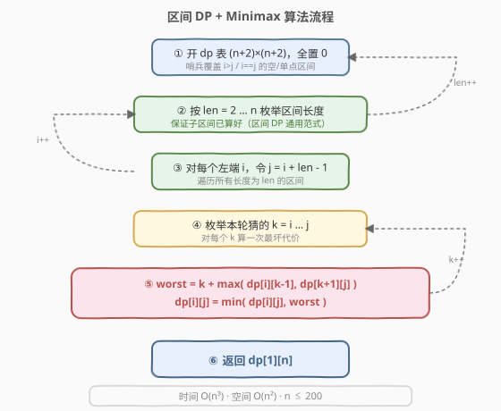
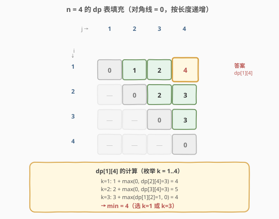

# 猜数字大小II

- **题目名称**：猜数字大小II
- **链接**：[375. 猜数字大小 II](https://leetcode.cn/problems/guess-number-higher-or-lower-ii/)
- **难度**：中等
- **标签**：动态规划、区间 DP、博弈、Minimax

## 1. 题目概述

我从 `1` 到 `n` 之间选一个数字，你来猜。每次猜 `x`：
- 猜中 → 赢，无需再付钱；
- 猜错 → 支付 `x`，并被告知「我选的数字比 `x` 更大 / 更小」，继续猜。

要求：**不管对手选哪个数字**，你都能确保获胜所需要的**最小现金数**。换句话说，求在最坏情况下你最少要花多少钱。

**示例 1**：

```text
输入：n = 10
输出：16
解释：先猜 7 → 若更大则猜 9（再猜 10/8，最坏 7+9=16）；
                若更小则猜 3 → 再猜 5/1 … 最坏路径合计 16。
```

**示例 2**：

```text
输入：n = 1
输出：0
解释：只有一个数，直接猜中，无需支付。
```

**示例 3**：

```text
输入：n = 2
输出：1
解释：猜 1，若错了支付 1，则另一数必为 2，再猜中。最坏付 1。
```

**约束条件**：

- `1 <= n <= 200`

---

## 2. 解题思路

### 2.1 暴力思路

最直接的想法：枚举所有「猜数序列」，对每个序列模拟最坏情况取最小。但猜哪个数、最坏分支走向都取决于对手，组合爆炸——`n=200` 时根本无法枚举。

问题的本质是**博弈**：你在选策略使「最坏代价」最小，对手在选数字使你的代价最大。这正是 **Minimax（极小化极大）** 模型。

> 💡 **关键卡点**：单次猜 `x` 之后，剩余候选会裂成左右两段 `[i, x-1]` 与 `[x+1, j]`，且这两段是**相互独立的子问题**——对手只会让你进入其中一段（更糟的那段）。这种「区间内选分点 → 拆成两个独立子区间」的结构，正是**区间 DP** 的招牌特征。

### 2.2 核心观察：区间 DP + Minimax



设当前已知目标数字落在闭区间 `[i, j]` 内。你选一个 `k ∈ [i, j]` 来猜：

- 猜中（目标就是 `k`）：付出 `0`，结束；
- 猜小了（目标更大）：付出 `k`，子问题变为 `[k+1, j]`；
- 猜大了（目标更小）：付出 `k`，子问题变为 `[i, k-1]`。

由于**对手会选对你最不利的那个分支**，猜 `k` 后你**最坏**还要再花 $\max(\text{cost}(i, k-1),\ \text{cost}(k+1, j))$。于是猜 `k` 的最坏总代价为：

$$k + \max\big(\text{cost}(i, k-1),\ \text{cost}(k+1, j)\big)$$

而你可以在 `[i, j]` 内自由选 `k`，目标是让这个最坏代价**尽量小**——对 `k` 取 `min`。

**状态定义**：

$$dp[i][j] = \text{在区间 } [i, j] \text{ 内确保获胜的最小代价},\quad 1 \le i \le j \le n$$

**状态转移**（枚举本轮猜的 `k`）：

$$dp[i][j] = \min_{k=i}^{j} \Big\{\, k + \max\big(dp[i][k-1],\ dp[k+1][j]\big) \,\Big\}$$

**边界**：

- $i = j$：只剩一个数，直接猜中，$dp[i][i] = 0$；
- $i > j$：区间为空（不会进入），$dp[i][j] = 0$（哨兵，便于 `k=i` / `k=j` 时统一处理）。

**答案**：$dp[1][n]$。

> 💡 **Minimax 的两句话理解**：
> - 内层 `max`：**对手**让你进入更糟的分支（你被动接受最坏）；
> - 外层 `min`：**你**主动选 `k` 让这个最坏尽量小（你主动优化最坏）。
>
> 这与 [877. 石子游戏](https://leetcode.cn/problems/stone-game/) 的「博弈型区间 DP」同源，只是 877 是「净赚差」、本题是「最坏代价」。

> ⚠️ **易错点 1**：`dp` 数组下标要扩到 `0` 和 `n+1`。当 `k = i` 时要用到 `dp[i][i-1]`（空区间，=0）；当 `k = j` 时要用到 `dp[j+1][j]`（空区间，=0）。开 `n+2` 行列、初始化为 `0` 即可，免去边界特判。

> ⚠️ **易错点 2**：**别贪心猜二分中点**。二分能最小化「猜测次数」但**不能**最小化「最坏代价」——猜大数时输了要赔很多。例如 `n=10` 最优首猜是 `7` 而非 `5`，因为右段 `[8,10]` 数字大、代价高，需要更早用大数「探路」以缩短右段。本题必须老老实实 DP。

### 2.3 算法流程图



核心是**按区间长度递增**填表：$dp[i][j]$ 依赖更短的子区间 $[i, k-1]$ 与 $[k+1, j]$，二者长度都严格小于 $j-i+1$。因此外层按 `len` 从小到大遍历，可保证转移时子状态已算好——这是区间 DP 通用遍历范式。

1. 开 `dp` 表大小 `(n+2) × (n+2)`，全置 `0`（已含所有边界哨兵）。
2. 按 `len = 2 … n` 枚举区间长度（`len = 1` 时 `dp[i][i] = 0` 已就绪）。
3. 对每个左端 `i`，令 `j = i + len - 1`。
4. 枚举本轮猜的 `k = i … j`。
5. 转移：$dp[i][j] = \min(dp[i][j],\ k + \max(dp[i][k-1],\ dp[k+1][j]))$。
6. 返回 $dp[1][n]$。

### 2.4 示例演算



以 `n = 4` 为例，求 $dp[1][4]$。对角线 $dp[i][i] = 0$ 已就绪，按长度递增填充：

| 区间长度 | (i, j) | 枚举 k 的最坏代价 `k + max(dp[i][k-1], dp[k+1][j])` | dp[i][j] | 选定 k |
|----------|--------|-----------------------------------------------------|----------|--------|
| 2 | (1,2) | k=1: 1+max(0,0)=1；k=2: 2+max(0,0)=2 | 1 | 1 |
| 2 | (2,3) | k=2: 2；k=3: 3 | 2 | 2 |
| 2 | (3,4) | k=3: 3；k=4: 4 | 3 | 3 |
| 3 | (1,3) | k=1: 1+max(0,dp[2][3]=2)=3；k=2: 2+max(0,0)=2；k=3: 3+max(dp[1][2]=1,0)=4 | 2 | 2 |
| 3 | (2,4) | k=2: 2+max(0,dp[3][4]=3)=5；k=3: 3+max(0,0)=3；k=4: 4+max(dp[2][3]=2,0)=6 | 3 | 3 |
| 4 | (1,4) | k=1: 1+max(0,dp[2][4]=3)=4；k=2: 2+max(0,dp[3][4]=3)=5；k=3: 3+max(dp[1][2]=1,0)=4；k=4: 4+max(dp[1][3]=2,0)=6 | **4** | 1 或 3 |

**最优策略回放**（`n=4`，对手总选最坏分支）：
- 猜 `1`：若对手说更大 → 进入 `[2,4]`，再猜 `3` → 若更大猜 `4`（共 1+3=4），若更小猜 `2`（共 1+3=4）。最坏 `4`。
- 或猜 `3`：对称，最坏也是 `4`。
- 所以 `n=4` 答案为 `4`。

---

## 3. 参考代码

### 方法一：区间 DP + Minimax（自底向上递推，推荐）

### C++

```cpp
class Solution {
  public:
    int getMoneyAmount(int n) {
        // 多开 2 行 2 列作哨兵，dp[i][j] 对 i>j / i==j 均为 0
        vector<vector<int>> dp(n + 2, vector<int>(n + 2, 0));

        for (int len = 2; len <= n; ++len) {            // 区间长度
            for (int i = 1; i + len - 1 <= n; ++i) {    // 左端
                int j = i + len - 1;                    // 右端
                dp[i][j] = INT_MAX;
                for (int k = i; k <= j; ++k) {          // 枚举本轮猜的 k
                    int worst = k + max(dp[i][k - 1], dp[k + 1][j]);
                    dp[i][j] = min(dp[i][j], worst);
                }
            }
        }
        return dp[1][n];
    }
};
```

### Python

```python
class Solution:
    def getMoneyAmount(self, n: int) -> int:
        # 多开 2 行 2 列作哨兵，dp[i][j] 对 i>j / i==j 均为 0
        dp = [[0] * (n + 2) for _ in range(n + 2)]

        for length in range(2, n + 1):         # 区间长度
            for i in range(1, n - length + 2): # 左端
                j = i + length - 1             # 右端
                best = float('inf')
                for k in range(i, j + 1):      # 枚举本轮猜的 k
                    worst = k + max(dp[i][k - 1], dp[k + 1][j])
                    if worst < best:
                        best = worst
                dp[i][j] = best
        return dp[1][n]
```

> ⚠️ **三个易错点**：
> 1. **哨兵开 `n+2`**：`k=i` 时访问 `dp[i][i-1]`、`k=j` 时访问 `dp[j+1][j]`，下标会到 `0` 和 `n+1`。开 `n+2` 且全置 `0` 即可，免去 `if` 特判。
> 2. **按区间长度递增填表**：`dp[i][j]` 依赖更短的 `[i, k-1]`、`[k+1, j]`，必须先算短区间。这是**所有区间 DP 的标准范式**。
> 3. **不要二分贪心**：最小化「最坏代价」≠ 最小化「猜测次数」，二分不适用，必须 DP 枚举 `k`。

---

## 4. 复杂度分析

| 维度 | 复杂度 | 说明 |
|------|--------|------|
| 时间复杂度 | $O(n^3)$ | 三重循环：区间长度 $O(n)$ × 左端 $O(n)$ × 枚举 $k$ $O(n)$ |
| 空间复杂度 | $O(n^2)$ | $(n+2) \times (n+2)$ 的 DP 表 |

> 💡 `n=200` 时 $n^3 = 8\times10^6$，远低于时间限制，轻松通过。⚠️ 本题**不能套 Knuth 优化**（见第 5 节），$O(n^3)$ 即为最优复杂度。

---

## 5. 扩展：记忆化搜索（自顶向下）

区间 DP 也可写成**自顶向下的分治 + 记忆化**：`dfs(i, j)` 表示在 `[i, j]` 内确保获胜的最小代价，枚举本轮猜的 `k`，递归求左右两段。逻辑上与递推完全等价，且更贴近「我先猜 `k`，对手选更糟分支」的直觉，写起来不易在遍历顺序上出错。

### C++

```cpp
class Solution {
    vector<vector<int>> memo;
  public:
    int getMoneyAmount(int n) {
        memo.assign(n + 2, vector<int>(n + 2, -1));
        return dfs(1, n);
    }
    int dfs(int i, int j) {
        if (i >= j) return 0;                       // 单点 / 空区间，无需付费
        if (memo[i][j] != -1) return memo[i][j];
        int best = INT_MAX;
        for (int k = i; k <= j; ++k) {
            int worst = k + max(dfs(i, k - 1), dfs(k + 1, j));
            best = min(best, worst);
        }
        return memo[i][j] = best;
    }
};
```

> 💡 **递推 vs 记忆化**：递推无递归栈、常数更小；记忆化更直观、只算真正用到的状态。本题 `n=200` 递归深度最坏 `200`，远低于默认栈限制，两种写法都能 AC。面试中**记忆化更易一遍写对**，可先写记忆化再优化为递推。

> ⚠️ **关于 Knuth 优化**：本题转移含 `max(dp[i][k-1], dp[k+1][j])`（取两子问题之差，而非相加）并叠加 `+k`，**不满足**标准 Knuth 优化的四边形不等式条件——实测最优分点 `opt[i][j]` 关于端点并**不单调**（如 `n=6` 时 `opt[1][4]=1 < opt[1][3]=2`），强行套用会得到错误答案。本题请老老实实 $O(n^3)$，不要套 Knuth。

---

## 6. 面试要点

1. **为什么是 Minimax 而不是普通最短路 / 二分？**

   - 对手会**主动选对你最不利的分支**，每步代价不确定，须按「最坏情况」计价。二分只最小化猜测次数、不考虑每次赔钱多少；本题要求最小化**最坏总赔付**，必须 Minimax + DP。

2. **状态为什么定义在区间 `[i, j]` 上？**

   - 每猜一次 `x`，剩余候选裂成 `[i, x-1]` 与 `[x+1, j]` 两段，二者**独立**（对手只让你进一段）。这天然满足最优子结构 + 无后效性，是区间 DP 的标准信号。

3. **内层 `max`、外层 `min` 各代表什么？**

   - 内层 `max(dp[i][k-1], dp[k+1][j])`：**对手**选更糟的分支（你被动接受最坏）；
   - 外层 `min over k`：**你**主动选 `k` 让最坏代价尽量小（你主动优化最坏）。合起来即 Minimax。

4. **为什么要开 `n+2` 大小的数组？**

   - `k=i` 时访问 `dp[i][i-1]`、`k=j` 时访问 `dp[j+1][j]`，下标到 `0` 和 `n+1`。开 `n+2` 且全置 `0` 作为哨兵，免去边界特判，代码更简洁。

5. **能优化到 $O(n^2)$ 吗？**

   - **本题不能套 Knuth 优化**。转移含 `max(dp[i][k-1], dp[k+1][j])`（取两子问题之较大者，而非相加）并叠加 `+k`，不满足标准四边形不等式——实测最优分点 `opt[i][j]` 关于端点并不单调（`n=6` 即出现反例 `opt[1][4]=1 < opt[1][3]=2`），强行套 Knuth 会出错。$O(n^3)$ 是本题的正确复杂度，`n=200` 时 $8\times10^6$ 足够通过。

6. **区间 DP 还有哪些同类题型？**

   - 「博弈型」：[877. 石子游戏](https://leetcode.cn/problems/stone-game/)（净赚差 Minimax）；「分段型」：[312. 戳气球](https://leetcode.cn/problems/burst-balloons/)（最后戳谁）、[1039. 多边形三角剖分](https://leetcode.cn/problems/minimum-score-triangulation-of-polygon/)。共性：区间内选分点 → 拆独立子区间 → 按长度递增填表。

---

## 7. 同类练习题

- [374. 猜数字大小](https://leetcode.cn/problems/guess-number-higher-or-lower/)：本题的「次数版」前身，二分即可，对照理解为何本题不能二分
- [877. 石子游戏](https://leetcode.cn/problems/stone-game/)：博弈型区间 DP（净赚差 Minimax），与本题骨架一致、目标函数不同
- [312. 戳气球](https://leetcode.cn/problems/burst-balloons/)：区间 DP 母题（最后戳谁 + 拆独立子区间），$O(n^3)$ 模板招牌题
- [664. 奇怪的打印机](https://leetcode.cn/problems/strange-printer/)：区间 DP，按「首字符」分段，转移讨论两端同色
- [1039. 多边形三角剖分的最低得分](https://leetcode.cn/problems/minimum-score-triangulation-of-polygon/)：区间 DP，选 `k` 切两半，骨架与本题几乎一致
