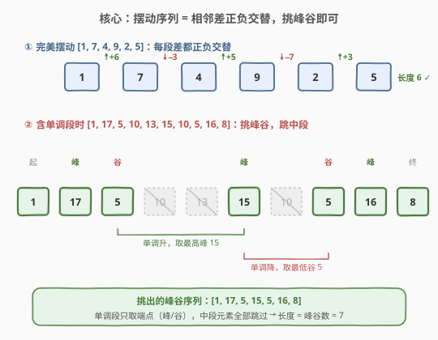
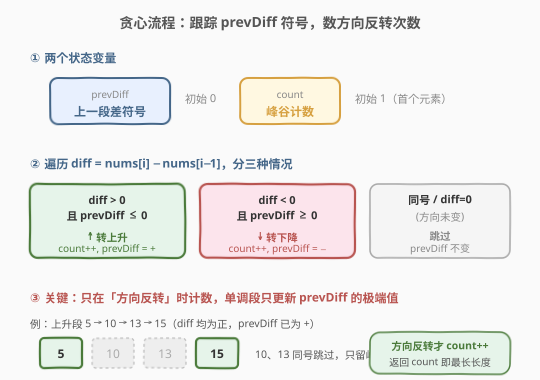
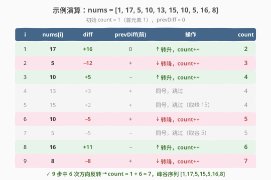

# 摆动序列

- **题目名称**：摆动序列
- **链接**：[376. 摆动序列](https://leetcode.cn/problems/wiggle-subsequence/)
- **难度**：中等
- **标签**：贪心、动态规划、数组

## 1. 题目概述

如果一个序列的**相邻元素差的符号严格交替**（正、负、正、负……），则称其为「摆动序列」。第一个差可以是正或负；**仅有一个元素的序列也算摆动序列**（长度为 1）。

给定一个整数数组 `nums`，返回 `nums` 中**最长摆动子序列的长度**。子序列可通过删除若干元素（可能不删）得到，剩余元素保持原序。

**示例 1**：

```text
输入：nums = [1,7,4,9,2,5]
输出：6
解释：整个数组就是摆动序列，差的序列为 6, -3, 5, -7, 3。
```

**示例 2**：

```text
输入：nums = [1,17,5,10,13,15,10,5,16,8]
输出：7
解释：一个最长摆动子序列为 [1,17,10,13,10,16,8]，差为 16,-7,3,-3,6,-8。
```

**示例 3**：

```text
输入：nums = [1,2,3,4,5,6,7,8,9]
输出：2
解释：严格递增，最长摆动子序列只能取首尾 [1,9]，长度 2。
```

**约束条件**：

- $1 \le \text{nums.length} \le 1000$
- $0 \le \text{nums[i]} \le 1000$

> 💡 **进阶要求**：能否用 $O(n)$ 时间解决？答案是肯定的——贪心一趟扫描即可。本题也是 [334. 递增的三元子序列](../0301-0400/334_递增的三元子序列.md)「维护极值阈值」思想的姊妹篇。

---

## 2. 解题思路

### 2.1 暴力思路：动态规划 $O(n^2)$

定义 `up[i]` = 以 `nums[i]` 结尾、且最后一段差为**正**的最长摆动子序列长度；`down[i]` = 最后一段差为**负**的长度。对每个 `i` 枚举所有 `j < i`：

$$
\text{up}[i] = \max_{j<i,\ \text{nums}[j] < \text{nums}[i]} (\text{down}[j] + 1), \qquad
\text{down}[i] = \max_{j<i,\ \text{nums}[j] > \text{nums}[i]} (\text{up}[j] + 1)
$$

时间 $O(n^2)$，空间 $O(n)$。能过但远非最优——其实只关心「当前方向」，不必回看所有 `j`。

### 2.2 核心观察：贪心数峰谷——方向反转才计数



最长摆动子序列贪心选取**局部极值（峰与谷）**：在每一段单调上升/下降的连续段里，只保留端点（峰或谷），跳过中段元素。

> 💡 **正确性直觉**：单调段里的中间元素对「方向反转」没有贡献——同方向连续走，多走几步不增加摆动长度。只有「方向发生反转」的那一刻才让序列长度 `+1`。而要让后续更容易反转，上升段应尽量**走到最高**（取峰），下降段应尽量**走到最低**（取谷）。这与 [334. 递增的三元子序列](../0301-0400/334_递增的三元子序列.md)「`first` 尽量小、`second` 尽量小」是同一类贪心直觉——**维护最有利于后续反转的极端状态**。

因此只需跟踪**上一段差的方向** `prevDiff`（正 / 负 / 零），扫描相邻差 `diff = nums[i] − nums[i−1]`：

- **方向反转**（`diff > 0` 且 `prevDiff ≤ 0`，或 `diff < 0` 且 `prevDiff ≥ 0`）：`count++`，更新 `prevDiff`。
- **方向不变**（同号或 `diff = 0`）：跳过，`prevDiff` 不变（等价于把当前单调段的极端点顺延）。

初始 `count = 1`（首元素必选），`prevDiff = 0`（保证第一段非零差一定算作反转）。

### 2.3 算法流程图



**三步法**：

1. **初始化**：`count = 1`，`prevDiff = 0`。
2. **遍历** `i` 从 `1` 到 `n−1`，令 `diff = nums[i] − nums[i−1]`：
   - 若 `diff > 0` 且 `prevDiff ≤ 0`：`count++`，`prevDiff = diff`（记为正方向）。
   - 否则若 `diff < 0` 且 `prevDiff ≥ 0`：`count++`，`prevDiff = diff`（记为负方向）。
   - 否则：跳过（同号或零差，`prevDiff` 保持不变）。
3. **返回** `count`。

> ⚠️ **为什么 `prevDiff ≤ 0` 而非 `prevDiff < 0`？** 初始 `prevDiff = 0` 时，第一段非零差必须被计入——用 `≤ 0` / `≥ 0` 让零值视作「可被任意方向接管」。同时，连续零差（平台）不会触发任一分支，`prevDiff` 停留为 0，直到遇到第一个非零差才确定初始方向。这样天然处理了前导平台与全相等数组（此时 `count` 始终为 1，正确）。

### 2.4 示例演算

以 `nums = [1, 17, 5, 10, 13, 15, 10, 5, 16, 8]` 为例（期望答案 7）：



| i | nums[i] | diff | prevDiff(前) | 操作 | count |
|---|---------|------|--------------|------|-------|
| — | 1 | — | — | 初始（首元素必选） | 1 |
| 1 | 17 | +16 | 0 | ↑ 转升，count++ | 2 |
| 2 | 5 | −12 | + | ↓ 转降，count++ | 3 |
| 3 | 10 | +5 | − | ↑ 转升，count++ | 4 |
| 4 | 13 | +3 | + | 同号，跳过 | 4 |
| 5 | 15 | +2 | + | 同号，跳过（取峰 15） | 4 |
| 6 | 10 | −5 | + | ↓ 转降，count++ | 5 |
| 7 | 5 | −5 | − | 同号，跳过（取谷 5） | 5 |
| 8 | 16 | +11 | − | ↑ 转升，count++ | 6 |
| 9 | 8 | −8 | + | ↓ 转降，count++ | **7** ⭐ |

> 💡 **关键看 i=4、5、7 三步**：它们处在单调段中段，`diff` 与 `prevDiff` 同号，被跳过——但跳过的同时，贪心实际把「峰」顺延到了 `15`（比 `10`、`13` 更高）、把「谷」顺延到了 `5`（比 `10` 更低）。这正是贪心只更新 `prevDiff` 方向、不显式记录选谁所隐含的「取极端点」行为。最终挑出的峰谷序列为 `[1, 17, 5, 15, 5, 16, 8]`，长度 7。

---

## 3. 参考代码

### C++

```cpp
class Solution {
  public:
    int wiggleMaxLength(vector<int>& nums) {
        int n = nums.size();
        if (n < 2) return n;
        int count = 1;
        int prevDiff = 0;
        for (int i = 1; i < n; i++) {
            int diff = nums[i] - nums[i - 1];
            if (diff > 0 && prevDiff <= 0) {        // 转上升
                count++;
                prevDiff = diff;
            } else if (diff < 0 && prevDiff >= 0) { // 转下降
                count++;
                prevDiff = diff;
            }
            // 同号或 diff==0：跳过，prevDiff 不变
        }
        return count;
    }
};
```

### Python

```python
class Solution:
    def wiggleMaxLength(self, nums: List[int]) -> int:
        n = len(nums)
        if n < 2:
            return n
        count = 1
        prev_diff = 0
        for i in range(1, n):
            diff = nums[i] - nums[i - 1]
            if diff > 0 and prev_diff <= 0:        # 转上升
                count += 1
                prev_diff = diff
            elif diff < 0 and prev_diff >= 0:      # 转下降
                count += 1
                prev_diff = diff
            # 同号或 diff==0：跳过，prev_diff 不变
        return count
```

> ⚠️ **两个高频踩坑点**：
> （1）**条件必须带等号**（`prevDiff ≤ 0` / `≥ 0`）。若写成 `prevDiff < 0` / `> 0`，初始 `prevDiff = 0` 时第一段非零差无法被计入，`count` 少 1；前导平台也会出错。
> （2）**`diff == 0` 不能更新 `prevDiff`**。平台段方向未定，若把 `prevDiff` 刷成 0 之外的值，会破坏后续反转判定。上面代码让零差落入「跳过」分支（不进任何 `if`），`prevDiff` 自然保持不变，正确。

> 💡 **`n < 2` 特判**：单元素数组是摆动序列（长度 1），双元素只要不等就是长度 2。上面通用循环对 `n = 1` 不进循环返回 `count = 1` 也对，但显式特判更清晰。

---

## 4. 复杂度分析

| 维度 | 复杂度 | 说明 |
|------|--------|------|
| **时间复杂度** | $O(n)$ | 一趟遍历，每个相邻差 $O(1)$ 比较与赋值 |
| **空间复杂度** | $O(1)$ | 仅 `count`、`prevDiff`、`diff` 三个变量 |

> 💡 这是该题的最优解：时间已达下界 $O(n)$（必须至少看一遍所有相邻差），空间为常数。$n \le 1000$ 的约束对 $O(n^2)$ DP 也能通过，但面试中应主动给出 $O(n)$ 贪心。

---

## 5. 扩展：动态规划解法（$O(n)$ 空间优化版）

若不习惯贪心的「跳过中段」直觉，可用状态机 DP 推导，殊途同归：

- `up` = 当前以「上升」结尾的最长摆动长度；
- `down` = 当前以「下降」结尾的最长摆动长度。

每步看 `diff = nums[i] − nums[i−1]`：

$$
\begin{cases}
\text{diff} > 0:\ \text{up} = \text{down} + 1 & (\text{上升接在下降之后}) \\
\text{diff} < 0:\ \text{down} = \text{up} + 1 & (\text{下降接在上升之后}) \\
\text{diff} = 0:\ \text{不变} & (\text{平台})
\end{cases}
$$

初始 `up = down = 1`，答案 $\max(\text{up}, \text{down})$。

```python
def wiggleMaxLength(self, nums: List[int]) -> int:
    up = down = 1
    for i in range(1, len(nums)):
        if nums[i] > nums[i - 1]:
            up = down + 1
        elif nums[i] < nums[i - 1]:
            down = up + 1
    return max(up, down)
```

> 💡 **DP 与贪心的等价性**：`up = down + 1` 只在「上升」时触发，若连续上升则 `down` 不变、`up` 反复赋同一个 `down + 1`——等价于贪心的「同号跳过、只更新极端点」。两份代码状态转移完全同构，只是 DP 把「方向」编码进 `up/down` 两个变量，贪心编码进 `prevDiff` 一个符号。面试时先讲 DP 建立信心，再优化到贪心 $O(1)$ 变量，展示渐进思维。

> ⚠️ **注意 `up = down + 1` 不能写成 `up = max(up, down + 1)` 吗？** 可以加 `max` 但无意义——连续上升时 `down` 不变，`down + 1` 恒等于当前 `up`，`max` 不改变值。省略 `max` 更简洁，且体现「只在方向反转时增长」的本质。

---

## 6. 面试要点

1. **贪心为什么正确？为什么跳过单调中段不影响最优解？**
   - 摆动长度只在「方向反转」时增长。单调段里的中间元素方向不变，对长度无贡献。
   - 上升段取最高点（峰）、下降段取最低点（谷），让后续更容易反转——这是「维护最有利于后续的极端状态」的贪心交换论证。跳过中段等价于把极端点顺延到段的末端，不会丢失任何反转机会。

2. **`prevDiff ≤ 0` 里的等号为什么不能省？**
   - 初始 `prevDiff = 0`，第一段非零差必须被计入。若用 `< 0` / `> 0`，初始零值不满足任一分支，`count` 少 1。等号让零值视作「可被任意方向接管」，同时正确处理前导平台与全相等数组。

3. **`diff == 0`（平台）怎么处理？为什么不能更新 `prevDiff`？**
   - 平台方向未定，应跳过。上面代码让零差不进任何 `if`，`prevDiff` 保持不变。若误把 `prevDiff` 刷成 0 之外的值（如直接 `prevDiff = diff`），会破坏后续反转判定——例如 `[1,1,1,2]` 会得到错误结果。

4. **贪心和状态机 DP 的关系？**
   - 完全等价。DP 的 `up = down + 1`（上升时）与 `down = up + 1`（下降时）只在方向反转时生效，连续同向时值不变——正是贪心的「同号跳过」。DP 用 `up/down` 两变量编码方向，贪心用 `prevDiff` 一个符号，状态转移同构。

5. **如果要求输出最长摆动子序列本身（而非长度），怎么做？**
   - 贪心扫描时，每次 `count++`（方向反转）把当前 `nums[i]` 加入结果序列；最后若末尾处在单调段，还需补上末端元素（峰/谷）。也可在 DP 里记录前驱下标回溯。注意答案不唯一——`[1,17,5,15,5,16,8]` 和 `[1,17,10,13,10,16,8]` 都是长度 7 的合法解。

---

## 7. 同类练习题

- [334. 递增的三元子序列](https://leetcode.cn/problems/increasing-triplet-subsequence/)（[题解](../0301-0400/334_递增的三元子序列.md)）：贪心维护 `first/second` 双阈值，与本题「维护极端状态便于后续反转」同源
- [300. 最长递增子序列](https://leetcode.cn/problems/longest-increasing-subsequence/)（[题解](../0201-0300/300_最长递增子序列.md)）：通用版 LIS 的 `tails` 数组 + 二分，本题是「交替方向版」最长子序列
- [152. 乘积最大子数组](https://leetcode.cn/problems/maximum-product-subarray/)（[题解](../0101-0200/152_乘积最大子数组.md)）：维护 `min/max` 双状态滚动递推，与本题 `up/down` 状态机结构相似
- [53. 最大子数组和](https://leetcode.cn/problems/maximum-subarray/)（[题解](../0001-0100/53_最大子数组和.md)）：一趟扫描维护当前最优状态，贪心/DP 边界模糊的同类题型
- [746. 使用最小花费爬楼梯](https://leetcode.cn/problems/min-cost-climbing-stairs/)：线性状态机 DP，对比「滚动两变量」的空间优化套路
