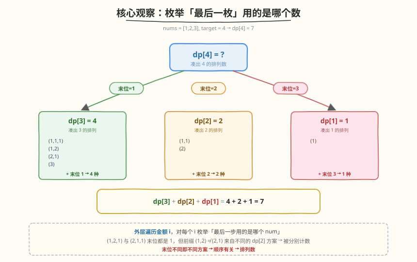
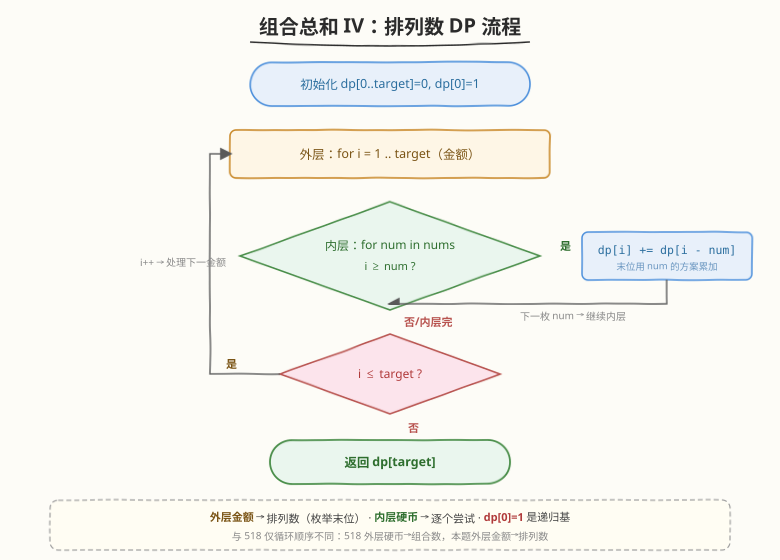

# 组合总和IV

- **题目名称**：组合总和IV
- **链接**：[377. 组合总和 IV](https://leetcode.cn/problems/combination-sum-iv/)
- **难度**：中等
- **标签**：动态规划、完全背包、排列计数

## 1. 题目概述

给定一个由**互不相同的**正整数组成的数组 `nums` 和一个目标整数 `target`，返回**加起来等于 `target` 的元素组合的个数**。每个元素可以使用**无限次**。题目保证答案符合 32 位整数范围。

> ⚠️ **「组合」名不副实**：题目虽叫「组合总和」，但说明里明确「**不同顺序的序列视为不同组合**」——即 `(1,2,1)` 和 `(2,1,1)` 算两种。这其实是求**排列数**（顺序有关），与 [518. 零钱兑换 II](../0501-0600/518_零钱兑换II.md) 的「组合数」（顺序无关）恰成镜像。

**示例 1**：

```text
输入：nums = [1,2,3], target = 4
输出：7
解释：7 种可能的序列：
(1,1,1,1)  (1,1,2)  (1,2,1)  (2,1,1)  (2,2)  (1,3)  (3,1)
```

**示例 2**：

```text
输入：nums = [9], target = 3
输出：0
解释：只有 9，无法凑出 3。
```

**示例 3**：

```text
输入：nums = [1], target = 1000
输出：1
解释：唯一方案是 1000 个 1 相加。
```

**约束条件**：

- $1 \leq \text{nums.length} \leq 200$
- $1 \leq \text{nums[i]} \leq 1000$
- `nums` 中的所有元素**互不相同**
- $0 \leq \text{target} \leq 1000$
- 题目数据保证答案符合 32 位整数范围

> 💡 本题是 [518. 零钱兑换 II](../0501-0600/518_零钱兑换II.md) 的「**排列版**」——同样是每种数无限用的完全背包计数，518 求「组合数」（顺序无关），本题求「排列数」（顺序有关）。两题的**转移方程一模一样**，唯一的区别是**循环顺序**：518 外层硬币、内层金额；本题外层金额、内层硬币。理解这层关系，就能在两题间一行迁移。

---

## 2. 解题思路

### 2.1 暴力思路：DFS 回溯

从 `target` 出发，每次选一个 `num` 减去，递归到 `0` 时计数 `+1`。因为「不同顺序算不同方案」，所以每次都从**全部** `nums` 里选（不像 [39. 组合总和](../0001-0100/39_组合总和.md) 那样用 `start` 限制不回头）。

```text
dfs(target) = sum(dfs(target - num))  for num in nums if target >= num
dfs(0) = 1
```

问题：大量子问题重复计算——如 `target=4, nums=[1,2]` 时，`dfs(2)` 会在 `4→3→2` 和 `4→2` 两条路径上被重复求解。指数级 $O(\text{target}^{\text{nums.length}})$，严重超时。

加记忆化（`memo[target]`）后降到 $O(\text{target} \cdot n)$——这其实就是下面的 DP。

### 2.2 核心观察：完全背包求排列数——枚举「最后一枚」



定义 `dp[i]` = 凑出金额 `i` 的**排列数**（顺序有关）。转移方程：

$$
\text{dp}[i] \;{+}{=}\; \text{dp}[i - \text{num}] \qquad \text{for num in nums if } i \geq \text{num}
$$

初始 `dp[0] = 1`（金额为 0 有一种「空序列」方案），其余 `dp[i] = 0`。

**关键洞察——为什么外层金额、内层硬币就是排列数？**

> 💡 固定金额 `i`，逐个 `num` 枚举「**最后一步用的是哪个数**」。于是 `dp[i]` = 「末位是 `num₁` 的方案数」+「末位是 `num₂` 的方案数」+ …… 每个分支代表一种**不同的末位选择**，自然区分顺序。
>
> - `(1,2,1)`：末位是 `1`，前缀 `(1,2)` 是 `dp[3]` 中的一种排列
> - `(2,1,1)`：末位也是 `1`，但前缀 `(2,1)` 是 `dp[3]` 中的**另一种**排列
>
> 两者末位相同，但前缀不同（`dp[3]` 本身也是排列数，区分顺序），所以被**分别计数**。这正是「排列数」的本质——**末位不同即不同方案，末位相同但前缀不同也算不同方案**。

> ⚠️ **与 [518. 零钱兑换 II](../0501-0600/518_零钱兑换II.md) 的唯一区别**：518 外层遍历**硬币**、内层遍历**金额**，相当于给硬币排序后「逐个纳入」，已处理的硬币不回头，方案里硬币相对顺序固定 → **组合数**（`{1,2,2}` 只算一次）。本题外层遍历**金额**、内层遍历**硬币**，固定金额枚举末位 → **排列数**（`1+2+2`、`2+1+2`、`2+2+1` 算三次）。**同一个转移方程，只换循环顺序，结果从 4 变 7**——这是背包 DP 最精妙的一处。

### 2.3 算法流程图



**三步法**（与 518 骨架相同，仅内外层互换）：

1. **初始化**：`dp[0..target] = 0`，`dp[0] = 1`。
2. **外层遍历金额** `i` 从 `1` 到 `target`，**内层遍历** `num` in `nums`：
   - 若 $i \geq \text{num}$：$\text{dp}[i] \;{+}{=}\; \text{dp}[i - \text{num}]$（末位用 `num` 的方案数累加进来）。
3. **返回** `dp[target]`。

> 💡 **为什么内层不需要「正序/倒序」讨论？** 518 那道题里「内层正序 = 完全背包、倒序 = 0-1 背包」的前提是「外层硬币、内层金额」。本题外层是金额、内层是硬币——每次 `dp[i]` 只引用 `dp[i-num]`（比 `i` 小的位置），而 `dp[i-num]` 在**更早的外层轮次**就已算定，与内层遍历方向无关。所以本题没有「正序倒序」的坑，**只要外层金额、内层硬币，天然就是完全背包**。

### 2.4 示例演算

以 `nums = [1,2,3], target = 4` 为例（期望答案 7）：

![示例演算：nums=[1,2,3], target=4 逐步填充得到 dp[4]=7](../images/combsum4_walkthrough.svg)

| i | dp[i−1]+1 | dp[i−2]+2 | dp[i−3]+3 | dp[i] | 对应排列 |
|---|-----------|-----------|-----------|-------|----------|
| 0 | — | — | — | 1 | `()` 空序列 |
| 1 | dp[0]=1 | — | — | 1 | `(1)` |
| 2 | dp[1]=1 | dp[0]=1 | — | 2 | `(1,1)` `(2)` |
| 3 | dp[2]=2 | dp[1]=1 | dp[0]=1 | 4 | `(1,1,1)` `(1,2)` `(2,1)` `(3)` |
| 4 | dp[3]=4 | dp[2]=2 | dp[1]=1 | **7** ⭐ | 见下方 7 种 |

最终 `dp[4] = 7`，对应的 7 种排列按**末位**分组：

- **末位 = 1**（来自 `dp[3]` 的 4 种排列 + `1`）：`(1,1,1,1)` `(1,2,1)` `(2,1,1)` `(3,1)` → 4 种
- **末位 = 2**（来自 `dp[2]` 的 2 种排列 + `2`）：`(1,1,2)` `(2,2)` → 2 种
- **末位 = 3**（来自 `dp[1]` 的 1 种排列 + `3`）：`(1,3)` → 1 种

合计 $4 + 2 + 1 = 7$。

> 💡 **对照 518**：同样的输入 `amount=4, coins=[1,2,3]`，518（组合数）的答案是 **4**——`{1,1,1,1}` `{1,1,2}` `{2,2}` `{1,3}`，不区分顺序。本题把 `{1,1,2}` 展开成 `(1,1,2)` `(1,2,1)` `(2,1,1)` 三种，故多出 3 种，$4 + 3 = 7$。**同一个转移方程，循环顺序不同，结果差出整整 3**——这就是「组合 vs 排列」的全部秘密。

---

## 3. 参考代码

### C++

```cpp
class Solution {
  public:
    int combinationSum4(vector<int>& nums, int target) {
        vector<unsigned int> dp(target + 1, 0);
        dp[0] = 1;
        for (int i = 1; i <= target; i++)       // 外层金额 → 排列数
            for (int num : nums)                 // 内层硬币 → 枚举末位
                if (i >= num)
                    dp[i] += dp[i - num];
        return dp[target];
    }
};
```

### Python

```python
class Solution:
    def combinationSum4(self, nums: List[int], target: int) -> int:
        dp = [0] * (target + 1)
        dp[0] = 1                        # 空序列凑出 0
        for i in range(1, target + 1):   # 外层金额 → 排列数
            for num in nums:             # 内层硬币 → 枚举末位
                if i >= num:
                    dp[i] += dp[i - num]
        return dp[target]
```

> ⚠️ **C++ 为什么要用 `unsigned int`？** 题目保证最终答案在 32 位整数范围内，但**中间状态** `dp[i]` 可能短暂超出 `INT_MAX` 再被后续「不取某些分支」拉回——尤其当 `nums` 含小数（如 `[1]`）且 `target` 较大时。用 `int` 可能在累加过程中溢出导致错误。`unsigned int` 能容纳到 $2^{32}-1$，覆盖所有中间值；Python 的整数天然不限宽，无需担心。

> ⚠️ **两个高频踩坑点**：
> （1）**内外层不能互换**。写成 `for num in nums: for i in range(num, target+1):` 会变成求**组合数**（518 题），`target=4, nums=[1,2,3]` 会得到 4 而非 7。本题要排列数，必须外层金额。
> （2）**不是 0-1 背包**。每个数可无限使用，是完全背包。本题的外层金额+内层硬币天然满足「可重复选」——`dp[i]` 引用的 `dp[i-num]` 在更早的外层轮次算定，已包含所有 `num` 的贡献，无需讨论正序倒序。

---

## 4. 复杂度分析

| 维度 | 复杂度 | 说明 |
|------|--------|------|
| **时间复杂度** | $O(\text{target} \cdot n)$ | $n$ = `nums.length`，外层 `target` 次，内层 $n$ 次转移 |
| **空间复杂度** | $O(\text{target})$ | 一维 `dp` 数组，长度 `target + 1` |

> 💡 本题 $n \leq 200$、$\text{target} \leq 1000$，故 $\text{target} \cdot n \leq 2 \times 10^5$，一维 DP 空间约 4KB，轻松通过。这是背包 DP「伪多项式」的典型体现——复杂度与 `target` 的**数值**而非位数相关。

---

## 5. 扩展：组合数 vs 排列数——循环顺序的本质

518 和 377 是背包 DP 里最经典的一对「镜像题」，差异只在循环顺序。理解本质后可一行迁移：

| 维度 | 518. 零钱兑换 II（组合数） | 377. 组合总和 IV（排列数） |
|------|---------------------------|---------------------------|
| **所求** | **组合数**（顺序无关） | **排列数**（顺序有关） |
| **外层** | 硬币 `coin` | 金额 `i` |
| **内层** | 金额 `i`（正序） | 硬币 `num` |
| **转移** | $\text{dp}[i] \mathrel{+}= \text{dp}[i-\text{coin}]$ | $\text{dp}[i] \mathrel{+}= \text{dp}[i-\text{num}]$ |
| **视角** | 硬币「逐个纳入」，已轮过的不回头 | 固定金额，枚举「最后一步用哪个」 |
| **`target=4, nums=[1,2,3]`** | **4** | **7** |

**本质解释**：

- **外层硬币**相当于给硬币**排序后**逐个纳入——每种硬币一旦「轮到」，就被允许出现在所有后续方案里，但已经轮过的硬币不会再回头。于是方案里硬币的**相对顺序固定**（按 `coins` 的下标序），`{1,2,2}` 只会被统计一次，不会出现 `{2,1,2}` 这种「2 排在 1 前面」的重复，故为**组合数**。
- **外层金额**则相当于固定「**最后一步用的是哪个数**」——对金额 `i`，枚举最后一枚是 `num`，则方案数 = 凑出 `i-num` 的方案数之和。这样「最后一步是 1」和「最后一步是 2」是不同分支，自然区分顺序，故为**排列数**。

> 💡 **一句话记忆**：**外层硬币管「选什么」，外层金额管「最后放什么」**。前者顺序无关得组合，后者顺序有关得排列。两个转移方程一模一样，全靠循环顺序区分。

### Follow-up：如果允许负数？

题目原有一个进阶问题：如果 `nums` 中允许**负数**，会怎样？

> ⚠️ 答案是**会无限循环**——若存在一正一负两数之和为 0（如 `nums=[1,-1]`），则可以无限次插入 `(+1,−1)` 对而不改变总和，方案数趋于无穷，DP 不再收敛。要让问题有意义，必须**限制每个元素的使用次数**（如最多用一次，退化为 0-1 背包）或**限制序列长度**。这也是力扣后来移除该 follow-up 的原因。

---

## 6. 面试要点

1. **为什么外层遍历金额、内层遍历硬币就是排列数？**

   - 外层固定金额 `i`，内层逐个 `num` 尝试「最后一步用的是哪个数」。于是 `dp[i]` = 「末位是 `num₁` 的方案数」+「末位是 `num₂` 的方案数」+ …… 每个分支代表一种**不同的末位选择**，自然区分顺序。
   - `(1,2,1)` 和 `(2,1,1)` 末位都是 1，但前缀 `(1,2)` ≠ `(2,1)` 来自 `dp[3]` 中不同的排列，所以分别计数。**末位不同即不同方案，末位相同但前缀不同也算不同方案** → 排列数。

2. **这题和 518 零钱兑换 II 的区别是什么？**

   - 转移方程**完全相同**：`dp[i] += dp[i-num]`。
   - 518 外层**硬币**、内层**金额** → 组合数（顺序无关）；本题外层**金额**、内层**硬币** → 排列数（顺序有关）。
   - 同输入 `target=4, nums=[1,2,3]`：518 得 4，本题得 7。**记牢这组对比就掌握了背包计数的全部变体**。

3. **`dp[0] = 1` 的 1 从哪里来？**

   - `dp[0]` 表示「凑出金额 0 的方案数」。金额为 0 时「空序列」是一种合法方案，故为 1。它是所有转移的**递归基**：`dp[num] += dp[0]` 即「单用一个 `num` 凑出 `num`」这一种方案。若 `dp[0]=0`，所有 `dp[num]` 永远累加 0，整表全为 0，无法递推。

4. **C++ 为什么要用 `unsigned int` 而不是 `int`？**

   - 题目保证最终答案在 32 位范围内，但**中间累加过程**可能短暂溢出 `INT_MAX`（尤其 `nums` 含小数、`target` 较大时，`dp[i]` 可能累加到一个很大的值，即使最终 `dp[target]` 被「不可达分支」限制在范围内）。
   - `unsigned int` 能容纳到 $2^{32}-1$，覆盖所有中间值。Python 整数不限宽，无需担心。

5. **如果允许负数会怎样？**

   - 若 `nums` 含一正一负且和为 0（如 `[1,-1]`），可无限次插入 `(+1,−1)` 对而不改变总和，方案数趋于无穷，DP 不收敛。必须限制每个元素的使用次数或序列长度才有意义。这也是力扣移除该 follow-up 的原因。

---

## 7. 同类练习题

- [518. 零钱兑换 II](https://leetcode.cn/problems/coin-change-ii/)（[题解](../0501-0600/518_零钱兑换II.md)）：完全背包求**组合数**，外层硬币内层金额，与本题镜像对比循环顺序
- [322. 零钱兑换](https://leetcode.cn/problems/coin-change/)（[题解](../0301-0400/322_零钱兑换.md)）：完全背包求**最少**硬币数，对比 `min` 与 `+=` 的转移算子差异
- [494. 目标和](https://leetcode.cn/problems/target-sum/)（[题解](../0401-0500/494_目标和.md)）：0-1 背包**计数**，内层倒序，对比「每元素用一次」与本题「无限用」
- [279. 完全平方数](https://leetcode.cn/problems/perfect-squares/)：完全背包求**最少**个数，进一步熟悉完全背包框架
- [39. 组合总和](https://leetcode.cn/problems/combination-sum/)（[题解](../0001-0100/39_组合总和.md)）：**回溯**枚举所有组合方案，对比「回溯求具体方案」与「DP 求方案数」
