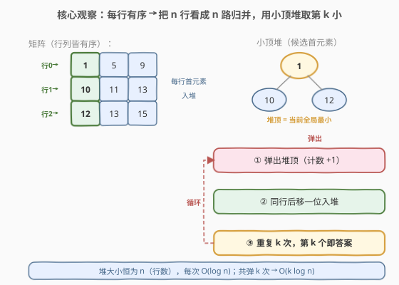
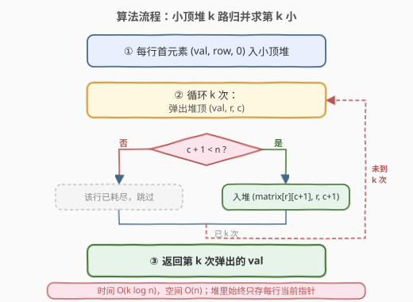
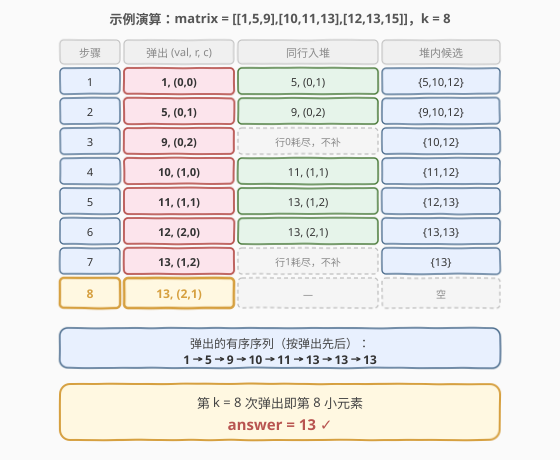

# LeetCode 有序矩阵中第K小的元素 题解

## 1. 题目概述

- **标题 / 题号**：有序矩阵中第K小的元素（#378，medium）
- **链接**：https://leetcode.cn/problems/kth-smallest-element-in-a-sorted-matrix/
- **难度**：中等
- **标签**：堆、二分查找、矩阵、归并

**题意**：给定一个 `n x n` 的矩阵 `matrix`，其中**每行**和**每列**均按升序排列（非递减）。请返回矩阵中**第 `k` 小**的元素（按升序排列后的第 `k` 个，**不是**第 `k` 个不同的元素）。

**示例 1**：

```text
输入：matrix = [[1,5,9],[10,11,13],[12,13,15]], k = 8
输出：13
解释：矩阵元素升序排列为 [1,5,9,10,11,13,13,15]，第 8 个是 13。
```

**示例 2**：

```text
输入：matrix = [[-5]], k = 1
输出：-5
```

**约束**：

- `n == matrix.length == matrix[i].length`
- `1 <= n <= 300`
- `-10^9 <= matrix[i][j] <= 10^9`
- 题目保证每行、每列均按非递减顺序排序
- `1 <= k <= n^2`

> ⚠️ 注意：题目求的是「第 k 小」而非「第 k 个不同元素」，因此**重复元素分别计数**（如示例 1 中两个 `13` 各占一位）。矩阵的「行列皆有序」是破题的关键性质。

## 2. 解题思路

### 2.1 暴力思路

把 `n^2` 个元素全部拍平进一个数组，排序后取第 `k` 个。时间 $O(n^2 \log n)$，空间 $O(n^2)$。`n = 300` 时 `n^2 = 90000`，能 AC 但**完全没有利用矩阵行列有序的性质**，面试中只能作为「保底」说一句。

### 2.2 核心观察：小顶堆 k 路归并



矩阵**每一行本身就有序**，于是可以把 `n` 行看成 `n` 条有序链表，问题转化为经典的 **「k 路归并取第 k 小」**：

- 维护一个**小顶堆**，初始把**每行的首元素**（即每行当前最小的）连同其坐标 `(row, col)` 入堆；
- 堆顶就是当前 `n` 行**各自未取部分中的全局最小**。弹出堆顶、计数 +1；
- 弹出后，把**同一行的下一个元素**（`col + 1` 位置）补入堆，保持堆里始终是每行当前的「候选最小」；
- 重复 `k` 次弹出，第 `k` 次弹出的值即为答案。

> 💡 **关键不变式**：堆的大小始终 $\le n$（每行至多有一个代表在堆里），所以每次弹出/入堆都是 $O(\log n)$。这正是把「在 $n^2$ 个数里找第 k 小」降为 $O(k \log n)$ 的核心。

### 2.3 算法流程图



> ⚠️ **边界**：当某行的 `col + 1 == n` 时，说明该行已全部出堆，**不再补位**（堆自然缩小）。无需额外去重——每个位置只会被入堆一次。

### 2.4 示例演算

以 `matrix = [[1,5,9],[10,11,13],[12,13,15]], k = 8` 为例，初始堆为每行首元素 `{1, 10, 12}`：



| 步骤 | 弹出 (val, r, c) | 同行入堆 | 堆内候选 |
|------|------------------|----------|----------|
| 1 | 1, (0,0) | 5, (0,1) | {5,10,12} |
| 2 | 5, (0,1) | 9, (0,2) | {9,10,12} |
| 3 | 9, (0,2) | 行0耗尽，不补 | {10,12} |
| 4 | 10, (1,0) | 11, (1,1) | {11,12} |
| 5 | 11, (1,1) | 13, (1,2) | {12,13} |
| 6 | 12, (2,0) | 13, (2,1) | {13,13} |
| 7 | 13, (1,2) | 行1耗尽，不补 | {13} |
| 8 | 13, (2,1) ← 答案 | — | 空 |

弹出序列为 `1,5,9,10,11,13,13,13`，第 8 个即 `13`。

## 3. 参考代码

### C++

```cpp
class Solution {
  public:
    int kthSmallest(vector<vector<int>>& matrix, int k) {
        int n = matrix.size();
        // 小顶堆：元素为 (值, 行, 列)
        auto cmp = [](const auto& a, const auto& b) { return a[0] > b[0]; };
        priority_queue<array<int, 3>, vector<array<int, 3>>, decltype(cmp)> pq(cmp);

        for (int r = 0; r < n; ++r) {
            pq.push({matrix[r][0], r, 0});
        }

        int ans = 0;
        for (int i = 0; i < k; ++i) {
            auto [val, r, c] = pq.top();
            pq.pop();
            ans = val;
            if (c + 1 < n) {
                pq.push({matrix[r][c + 1], r, c + 1});
            }
        }
        return ans;
    }
};
```

### Python

```python
class Solution:
    def kthSmallest(self, matrix: List[List[int]], k: int) -> int:
        n = len(matrix)
        # 小顶堆：元素为 (值, 行, 列)
        heap = [(matrix[r][0], r, 0) for r in range(n)]
        heapq.heapify(heap)

        ans = 0
        for _ in range(k):
            val, r, c = heapq.heappop(heap)
            ans = val
            if c + 1 < n:
                heapq.heappush(heap, (matrix[r][c + 1], r, c + 1))
        return ans
```

## 4. 复杂度分析

| 维度 | 复杂度 | 说明 |
|------|--------|------|
| 时间复杂度 | $O(k \log n)$ | 共弹出 `k` 次，每次弹出/入堆为 $O(\log n)$（堆大小 $\le n$）；最坏 `k = n^2` 时退化为 $O(n^2 \log n)$ |
| 空间复杂度 | $O(n)$ | 堆中至多存放每行一个代表元素，即 `n` 个；不计输入矩阵 |

> 💡 当 `k` 较小时（如求第 1~几个小元素），堆解法远优于二分；当 `k` 接近 `n^2` 时，下节的二分解法更优。

## 5. 扩展：二分答案——对值域二分 + 计数

当 `k` 很大（接近 `n^2`）或题目改成「第 k 大」时，堆解法 $O(n^2 \log n)$ 偏慢。可换用**对值域二分**，做到 $O(n \log(\max - \min))$：

**思路**：答案落在 `[matrix[0][0], matrix[n-1][n-1]]` 之间。二分一个值 `mid`，统计矩阵中 `<= mid` 的元素个数 `cnt`：

- 若 `cnt < k`，说明第 `k` 小一定 `> mid`，令 `lo = mid + 1`；
- 若 `cnt >= k`，说明第 `k` 小 `<= mid`，令 `hi = mid`（收缩上界）。

**计数如何 $O(n)$**：利用「列也升序」。从**左下角** `(n-1, 0)` 出发：

- 若 `matrix[i][j] <= mid`，则该列从 `0..i` 都 `<= mid`，累加 `i+1`，`j++` 右移；
- 否则 `i--` 上移。

整趟计数每行/每列指针只单向移动，共 $O(n)$。

```cpp
class Solution {
  public:
    int kthSmallest(vector<vector<int>>& matrix, int k) {
        int n = matrix.size();
        long lo = matrix[0][0], hi = matrix[n - 1][n - 1];
        while (lo < hi) {
            long mid = lo + (hi - lo) / 2;
            // 从左下角出发统计 <= mid 的个数
            int cnt = 0, i = n - 1, j = 0;
            while (i >= 0 && j < n) {
                if (matrix[i][j] <= mid) {
                    cnt += i + 1;
                    ++j;
                } else {
                    --i;
                }
            }
            if (cnt < k) lo = mid + 1;
            else hi = mid;
        }
        return lo;
    }
};
```

> ⚠️ **为什么用 `cnt >= k` 收缩上界而非 `cnt == k`**？因为 `mid` 未必是矩阵里真实存在的值。当 `cnt >= k` 时只能断定「第 k 小 $\le$ mid」，需把上界收到 `mid` 继续逼近，最终 `lo == hi` 时收敛到真实存在的答案。

| 解法 | 时间 | 空间 | 适用 |
|------|------|------|------|
| 小顶堆 k 路归并 | $O(k \log n)$ | $O(n)$ | `k` 小，或需要前 k 个有序输出 |
| 二分值域 + 计数 | $O(n \log W)$ | $O(1)$ | `k` 大、值域 `W = max - min` 不极大 |

## 6. 面试要点

1. **为什么把每行首元素入堆就够，不用每列也入？**
   - 行有序意味着每行最小的就是首元素。`n` 行首元素入堆，堆顶即全局最小；弹出后只补**同一行**的下一个，列有序性保证「同行内按序取」始终正确，无需重复入列。

2. **堆里为什么要存坐标 `(r, c)`？**
   - 弹出后需要知道这是哪一行，才能把**该行下一个元素** `matrix[r][c+1]` 补入堆。只存值无法定位补位来源。

3. **`k` 取到 `n^2` 时堆解法还优吗？**
   - 退化为 $O(n^2 \log n)$，与暴力排序同级甚至略慢。此时改用「二分值域 + 左下角计数」可做到 $O(n \log W)$，`W` 为矩阵值域宽度。

4. **二分计数为什么从左下角出发？**
   - 左下角往上是递减、往右是递增，呈「阶梯」结构。`<= mid` 就整列累加并右移，`> mid` 就上移，两个指针各单调移动，单趟计数严格 $O(n)$。从右上角出发同理，但左下角更直观。

5. **二分为什么是 `lo < hi` + `hi = mid` 而非 `lo <= hi`？**
   - 我们在「值域」上二分，`mid` 不一定是矩阵中的真实元素。`cnt >= k` 只能保证「答案 $\le$ mid」，故上界收到 `mid`；最终 `lo == hi` 收敛到真实答案，避免「跳过」正确值。

## 同类练习题

| # | 题目 | 与本题的关联 |
|---|------|-------------|
| 373 | [查找和最小的K对数字](https://leetcode.cn/problems/find-k-pairs-with-smallest-sums/) | 两数组各取一个组对，求和最小的 k 对，同样是「多路归并 + 小顶堆」模板 |
| 23 | [合并 K 个升序链表](https://leetcode.cn/problems/merge-k-sorted-lists/)（[题解](../0001-0100/23_合并K个升序链表.md)） | k 路归并的鼻祖题，堆中存链表节点指针，套路完全一致 |
| 215 | [数组中的第K个最大元素](https://leetcode.cn/problems/kth-largest-element-in-an-array/)（[题解](../0201-0300/215_数组中的第K个最大元素.md)） | 对比「无序数组找第 k 大」的快速选择，与本题「有序矩阵找第 k 小」的归并/二分形成互补 |
| 668 | [乘法表中第k小的数](https://leetcode.cn/problems/kth-smallest-number-in-multiplication-table/) | 值域二分 + 计数的进阶变体，计数函数换成乘法表的几何计数 |
| 1439 | [有序矩阵中的第 k 个最小数组和](https://leetcode.cn/problems/find-the-kth-smallest-sum-of-a-matrix-with-sorted-rows/) | 每行有序但列未必有序，需「逐行归并 + 堆」或「二分值域」，是本题的困难版延伸 |
