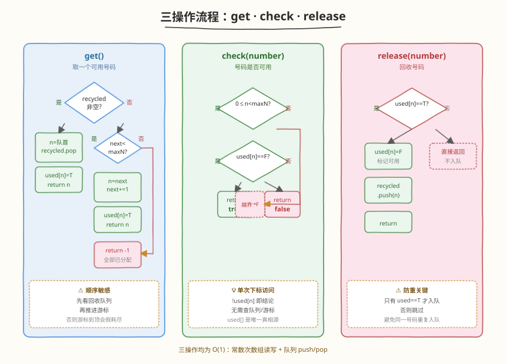
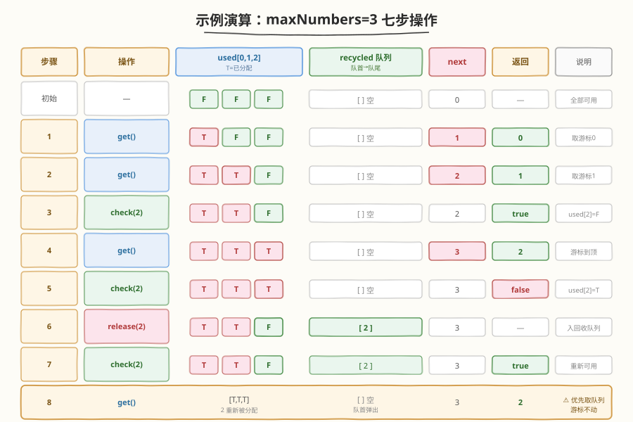

# 设计电话目录

- **题目名称**：设计电话目录
- **链接**：[379. 设计电话目录](https://leetcode.cn/problems/design-phone-directory/)
- **难度**：中等
- **标签**：设计、队列、数组、哈希

## 1. 题目概述

设计一个电话号码目录，初始包含 `maxNumbers` 个号码 `0, 1, ..., maxNumbers - 1`。要求高效支持以下三种操作：

- `get()`：获取一个**未被分配**的号码，返回它；若全部已分配则返回 `-1`。
- `check(number)`：判断号码 `number` 当前是否**可用**（未被分配）。
- `release(number)`：回收号码 `number`，使其重新变为可用。若号码本就可用则不做任何事。

**示例 1**：

```text
输入
["PhoneDirectory", "get", "get", "check", "get", "check", "release", "check"]
[[3], [], [], [2], [], [2], [2], [2]]
输出
[null, 0, 1, true, 2, false, null, true]

解释
PhoneDirectory directory = new PhoneDirectory(3);   // 可用号码池 {0,1,2}
directory.get();      // 返回 0，可用池 {1,2}
directory.get();      // 返回 1，可用池 {2}
directory.check(2);   // true，2 仍可用
directory.get();      // 返回 2，可用池 {}
directory.check(2);   // false，2 已被分配
directory.release(2); // 回收 2，可用池 {2}
directory.check(2);   // true，2 重新可用
```

**约束条件**：

- $1 \leq \text{maxNumbers} \leq 10^4$
- `get`、`check`、`release` 总调用次数最多 $10^4$
- `release(number)` 调用时保证 `0 <= number < maxNumbers`

> 💡 本题考点是「**三种操作能否同时做到 $O(1)$**」。直觉上 `get()` 要从一堆号码里挑一个、`check()` 要查状态、`release()` 要回收——单用一种结构都要在某个操作上妥协。关键是**把号码池拆成「未分配的连续段」和「被回收的离散号码」两段**，分别用游标和队列管理，再用一个 `bool` 数组统一支撑 `check`。

---

## 2. 解题思路

### 2.1 暴力思路：单结构各有短板

先看几种朴素实现各自卡在哪：

| 结构 | `get()` | `check()` | `release()` | 瓶颈 |
|------|---------|-----------|-------------|------|
| **可用集合** `unordered_set<int>` | $O(1)$（取任一元素） | $O(1)$ | $O(1)$（插入） | `get()` 在 C++ 里取任一元素需 `*set.begin()`，常数尚可；但若用 `set` 则 $O(\log n)$ |
| **可用数组 + 标记数组** | $O(1)$（末尾弹出） | $O(1)$ | $O(1)$（推入末尾） | 数组元素可重复入队，需配合标记防重复回收 |
| **位图 bitmap** | $O(n/64)$（扫描首个空位） | $O(1)$ | $O(1)$ | `get()` 需线性扫描，最坏 $O(n)$ |
| **链表池** | $O(1)$（头摘） | $O(n)$（链表无索引） | $O(1)$（头插） | `check()` 必须配一个辅助表 |

> ⚠️ 用 `unordered_set` 看似三操作都 $O(1)$，但**回收时必须先查是否已在集合**，否则同一号码会被重复插入，`get()` 取出后集合里仍残留——这是单集合方案的常见陷阱。

### 2.2 核心观察：三件套——`used[]` + 回收队列 + 游标

![三件套协同：used[] 判状态、recycled 队列存回收号、next 游标扫新号](../images/phonedir_concept.svg)

把号码池分成两类：

1. **从未分配过的连续段** `[next, maxNumbers)`——靠 `next` 游标顺次推进即可，每次 `get()` 直接返回 `next++`。
2. **被 `release` 回收的离散号码**——存入 `recycled` 队列，`get()` 优先从队首取。

再用一个**布尔数组** `used[number]` 统一记录「号码当前是否已被分配」，作为 `check()` 的 $O(1)$ 真相来源。

> 💡 **为什么要 `used[]` 而不是只靠 `recycled` 队列 + `next` 游标？** 因为 `check(number)` 必须能区分「号码在 `recycled` 里待取」「号码已被分配」「号码从未分配过」三种状态。仅靠队列无法 $O(1)$ 查询成员资格。`used[]` 把这三种状态归并成一个布尔值：`true` 表示已分配、不可取；`false` 表示可用（无论它来自未分配段还是回收队列）。

**`get()` 的优先级**：

1. **先看回收队列**——若 `recycled` 非空，弹出队首 `n`，置 `used[n] = true`，返回 `n`。
2. **再看未分配段**——若 `next < maxNumbers`，置 `used[next] = true`，返回 `next++`。
3. **都没有**——返回 `-1`。

> ⚠️ 优先回收队列是为了**避免游标空跑**：若 `next` 已经推进到 `maxNumbers` 但有回收号可用，必须先复用回收号，否则会错误返回 `-1`。

### 2.3 算法流程图



**`get()`**：
1. 若 `recycled` 非空：`n = recycled.pop()`；`used[n] = true`；返回 `n`。
2. 否则若 `next < maxNumbers`：`used[next] = true`；返回 `next++`。
3. 否则：返回 `-1`。

**`check(number)`**：返回 `!used[number]`。

**`release(number)`**：
1. 若 `!used[number]`（号码本就可用）→ 直接返回，**不入队**（防重复入队）。
2. 否则：`used[number] = false`；`recycled.push(number)`。

> ⚠️ **`release` 的防重关键**：必须先查 `used[number]`。若号码已可用还把它推入 `recycled`，后续 `get()` 会取出一个本就「可用」的号码，与 `used[]` 状态不一致，导致 `check` 与 `get` 互相打脸。

### 2.4 示例演算

以 `maxNumbers = 3` 为例，初始 `used = [F,F,F]`、`recycled = []`、`next = 0`：



| 步骤 | 操作 | `used` (0,1,2) | `recycled` | `next` | 返回 | 说明 |
|------|------|----------------|------------|--------|------|------|
| 初始 | — | `[F,F,F]` | `[]` | `0` | — | 全部可用 |
| 1 | `get()` | `[T,F,F]` | `[]` | `1` | `0` | 队列空，取游标 0，游标前进 |
| 2 | `get()` | `[T,T,F]` | `[]` | `2` | `1` | 队列空，取游标 1，游标前进 |
| 3 | `check(2)` | `[T,T,F]` | `[]` | `2` | `true` | `used[2]=F`，可用 |
| 4 | `get()` | `[T,T,T]` | `[]` | `3` | `2` | 队列空，取游标 2，游标到顶 |
| 5 | `check(2)` | `[T,T,T]` | `[]` | `3` | `false` | `used[2]=T`，已分配 |
| 6 | `release(2)` | `[T,T,F]` | `[2]` | `3` | — | `used[2]→F`，推入回收队列 |
| 7 | `check(2)` | `[T,T,F]` | `[2]` | `3` | `true` | `used[2]=F`，重新可用 |
| 8 | `get()` | `[T,T,T]` | `[]` | `3` | `2` | **优先取回收队列**，游标不动 |

> 💡 **看第 8 步**：游标 `next` 已到 `3`（= `maxNumbers`），未分配段已耗尽。但因为回收队列里有 `2`，`get()` 依然成功返回 `2`。**这正是回收队列存在的意义**——让已分配过的号码能被复用，而不必等到游标重置。

---

## 3. 参考代码

### C++

```cpp
class PhoneDirectory {
    vector<bool> used;          // used[n] = true 表示号码 n 当前已分配
    queue<int> recycled;        // 被 release 回收、可复用的号码
    int next;                   // 下一个从未分配过的号码
    int maxNumbers;
public:
    PhoneDirectory(int maxNumbers)
        : used(maxNumbers, false), next(0), maxNumbers(maxNumbers) {}

    int get() {
        if (!recycled.empty()) {            // 优先复用回收号
            int n = recycled.front();
            recycled.pop();
            used[n] = true;
            return n;
        }
        if (next < maxNumbers) {            // 再取未分配段
            int n = next++;
            used[n] = true;
            return n;
        }
        return -1;                          // 全部已分配
    }

    bool check(int number) {
        if (number < 0 || number >= maxNumbers) return false;
        return !used[number];
    }

    void release(int number) {
        if (number < 0 || number >= maxNumbers) return;
        if (!used[number]) return;          // 本就可用，避免重复入队
        used[number] = false;
        recycled.push(number);
    }
};
```

### Python

```python
from collections import deque

class PhoneDirectory:
    def __init__(self, maxNumbers: int):
        self.used: list[bool] = [False] * maxNumbers   # 号码当前是否已分配
        self.recycled: deque[int] = deque()            # 回收池
        self.next: int = 0                             # 下一个未分配号
        self.max_numbers: int = maxNumbers

    def get(self) -> int:
        if self.recycled:                              # 优先复用回收号
            n = self.recycled.popleft()
            self.used[n] = True
            return n
        if self.next < self.max_numbers:               # 再取未分配段
            n = self.next
            self.next += 1
            self.used[n] = True
            return n
        return -1                                      # 全部已分配

    def check(self, number: int) -> bool:
        if 0 <= number < self.max_numbers:
            return not self.used[number]
        return False

    def release(self, number: int) -> None:
        if 0 <= number < self.max_numbers and self.used[number]:
            self.used[number] = False
            self.recycled.append(number)               # 只有被分配过的才入队
```

> ⚠️ **两个高频踩坑点**：
> （1）**`release` 不查 `used` 就入队**：同一号码被连续 `release` 两次会重复入队，`get()` 取出后 `used[]` 标记与队列内容不一致，再 `check` 该号码会得到错误的 `true`。务必先判 `used[number] == true` 才入队。
> （2）**`get` 先取游标再取队列**：若游标优先，会出现「明明有回收号却返回 `-1`」的假耗尽——游标到顶后必须回落到回收队列，但若此时已返回 `-1` 就来不及了。**先队列后游标**的顺序天然避免。

---

## 4. 复杂度分析

| 维度 | 复杂度 | 说明 |
|------|--------|------|
| **`get` 时间** | $O(1)$ | 队首弹出或游标自增，均单次常数操作 |
| **`check` 时间** | $O(1)$ | 一次数组下标访问 |
| **`release` 时间** | $O(1)$ | 一次布尔翻转 + 一次入队 |
| **空间复杂度** | $O(\text{maxNumbers})$ | `used[]` 长度为 $\text{maxNumbers}$，回收队列最多容纳 $\text{maxNumbers}$ 个元素 |

> 💡 当 `maxNumbers` 较大（如 $10^7$）时，`used[]` 数组的内存开销会成为瓶颈。可用位图压缩：`vector<uint64_t>` 每个元素表示 64 个号码，`used` 占用降为 $\text{maxNumbers}/8$ 字节。`check` 仍是 $O(1)$，`release` 是 $O(1)$，但 `get()` 在回收队列空时需在位图里扫描首个 0 bit，最坏 $O(\text{maxNumbers}/64)$——见第 5 节扩展。

---

## 5. 扩展：位图压缩方案

当 `maxNumbers` 很大（如 $10^7$ 级别）时，`vector<bool>` 或手写位图能把空间压到原来的 $1/8$。`vector<bool>` 在 C++ 标准里就是按 bit 打包的特化版本，写法几乎不变：

```cpp
class PhoneDirectory {
    vector<bool> used;          // C++ 特化版，按 bit 存储
    queue<int> recycled;
    int next, maxNumbers;
public:
    PhoneDirectory(int maxNumbers)
        : used(maxNumbers, false), next(0), maxNumbers(maxNumbers) {}
    // get / check / release 与第 3 节完全一致
};
```

> ⚠️ `vector<bool>` 的 `operator[]` 返回的是代理引用而非 `bool&`，不能用于多线程并发写。若需并发安全或想自己控制位运算，可用 `vector<uint64_t>` 手写：

```cpp
class PhoneDirectory {
    vector<uint64_t> bits;      // 每 64 个号码打包进一个 uint64_t
    queue<int> recycled;
    int next, maxNumbers;
public:
    PhoneDirectory(int maxNumbers)
        : bits((maxNumbers + 63) / 64, 0), next(0), maxNumbers(maxNumbers) {}

    int get() {
        if (!recycled.empty()) {
            int n = recycled.front(); recycled.pop();
            bits[n >> 6] |= (1ULL << (n & 63));
            return n;
        }
        if (next < maxNumbers) {
            int n = next++;
            bits[n >> 6] |= (1ULL << (n & 63));
            return n;
        }
        // 进阶：扫描位图找首个 0 bit，O(maxNumbers/64)
        for (int i = 0; i < (int)bits.size(); ++i) {
            if (bits[i] != ~0ULL) {
                int n = i * 64 + __builtin_ctzll(~bits[i]);
                if (n < maxNumbers) {
                    bits[i] |= (1ULL << (n & 63));
                    return n;
                }
            }
        }
        return -1;
    }

    bool check(int number) {
        if (number < 0 || number >= maxNumbers) return false;
        return !(bits[number >> 6] & (1ULL << (number & 63)));
    }

    void release(int number) {
        if (number < 0 || number >= maxNumbers) return;
        if (!check(number)) return;       // 已可用则不重复入队
        bits[number >> 6] &= ~(1ULL << (number & 63));
        recycled.push(number);
    }
};
```

> 💡 位图版本在「回收队列空、游标到顶」时仍能扫描位图找到被 `release` 后漏入队列的可用号（理论上不会发生，因为 `release` 总会入队），但作为防御性实现，扫描位图能保证 `get()` 不会假耗尽。Python 中可用 `bytearray` 模拟，每个 byte 表示 8 个号码。

---

## 6. 面试要点

1. **为什么要拆「未分配段 + 回收队列」两部分？合一个队列不行吗？**

   - 若把所有可用号码（`0..maxNumbers-1`）初始全部塞进一个队列，`get()` 弹队首、`release()` 推队尾，逻辑也 $O(1)$ 且代码更短。但**初始化要 $O(\text{maxNumbers})$ 的时间和空间**——当 `maxNumbers = 10^7` 时初始化即耗时上百毫秒。游标 + 回收队列方案把初始化降到 $O(1)$（只设 `next = 0`），回收队列按需增长，更适合大号码池。这是面试官常追问的「能不能优化初始化」。

2. **`used[]` 数组能否省掉，只用回收队列 + 游标？**

   - 不能。`check(number)` 必须在 $O(1)$ 判断号码是否可用，但队列无法 $O(1)$ 查询成员资格。即使维护一个「在队列中」的辅助集合，回收号被 `get()` 取出后还要同步删集合元素，逻辑复杂且常数大。`used[]` 是最直接、最不易出错的真相来源。

3. **`release` 时为什么要先判 `used[number]`？**

   - 防止同一号码被重复入队。若号码已可用（`used[number] == false`），说明它要么从未被分配过、要么已在回收队列里——两种情况都不应再入队，否则 `get()` 会取出一个 `used` 标记为 `false` 的号码，造成「号码在 `check` 看来可用却被 `get` 返回」的矛盾。

4. **`get` 为什么要先取回收队列再取游标？反过来不行吗？**

   - 若先取游标，当 `next` 推到 `maxNumbers` 时会直接返回 `-1`，无视回收队列里还有可用号——这是「假耗尽」。先取回收队列，能保证已分配过的号码被复用后才考虑新号码。游标仅在回收队列空时才推进，最大化复用率。

5. **如果要支持并发调用（多线程），需要怎么改？**

   - `used[]`、`recycled`、`next` 三个共享状态都需加锁。最简单是给每个操作加 `std::lock_guard`；更细粒度可用读写锁——`check` 只读，可与另一个 `check` 并发，但与 `get`/`release` 互斥。若号码池极大、并发极高，可分片：把号码池按区间分桶，每桶独立加锁，降低 contention。`vector<bool>` 因代理引用问题不能直接用于多线程，需改 `vector<char>` 或 `vector<uint64_t>`。

---

## 7. 同类练习题

- [380. O(1) 时间插入、删除和获取随机元素](https://leetcode.cn/problems/insert-delete-getrandom-o1/)（[题解](./380_O1时间插入删除和获取随机元素.md)）：同样是「三操作 $O(1)$」的设计题，对比「数组 + 哈希表」与本题「数组 + 队列 + 游标」的选型差异
- [146. LRU 缓存](https://leetcode.cn/problems/lru-cache/)（[题解](../0101-0200/146_LRU缓存.md)）：哈希表 + 双向链表的经典设计题，巩固「两个结构协同补足」的思想
- [460. LFU 缓存](https://leetcode.cn/problems/lfu-cache/)（[题解](../0101-0200/460_LFU缓存.md)）：频率桶 + 哈希的进阶设计题，对比本题的「单一 bool 数组 + 队列」与 LFU 的多层结构
- [232. 用栈实现队列](https://leetcode.cn/problems/implement-queue-using-stacks/)（[题解](../0201-0300/232_用栈实现队列.md)）：用一种结构模拟另一种结构，巩固「输入栈 + 输出栈」的双结构思想
- [705. 设计哈希集合](https://leetcode.cn/problems/design-hashset/)：从零实现哈希集合，对比「直接复用语言内置结构」与「手写底层」的取舍
