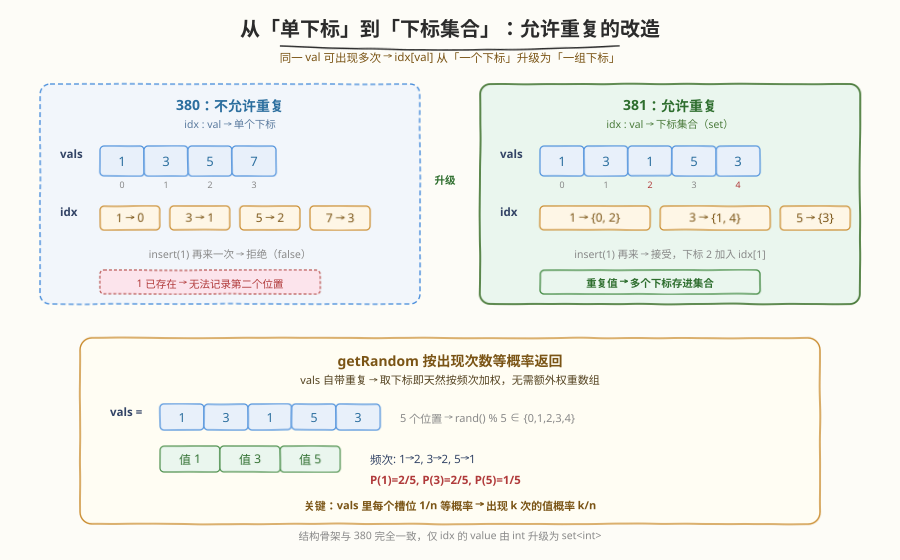
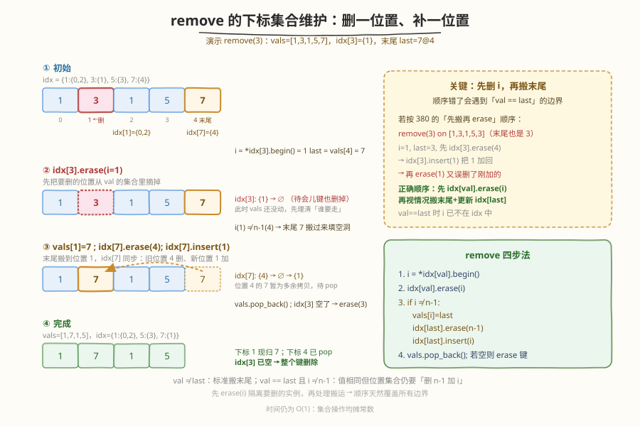
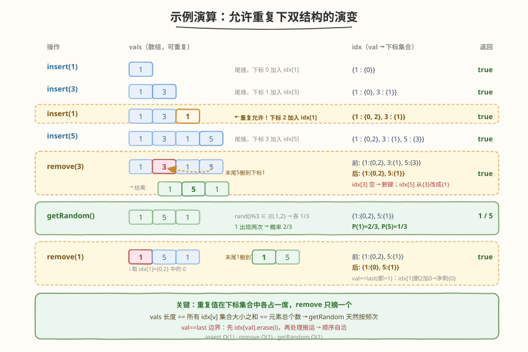

# O(1) 时间插入、删除和获取随机元素 - 允许重复

- **题目名称**：O(1) 时间插入、删除和获取随机元素 - 允许重复
- **链接**：[381. O(1) 时间插入、删除和获取随机元素 - 允许重复](https://leetcode.cn/problems/insert-delete-getrandom-o1-duplicates-allowed/)
- **难度**：困难
- **标签**：设计、哈希表、数组、随机化

## 1. 题目概述

实现一个 `RandomizedCollection` 类，允许同一元素**出现多次**，且 `insert`、`remove`、`getRandom` 三个操作**平均时间复杂度均为 $O(1)$**：

- `insert(val)`：把 `val` 插入集合，返回 `true` 表示这次插入使 `val` 在集合中**首次出现**，返回 `false` 表示插入前 `val` 已存在（即这是重复插入）。**注意**：无论返回 `true`/`false`，元素都被实际插入。
- `remove(val)`：从集合中**移除一个** `val`（若有多个只删一个），返回是否确实移除。若集合中没有 `val` 返回 `false`。
- `getRandom()`：从现有元素中**按出现次数等概率**随机返回一个。即若 `val` 出现 $k$ 次、集合总大小为 $n$，则返回 `val` 的概率为 $k/n$。保证调用时集合非空。

**示例 1**：

```text
输入
["RandomizedCollection", "insert", "insert", "insert", "getRandom", "remove", "getRandom"]
[[], [1], [1], [2], [], [1], []]
输出
[null, true, false, true, 2, true, 1]

解释
RandomizedCollection rc = new RandomizedCollection();
rc.insert(1);     // true, 集合 = {1}        （1 首次出现）
rc.insert(1);     // false, 集合 = {1, 1}    （1 已存在，再插一次）
rc.insert(2);     // true, 集合 = {1, 1, 2}  （2 首次出现）
rc.getRandom();   // 返回 1 概率 2/3, 返回 2 概率 1/3
rc.remove(1);     // true, 集合 = {1, 2}     （只删一个 1）
rc.getRandom();   // 返回 1 或 2, 各 1/2 概率
```

**约束条件**：

- $-2^{31} \leq \text{val} \leq 2^{31}-1$
- `insert`、`remove`、`getRandom` 总调用次数最多 $2 \times 10^5$
- 调用 `getRandom` 时数据结构中至少存在一个元素

> 💡 本题是 [380. O(1) 时间插入、删除和获取随机元素](../0301-0400/380_O1时间插入删除和获取随机元素.md) 的「**多重集合**」版。380 要求元素互异，`idx` 是 `val → 单个下标`；381 允许重复，`idx` 升级为 `val → 一组下标`。骨架与「交换末尾删除」技巧完全沿用 380，新增的工程量只在**维护这组下标的同步**。题目标「困难」，难点不在于想出新结构，而在于**边界顺序**——尤其当 `val` 恰好是末尾元素时，先 erase 还是先 insert 稍有差池就会让集合残留错误下标。先吃透 380 再看本题，事半功倍。

---

## 2. 解题思路

### 2.1 暴力思路：沿用 380 单下标行不行？

直接套 380 的 `idx : val → 单个下标` 会立刻撞墙：第二次 `insert(1)` 时 `idx[1]` 已有值，新插入的下标无处可记，删一个 `1` 也无法区分删的是哪一次插入的那一份。要让「同一 `val` 对应多个下标」可检索，必须把 `idx[val]` 的值域从「标量」升级为「**集合**」。

| 结构 | `insert` | `remove` | `getRandom` | 瓶颈 |
|------|----------|----------|-------------|------|
| 动态数组 `vector` | $O(1)$（尾插） | $O(n)$（中间删要搬移） | $O(1)$（按下标取） | 删除要搬移 |
| `unordered_multiset` | $O(1)$ | $O(1)$ | $O(n)$（无下标语义） | 取不出「第 k 个」 |
| **数组 + 哈希表（val→下标集合）** | $O(1)$ | $O(1)$（交换末尾） | $O(1)$ | — |

`getRandom` 仍要靠数组按下标取，`remove` 的 $O(1)$ 定位仍要靠哈希表。两者一搭，配「交换末尾删除」即可三操作全 $O(1)$。这与 380 如出一辙，只是哈希表的 value 从 `int` 改成了 `unordered_set<int>`（或等价结构）。

### 2.2 核心观察：idx 升级为「下标集合」，其余照搬 380



维护两个结构：

1. **动态数组** `vals`：按插入顺序存放所有元素（**包含重复**）。`getRandom` 用 `vals[rand() % n]` 在 $O(1)$ 取出。**数组里每个槽位天然代表一次出现**，所以取下标即按频次加权——出现 $k$ 次的 `val` 占了 $k$ 个槽位，被选中概率就是 $k/n$，无需额外维护权重数组。
2. **哈希表** `idx`：`val → 该 val 出现过的所有下标集合`（C++ 用 `unordered_map<int, unordered_set<int>>`，Python 用 `dict[int, set[int]]`）。`insert` 把新下标塞进 `idx[val]`，`remove` 从 `idx[val]` 任取一个下标来定位。

> ⚠️ 关键不变式：**`vals` 的长度 == 所有 `idx[v]` 集合大小之和 == 元素总个数**。只要 `remove` 后数组仍「紧凑无空洞」，`getRandom` 就一定命中有效元素且按频次等概率。

### 2.3 删除流程：先从集合摘 i，再搬末尾补空洞



`remove(val)` 的核心仍是 380 的「**末尾搬来填空洞**」，但因为 `idx[val]` 是集合，需要多两步集合维护。**正确顺序**是：

1. **取一个下标**：`i = *idx[val].begin()`（任取一个，集合迭代器取首元素 $O(1)$）。
2. **先从 `idx[val]` 摘掉 `i`**：`idx[val].erase(i)`。这一步**必须先做**——它把「要删的那一份 `val`」从下标集合里隔离出去，后续搬末尾时即便 `val == last`，`i` 已不在 `idx[val]` 中，不会引发「先加后删」的混乱。
3. **若 `i != n-1`，搬末尾补空洞**：
   - `last = vals.back()`，`vals[i] = last`（末尾值覆盖到位置 `i`）。
   - `idx[last].erase(n-1)`（末尾的旧下标 `n-1` 要从 `last` 的集合里去掉）。
   - `idx[last].insert(i)`（`last` 现在的新下标是 `i`，加进集合）。
4. **弹末尾**：`vals.pop_back()`。
5. **清理空键**：若 `idx[val]` 此时为空，`idx.erase(val)` 删掉这个键，避免后续 `remove` 误判存在。

> ⚠️ **为什么必须先 `idx[val].erase(i)` 再搬末尾？** 考虑 `val == last`（要删的值恰好就是末尾元素的值）且 `i != n-1` 的情形：若按 380 的「先搬末尾、更新 `idx[last]`、再 `erase(i)`」顺序，会先 `idx[last=val].erase(n-1)` 再 `idx[last=val].insert(i)`——而 `i` 本来就在 `idx[val]` 里，这个 `insert` 是把「即将被删的 `i`」又加回去了；紧接着 `erase(i)` 又把它删掉。结果 `idx[val]` 丢失了 `n-1`（被 pop 的合法位置）却保留了不该保留的状态，下标集合与数组完全错位。**先 `erase(i)`** 把 `i` 摘掉，之后 `idx[last]` 的 erase/insert 就不会再受 `i` 干扰，`val == last` 时净效果是「`n-1` 出、`i` 进」，正好对应「末尾那份 `val` 搬到了位置 `i`」。这正是 381 比 380 多出来的唯一一道「顺序关」。

### 2.4 示例演算

以一组操作演示 `vals` 与 `idx` 的协同演变，重点关注 `remove` 时下标集合的变化与 `val == last` 边界：



| 操作 | `vals`（数组） | `idx`（val→下标集合） | 返回 | 说明 |
|------|----------------|------------------------|------|------|
| `insert(1)` | `[1]` | `{1:{0}}` | `true` | 1 首次出现，下标 0 加入 idx[1] |
| `insert(3)` | `[1,3]` | `{1:{0}, 3:{1}}` | `true` | 3 首次出现 |
| `insert(1)` | `[1,3,1]` | `{1:{0,2}, 3:{1}}` | `false` | **重复允许**，下标 2 加入 idx[1]；返回 false 因 1 已存在 |
| `insert(5)` | `[1,3,1,5]` | `{1:{0,2}, 3:{1}, 5:{3}}` | `true` | 5 首次出现 |
| `remove(3)` | `[1,5,1]` | `{1:{0,2}, 5:{1}}` | `true` | i=1，末尾 5 搬到下标 1；idx[5] 从{3}改成{1}；idx[3] 空了删键 |
| `getRandom()` | `[1,5,1]` | — | `1`/`5` | P(1)=2/3，P(5)=1/3 |
| `remove(1)` | `[1,5]` | `{1:{0}, 5:{1}}` | `true` | **val==last 边界**：i=0，末尾也是 1；先 idx[1].erase(0)，再 idx[1]: 删 2 加 0 → 净剩 {0} |

> 💡 **看最后一步 `remove(1)`**：`vals=[1,5,1]`，`idx[1]={0,2}`。取 `i=0`，先 `idx[1].erase(0)` 得 `{2}`。`last=vals[2]=1`，`val==last`。`i=0 != n-1=2`，于是 `vals[0]=1`（值不变），`idx[last=1].erase(2)` 得 `∅`，`idx[last=1].insert(0)` 得 `{0}`。`pop_back()` 后 `vals=[1,5]`，`idx[1]={0}`（非空，保留键）。**关键**：尽管 `val==last` 让「搬运」在数值上看是空操作，但下标集合仍要从 `{2}` 迁移到 `{0}`——因为位置 2 被 pop 掉了，原本在位置 2 的那份 1 现在落在了位置 0。顺序若反了，`insert(0)` 会撞上还没摘掉的 `0`，逻辑就乱了。

---

## 3. 参考代码

### C++

```cpp
class RandomizedCollection {
    vector<int> vals;                                   // 动态数组：支撑 O(1) 随机访问，含重复
    unordered_map<int, unordered_set<int>> idx;         // val -> 出现过的所有下标集合
public:
    RandomizedCollection() {}

    bool insert(int val) {
        bool first = !idx.count(val);                   // 集合中是否首次出现
        idx[val].insert(vals.size());                  // 新下标入集合
        vals.push_back(val);                            // 尾插 O(1)
        return first;
    }

    bool remove(int val) {
        if (!idx.count(val)) return false;              // 不存在
        int i = *idx[val].begin();                      // 任取一个下标 O(1)
        int last = vals.back();
        int n = vals.size();
        idx[val].erase(i);                              // ① 先从 val 的集合摘掉 i
        if (i != n - 1) {                               // ② i 非末尾，搬末尾补空洞
            vals[i] = last;
            idx[last].erase(n - 1);                     //    last 旧位置 n-1 出集合
            idx[last].insert(i);                        //    last 新位置 i 入集合
        }
        vals.pop_back();                                // ③ 弹末尾 O(1)
        if (idx[val].empty()) idx.erase(val);           // ④ val 集合空了则删键
        return true;
    }

    int getRandom() {
        return vals[rand() % vals.size()];               // 按槽位等概率 → 按频次加权
    }
};
```

### Python

```python
class RandomizedCollection:
    def __init__(self):
        self.vals: list[int] = []                       # 动态数组：支撑 O(1) 随机访问，含重复
        self.idx: dict[int, set[int]] = {}              # val -> 出现过的所有下标集合

    def insert(self, val: int) -> bool:
        first = val not in self.idx                     # 集合中是否首次出现
        self.idx.setdefault(val, set()).add(len(self.vals))   # 新下标入集合
        self.vals.append(val)                           # 尾插 O(1)
        return first

    def remove(self, val: int) -> bool:
        if val not in self.idx:                         # 不存在
            return False
        i = next(iter(self.idx[val]))                   # 任取一个下标 O(1)
        last = self.vals[-1]
        n = len(self.vals)
        self.idx[val].remove(i)                         # ① 先从 val 的集合摘掉 i
        if i != n - 1:                                  # ② i 非末尾，搬末尾补空洞
            self.vals[i] = last
            self.idx[last].discard(n - 1)               #    last 旧位置 n-1 出集合
            self.idx[last].add(i)                       #    last 新位置 i 入集合
        self.vals.pop()                                 # ③ 弹末尾 O(1)
        if not self.idx[val]:                           # ④ val 集合空了则删键
            del self.idx[val]
        return True

    def getRandom(self) -> int:
        return random.choice(self.vals)                 # 按槽位等概率 → 按频次加权
```

> ⚠️ **三个高频踩坑点**：
> （1）**先 `idx[val].erase(i)` 再搬末尾**。这是 381 区别于 380 的核心顺序差异。380 中 `idx[last]=i` 必须在 `erase(val)` 前；381 中 `idx[val].erase(i)` 必须在 `idx[last]` 的 erase/insert 前。两条规则方向相反，但动机一致：**让被删的下标先从集合里消失，避免后续集合操作误伤**。
> （2）**`if (i != n-1)` 守卫不可省**。若 `i == n-1`（删的就是末尾元素本身），无需搬末尾——直接 `pop_back()` 即可，此时 `last == val` 且 `last` 的位置就是要删的 `i`。若不守卫，`idx[last].erase(n-1)` 会先删 `n-1`，`idx[last].insert(i=n-1)` 又加回来，紧接着 `pop_back()` 后位置 `n-1` 已不存在但集合里还留着，状态错乱。
> （3）**`getRandom` 不能用 `set` 或 `dict` 直接取**。`random.choice(set)` 在 Python 3 上会报错，`dict` 也无下标语义。`vals` 这个数组存在的全部理由就是支撑 $O(1)$ 等概率按下标访问。

---

## 4. 复杂度分析

| 维度 | 复杂度 | 说明 |
|------|--------|------|
| **`insert` 时间** | $O(1)$ | 哈希表查/建一次 + 集合插入一次 + 数组尾插一次，均摊常数 |
| **`remove` 时间** | $O(1)$ | 集合取首元素 + erase 一次 + （可能）两次集合 erase/insert + 弹末尾，均摊常数 |
| **`getRandom` 时间** | $O(1)$ | 一次取模 + 一次下标访问 |
| **空间复杂度** | $O(n)$ | 数组存 $n$ 个元素，哈希表的下标集合合计也存 $n$ 个下标，$n$ 为当前元素总个数（含重复） |

> 💡 三个操作均为**平均** $O(1)$——`unordered_map`/`unordered_set` 在极端哈希冲突下会退化到 $O(n)$，但常规数据规模下均摊为 $O(1)$。若要严格最坏 $O(1)$，可用 `unordered_map<int, unordered_set<int>>` 替换为 `unordered_map<int, set<int>>`（红黑树，单次 $O(\log n)$）或自定义开放寻址哈希，但面试范围内 `unordered_set` 已足够。注意 `set` 的 `begin()` 取首元素是 $O(1)$（指向最小元素的迭代器恒定维护），但插入/删除会变 $O(\log n)$，整体复杂度抬升一档。

---

## 5. 扩展：与 380 的对照与可复用模板

380 与 381 的差异可以浓缩成一张表：

| 维度 | 380（不重复） | 381（允许重复） |
|------|---------------|------------------|
| `idx` value 类型 | `int`（单下标） | `unordered_set<int>`（下标集合） |
| `insert` 返回 | `val` 不存在才插，返回是否插入 | 必插入，返回是否**首次出现** |
| `remove` 第一步 | `i = idx[val]` | `i = *idx[val].begin()` |
| `remove` 顺序 | 先 `idx[last]=i` 再 `erase(val)` | 先 `idx[val].erase(i)` 再搬末尾更新 `idx[last]` |
| `getRandom` | 等概率 $1/n$ | 按频次 $k/n$ |
| 不变式 | `vals.size() == idx.size()` | `vals.size() == Σ |idx[v]|` |

**通用模板**（无序数组 $O(1)$ 删任意元素的「交换末尾法」）：

```text
remove(val):
  i = locate(val)              # 哈希表 O(1) 定位
  last = vals.back()
  if i != last_index:
      vals[i] = last           # 末尾值搬到位置 i
      update_index(last, i)    # 同步 last 的新位置（单值或集合）
  vals.pop_back()              # 弹末尾 O(1)
  drop_index(val, i)           # 删掉 val 在 i 的记录
```

这套模板搬到任何「需要 $O(1)$ 删任意元素 + $O(1)$ 随机访问」的设计题都成立——区别只在 `locate`/`update_index`/`drop_index` 三个钩子如何实现。380 是「标量版」，381 是「集合版」。

---

## 6. 面试要点

1. **381 相比 380 多了什么难点？**

   - 结构上只是 `idx` 的 value 从 `int` 升级为 `set<int>`，骨架完全一致。真正的难点在 **`remove` 的顺序**：380 要求「先更新 `idx[last]` 再 `erase(val)`」以覆盖「删末尾」边界；381 反过来要求「先 `idx[val].erase(i)` 再搬末尾」以覆盖「`val == last` 且 `i != n-1`」边界。两条规则方向相反，容易记混。口诀：**先把要删的下标从集合里摘掉，再做任何搬运**——这样后续集合操作不会误伤「正被删除的 `i`」。

2. **为什么 `getRandom` 不需要额外维护权重？**

   - `vals` 数组里每个槽位就是一次出现，重复值自然占多个槽位。`rand() % n` 在 $n$ 个槽位上均匀采样，等于按「出现次数」加权采样。若 `val` 出现 $k$ 次，它占 $k$ 个槽位，被选中概率即 $k/n$。这比另开一个 `(val, freq)` 表再按权重采样简洁得多——把「频次」隐式编码进数组长度即可。

3. **`remove` 时为什么必须 `if (i != n-1)` 守卫？**

   - 若 `i == n-1`（删的就是末尾），`last` 就是 `val` 本身，且 `last` 的位置就是 `i`。此时「搬末尾」是无意义的自我覆盖，更糟的是 `idx[last].erase(n-1)` 会删掉 `last` 的合法位置、`idx[last].insert(i=n-1)` 又加回来，最后 `pop_back()` 后位置 `n-1` 已不存在但集合里还残留。守卫住这种情况，直接 `pop_back()` 即可。380 不需要这个守卫，因为 `val == last` 时 `idx[last]=i` 写的是原值、`erase(val)` 照常工作；381 因为集合语义，必须显式跳过。

4. **`idx[val]` 集合为空时为什么要 `erase` 掉这个键？**

   - 若不删空键，`idx.count(val)` 会误判 `val` 仍存在，下次 `remove(val)` 时进入函数体却取不到下标（`*idx[val].begin()` 对空集合是未定义行为，Python 的 `next(iter(set()))` 会抛 `StopIteration`）。保持「键存在 ⇔ 至少有一个下标」的不变式，`count` 即可充当 $O(1)$ 存在性判定。

5. **能否用 `unordered_map<int, list<int>>` 代替 `unordered_set<int>`？**

   - 可以。`list` 的 `splice` 也是 $O(1)$，且能保持插入顺序。但 `list` 不能 $O(1)$ 删除任意迭代器指向的节点（需要先定位），除非额外维护「下标 → list 迭代器」的二级哈希。综合来看 `unordered_set<int>` 最简洁：插入/删除/取首元素都是均摊 $O(1)$，且无需二级索引。若题目要求 `remove` 删除「最久未访问」的那个实例（LRU 风），才需要换 `list` + 迭代器哈希。

---

## 7. 同类练习题

- [380. O(1) 时间插入、删除和获取随机元素](https://leetcode.cn/problems/insert-delete-getrandom-o1/)（[题解](../0301-0400/380_O1时间插入删除和获取随机元素.md)）：本题的不重复版，先吃透 380 的「交换末尾删除」与 `idx[last]=i` 在 `erase(val)` 前的顺序，再看 381 的集合升级
- [146. LRU 缓存](https://leetcode.cn/problems/lru-cache/)（[题解](../0101-0200/146_LRU缓存.md)）：同样是「哈希表 + 另一结构」的 $O(1)$ 设计题，对比「哈希 + 双向链表」与本题「哈希 + 动态数组」的选型差异，以及 `list` 与 `set` 作为哈希 value 的取舍
- [460. LFU 缓存](https://leetcode.cn/problems/lfu-cache/)（[题解](../0201-0300/460_LFU缓存.md)）：更复杂的「频率桶 + 哈希」$O(1)$ 设计，频率桶内部用双向链表维护同频元素，与 381 的「下标集合」异曲同工
- [528. 按权重随机选择](https://leetcode.cn/problems/random-pick-with-weight/)：`getRandom` 的进阶版——按权重不等概率随机，用到前缀和 + 二分，对比 381「按频次加权」与 528「按任意权重」的实现差异
- [710. 黑名单中的随机数](https://leetcode.cn/problems/random-pick-with-blacklist/)：在「等概率随机」基础上加入黑名单约束，用「映射 + 交换」把合法数压缩到连续区间，与 381 的「交换末尾」思想同源
