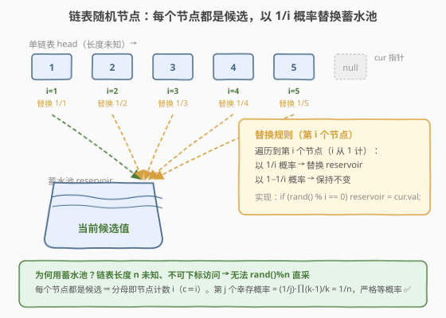
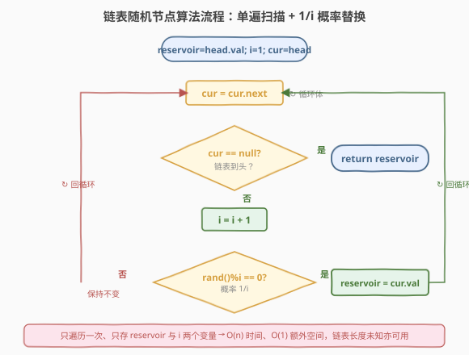
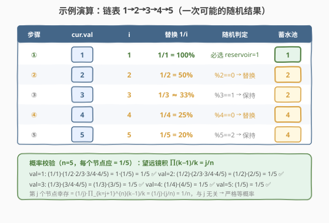

# 链表随机节点

- **题目名称**：链表随机节点
- **链接**：[382. 链表随机节点](https://leetcode.cn/problems/linked-list-random-node/)
- **难度**：中等
- **标签**：水塘/蓄水池抽样、链表、概率与随机、设计

## 1. 题目概述

给定一个**单链表**的头节点 `head`，实现一个类，支持「随机返回链表中一个节点的值」的操作。链表中每个节点被选中的概率必须**相等**。可以多次调用 `getRandom()`。

```cpp
Solution(ListNode* head)   // 用单链表头节点初始化
int getRandom()            // 随机返回链表中一个节点的值
```

**示例 1**：

```text
输入：
["Solution", "getRandom", "getRandom", "getRandom", "getRandom", "getRandom"]
[[[1, 2, 3]], [], [], [], [], []]
输出：
[null, 1, 3, 2, 2, 3]

解释：
Solution solution = new Solution([1, 2, 3]);
solution.getRandom();  // 返回 1
solution.getRandom();  // 返回 3
solution.getRandom();  // 返回 2
solution.getRandom();  // 返回 2
solution.getRandom();  // 返回 3
// 每次调用应从 [1, 2, 3] 中等概率返回一个值
```

**示例 2**：

```text
输入：
["Solution", "getRandom", "getRandom", "getRandom", "getRandom", "getRandom"]
[[[10, 1, 10, 2, 10, 3, 10]], [], [], [], [], []]
输出：
[null, 10, 1, 10, 3, 10]

解释：
// 链表 10 -> 1 -> 10 -> 2 -> 10 -> 3 -> 10
// 每次调用应从所有节点值中等概率返回一个
```

**约束条件**：

- 链表中的节点数在范围 `[1, 10^4]` 内
- `-10^4 <= Node.val <= 10^4`
- `getRandom` 最多被调用 `10^4` 次

> 💡 **进阶要求（面试常被追问）**：如果链表**极大**且**长度未知**，能否做到**不使用额外空间**高效解决？——这正是**蓄水池抽样（Reservoir Sampling）**的招牌场景。本题是 [398 随机数索引](../0301-0400/398_随机数索引.md)的「链表纯净版」：没有 `target` 过滤，每个节点都是候选，是蓄水池抽样 `k=1` 最直接的教科书应用。

---

## 2. 解题思路

### 2.1 直观思路：先数长度，再随机取下标

最直觉的做法分两步：初始化时**先遍历一遍数出链表长度** `n`；查询时生成随机下标 `r = rand() % n`，再从 `head` 走 `r` 步取那个节点的值。

```text
初始化：n = 0; for p = head; p; p = p.next: n++
查询：  r = rand() % n
        p = head; for i = 0 .. r-1: p = p.next
        return p.val
```

这个做法正确且只需 `O(1)` 额外空间。但它有**两个硬伤**：(1) 初始化必须**完整遍历一次**才能数出长度；(2) 若数据以**流式到达**（只能扫一遍、无法回头），或链表**动态增删**导致 `n` 不断变化，这个方案直接失效——而这正是面试官的进阶追问。

> ⚠️ 另一个更朴素的变体是把链表转成数组（`vector`），查询 `O(1)`，但需 `O(n)` 额外空间，更不符合进阶要求。本题的进阶旨在引出**蓄水池抽样**：单遍扫描、`O(1)` 空间、长度未知亦可用。

### 2.2 核心观察：蓄水池抽样（Reservoir Sampling, R 算法 k=1）



关键直觉是：**不必先知道链表有多长，一边遍历一边「以递减的概率」替换手中的候选，走完时手中那个就是均匀抽到的。**

设遍历过程中已经走过 `i` 个节点。规则非常简单：

> 💡 走到第 `i` 个节点时（`i = 1, 2, 3, ...`），以概率 $\dfrac{1}{i}$ **用它替换手中的候选值**（即「蓄水池」），以概率 $1 - \dfrac{1}{i}$ **保持不变**。

第 1 个节点必然被选中（概率 $1/1 = 1$）；第 2 个以 $1/2$ 概率顶替它；第 3 个以 $1/3$ 概率顶替……越往后，单个新元素「顶替成功」的概率越小，但**累积起来**却恰好让每个节点地位平等。

**为什么这样是均匀的？** 设链表共有 $n$ 个节点，考察第 $j$ 个节点（$1 \le j \le n$）成为最终候选的概率。它要成为最终结果，需要满足两件事：

1. 它在被遍历到时**被选中**：概率 $\dfrac{1}{j}$；
2. 它**没有被任何一个后续**第 $k$ 个（$j < k \le n$）节点顶替掉：每个后续第 $k$ 个以 $1 - \dfrac{1}{k} = \dfrac{k-1}{k}$ 的概率不顶替，连乘起来。

于是

$$
P(j\text{ 幸存}) = \frac{1}{j} \cdot \prod_{k=j+1}^{n}\frac{k-1}{k}
$$

这个连乘是经典的**望远镜积（telescoping product）**，中间项逐项约掉：

$$
\prod_{k=j+1}^{n}\frac{k-1}{k} = \frac{j}{j+1}\cdot\frac{j+1}{j+2}\cdots\frac{n-1}{n} = \frac{j}{n}
$$

代回得

$$
P(j\text{ 幸存}) = \frac{1}{j}\cdot\frac{j}{n} = \frac{1}{n}
$$

即每个节点最终被选中的概率都是 $\dfrac{1}{n}$，与位置无关，**严格均匀** ✅。

> 💡 **382 vs 398 的关键区别**：398 随机数索引需要先**筛掉不等于 `target` 的元素**，分母是**候选计数 `c`**（只数目标值）；382 链表随机节点**每个节点都是候选**，所以候选计数 `c` 就等于节点计数 `i`，分母直接用 `i`。这是蓄水池抽样 `k=1` 最纯净的形式——没有过滤、没有额外条件，单遍扫描即得等概率样本。

### 2.3 算法流程图



```text
1. 初始化 reservoir = head.val, i = 1, cur = head
2. 循环：cur = cur.next
       若 cur == null：返回 reservoir          // 链表走完
       i = i + 1                                // 第 i 个节点
       if rand() % i == 0:                      // 以 1/i 概率替换
           reservoir = cur.val
3. （循环出口即步骤 2 的 cur == null 分支）
```

> 💡 整个过程**只走一遍**、**只存 `reservoir` 与 `i` 两个变量**，满足进阶追问的 `O(1)` 额外空间与流式数据要求。即便链表极长、长度未知，算法照常工作——这正是蓄水池抽样的威力。

### 2.4 示例演算

以链表 `1 -> 2 -> 3 -> 4 -> 5`（`n = 5`，期望每个节点被选中概率 $1/5$）为例：



| 步骤 | cur.val | i | 替换概率 1/i | 随机判定（一次可能结果） | 蓄水池 |
|------|---------|---|--------------|--------------------------|--------|
| ① | 1 | 1 | 1/1 = 100% | 必选 → reservoir = 1 | **1** |
| ② | 2 | 2 | 1/2 = 50% | 假设 rand()%2 == 0 → 替换 | **2** |
| ③ | 3 | 3 | 1/3 ≈ 33% | 假设 rand()%3 == 1 → 不替换 | 2 |
| ④ | 4 | 4 | 1/4 = 25% | 假设 rand()%4 == 0 → 替换 | **4** |
| ⑤ | 5 | 5 | 1/5 = 20% | 假设 rand()%5 == 2 → 不替换 | 4 |
| — | — | — | — | 遍历结束，返回 reservoir | **4** |

校验概率（$n = 5$，每个节点应 $= 1/5$）：第 $j$ 个节点幸存需「选中($1/j$)×不被任何后续第 $k$ 个顶替($\prod (k-1)/k$)」。由望远镜积 $\prod_{k=j+1}^{n}\frac{k-1}{k} = \frac{j}{n}$，故 $P = \frac{1}{j}\cdot\frac{j}{n} = \frac{1}{n} = \frac{1}{5}$，对所有 $j$ 成立 ✅。

---

## 3. 参考代码

> 下面给出**两套**实现。面试中先讲「先数长度」版（直观、`O(1)` 空间），再被追问「长度未知 / 流式数据」时自然引出蓄水池抽样版——这种「先给 baseline，再给进阶」的节奏非常加分。

### 方案一：先数长度再随机取下标（O(1) 空间，需两遍遍历）

#### C++

```cpp
// 链表随机节点.cpp —— 方案一：先数长度，再随机取下标
#include <cstdlib>
using namespace std;

class Solution {
    ListNode* head;
    int n;
public:
    Solution(ListNode* head) : head(head), n(0) {
        for (ListNode* p = head; p; p = p->next) ++n;   // 第一遍：数长度
    }
    int getRandom() {
        int r = rand() % n;                              // 随机下标 [0, n)
        ListNode* p = head;
        for (int i = 0; i < r; ++i) p = p->next;         // 第二遍：走到第 r 个
        return p->val;
    }
};
```

#### Python

```python
import random

class Solution:
    def __init__(self, head: ListNode | None):
        self.head = head
        self.n = 0
        p = head
        while p:                          # 第一遍：数长度
            self.n += 1
            p = p.next

    def getRandom(self) -> int:
        r = random.randrange(self.n)      # 随机下标 [0, n)
        p = self.head
        for _ in range(r):                # 第二遍：走到第 r 个
            p = p.next
        return p.val
```

### 方案二：蓄水池抽样（O(1) 额外空间，单遍遍历，流式友好）

#### C++

```cpp
// 链表随机节点.cpp —— 方案二：蓄水池抽样 R 算法 (k=1)
#include <cstdlib>
using namespace std;

class Solution {
    ListNode* head;
public:
    Solution(ListNode* head) : head(head) {}

    int getRandom() {
        int reservoir = 0, i = 0;
        for (ListNode* p = head; p; p = p->next) {
            ++i;                                  // 第 i 个节点
            if (rand() % i == 0)                  // 以 1/i 概率替换蓄水池
                reservoir = p->val;
        }
        return reservoir;
    }
};
```

#### Python

```python
import random

class Solution:
    def __init__(self, head: ListNode | None):
        self.head = head

    def getRandom(self) -> int:
        reservoir = 0
        i = 0
        p = self.head
        while p:
            i += 1                              # 第 i 个节点
            if random.randrange(i) == 0:        # 以 1/i 概率替换蓄水池
                reservoir = p.val
            p = p.next
        return reservoir
```

> ⚠️ **实现易错点**：
> - 第 1 个节点（`i = 1`）时 `rand() % 1 == 0` 恒成立，`reservoir` 必然被初始化为 `head->val`，无需特判。
> - 分母用**节点计数 `i`**（1-indexed）。本题中每个节点都是候选，故 `i` 即候选计数；对比 398 需用目标值计数 `c`，非目标值不参与抽样。
> - `rand() % i` 在大多数实现里均匀性足够；若对随机质量要求极高，可用 `std::uniform_int_distribution<int>(0, i - 1)` 配合 `std::mt19937`（C++）或 `random.randrange(i)`（Python）消除模偏差。

---

## 4. 复杂度分析

| 维度 | 方案一 先数长度 | 方案二 蓄水池抽样 | 说明 |
|------|----------------|-------------------|------|
| **预处理时间** | `O(n)` | `O(1)`（仅存 head） | 方案一初始化时遍历一次数长度 |
| **单次 `getRandom` 时间** | `O(n)`（最坏走 n 步） | `O(n)`（必走完整个链表） | 两者单次调用都是 `O(n)`；方案一平均走 `n/2` 步 |
| **额外空间** | `O(1)` | `O(1)` | 方案一存 `head` 与 `n`；方案二只存 `reservoir` 与 `i` |
| **流式 / 未知长度** | ❌ 不支持（需先数长度） | ✅ 支持 | 方案二不需要预先知道链表长度，也不必回头重扫 |

> 💡 **如何选型？** 若链表长度已知且不变 → **方案一**（实现简单，平均更快）；若链表极大 / 长度未知 / 数据流式到达 / 面试官追问 `O(1)` 空间与流式友好 → **方案二**。若 `getRandom` 调用极频繁且内存允许，可改用**转数组**方案（`O(n)` 空间换 `O(1)` 查询）。能在面试中讲清这个权衡是拿满分的关键。

---

## 5. 扩展：382 与 398 的关系

382 和 398 是蓄水池抽样 `k=1` 的**一对镜像题**：

| 维度 | 382 链表随机节点 | 398 随机数索引 |
|------|------------------|----------------|
| **数据结构** | 单链表（无下标访问） | 数组（可下标访问） |
| **候选筛选** | 无，每个节点都是候选 | 有，只选 `nums[i] == target` |
| **分母** | 节点计数 `i`（`c ≡ i`） | 目标值计数 `c`（`c ≤ i`） |
| **长度未知** | ✅ 链表长度天然未知 | ⚠️ 数组长度已知，但进阶追问流式场景 |
| **核心难度** | 链表不可下标 → 无法 `rand()%n` 直采 | 需在目标值子集上均匀 → 用 `c` 而非 `i` |

二者的**均匀性证明完全相同**——都是望远镜积 $\prod \frac{k-1}{k}$ 约分。区别只在「分母用什么计数」：382 中每个节点都参与抽样，`c ≡ i`，分母直接用 `i`；398 中只有目标值参与，分母必须用 `c`。掌握这一点，两道题互相印证，蓄水池抽样 `k=1` 即可彻底拿下。

> 更一般地，R 算法可推广为从流中等概率抽取 **`k` 个**样本（前 `k` 个直接入池，第 `i` 个以 $k/i$ 概率入池并随机踢掉一个），详见 [398 题解第 5 节](../0301-0400/398_随机数索引.md#5-扩展抽样-k-个样本r-算法一般形式)。

---

## 6. 面试要点

1. **蓄水池抽样为什么是均匀的？请给出证明。**

   - 设链表共 $n$ 个节点。第 $j$ 个成为最终结果，需要「被选中（$1/j$）」且「不被任何后续第 $k$ 个顶替（每个不顶替概率 $(k-1)/k$）」。
   - $P = \dfrac{1}{j}\displaystyle\prod_{k=j+1}^{n}\dfrac{k-1}{k}$，连乘**望远镜约分**得 $\dfrac{j}{n}$，故 $P = \dfrac{1}{j}\cdot\dfrac{j}{n} = \dfrac{1}{n}$，与 $j$ 无关，严格均匀。

2. **为什么 382 的分母用 `i`，而 398 用 `c`？**

   - 蓄水池抽样要求「在**所有候选**中等概率选一个」。382 中**每个节点都是候选**，候选计数 `c` 就等于节点计数 `i`，所以分母用 `i`。398 中候选是**等于 `target` 的元素**，非目标值不参与抽样，分母必须用 `c`（只数目标值）。
   - 一句话：**分母永远是候选计数**。382 的特殊性在于候选 = 全体，故 `c ≡ i`。

3. **进阶追问「链表极大、长度未知」时，先数长度和蓄水池抽样有何区别？**

   - 「先数长度」需要**完整遍历一次**才能得到 `n`，若数据是**流式**（只能扫一遍）或链表**动态增删**导致 `n` 失效，则不可用。
   - 蓄水池抽样**单遍即得**，不需要预知 `n`，天然适配流式与动态场景。代价是每次 `getRandom` 都要 `O(n)` 走完整条链表。

4. **如果 `getRandom` 要被调用 `10^4` 次，蓄水池方案每次都 `O(n)` 会不会太慢？**

   - 会。$10^4 \times 10^4 = 10^8$ 次操作，时间敏感场景可能超时。此时应切回**先数长度**（`O(n)` 预处理 + 每次 `O(n)` 但平均 `n/2`）或**转数组**（`O(n)` 空间换 `O(1)` 查询）。
   - 蓄水池抽样的价值不在「多查高效」，而在「**单查省空间 / 流式可用 / 长度未知**」。选型时务必对应场景，而非无脑套用。

5. **`rand() % i == 0` 真的是 1/i 概率吗？有没有陷阱？**

   - `rand()` 返回 `[0, RAND_MAX]` 的整数，`rand() % i` 在 `[0, i-1]` 上**近似**均匀。当 `RAND_MAX + 1` 不能被 `i` 整除时存在**模偏差**（modulo bias），但本题 `i` 远小于 `RAND_MAX`，偏差可忽略。
   - 若面试官追问随机质量，改用 `std::uniform_int_distribution<int>(0, i-1)`（C++）或 `random.randrange(i)`（Python）消除模偏差。

> 💡 **一句话总结**：382 是蓄水池抽样 `k=1` 最纯净的教科书题——链表单遍扫描、`O(1)` 空间、以 $1/i$ 概率替换手中候选，扫完即得等概率样本。与 398 的区别仅在于「每个节点都是候选 ⇒ 分母用 `i` 而非 `c`」。均匀性靠**望远镜积**证明，是「概率采样」家族的母题。

---

## 7. 同类练习题

- [398. 随机数索引](https://leetcode.cn/problems/random-pick-index/)（[题解](../0301-0400/398_随机数索引.md)）：数组上等概率取等于 `target` 的下标，需用候选计数 `c` 做分母，是 382 的「带过滤版」镜像题。
- [470. 用 Rand7() 实现 Rand10()](https://leetcode.cn/problems/implement-rand10-using-rand7/)（[题解](../0401-0500/470_用Rand7实现Rand10.md)）：另一类概率采样套路——**拒绝采样**，与蓄水池抽样互为补充。
- [528. 按权重随机选择](https://leetcode.cn/problems/random-pick-with-weight/)：按权重抽样，用**前缀和 + 二分**实现，对比「等概率」与「加权概率」两种采样。
- [497. 非重叠矩形中的随机点](https://leetcode.cn/problems/random-point-in-non-overlapping-rectangles/)：按面积加权前缀和 + 二分定位 + 拒绝/直接采样，概率采样的综合题。
- [710. 黑名单中的随机数](https://leetcode.cn/problems/random-pick-with-blacklist/)：在带黑名单的范围内均匀采样，用哈希重映射把「不均匀」化归为「均匀」，采样问题进阶。
