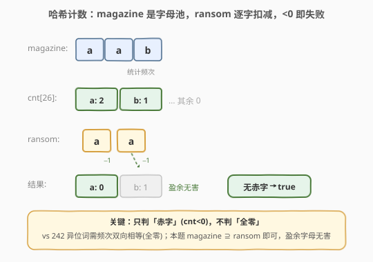
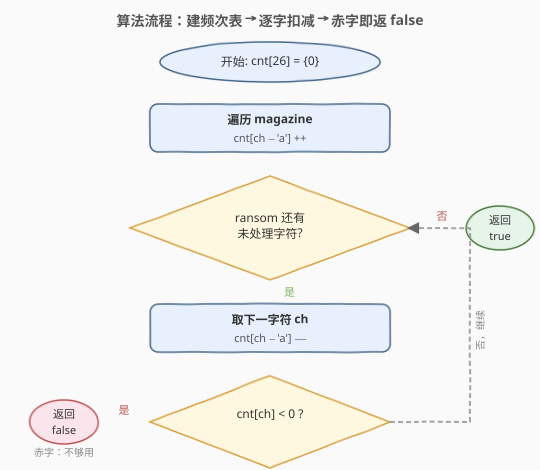
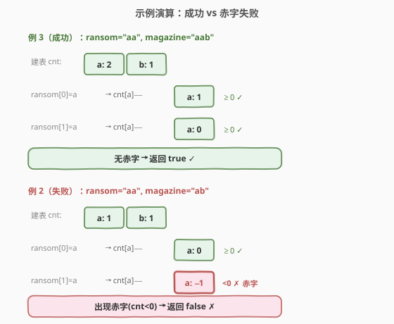

# 赎金信

- **题目名称**：赎金信
- **链接**：[383. 赎金信](https://leetcode.cn/problems/ransom-note/)
- **难度**：简单
- **标签**：哈希表、字符串、计数

## 1. 题目概述

给你两个字符串 `ransomNote` 和 `magazine`，判断 `ransomNote` 能否由 `magazine` 里的字符构成。

**约束**：`magazine` 中的每个字符只能在 `ransomNote` 中使用**一次**（即 `ransomNote` 的字符多重集必须是 `magazine` 字符多重集的**子集**）。

**示例 1**：

```text
输入：ransomNote = "a", magazine = "b"
输出：false
解释：magazine 中没有 'a'，无法拼出 ransomNote。
```

**示例 2**：

```text
输入：ransomNote = "aa", magazine = "ab"
输出：false
解释：magazine 只有一个 'a'，而 ransomNote 需要两个。
```

**示例 3**：

```text
输入：ransomNote = "aa", magazine = "aab"
输出：true
解释：magazine 有两个 'a'，恰好够用；多出的 'b' 无害。
```

**约束条件**：

- $1 \le \text{ransomNote.length}, \text{magazine.length} \le 10^5$
- `ransomNote` 和 `magazine` 仅由**小写英文字母**组成

> 💡 这道题是 [242. 有效的字母异位词](../0201-0300/242_有效的字母异位词.md) 的「单向版」：242 要求两串频次**完全相等**（双向），本题只要求 `magazine` 的频次**覆盖** `ransomNote`（单向，`magazine` 盈余字母无害）。二者共享同一套「字符计数」骨架，区别只在判定条件——242 判「全零」，383 判「无赤字」。

---

## 2. 解题思路

### 2.1 暴力思路

对 `ransomNote` 的每个字符，在 `magazine` 中从头线性查找一个**未被使用**的相同字符，找到后把它标记为已用（例如替换成 `#` 或维护一个 `visited` 数组）。最坏情况下每次都要扫到 `magazine` 末尾，时间 $O(|r| \cdot |m|)$，空间 $O(|m|)$。在 $10^5$ 量级下会达到 $10^{10}$，明显超时。

> ⚠️ 暴力法的根源问题：它把 `magazine` 当作「散乱的字符序列」反复搜索，而没有利用「只需知道每种字母**还剩多少**」这一关键抽象。

### 2.2 核心观察：哈希计数——magazine 是字母池，扣减出赤字即失败



把 `magazine` 看作一个**字母池**：每种字母都有一个剩余配额。建一张长度为 $26$ 的频次表 `cnt`，先扫一遍 `magazine` 统计每种字母的可用数量；再扫 `ransomNote`，每用一个字符就把对应配额 $-1$。

> 💡 **核心判据**：只要某个 `cnt[ch]` 在扣减后变成**负数**，说明 `magazine` 这种字母不够用——立即返回 `false`；若 `ransomNote` 全部处理完都没有出现负数，则返回 `true`。

这与 [242](../0201-0300/242_有效的字母异位词.md) 的「建表 + 抵消」几乎同构，但有两点关键差异：

| 维度 | 242 异位词 | 383 赎金信 |
|------|-----------|-----------|
| 关系 | 频次**双向相等** | `magazine` **单向覆盖** `ransomNote` |
| 长度 | 必须相等（快判剪枝） | `magazine` 可更长（盈余无害） |
| 终判 | `cnt` **全为零** | `cnt` **无负数**（允许有正盈余） |
| 提前退出 | 不能（需扫完才知全零） | **能**（一旦赤字立即返 `false`） |

正因为只需判「赤字」而非「全零」，本题可在扣减时**边走边判、命中即返**，无需扫完后再遍历 $26$ 格校验。

### 2.3 算法流程图



两阶段流程：

1. **建表**：遍历 `magazine`，对每个字符 `ch` 执行 `cnt[ch - 'a'] += 1`。
2. **扣减**：遍历 `ransomNote`，对每个字符 `ch` 执行 `cnt[ch - 'a'] -= 1`：
   - 若扣减后 `cnt[ch - 'a'] < 0`（赤字）→ 立即返回 `false`；
   - 否则继续。
3. 全部处理完未出现赤字 → 返回 `true`。

> 💡 **为什么先建表再扣减，而不是边统计边匹配？** 一次性建表让 `magazine` 的「字母池」完整可见，扣减阶段每个字符都是 $O(1)$ 查改，总复杂度严格 $O(|m| + |r|)$。若边统计边匹配则要反复扫描，退化为暴力。

### 2.4 示例演算



**例 3（成功）**：`ransomNote = "aa"`，`magazine = "aab"`

| 步骤 | 字符 | 动作 | cnt[a] | cnt[b] | 状态 |
|------|------|------|--------|--------|------|
| 建表 | — | 扫 magazine | 2 | 1 | — |
| 1 | a | cnt[a]−− | 1 | 1 | ≥0 ✓ |
| 2 | a | cnt[a]−− | 0 | 1 | ≥0 ✓ |
| 终判 | — | 无赤字 | 0 | 1 | → **true** |

**例 2（失败）**：`ransomNote = "aa"`，`magazine = "ab"`

| 步骤 | 字符 | 动作 | cnt[a] | cnt[b] | 状态 |
|------|------|------|--------|--------|------|
| 建表 | — | 扫 magazine | 1 | 1 | — |
| 1 | a | cnt[a]−− | 0 | 1 | ≥0 ✓ |
| 2 | a | cnt[a]−− | −1 | 1 | <0 ✗ 赤字 |
| 终判 | — | 出现赤字 | −1 | 1 | → **false**（提前退出） |

注意例 2 在第 2 步即命中赤字提前返回，不会继续无意义的处理。

---

## 3. 参考代码

### C++

```cpp
class Solution {
  public:
    bool canConstruct(string ransomNote, string magazine) {
        int cnt[26] = {0};
        for (char ch : magazine) {
            ++cnt[ch - 'a'];                 // 建字母池
        }
        for (char ch : ransomNote) {
            if (--cnt[ch - 'a'] < 0) {       // 扣减并立即判赤字
                return false;
            }
        }
        return true;
    }
};
```

### Python

```python
class Solution:
    def canConstruct(self, ransomNote: str, magazine: str) -> bool:
        cnt = [0] * 26
        for ch in magazine:
            cnt[ord(ch) - ord('a')] += 1
        for ch in ransomNote:
            idx = ord(ch) - ord('a')
            cnt[idx] -= 1
            if cnt[idx] < 0:
                return False
        return True
```

> 💡 Python 可用 `collections.Counter` 更直观：`cnt = Counter(magazine)`，然后 `if cnt[ch] == 0: return False` 否则 `cnt[ch] -= 1`。但手写数组版常数更小、空间确定 $O(26)$，且扣减与判赤字合并在 `--` 一步，逻辑更紧凑。注意 `Counter` 版要先判 `==0` 再减，避免出现负数键。

---

## 4. 复杂度分析

| 维度 | 复杂度 | 说明 |
|------|--------|------|
| 时间 | $O(|m| + |r|)$ | 建表扫一次 `magazine`，扣减扫一次 `ransomNote`，每字符 $O(1)$ |
| 空间 | $O(1)$ | 固定 $26$ 格计数数组，与输入规模无关 |
| 提前退出 | 平均更优 | 出现赤字即返，不必扫完 `ransomNote`；最坏（全匹配成功）仍 $O(|r|)$ |

> ⚠️ 若字符集不限定为 $26$ 个小写字母（如 Unicode），空间退化为 $O(|\Sigma|)$，需用哈希表替代定长数组，但时间仍 $O(|m| + |r|)$。

---

## 5. 扩展：排序 + 双指针变体

若不借助额外计数数组，也可将两串各自排序后用**双指针**判定覆盖关系：

- 排序 `magazine` 与 `ransomNote`；
- 双指针 `i`（扫 `ransomNote`）、`j`（扫 `magazine`）：
  - `magazine[j] == ransomNote[i]` → 匹配，`i++`、`j++`；
  - `magazine[j] < ransomNote[i]` → 该字母配额太小，`j++` 跳过；
  - `magazine[j] > ransomNote[i]` → `magazine` 中根本没有这种字母（已排序，后续只会更大）→ 返回 `false`。
- `i` 走完 `ransomNote` → `true`。

时间 $O(|m| \log |m| + |r| \log |r|)$（排序主导），空间 $O(\log |m| + \log |r|)$（排序栈）。**劣于**计数法的 $O(|m| + |r|)$，仅当字符集极大、计数数组开销不可接受时才有意义。此解法与 [392. 判断子序列](../0301-0400/392_判断子序列.md) 的双指针贪心同源，区别在于 392 保序匹配、本题不要求保序（排序后即可）。

> 💡 **何时用计数、何时用排序？** 字符集小且固定（如小写字母、ASCII）→ 计数数组最优；字符集大或元素可比较但种类不可枚举（如任意字符串、对象）→ 排序 + 双指针。

---

## 6. 面试要点

1. **为什么只需判「赤字」而不需判「全零」？**

   `ransomNote` 只要求 `magazine` **能覆盖**它的字符需求，不要求两者频次相等。`magazine` 多出的字母（盈余）不影响可构造性——配额池里剩下的字母用不完也无妨。因此只要扣减过程中没有任何一格变成负数，就说明每种字母都够用，返回 `true`。这与 [242](../0201-0300/242_有效的字母异位词.md) 的「全零校验」形成对照。

2. **为什么 `magazine` 长度小于 `ransomNote` 时一定 `false`，要不要显式判？**

   总字母数不足必然存在某种字母赤字。可以加一行 `if (magazine.size() < ransomNote.size()) return false;` 做快判剪枝，省去建表与扣减；但**不加也对**——扣减阶段必然会命中某格 $<0$ 而提前返回。快判只是常数优化，逻辑上非必需。

3. **`--cnt[ch-'a'] < 0` 把「扣减」和「判赤字」合并在一步，有什么好处？**

   先减再判：扣减后该格若 $<0$ 即赤字。等价于「扣减前为 $0$ 还要再扣」——即 `magazine` 中该字母已用尽。合并写法代码最短、且只读取一次数组，常数最优。若拆成「先判 `==0` 返回，再 `--`」也正确（`Counter` 版本即如此），但多一次读。

4. **进阶：如果字符集是 Unicode 怎么办？**

   把定长 `int cnt[26]` 换成哈希表（C++ `unordered_map<char,int>`、Python `Counter` / `dict`）。建表与扣减逻辑不变，时间仍 $O(|m| + |r|)$，空间变为 $O(|\Sigma|)$（实际用到的不同字符数）。注意此时 `ch - 'a'` 的索引方式失效，直接以字符本身作键。

5. **和 [242. 有效的字母异位词](../0201-0300/242_有效的字母异位词.md) 的代码几乎一样，能复用吗？**

   骨架（建表 + 增量抵消）完全可复用，差异只在判定：242 要求**长度相等**且扫完后 `cnt` **全为零**；383 不要求长度相等、只要求扣减时**无赤字**、允许盈余。把 242 的「先判长度、再扫完抵消、最后全零校验」改成「建表、扣减即判赤字」即可迁移。这正是「计数模板」的力量——同一套骨架覆盖一类问题。

---

## 7. 同类练习题

- [242. 有效的字母异位词](https://leetcode.cn/problems/valid-anagram/)（[题解](../0201-0300/242_有效的字母异位词.md)）：频次**双向相等**判定，本题的「母题」，共享计数骨架，对比「全零校验 vs 赤字校验」
- [350. 两个数组的交集 II](https://leetcode.cn/problems/intersection-of-two-arrays-ii/)（[题解](../0301-0400/350_两个数组的交集II.md)）：计数法求交集（取每种元素的最小频次），同为「计数 + 抵消」家族
- [49. 字母异位词分组](https://leetcode.cn/problems/group-anagrams/)（[题解](../0001-0100/49_字母异位词分组.md)）：按异位词签名（频次编码）成组，242/383 计数模板的批量应用
- [392. 判断子序列](https://leetcode.cn/problems/is-subsequence/)（[题解](../0301-0400/392_判断子序列.md)）：另一类「包含/覆盖」判定，保序匹配用双指针，与本题排序 + 双指针变体同源
