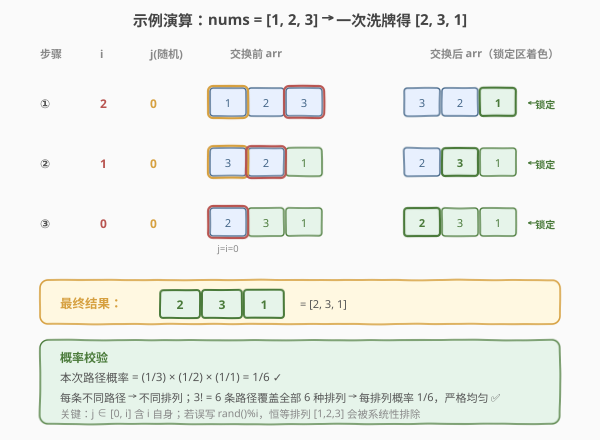

# LeetCode 打乱数组 题解

## 1. 题目概述

- **标题 / 题号**：打乱数组（#384，medium）
- **链接**：https://leetcode.cn/problems/shuffle-an-array/
- **难度**：中等
- **标签**：概率与随机、Fisher-Yates 洗牌、设计、数组

**题意**：给你一个**整数数组** `nums`，请实现一个 `Solution` 类，支持三个操作：

- `Solution(vector<int>& nums)`：用数组 `nums` 初始化对象；
- `vector<int> reset()`：将数组**重置**为初始配置并返回；
- `vector<int> shuffle()`：返回数组的一个**随机打乱**排列。每次调用应等概率地返回 `nums` 的一个排列，且与之前所有调用相互独立。

```cpp
Solution(vector<int>& nums)   // 用数组 nums 初始化
vector<int> reset()           // 重置为原始数组并返回
vector<int> shuffle()         // 随机打乱并返回
```

**示例 1**：

```text
输入：
["Solution", "shuffle", "reset", "shuffle"]
[[[1, 2, 3]], [], [], []]
输出：
[null, [3, 1, 2], [1, 2, 3], [1, 3, 2]]

解释：
Solution solution = new Solution([1, 2, 3]);
solution.shuffle();    // 随机打乱数组，返回 [3, 1, 2]（每次结果可能不同）
solution.reset();      // 重置为 [1, 2, 3] 并返回
solution.shuffle();    // 再次随机打乱，返回 [1, 3, 2]
```

**约束**：

- `1 <= nums.length <= 50`
- `-10^6 <= nums[i] <= 10^6`
- `nums` 中的所有元素**互不相同**
- 最多调用 `10^4` 次 `reset` 和 `shuffle`

> 💡 **题目本质**：洗牌的核心要求是「**每个排列出现的概率都必须等于 $1/n!$**」。这是「等概率随机生成排列」的招牌题——朴素的「每次随机挑一个未选元素」做法只要写错一点（例如对每个位置从全数组中任取、允许重复选取）就会破坏均匀性。Fisher-Yates 洗牌是这一问题**唯一**正确且最优的标准算法。

## 2. 解题思路

### 2.1 暴力思路：从池中逐个抽取

最直觉的做法：维护一个「剩余元素池」，每次从池中**等概率挑一个**放进结果，再从池中移除，重复 `n` 次直到池空。

```text
pool = nums.copy()
result = []
while pool 非空：
    j = rand() % len(pool)
    result.append(pool[j])
    pool.erase(pool[j])        // 把已选元素移除
return result
```

这个做法**是均匀的**：第 1 步 `n` 选 1，第 2 步 `n−1` 选 1……所有路径概率之积为

$$
\frac{1}{n}\cdot\frac{1}{n-1}\cdots\frac{1}{1} = \frac{1}{n!}
$$

恰好对应 $n!$ 种排列中的每一种。

> ⚠️ 但它有**两个工程硬伤**：
> (1) **额外空间** `O(n)`——必须复制一份 `pool` 才能边选边删，且原数组要保留用于 `reset`；
> (2) **删除代价高**——用 `vector::erase` 每次删除是 `O(n)`，总复杂度 `O(n²)`；用链表虽能 `O(1)` 删除，但随机访问又退化到 `O(n)`。
>
> 能否做到 **`O(n)` 时间、`O(1)` 额外空间**？这正是 Fisher-Yates 的精妙之处。

### 2.2 核心观察：Fisher-Yates 洗牌（原地、线性、严格均匀）

![Fisher-Yates 洗牌核心：从后向前扫描，i 与 [0,i] 随机交换](../images/shuffle_fisher_yates_concept.svg)

关键洞察是：**不必真的「从池中移除」已选元素，把交换当成移除即可**。具体地，从数组的**最后一个位置**开始往前扫，每一步在「尚未确定归位」的前缀 `[0, i]` 中随机挑一个下标 `j`，把 `arr[j]` 与 `arr[i]` 交换——交换后，`arr[i]` 就被「锁定」为本次洗牌结果，不再参与后续选择，等价于「从池中移除并放入结果区」。

> 💡 **Fisher-Yates 规则（标准版，自后向前）**：
>
> ```text
> for i = n-1 downto 1:
>     j = rand() % (i + 1)        // j ∈ [0, i]，含 i 自身
>     swap(arr[i], arr[j])
> ```

**为什么这样是严格均匀的？** 考察任意一个目标排列 $\pi = (\pi_0, \pi_1, \dots, \pi_{n-1})$ 被生成的概率。算法第 1 步从 `n` 个元素中挑出 `arr[n-1]`（概率 $1/n$），第 2 步从剩下 `n−1` 个里挑 `arr[n-2]`（概率 $1/(n-1)$）……每一步的选择概率构成一条独立路径：

$$
P(\pi) = \frac{1}{n}\cdot\frac{1}{n-1}\cdots\frac{1}{1} = \frac{1}{n!}
$$

由于每条路径**唯一对应**一个排列（一一映射），所有 $n!$ 个排列概率相等，都是 $\dfrac{1}{n!}$ ✅。

> ⚠️ **关键正确性细节**：第 `i` 步随机下标 `j` 的取值范围必须是 `[0, i]` **含 `i` 自身**。若误写成 `[0, i-1]`（即 `rand() % i`），则每个元素**永远不会留在原位**，会系统性地排除掉恒等排列 `[1,2,...,n]`，得到的并非「全部 $n!$ 种排列」而是「全部 derangement（错排）」——这是一个**极其常见又隐蔽**的 bug，面试时务必讲清。

### 2.3 算法流程图


```text
1. arr = nums 的拷贝（保留原始数组用于 reset）
2. for i = n-1 downto 1：
       j = random integer in [0, i]
       swap(arr[i], arr[j])           // arr[i] 锁定，前缀 [0, i-1] 继续
3. return arr
```

> 💡 **方向无关**：从后向前（`i = n-1 → 1`）和从前向后（`i = 0 → n-2`，`j ∈ [i, n-1]`）两种写法**等价**且都正确，只要满足「第 `k` 步在剩余 `n-k` 个候选里等概率选一个并锁定」。工程上自后向前更常见，因为 `rand() % (i+1)` 的上界随 `i` 递减，循环写起来更顺。

### 2.4 示例演算

以 `nums = [1, 2, 3]`（共 $3! = 6$ 种排列，每种概率 $1/6$）为例，展示一次可能的洗牌过程：



| 步骤 | i | 候选范围 [0,i] | 随机 j（一次可能取值） | 交换前 arr | 交换后 arr | 锁定区 |
|------|---|----------------|------------------------|------------|------------|--------|
| ① | 2 | [0,1,2] | j=0 | [1, 2, **3**] | [3, 2, **1**] | arr[2]=1 ✅ |
| ② | 1 | [0,1] | j=0 | [3, **2**, 1] | [2, **3**, 1] | arr[1]=3 ✅ |
| ③ | 0 | [0]（必选自身） | j=0 | [2, 3, 1] | [2, 3, 1] | arr[0]=2 ✅ |
| — | — | — | — | — | **[2, 3, 1]** | 全部锁定 |

校验概率：本次产出 `[2, 3, 1]` 的路径为「i=2 选 j=0（1/3）→ i=1 选 j=0（1/2）→ i=0 选 j=0（1/1）」，概率 $= \frac{1}{3}\times\frac{1}{2}\times 1 = \frac{1}{6}$ ✅。每条不同路径产出不同排列，6 条路径覆盖全部 $3! = 6$ 种排列，严格均匀。

## 3. 参考代码

> 工程上推荐使用语言自带的**高质量随机数源**（C++ 的 `std::mt19937` + `std::uniform_int_distribution`，Python 的 `random.randrange`），避免 `rand()` 的模偏差与线程安全问题。但 LeetCode 评测环境下 `rand() % (i+1)` 也完全可过。

### C++

```cpp
// 打乱数组.cpp —— Fisher-Yates 洗牌（自后向前）
#include <vector>
#include <random>
#include <algorithm>
using namespace std;

class Solution {
    vector<int> original;          // 原始数组，用于 reset
    vector<int> arr;               // 工作数组，用于 shuffle
    mt19937 rng;                   // 高质量随机数源
public:
    Solution(vector<int>& nums) : original(nums), arr(nums) {
        random_device rd;
        rng.seed(rd());
    }

    vector<int> reset() {
        arr = original;            // 恢复工作数组为原始
        return arr;
    }

    vector<int> shuffle() {
        for (int i = (int)arr.size() - 1; i >= 1; --i) {
            // j ∈ [0, i]，用 uniform_int_distribution 消除模偏差
            uniform_int_distribution<int> dist(0, i);
            int j = dist(rng);
            swap(arr[i], arr[j]);               // 锁定 arr[i]
        }
        return arr;
    }
};
```

### Python

```python
import random


class Solution:
    def __init__(self, nums: list[int]):
        self._original = nums[:]          # 拷贝，避免后续修改影响原对象
        self._arr = nums[:]

    def reset(self) -> list[int]:
        self._arr = self._original[:]     # 恢复
        return self._arr

    def shuffle(self) -> list[int]:
        # random.shuffle 底层即 Fisher-Yates，自后向前 randrange(i+1)
        # 这里手写一遍以便面试讲解
        arr = self._arr
        for i in range(len(arr) - 1, 0, -1):
            j = random.randrange(i + 1)   # j ∈ [0, i]
            arr[i], arr[j] = arr[j], arr[i]
        return arr
```

> ⚠️ **实现易错点**：
> - `reset` 必须**真正恢复** `arr`，不能只返回 `original`——否则下一次 `shuffle` 会在「上一次洗乱的结果」上继续洗，破坏「每次独立均匀」的要求。正确做法是 `arr = original`（或拷贝）。
> - `j` 的范围**必须含 `i`**：`rand() % (i+1)` / `randrange(i+1)` / `uniform_int_distribution(0, i)`，三者都包含 `i`。写成 `rand() % i` 是经典 bug。
> - Python 的 `random.shuffle(arr)` 与上述手写循环**完全等价**（CPython 实现就是 `for i in range(len-1, 0, -1): j = randbelow(i+1); arr[i], arr[j] = arr[j], arr[i]`），工程中直接调用即可，面试时手写以展示原理。

## 4. 复杂度分析

| 维度 | 复杂度 | 说明 |
|------|--------|------|
| **构造时间** | `O(n)` | 拷贝一份原始数组 |
| **`reset` 时间** | `O(n)` | 整体拷贝恢复工作数组 |
| **`shuffle` 时间** | `O(n)` | 单遍扫描，每步 `O(1)` 随机 + 交换 |
| **额外空间** | `O(n)` | 存 `original` 与 `arr` 两份（不计返回值） |
| **洗牌空间（除结果外）** | `O(1)` | 原地交换，无额外池 |

> 💡 **空间下界**：因为 `reset` 要能恢复原始数组，必须**额外保存一份原数组**，故 `O(n)` 空间不可省。Fisher-Yates 的 `O(1)` 是指「洗牌过程本身」原地，不含必须保留的 `original`。面试时可主动说明这一权衡，体现对题目要求的细致理解。

## 5. 扩展：Inside-Out 洗牌（数据流版）

Fisher-Yates 是**原地**算法，要求事先知道数组长度并能下标访问。若数据以**流式**到达（长度未知、只能顺序扫描一次），可改用 **Inside-Out（由前向后）洗牌**：

```text
result = []
for i, x in stream:
    j = rand() % (i + 1)          // j ∈ [0, i]
    if j == i:
        result.append(x)          // 放到末尾
    else:
        result.append(result[j])  // 把原 result[j] 挤到末尾
        result[j] = x             // 新元素入位 result[j]
```

可以证明（用与 2.2 节类似的归纳法），扫完 `n` 个元素后，`result` 中每个位置存放原流第 `k` 个元素的概率都是 $\dfrac{1}{n}$，即得到一个**均匀排列**。其优点是**单遍流式**、只需 `O(n)` 输出空间（无原数组可改时仍可用），常用于「**蓄水池抽样生成全排列**」「**MapReduce 上分布式洗牌**」等场景。

> 💡 Fisher-Yates（自后向前）与 Inside-Out（自前向后）是同一思想的两个方向：前者原地、需预知长度；后者流式、需额外输出空间。二者**对偶**，面试讲清这层关系非常加分。

## 6. 面试要点

1. **Fisher-Yates 为什么是均匀的？请给出证明。**

   - 算法第 1 步从 `n` 个里选 `arr[n-1]`（概率 $1/n$），第 2 步从剩下 `n−1` 个里选 `arr[n-2]`（$1/(n-1)$）……
   - 任意目标排列 $\pi$ 对应一条唯一选择路径，概率 $P(\pi) = \dfrac{1}{n}\cdot\dfrac{1}{n-1}\cdots\dfrac{1}{1} = \dfrac{1}{n!}$。
   - 每条路径产出不同排列，$n!$ 条路径覆盖全部排列，故每个排列概率严格 $1/n!$ ✅。

2. **为什么 `j` 的范围必须包含 `i` 自身？写成 `rand() % i` 会怎样？**

   - 若 `j ∈ [0, i-1]`（不含 `i`），则第 `i` 步的 `arr[i]` **必然被换走**，意味着每个元素都**不能留在原位**，恒等排列 `[1,2,...,n]` 被系统性排除。
   - 结果是只覆盖 $D_n$（错排数）种排列而非 $n!$ 种，**不再是均匀洗牌**。这是最隐蔽的洗牌 bug，LeetCode 评测不一定能发现（因为只统计频次近似），但工程上会导致严重的分布偏差。

3. **`reset` 为什么要重置 `arr` 而不是直接返回 `original`？**

   - 若只 `return original` 而 `arr` 仍保持上次洗乱的状态，下一次 `shuffle` 会**在乱序基础上继续洗**。虽然每次单独看仍均匀，但「相邻两次 `shuffle` 的结果」之间会**相关**（第二次受第一次残留影响），不符合「每次独立」的题意。
   - 正确做法是 `arr = original`（或 `original[:]`），让工作数组回到原点，保证每次 `shuffle` 从同一基准出发、相互独立。

4. **`rand() % (i+1)` 有没有陷阱？**

   - 有**模偏差**（modulo bias）：`rand()` 返回 `[0, RAND_MAX]`，当 `RAND_MAX+1` 不能被 `i+1` 整除时，`[0, RAND_MAX % (i+1)]` 范围内的值出现概率略高。
   - 本题 `n ≤ 50`，`RAND_MAX` 通常 `≥ 2^15`，偏差可忽略。但生产环境应使用 `std::uniform_int_distribution`（C++）或 `secrets.SystemRandom`（Python，密码学场景）消除偏差。

5. **Fisher-Yates 和 Inside-Out 的区别？分别用于什么场景？**

   - **Fisher-Yates**（自后向前）：**原地**、需预知长度、可下标访问。用于「已知数组原地洗牌」，空间 `O(1)`。
   - **Inside-Out**（自前向后）：**流式**、单遍扫描、长度未知也可用。用于「数据流洗牌」「分布式 MapReduce 洗牌」「不能修改原数组需输出新数组」等场景，空间 `O(n)`。
   - 二者方向对偶、产物等价（都是均匀排列），选型看「能否原地 / 是否流式」。

> 💡 **一句话总结**：384 是洗牌算法的母题——Fisher-Yates 自后向前、`j ∈ [0, i]` 含 `i`、原地 `O(n)`、严格均匀（每排列 $1/n!$，由选择路径的连乘证明）。最隐蔽的 bug 是把 `j` 范围写成 `[0, i-1]` 导致系统性排除恒等排列。`reset` 必须重置工作数组以保证「每次独立」。它与 Inside-Out 流式洗牌**方向对偶**，是「等概率生成排列」家族的标准答案。

## 同类练习题

| # | 题目 | 与本题的关联 |
|---|------|-------------|
| 398 | [随机数索引](https://leetcode.cn/problems/random-pick-index/)（[题解](../0301-0400/398_随机数索引.md)） | 从含重复值的数组中**等概率取一个等于 target 的下标**，蓄水池抽样 `k=1`，与 Fisher-Yates 同属「等概率采样」家族，对照「均匀采样的两种范式」。 |
| 382 | [链表随机节点](https://leetcode.cn/problems/linked-list-random-node/) | 链表上等概率取一个节点（长度未知、不可下标访问），蓄水池抽样的纯净应用；与 Fisher-Yates 对比「已知长度原地」vs「未知长度流式」。 |
| 528 | [按权重随机选择](https://leetcode.cn/problems/random-pick-with-weight/) | 从「等概率」升级到「**按权重**」采样，用前缀和 + 二分实现，对比两种采样目标的不同实现路径。 |
| 470 | [用 Rand7() 实现 Rand10()](https://leetcode.cn/problems/implement-rand10-using-rand7/) | 另一类概率采样——**拒绝采样**，与 Fisher-Yates 的「直接均匀采样」互为补充，体会「均匀性构造」的不同手法。 |
| 710 | [黑名单中的随机数](https://leetcode.cn/problems/random-pick-with-blacklist/) | 在带黑名单的范围内均匀采样，用哈希重映射把「不均匀」化归为「均匀」，采样问题的进阶综合题。 |
