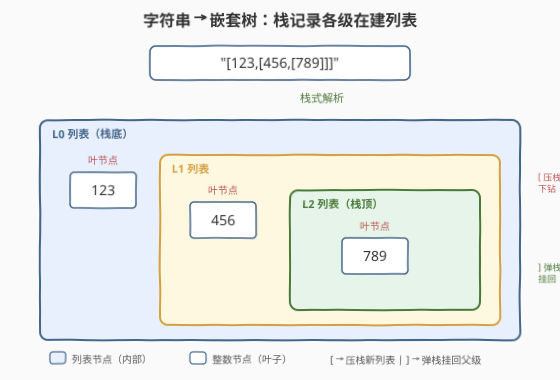
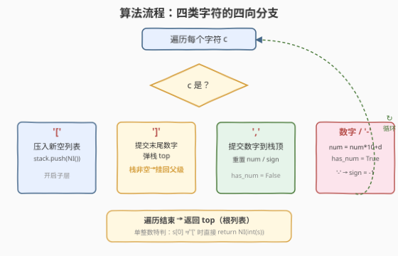

# 迷你语法分析器

- **题目名称**：迷你语法分析器
- **链接**：[385. 迷你语法分析器](https://leetcode.cn/problems/mini-parser/)
- **难度**：中等
- **标签**：栈、字符串、递归、深度优先搜索

## 1. 题目概述

给定一个字符串 `s` 表示一个**整数嵌套列表**，实现一个语法分析器，把它解析成 `NestedInteger` 对象返回。列表中的每个元素只可能是**整数**或**整数嵌套列表**，可任意嵌套。

`NestedInteger` 接口（简化）：

```text
NestedInteger()              # 构造一个空嵌套列表
NestedInteger(value)         # 构造一个只含单个整数的 NestedInteger
bool isInteger()             # 是否持有单个整数
int getInteger()             # 取整数（仅 isInteger 为真时有效）
void setInteger(value)       # 设为单个整数
void add(NestedInteger ni)   # 把 ni 追加到当前列表末尾（当前必须为列表）
List[NestedInteger] getList()# 取子列表
```

**示例 1**：

```text
输入：s = "324"
输出：324
解释：返回一个只含整数值 324 的 NestedInteger。
```

**示例 2**：

```text
输入：s = "[123,[456,[789]]]"
输出：[123,[456,[789]]]
解释：返回一个含两个元素的嵌套列表：
  1. 整数 123
  2. 一个含两个元素的嵌套列表：
     i.  整数 456
     ii. 一个含一个元素的嵌套列表：
         a. 整数 789
```

**约束条件**：

- $1 \le \text{s.length} \le 5 \times 10^4$
- `s` 由数字、方括号 `"[]"`、负号 `'-'`、逗号 `','` 组成
- `s` 保证是可解析的 `NestedInteger`
- 输入中所有值的范围是 $[-10^6, 10^6]$

> 💡 本题与 [341. 扁平化嵌套列表迭代器](../0301-0400/341_扁平化嵌套列表迭代器.md) 共享 `NestedInteger` 接口，但方向相反——341 是「结构 → 遍历」，385 是「字符串 → 结构」。把嵌套列表看成**多叉树**：`[` 开启一个**内部节点**（列表），整数是**叶节点**。解析过程就是**自顶向下建树**：遇到 `[` 开新节点下钻，遇到 `]` 收尾回退。难点在于方括号可任意嵌套，必须用**栈**记录「当前正在建造的父列表」，弹栈时把子列表挂回父级。

---

## 2. 解题思路

### 2.1 直接思路：递归下降解析

串 `s` 是自相似的：`[` 后面又是一段合法的元素序列，直到 `]`。最直观的写法是**递归下降**——用一个游标 `i` 扫描，遇到 `[` 就进入下一层 `parse()`，遇到 `]` 就返回当前层列表。

```text
def parse():
    if s[i] == '[':
        i += 1                       # 跳过 '['
        ni = NestedInteger()         # 新列表
        while s[i] != ']':
            ni.add(parse())          # 递归解析一个元素
            if s[i] == ',': i += 1   # 跳过逗号
        i += 1                       # 跳过 ']'
        return ni
    else:
        # 解析一个整数（含可选负号）
        return NestedInteger(int(读到的数字串))
```

逻辑清晰，时间 $O(n)$、空间 $O(d)$（$d$ 为最大嵌套深度，即递归栈深）。但 $n$ 可达 $5\times 10^4$，若输入是 `[[[[...[1]...]]]]` 形的极深单链嵌套，深度可达 $\sim 2.5\times 10^4$，**可能触发 Python 默认递归上限**（`sys.setrecursionlimit` 默认 1000，C++ 同样受系统栈限制）。

> ⚠️ 递归下降的隐患：嵌套深度受系统调用栈限制。题目允许 $s$ 长达 $5\times10^4$，最坏情况深度极大，递归可能爆栈。面试中递归版本是好的「思路切入点」，但落地实现常要求**迭代栈式解析**，避免栈溢出。

### 2.2 核心观察：栈式迭代解析——`[` 压栈新列表，`]` 弹栈挂回父级

递归的「进入 `[` = 下钻建子树」「遇到 `]` = 收尾回退」恰好对应**栈的压入与弹出**。把递归调用栈手动展开成显式栈，每个栈帧存一个「正在建造的 `NestedInteger` 列表」：

- **栈**：存放各级**正在建造的列表节点**，栈顶 = 当前最深层的列表。
- 维护两个临时变量：`num`（正在读取的数字，支持多位与负号）、`has_num`（是否已有未提交的数字）。

**四类字符的处理**：

| 字符 | 操作 |
|------|------|
| **`'['`** | 新建一个空 `NestedInteger`（列表），**压入栈**——开启子层 |
| **数字 / `'-'`** | 累积数字：`num = num*10 + digit`，遇 `'-'` 记 `sign = -1` |
| **`','`** | 若 `has_num`：把 `NestedInteger(num*sign)` 追加到**栈顶列表**，重置 `num/sign/has_num` |
| **`']'`** | 若 `has_num`：先提交末尾数字到栈顶列表；然后**弹栈**得到建好的子列表 `top`；若栈非空，把 `top` 追加到新栈顶（父列表）；若栈空，`top` 即为最终结果 |



**关键设计：为什么在 `]` 时才把子列表挂回父级？**

递归版本中，子列表是 `parse()` 的**返回值**，自然交给父层。迭代版本里，子列表在 `[` 时就已压入栈，但它要等内部所有元素都建完（即遇到匹配的 `]`）才「成熟」。此时弹栈取出完整的子列表，挂回父级——这与递归「`parse()` 返回后 `add` 到父列表」完全对应。

> 💡 **与 394 字符串解码的对照**：[394. 字符串解码](../0301-0400/394_字符串解码.md) 用双栈暂存「外层字符串 + 倍数」，遇 `[` 压栈、遇 `]` 弹栈拼接；本题用单栈暂存「各级在建列表」，遇 `[` 压栈、遇 `]` 弹栈挂回。两者同属「**栈模拟递归的嵌套解析**」家族，差别只在暂存的是什么现场——394 是「字符串 + 倍数」，385 是「列表节点」。

> ⚠️ **C++ 值语义陷阱**：若在遇到 `[` 时就把新列表 `add` 到父级（pre-link），由于 `add` 拷贝值，后续往栈顶列表 `add` 子元素修改的是**栈上的副本**，父级持有的早期副本仍是空的。**正确做法是在 `]` 弹栈时才把建好的子列表 `add` 到父级**——此时子列表已完整，拷贝给父级即得正确结构。Python 是引用语义无此问题，但为两语言一致，统一采用「弹栈时挂回」。

### 2.3 算法流程图



**完整步骤**：

1. **特判单整数**：若 `s[0] != '['`，说明整个串就是一个整数（如 `"324"`、`"-7"`），直接 `return NestedInteger(int(s))`。
2. 初始化空栈 `stack`、`num=0`、`sign=1`、`has_num=False`、`top=None`。
3. 顺序遍历 `s` 的每个字符 `c`：
   - `c == '['`：`stack.append(NestedInteger())`（压入新空列表）。
   - `c == ']'`：若 `has_num`，先 `stack[-1].add(NestedInteger(num*sign))` 并重置；`top = stack.pop()`；若栈非空，`stack[-1].add(top)`。
   - `c == ','`：若 `has_num`，`stack[-1].add(NestedInteger(num*sign))` 并重置。
   - `c == '-'`：`sign = -1`。
   - 数字：`num = num*10 + int(c)`，`has_num = True`。
4. 遍历结束，返回 `top`（最后一次弹栈所得的根列表）。

### 2.4 示例演算

以 `s = "[123,[456,[789]]]"` 为例（三层嵌套，最能体现栈的压入与弹栈挂回）：

![示例演算：[123,[456,[789]]] 的栈状态演化](../images/miniparser_walkthrough.svg)

| 步骤 | 字符 | 操作 | 栈（顶→底） | `num` |
|------|------|------|-------------|-------|
| 1 | `'['` | 压入空列表 $L_0$ | `[L0]` | 0 |
| 2 | `'1''2''3'` | 累积数字 | `[L0]` | 123 |
| 3 | `','` | 提交 `NI(123)` 到 $L_0$ | `[L0]`，$L_0$=`[123]` | 0 |
| 4 | `'['` | 压入空列表 $L_1$ | `[L1, L0]` | 0 |
| 5 | `'4''5''6'` | 累积数字 | `[L1, L0]` | 456 |
| 6 | `','` | 提交 `NI(456)` 到 $L_1$ | `[L1, L0]`，$L_1$=`[456]` | 0 |
| 7 | `'['` | 压入空列表 $L_2$ | `[L2, L1, L0]` | 0 |
| 8 | `'7''8''9'` | 累积数字 | `[L2, L1, L0]` | 789 |
| 9 | `']'` | 提交 `NI(789)` 到 $L_2$；弹 $L_2$=`[789]`；挂回 $L_1$ | `[L1, L0]`，$L_1$=`[456,[789]]` | 0 |
| 10 | `']'` | 弹 $L_1$=`[456,[789]]`；挂回 $L_0$ | `[L0]`，$L_0$=`[123,[456,[789]]]` | 0 |
| 11 | `']'` | 弹 $L_0$；栈空，`top=L0` | `[]` | 0 |

最终返回 $L_0 = [123,[456,[789]]]$，与期望输出一致。

> 💡 **观察「弹栈时挂回」的时机**：第 9 步 $L_2$ 在 `]` 时才被弹出并挂回 $L_1$——此时 $L_2$ 已收完 `789`，是完整的 `[789]`。若在第 7 步压入 $L_2$ 时就挂回 $L_1$，后续给 $L_2$ 加 `789` 修改的是栈上副本，$L_1$ 里那份仍是空列表（C++ 值语义下）。这正是「弹栈时挂回」设计的根本原因。

---

## 3. 参考代码

### C++

```cpp
// 迷你语法分析器.cpp —— 栈式迭代解析
// 编译: g++ -O2 -std=c++17 迷你语法分析器.cpp -o miniparser
#include <string>
#include <stack>
using namespace std;

class Solution {
public:
    NestedInteger deserialize(string s) {
        if (s.empty()) return NestedInteger();
        if (s[0] != '[') {                 // 整串就是单个整数
            return NestedInteger(stoi(s));
        }
        stack<NestedInteger> stk;
        int num = 0, sign = 1;
        bool has_num = false;
        NestedInteger top;
        for (char c : s) {
            if (c == '[') {
                stk.push(NestedInteger());            // 开新列表
            } else if (c == ']') {
                if (has_num) {                        // 提交末尾数字
                    stk.top().add(NestedInteger(num * sign));
                    has_num = false; num = 0; sign = 1;
                }
                top = stk.top(); stk.pop();           // 弹出建好的子列表
                if (!stk.empty()) stk.top().add(top); // 挂回父级
            } else if (c == ',') {
                if (has_num) {
                    stk.top().add(NestedInteger(num * sign));
                    has_num = false; num = 0; sign = 1;
                }
            } else if (c == '-') {
                sign = -1;
            } else {                                  // 数字
                num = num * 10 + (c - '0');
                has_num = true;
            }
        }
        return top;
    }
};
```

### Python

```python
class Solution:
    def deserialize(self, s: str) -> NestedInteger:
        if not s:
            return NestedInteger()
        if s[0] != '[':                      # 整串就是单个整数
            return NestedInteger(int(s))

        stack = []
        num = 0
        sign = 1
        has_num = False
        top = None
        for c in s:
            if c == '[':
                stack.append(NestedInteger())            # 开新列表
            elif c == ']':
                if has_num:                              # 提交末尾数字
                    stack[-1].add(NestedInteger(num * sign))
                    has_num = False
                    num = 0
                    sign = 1
                top = stack.pop()                        # 弹出建好的子列表
                if stack:                                # 挂回父级
                    stack[-1].add(top)
            elif c == ',':
                if has_num:
                    stack[-1].add(NestedInteger(num * sign))
                    has_num = False
                    num = 0
                    sign = 1
            elif c == '-':
                sign = -1
            else:                                        # 数字
                num = num * 10 + int(c)
                has_num = True
        return top
```

> 💡 **单整数特判的必要性**：若 `s = "324"`，整个串没有 `[`，栈永远不会被压入，循环结束时 `top` 仍为 `None`。故 `s[0] != '['` 时直接构造 `NestedInteger(int(s))` 返回，绕过栈逻辑。负数 `"−7"` 同理被 `int(s)` 正确处理。

> ⚠️ **Python 代码中的 `add` 返回值**：LeetCode 的 `NestedInteger.add` 返回 `self`（支持链式调用），但本题不需要链式——每次 `add` 后都不再用返回值。注意 `add` 会把当前对象从「空」转为「列表」语义：若一个 `NestedInteger` 先被 `add` 过，再调 `setInteger` 行为未定义。本题中列表节点只 `add`、整数节点只走构造函数，两类泾渭分明，不混用。

---

## 4. 复杂度分析

| 维度 | 复杂度 | 说明 |
|------|--------|------|
| **时间复杂度** | $O(n)$ | 每个字符恰好被扫描一次；数字累积、栈压弹均为 $O(1)$ 摊还 |
| **空间复杂度** | $O(d)$ | 栈深 = 当前嵌套深度 $d$；$d \le n/2$（最深为 `[[[...]]]` 单链形），远优于递归版受系统栈上限的隐式约束 |

> ⚠️ $n$ 为输入串长度。本题 $n \le 5\times10^4$，迭代栈式解法在任意深度下都安全；递归版在最深 $\sim 2.5\times10^4$ 层时可能爆栈，是迭代版的核心优势。

---

## 5. 扩展：递归下降写法

当面试官要求递归实现、或嵌套深度有保障时，递归下降更简洁直观：

```python
class Solution:
    def deserialize(self, s: str) -> NestedInteger:
        self.i = 0
        def parse() -> NestedInteger:
            if s[self.i] == '[':
                self.i += 1                      # 跳过 '['
                ni = NestedInteger()
                while s[self.i] != ']':
                    ni.add(parse())              # 递归解析一个元素
                    if s[self.i] == ',':         # 跳过逗号
                        self.i += 1
                self.i += 1                      # 跳过 ']'
                return ni
            else:
                # 解析整数（含可选负号）
                j = self.i
                if s[self.i] == '-':
                    self.i += 1
                while self.i < len(s) and s[self.i].isdigit():
                    self.i += 1
                return NestedInteger(int(s[j:self.i]))
        return parse()
```

仍是 $O(n)$ 时间、$O(d)$ 空间。两种写法本质同构：递归版的「进入 `parse()`」= 迭代版的「`[` 压栈」；递归版的「`return`」= 迭代版的「`]` 弹栈挂回」。迭代版把递归调用栈显式化，绕开了系统栈深度限制。

> 💡 **从「文法」视角理解**：本题的输入遵循简化文法 `S → '[' S (',' S)* ']' | INT`。递归下降的 `parse()` 正是对该文法的逐条规则实现——遇到 `[` 走列表分支，否则走整数分支。这是**编译原理中递归下降解析器**的最小实例，与 [394. 字符串解码](../0301-0400/394_字符串解码.md)（文法含重复因子 `k[...]`）、[224. 基本计算器](../0201-0300/224_基本计算器.md)（文法含运算符优先级）同属「栈/递归解析结构化文本」一脉。

---

## 6. 面试要点

1. **为什么用栈？栈和递归是什么关系？**

   > 嵌套列表的自相似结构天然适合递归，但递归调用栈由系统托管、深度受限（本题 $n \le 5\times10^4$，最深可达 $\sim 2.5\times10^4$ 层，易爆栈）。**显式栈就是手动管理的递归调用栈**：`[` 压栈 = 进入子层，`]` 弹栈 = 子层返回。这是「递归 → 迭代」的通用改造范式，与 [394. 字符串解码](../0301-0400/394_字符串解码.md)、[341. 扁平化嵌套列表迭代器](../0301-0400/341_扁平化嵌套列表迭代器.md) 同源。

2. **为什么在 `]` 弹栈时才把子列表挂回父级，而不是在 `[` 时就挂？**

   > 子列表在 `[` 时还是空的，要等内部所有元素建完（遇到匹配 `]`）才「成熟」。若在 `[` 时就 `add` 到父级，C++ 值语义下父级持有的是早期空副本，后续给栈顶加子元素修改的是栈上另一份副本，父级那份仍是空——结构断裂。**弹栈时挂回**保证挂给父级的是已完整的子列表。Python 引用语义下无此问题，但统一采用「弹栈时挂回」使两语言行为一致、逻辑更清晰。

3. **单整数输入（如 `"324"`）为什么要特判？**

   > 没有 `[` 时栈永远不会被压入，循环结束 `top` 仍为 `None`。`s[0] != '['` 直接 `NestedInteger(int(s))` 返回，绕过栈逻辑。负数 `"-7"` 被 `int(s)` 正确处理。也可不特判、用一个哨兵根列表兜底，但特判更直观。

4. **多位数字与负号如何处理？**

   > 数字可能多位（如 `123`）且可带负号。用 `num = num*10 + int(c)` 累积，遇 `'-'` 记 `sign = -1`。`has_num` 标志区分「当前无数字在读」与「读到 0」（否则 `num=0` 无法区分这两种状态）。提交数字（遇 `,` 或 `]`）后必须重置 `num=0; sign=1; has_num=False`，否则下一段会带上前一段的残留。

5. **`[123,[456,[789]]]` 这种三层嵌套，栈的最大深度是多少？**

   > 三层嵌套对应栈深 3。一般地，栈深 = 当前嵌套深度。最坏情况 `[[[...[1]...]]]` 形单链嵌套，深度 $\sim n/2$。迭代栈式解法的空间是 $O(d)$，与递归版相同，但不受系统调用栈上限约束——这是迭代版在极深输入下的核心优势。

> 💡 **一句话总结**：385 是「**用栈把递归下降解析器展开成迭代**」——`[` 压入新列表，数字累积，`,` / `]` 提交数字，`]` 弹栈并把建好的子列表挂回父级。核心思想是「栈记录各级在建列表，弹栈时挂回」，与 394 字符串解码的「栈暂存外层现场」同源。掌握了「栈模拟递归的嵌套解析」，所有结构化文本解析题都能一通百通。

---

## 7. 同类练习题

- [341. 扁平化嵌套列表迭代器](https://leetcode.cn/problems/flatten-nested-list-iterator/)（[题解](../0301-0400/341_扁平化嵌套列表迭代器.md)）：同一 `NestedInteger` 接口，方向相反——385 是「字符串→结构」，341 是「结构→遍历」；341 用栈惰性展开，385 用栈迭代建造
- [394. 字符串解码](https://leetcode.cn/problems/decode-string/)（[题解](../0301-0400/394_字符串解码.md)）：栈模拟递归解析嵌套 `k[...]` 结构的招牌题，与本题「`[` 压栈、`]` 弹栈」同源，差别只在暂存的现场类型
- [224. 基本计算器](https://leetcode.cn/problems/basic-calculator/)（[题解](../0201-0300/224_基本计算器.md)）：栈处理括号与一元符号的表达式求值，与本题同属「栈解析结构化文本」家族
- [339. 嵌套列表加权和](https://leetcode.cn/problems/nested-list-weight-sum/)：同一 `NestedInteger` 接口的遍历入门题，配合 341 / 385 理解嵌套家族的「建/遍/聚合」三个方向
- [1086. 前五分均分](https://leetcode.cn/problems/high-five/)：结构化文本解析的简化场景，可作为递归下降的入门练手
