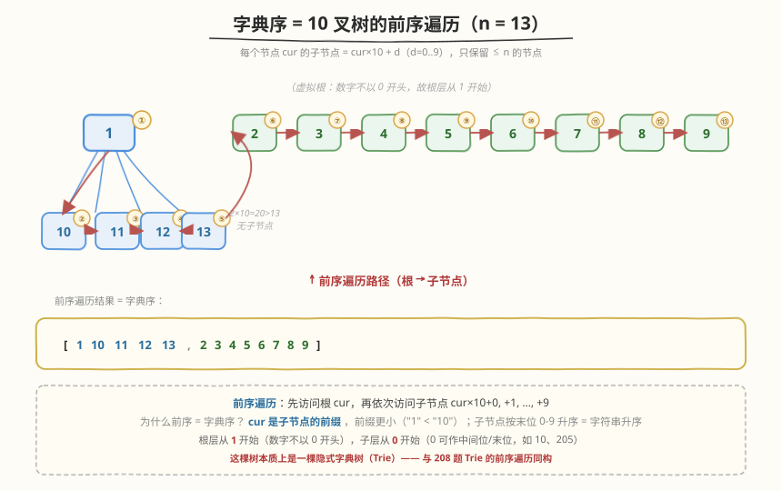
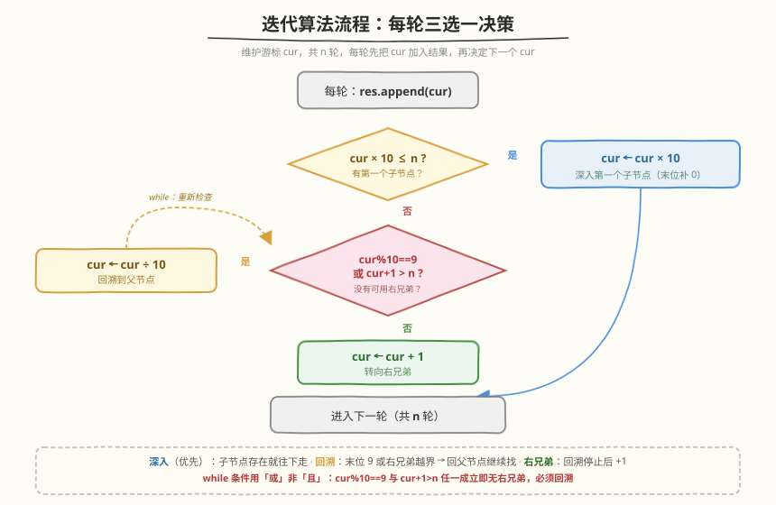
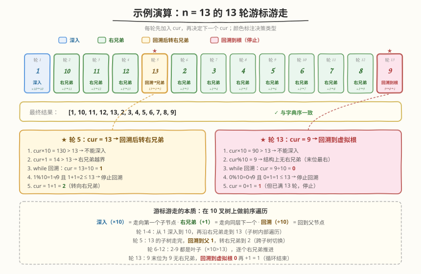

# LeetCode 字典序排数 题解

## 1. 题目概述

- **标题 / 题号**：字典序排数（#386，medium）
- **链接**：https://leetcode.cn/problems/lexicographical-numbers/
- **难度**：中等
- **标签**：深度优先搜索、字典树、迭代

**题意**：给定一个整数 `n`，返回区间 `[1, n]` 内所有整数按**字典序**（lexicographical order）排列后的结果。

> 💡 **字典序就是字符串序**：把每个数字当成字符串比较。`"10"` < `"2"`，因为字符 `'1'` < `'2'`（逐字符比较，第一位就分出胜负）。所以 `n=13` 的字典序是 `[1,10,11,12,13,2,3,...,9]`——`1` 开头的全部排在 `2` 前面，正如字典里 `"ab"` 排在 `"b"` 前面。

**示例 1**：

```text
输入：n = 13
输出：[1,10,11,12,13,2,3,4,5,6,7,8,9]
解释：按字符串比较，"1" < "10" < "11" < "12" < "13" < "2" < "3" < ... < "9"
```

**示例 2**：

```text
输入：n = 2
输出：[1,2]
```

**约束**：

- $1 \leq n \leq 5 \times 10^4$

**进阶**：用 $O(n)$ 时间复杂度、$O(1)$ 额外空间（不含输出数组）完成。

> 💡 本题的灵魂在于「**把数字看成 10 叉树的前序遍历**」。朴素做法是转字符串排序（$O(n \log n)$），但若观察到字典序天然对应一棵以 1-9 为根、每节点子节点为 `cur*10+0..9` 的 10 叉树的**前序遍历**，就能在 $O(n)$ 时间内逐个生成，再用迭代把空间压到 $O(1)$。这棵「隐式字典树」是本题的全部考点。

## 2. 解题思路

### 2.1 暴力思路：转字符串排序

最直白的做法：生成 `1..n`，转成字符串后按字典序排序，再转回整数。

```text
nums = [str(i) for i in range(1, n+1)]
nums.sort()                  # 字符串字典序排序
return [int(s) for s in nums]
```

问题：排序需 $O(n \log n)$ 次字符串比较，每次比较又需逐字符扫描，整体 $O(n \log n \cdot L)$（$L$ 为数字位数）；空间上需额外 $O(n)$ 存字符串数组。对于 $n = 5 \times 10^4$ 能过，但**不满足进阶的 $O(n)$ 时间 / $O(1)$ 空间**要求。

> ⚠️ **为什么不优雅**：这种做法「先把所有数造出来再排序」，完全没利用字典序的**结构**。字典序不是任意序——它对应一棵树的遍历序，顺着树走一遍就能**按序逐个生成**，无需排序。下面的核心观察就是揭示这棵树。

### 2.2 核心观察：字典序 = 10 叉树前序遍历



把 `1..n` 的每个数字看作树的一个节点，构造规则如下：

- **根层**有 9 棵子树，根分别是 `1, 2, ..., 9`（注意没有 `0`，因为数字不以 0 开头）。
- 节点 `cur` 的子节点是 `cur*10 + d`，其中 $d \in \{0,1,...,9\}$，即 `cur0, cur1, ..., cur9`（在 `cur` 后面「追加一位」）。
- 只保留 $\leq n$ 的节点。

对这棵树做**前序遍历**（根 → 左 → 右），访问到的节点序列恰好就是字典序！

> 💡 **为什么前序遍历 = 字典序？** 前序遍历先访问根 `cur`，再依次访问子节点 `cur0, cur1, ..., cur9`。在字符串意义上，`cur` 是 `cur0..cur9` 的**前缀**，前缀必然更小（`"1"` 是 `"10"` 的前缀，`"1"` < `"10"`）；而子节点之间按末位 `0..9` 升序，恰好是字符串升序。于是「根 → 子节点（按末位升序）」的访问顺序就是字典序。这与 [208. 实现 Trie](../0201-0300/208_实现Trie.md) 的字典树前序遍历完全同构——本题的树本质上就是一棵**只存数字、不存单词**的字典树。

以 `n = 13` 为例，树的结构（只画有效节点）：

```text
1 ─┬─ 10
   ├─ 11
   ├─ 12
   └─ 13
2
3
...
9
```

前序遍历：先访问 `1`，再深入 `1` 的子树访问 `10, 11, 12, 13`，然后回溯访问 `2, 3, ..., 9`，得到 `[1,10,11,12,13,2,3,4,5,6,7,8,9]`，正是字典序。

### 2.3 算法流程图：迭代版（O(1) 额外空间）



DFS 递归版直观但占用 $O(\log n)$ 递归栈空间。要达到 $O(1)$ 额外空间，需用**迭代**模拟前序遍历。维护一个游标 `cur`，每轮生成一个数，共 $n$ 轮。每轮做三选一的决策：

**单轮逻辑**（已将 `cur` 加入结果，现在决定下一个 `cur`）：

1. **向下深入**（优先）：若 `cur * 10 <= n`，说明 `cur` 有「第一个子节点」`cur*10`（即末位补 0），字典序下一个就是它 → `cur = cur * 10`。
2. **转向右兄弟 / 回溯**：若不能深入（`cur*10 > n`），则尝试 `cur + 1`（右兄弟）。但有两种情况需先**向上回溯**：
   - `cur % 10 == 9`：当前已是该层最后一个兄弟（末位为 9），没有右兄弟 → 回溯到父节点 `cur // 10`，再看父节点有没有右兄弟。
   - `cur + 1 > n`：右兄弟超出范围 → 同样回溯到父节点继续尝试。
   
   回溯可能连续多级（如 `n=13` 时 `cur=13`，`13+1=14>13` 且 `13%10=3≠9`，先回溯到 `1`，`1+1=2≤13` 停下）。

3. **回溯停止后**：`cur = cur + 1`（走向第一个可用的右兄弟）。

> ⚠️ **回溯条件为什么是 `cur%10==9 或 cur+1>n`？** 这两个条件刻画了「当前节点没有可用的右兄弟」：前者表示**结构上**没有右兄弟（末位 9 是该层最右），后者表示右兄弟**虽存在但越界**（超过 `n`）。只要任一成立，就只能往上找父节点的右兄弟——父节点同样用这两个条件判断，于是回溯会一直上升到「某个有可用右兄弟的祖先」为止。回溯停止时 `cur` 一定满足 `cur%10≠9 且 cur+1≤n`，于是 `cur+1` 就是合法的下一个数。

> 💡 **终止性**：每轮必产出 1 个数，共 `n` 轮，第 `n` 轮后游标可能漂到 `1`（最右叶 `9` 回溯到根层 `0` 再 `+1` 得 `1`），但我们已停止——所以游标的「漂移」不影响输出正确性，只用于推导下一轮。

### 2.4 示例演算

以 `n = 13` 为例，逐步追踪游标 `cur` 的演变（共 13 轮）：



| 轮次 | 加入结果 | 决策前 `cur` | `cur*10≤13?` | 回溯? | 下一 `cur` | 说明 |
|------|----------|--------------|--------------|-------|------------|------|
| 1 | 1 | 1 | 10≤13 ✅ | — | 10 | 深入子节点 |
| 2 | 10 | 10 | 100>13 ❌ | 10%10=0≠9, 11≤13 → 不回溯 | 11 | 转右兄弟 |
| 3 | 11 | 11 | 110>13 ❌ | 12≤13 → 不回溯 | 12 | 转右兄弟 |
| 4 | 12 | 12 | 120>13 ❌ | 13≤13 → 不回溯 | 13 | 转右兄弟 |
| 5 | 13 | 13 | 130>13 ❌ | 14>13 → 回溯到 1; 2≤13 停 | 2 | 回溯后转右兄弟 |
| 6 | 2 | 2 | 20>13 ❌ | 3≤13 → 不回溯 | 3 | 转右兄弟 |
| 7 | 3 | 3 | — | — | 4 | 转右兄弟 |
| 8 | 4 | 4 | — | — | 5 | 转右兄弟 |
| 9 | 5 | 5 | — | — | 6 | 转右兄弟 |
| 10 | 6 | 6 | — | — | 7 | 转右兄弟 |
| 11 | 7 | 7 | — | — | 8 | 转右兄弟 |
| 12 | 8 | 8 | — | — | 9 | 转右兄弟 |
| 13 | 9 | 9 | 90>13 ❌ | 9%10=9 → 回溯到 0; 1≤13 停 | 1（已结束） | 回溯后转右兄弟 |

最终结果：`[1,10,11,12,13,2,3,4,5,6,7,8,9]` ✅

> 💡 **关键看第 5 轮**：`cur=13` 不能深入（`130>13`），右兄弟 `14` 越界 → 回溯到父 `1`，`1` 的右兄弟 `2` 合法 → `cur=2`。这一步体现了「**子树走完回父，父再找右兄弟**」的前序遍历精髓。第 13 轮的 `cur=9` 则是回溯到 `0`（根层虚拟根），但因已满 `n` 轮而停止。

## 3. 参考代码

### 方法一：迭代（推荐，O(1) 额外空间）

### C++

```cpp
class Solution {
  public:
    vector<int> lexicalOrder(int n) {
        vector<int> res(n);
        int cur = 1;
        for (int i = 0; i < n; i++) {
            res[i] = cur;
            if (cur * 10 <= n) {
                cur *= 10;                   // 深入第一个子节点（末位补 0）
            } else {
                while (cur % 10 == 9 || cur + 1 > n)
                    cur /= 10;               // 回溯到父节点
                cur++;                       // 转向右兄弟
            }
        }
        return res;
    }
};
```

### Python

```python
class Solution:
    def lexicalOrder(self, n: int) -> List[int]:
        res = []
        cur = 1
        for _ in range(n):
            res.append(cur)
            if cur * 10 <= n:
                cur *= 10                    # 深入第一个子节点（末位补 0）
            else:
                while cur % 10 == 9 or cur + 1 > n:
                    cur //= 10               # 回溯到父节点
                cur += 1                     # 转向右兄弟
        return res
```

### 方法二：DFS 递归（直观，O(log n) 栈空间）

### C++

```cpp
class Solution {
    vector<int> res;
    void dfs(int cur, int n) {
        if (cur > n) return;
        res.push_back(cur);
        for (int d = 0; d <= 9; d++)
            dfs(cur * 10 + d, n);            // 递归子节点 cur0..cur9
    }
  public:
    vector<int> lexicalOrder(int n) {
        for (int d = 1; d <= 9; d++)          // 根层从 1 开始（数字不以 0 开头）
            dfs(d, n);
        return res;
    }
};
```

### Python

```python
class Solution:
    def lexicalOrder(self, n: int) -> List[int]:
        res: List[int] = []

        def dfs(cur: int) -> None:
            if cur > n:
                return
            res.append(cur)
            for d in range(10):
                dfs(cur * 10 + d)            # 递归子节点 cur0..cur9

        for d in range(1, 10):               # 根层从 1 开始（数字不以 0 开头）
            dfs(d)
        return res
```

> ⚠️ **递归版的两个细节**：（1）根层循环从 `1` 而非 `0` 开始——`0` 不是合法数字首位（除非 `n=0`，但题目保证 $n \geq 1$）。（2）`dfs` 内部子节点循环从 `0` 开始——因为 `cur*10+0` 是合法的（如 `10`、`100`），`0` 只是不能作首位，作中间位/末位完全合法。两者起点不同，别混淆。

> ⚠️ **迭代版的高频踩坑点**：回溯的 `while` 条件是 `cur%10==9 或 cur+1>n`，**不是** `cur%10==9 且 cur+1>n`。用「且」会在 `cur=19`（末位 9 但 `20` 可能 ≤n）时错误地不回溯——此时 `19` 没有右兄弟（结构上末位 9 是最右），必须回溯到父 `1` 再看 `2`。两个条件只要**任一**成立就要回溯，故是「或」。

## 4. 复杂度分析

| 维度 | 复杂度 | 说明 |
|------|--------|------|
| **时间复杂度** | $O(n)$ | 共 $n$ 轮，每轮产出 1 个数；回溯的总次数 $\leq n$（每个节点至多被回溯经过一次），分摊到每轮为 $O(1)$ |
| **空间复杂度（迭代版）** | $O(1)$ | 仅游标 `cur` 与循环变量，不含输出数组 |
| **空间复杂度（递归版）** | $O(\log n)$ | 递归栈深度 = 树高 $\approx \lfloor \log_{10} n \rfloor + 1$，$n=5\times10^4$ 时约 5 层 |

> 💡 **为什么时间是 $O(n)$ 而非 $O(n \cdot 10)$？** 朴素看每轮可能扫 10 个子节点（递归版 `for d in range(10)`），似乎 $O(10n)$。但 10 是常数，且**每个节点只被访问一次**（前序遍历的性质），总访问数恰为 $n$（有效节点数），故 $O(n)$。迭代版的 `while` 回溯看似额外开销，但每次回溯使 `cur` 上升一层，而「上升」总次数被「下降」（`cur*=10`）严格限制——下降至多 $n$ 次，故上升也至多 $n$ 次，分摊每轮 $O(1)$。

> 💡 **进阶要求达成**：迭代版 $O(n)$ 时间 + $O(1)$ 额外空间，完美满足进阶。递归版虽空间多 $O(\log n)$，但代码更短、思路更直观，面试时可作为「先讲清楚思路」的版本，再优化为迭代版秀工程能力。

## 5. 扩展：字典序的进阶应用

### 5.1 第 k 个字典序数（440. 字典序的第 K 小数字）

[440. 字典序的第 K 小数字](https://leetcode.cn/problems/k-th-smallest-in-lexicographical-order/) 是本题的进阶版：给定 `n` 和 `k`，返回 `[1,n]` 字典序里第 `k` 小的数（$n, k \leq 10^9$）。

- 本题的迭代法逐个生成需 $O(n)$，但 $n$ 到 $10^9$ 时不可行。
- **优化**：不再逐个走，而是「**按子树跳跃**」。对当前节点 `cur`，计算以其为根的子树（在 `[1,n]` 范围内）的节点数 `steps`：
  - 若 `steps < k`：第 `k` 个不在该子树内，跳过整棵子树 → `cur++`，`k -= steps`。
  - 若 `steps >= k`：第 `k` 个在该子树内，深入 → `cur *= 10`，`k--`（当前 `cur` 占用 1 个）。
- 子树节点数用「**逐层估算**」：从 `cur` 层到 `cur+1` 层，区间 `[cur*10^l, min((cur+1)*10^l - 1, n)]`，累加每层宽度，$O(\log n)$ 算出。

整体 $O(\log^2 n)$，是字典序问题的「**跳跃版**」——本题的「逐个走」升级为「按子树跳」。

> 💡 **从 386 到 440 的认知跃迁**：386 是「遍历整棵树」求全序；440 是「在树上二分定位」求第 k 个。前者考察「能否看出树结构」，后者考察「能否在树上做高效计数」。先吃透 386 的树模型，440 只是把「逐节点访问」换成「子树规模计算 + 跳跃」。

### 5.2 字典序排序的字符串版

字典序对数字的处理与对字符串的处理本质相同，但数字有「不以 0 开头」的特殊规则，导致根层从 `1` 而非 `0` 开始。对纯字符串排序（如 [943. 最短超级串](https://leetcode.cn/problems/find-the-shortest-superstring/) 的拼接顺序），没有此限制，所有字符（含空串的「空」）都可作为前缀。理解这点差异，能避免把数字字典序与字符串字典序机械套用。

## 6. 面试要点

1. **为什么字典序对应 10 叉树的前序遍历？**

   - 把数字 `cur` 看作树节点，子节点是 `cur*10+d`（$d=0..9$），即「在末尾追加一位」。在字符串意义上，`cur` 是其所有子节点的前缀，前缀严格小于后继（`"1"` < `"10"`）；子节点之间按末位 `0..9` 升序，恰为字符串升序。于是「根 → 子节点（按末位升序）」的前序访问序就是字典序。这棵树本质上是一棵**隐式字典树**（Trie），与 [208. 实现 Trie](../0201-0300/208_实现Trie.md) 同构。

2. **迭代版回溯的条件为什么是「`cur%10==9` 或 `cur+1>n`」？**

   - 这两个条件刻画「当前节点没有可用的右兄弟」：`cur%10==9` 表示**结构上**末位已是 9，该层最右，没有右兄弟；`cur+1>n` 表示右兄弟**虽存在但越界**。任一成立就只能回溯到父节点继续找。用「且」会漏掉「末位 9 但 `cur+1` 恰好 ≤n」的情况（如 `n=25, cur=19`，`20≤25` 但 `19` 仍无右兄弟，必须回溯）。故是「或」。

3. **迭代版为什么是 $O(n)$ 时间？回溯的 `while` 不会让它退化吗？**

   - 用**势能分析**：把「`cur` 的位数」视为势能。`cur *= 10`（深入）使势能 +1，`cur /= 10`（回溯）使势能 −1。深入至多 `n` 次（每轮至多一次），故回溯总次数 ≤ 深入总次数 ≤ `n`。所有 `while` 回溯的累计开销 $O(n)$，分摊到 `n` 轮为 $O(1)$。故整体 $O(n)$。

4. **递归版和迭代版各自适合什么场景？**

   - 递归版代码短、思路直观，适合**面试讲解**时先建立「树 + 前序遍历」的心智模型；空间 $O(\log n)$ 在 $n \leq 5\times10^4$ 时完全可接受。迭代版满足进阶的 $O(1)$ 空间，适合**追求极致**或面试官追问「能否优化空间」时展示。两版的**思路内核完全相同**——都是前序遍历这棵隐式 10 叉树，只是用「手写游标」替代「调用栈」。

5. **这棵树为什么根层是 1-9 而不是 0-9？**

   - 数字不以 `0` 开头（`013` 不是合法整数表示，除非 `n=0` 但题目保证 $n\geq1$）。所以根层（最高位）从 `1` 开始。但**内部节点**的子节点循环从 `0` 开始——因为 `0` 作中间位/末位合法（如 `10`、`100`、`205`）。这个「根层 1 起、子层 0 起」的差异是数字字典序与字符串字典序的唯一区别，面试时是高频追问点。

## 同类练习题

| # | 题目 | 与本题的关联 |
|---|------|-------------|
| 440 | [字典序的第 K 小数字](https://leetcode.cn/problems/k-th-smallest-in-lexicographical-order/) | 本题的进阶版，$n$ 到 $10^9$，用「子树规模计算 + 跳跃」替代逐个遍历，从 $O(n)$ 优化到 $O(\log^2 n)$ |
| 208 | [实现 Trie (前缀树)](https://leetcode.cn/problems/implement-trie-prefix-tree/)（[题解](../0201-0300/208_实现Trie.md)） | 本题的「树」本质就是一棵 Trie，理解 Trie 的前序遍历即字典序，巩固「字典树 ↔ 字典序」的同构关系 |
| 38 | [外观数列](https://leetcode.cn/problems/count-and-say/) | 另一道「数字字符串化」的经典题，对比「按字符串规则生成」与本题「按字符串序排列」的差异 |
| 31 | [下一个排列](https://leetcode.cn/problems/next-permutation/)（[题解](../0001-0100/31_下一个排列.md)） | 同样是「求下一个」的迭代逻辑，对比「字典序下一个排列」与「字典序下一个数」的回溯结构异同 |
| 179 | [最大数](https://leetcode.cn/problems/largest-number/)（[题解](../0101-0200/179_最大数.md)） | 自定义字符串比较器拼接，对比「字典序升序排列」与「字典序拼接求最大」的比较方向差异 |
