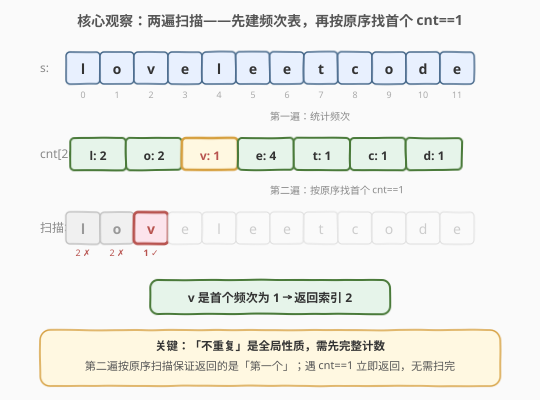
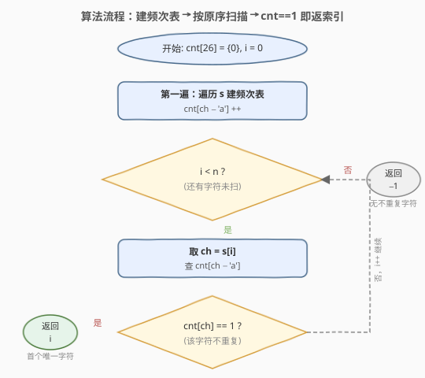
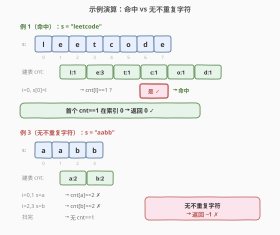

# LeetCode 字符串中的第一个唯一字符 题解

## 1. 题目概述

- **标题 / 题号**：字符串中的第一个唯一字符（#387，easy）
- **链接**：https://leetcode.cn/problems/first-unique-character-in-a-string/
- **难度**：简单
- **标签**：哈希表、字符串、计数

**题意**：给定一个字符串 `s`，找到它的**第一个不重复的字符**，并返回它的索引。如果不存在不重复的字符，返回 `-1`。

**示例 1**：

```text
输入：s = "leetcode"
输出：0
解释：'l' 在整串中只出现一次，且是最靠左的不重复字符。
```

**示例 2**：

```text
输入：s = "loveleetcode"
输出：2
解释：'v' 只出现一次，位于索引 2；它之前的 'l'、'o' 都重复出现，故 2 是答案。
```

**示例 3**：

```text
输入：s = "aabb"
输出：-1
解释：'a' 和 'b' 各出现两次，没有不重复字符。
```

**约束**：

- $1 \le \text{s.length} \le 10^5$
- `s` 仅由**小写英文字母**组成

> 💡 这道题是 [383. 赎金信](383_赎金信.md) 的「定位版」：383 用字符计数做**可行性判定**（能否拼出），387 用同一套计数骨架做**定位查询**（首个频次为 1 的位置）。二者共享「先建频次表」的第一步，区别只在第二步如何使用这张表——383 扣减判赤字，387 按原序查 `==1`。

## 2. 解题思路

### 2.1 暴力思路

对每个下标 `i`，扫描整个 `s` 检查 `s[i]` 是否在别处再次出现：若不重复则立即返回 `i`；若所有字符都重复则返回 `-1`。

```text
for i in 0..n-1:
    repeat = False
    for j in 0..n-1:
        if i != j and s[i] == s[j]: repeat = True; break
    if not repeat: return i
return -1
```

时间 $O(n^2)$，对 $10^5$ 量级约 $10^{10}$ 次比较，明显超时。

> ⚠️ 暴力法的根源问题：它在判断「`s[i]` 是否重复」时，每次都重新扫描全串。而「某个字符总共出现几次」是一个**全局属性**，只需预先统计一次，之后任意位置都可 $O(1)$ 查询。

### 2.2 核心观察：两遍扫描——先建频次表，再按原序找首个 `cnt==1`



把整个字符串视作字符的多重集。**「不重复」是全局性质**——某字符是否唯一取决于它在全串中的总出现次数，而非局部邻域。因此分两步：

1. **第一遍（建表）**：扫一次 `s`，建一张长度为 $26$ 的频次表 `cnt`，记录每种字母的总出现次数。
2. **第二遍（定位）**：**按原顺序**再扫一次 `s`，对每个字符查 `cnt`：第一个满足 `cnt == 1` 的位置即为答案；扫完仍未命中则返回 `-1`。

> 💡 **为什么第二遍必须「按原顺序扫 `s`」而不是遍历 `cnt` 表？** 因为我们要找的是「**第一个**」不重复字符，"第一个"是**位置序**概念，只有按 `s` 的下标顺序扫描才能保证命中的是最小下标。若遍历 `cnt` 表，得到的是「字母序」的频次，丢失了位置信息。

> ⚠️ **为什么不一遍扫描就判定？** 当遍历到某个字符时，你**还不知道它后面会不会再次出现**——后文可能藏着一个相同字符让它变成"重复"。所以单遍扫描无法当场判定唯一性，必须先获得全串的完整频次。这正是「两遍扫描」的根本原因。

### 2.3 算法流程图



两阶段流程：

1. **建表**：遍历 `s`，对每个字符 `ch` 执行 `cnt[ch - 'a'] += 1`。
2. **定位**：令 `i` 从 `0` 起，依次取 `ch = s[i]`：
   - 若 `cnt[ch - 'a'] == 1` → **立即返回 `i`**（首个不重复字符找到）；
   - 否则 `i++` 继续扫描。
3. 扫完 `s` 仍未命中 → 返回 `-1`。

> 💡 **提前退出**：第二遍一旦命中即返回，平均情况不必扫完；最坏情况（无不重复字符，或唯一字符在末尾）仍需 $O(n)$。

### 2.4 示例演算



**例 1（命中）**：`s = "leetcode"`

| 步骤 | 字符 | 动作 | 查 cnt | 状态 |
|------|------|------|--------|------|
| 建表 | — | 扫 s 统计 | l:1, e:3, t:1, c:1, o:1, d:1 | — |
| i=0 | l | cnt[l]==1? | 1 | ✓ 命中 → **返回 0** |

`l` 在 `s` 中仅出现一次（索引 0），尽管 `e` 出现 3 次、`t/c/o/d` 也各出现一次，但 `l` 是最靠左的，第二遍扫描第一步即命中，无需检查后续。

**例 2（无命中）**：`s = "aabb"`

| 步骤 | 字符 | 动作 | 查 cnt | 状态 |
|------|------|------|--------|------|
| 建表 | — | 扫 s 统计 | a:2, b:2 | — |
| i=0 | a | cnt[a]==1? | 2 | ✗ 重复 |
| i=1 | a | cnt[a]==1? | 2 | ✗ 重复 |
| i=2 | b | cnt[b]==1? | 2 | ✗ 重复 |
| i=3 | b | cnt[b]==1? | 2 | ✗ 重复 |
| 终判 | — | 扫完未命中 | — | → **返回 −1** |

每个字符都重复出现，第二遍全程 `cnt != 1`，扫完返回 `-1`。

## 3. 参考代码

### C++

```cpp
class Solution {
  public:
    int firstUniqChar(string s) {
        int cnt[26] = {0};
        for (char ch : s) {
            ++cnt[ch - 'a'];                 // 第一遍：建频次表
        }
        for (int i = 0; i < (int)s.size(); ++i) {
            if (cnt[s[i] - 'a'] == 1) {      // 第二遍：按原序找首个 cnt==1
                return i;
            }
        }
        return -1;
    }
};
```

### Python

```python
class Solution:
    def firstUniqChar(self, s: str) -> int:
        cnt = [0] * 26
        for ch in s:
            cnt[ord(ch) - ord('a')] += 1     # 第一遍：建频次表
        for i, ch in enumerate(s):
            if cnt[ord(ch) - ord('a')] == 1: # 第二遍：按原序找首个 cnt==1
                return i
        return -1
```

> 💡 Python 用 `collections.Counter` 更直观：`cnt = Counter(s)`，再 `for i, ch in enumerate(s): if cnt[ch] == 1: return i`。但手写数组版常数更小、空间确定 $O(26)$，且 `ch - 'a'` 的索引方式对纯小写字母场景最高效。注意 `Counter` 版以字符本身作键，无需减 `'a'`，但底层是哈希表，访问略慢于数组下标。

> ⚠️ **避免写成 `s.count(ch)` 的"一行流"**：`for i, ch in enumerate(s): if s.count(ch) == 1: return i` 虽然可读性好，但 `s.count` 本身是 $O(n)$，整体退化为 $O(n^2)$，在 $10^5$ 量级会超时。`Counter` 版本把计数降到 $O(1)$ 查询，是等价意图的正确写法。

## 4. 复杂度分析

| 维度 | 复杂度 | 说明 |
|------|--------|------|
| 时间 | $O(n)$ | 建表扫一次 $O(n)$，定位扫一次最坏 $O(n)$，合计 $O(n)$ |
| 空间 | $O(1)$ | 固定 $26$ 格计数数组，与输入规模无关 |
| 提前退出 | 平均更优 | 第二遍命中即返，无需扫完；最坏（无命中或唯一字符在末尾）仍 $O(n)$ |

> ⚠️ 若字符集不限定为 $26$ 个小写字母（如 Unicode），空间退化为 $O(|\Sigma|)$（实际用到的不同字符数），需用哈希表替代定长数组，时间仍 $O(n)$。

## 5. 扩展：第一遍同时记录「首次下标」，第二遍只扫字母表

上面的标准解法第二遍扫的是 `s`（长度 $n$）。若 $n$ 极大而字符集 $\Sigma$ 很小（如本题 $|\Sigma|=26$），可以让第二遍只扫字母表，把最坏 $O(n)$ 的第二步降到 $O(|\Sigma|)$：

```cpp
class Solution {
  public:
    int firstUniqChar(string s) {
        int cnt[26] = {0};
        int firstIdx[26];                       // 每种字母的首次下标
        for (int i = 0; i < 26; ++i) firstIdx[i] = -1;
        for (int i = 0; i < (int)s.size(); ++i) {
            int k = s[i] - 'a';
            ++cnt[k];
            if (firstIdx[k] == -1) firstIdx[k] = i;   // 只记第一次
        }
        int ans = INT_MAX;
        for (int k = 0; k < 26; ++k) {               // 第二遍只扫 26 格
            if (cnt[k] == 1) ans = min(ans, firstIdx[k]);
        }
        return ans == INT_MAX ? -1 : ans;
    }
};
```

| 解法 | 第一遍 | 第二遍 | 总时间 | 适用场景 |
|------|--------|--------|--------|----------|
| 标准（扫 `s` 两次） | $O(n)$ 建表 | $O(n)$ 定位（平均更优） | $O(n)$ | 通用，代码最简 |
| 记首次下标 | $O(n)$ 建表 + 记位置 | $O(\|\Sigma\|)$ 取最小下标 | $O(n)$ | $n \gg \|\Sigma\|$ 且第二步需削常数 |

> 💡 两种解法**渐近复杂度相同**（都是 $O(n)$ 时间、$O(|\Sigma|)$ 空间），区别仅在第二步常数：标准版第二步平均可提前退出、最坏 $O(n)$；记下标版第二步固定 $O(|\Sigma|)$，但需要额外维护 `firstIdx` 表、且不能提前退出（必须扫完 26 格取最小）。**面试默认写标准版**——代码更短、意图更清晰。

## 6. 面试要点

1. **为什么不能一遍扫描就判定？**

   「不重复」是**全局属性**：某字符是否唯一取决于它在整串中的总出现次数。当遍历到 `s[i]` 时，后文可能还藏着一个相同字符让它变成"重复"，因此无法当场判定。必须先获得全串完整频次，再回头按原序定位——这正是「两遍扫描」的根本原因。对照 [1. 两数之和](../0001-0100/1_两数之和.md) 的「边查边存」能一遍搞定，是因为两数之和利用了 `a+b=target` 的**对称性**（查到 `b` 时 `a` 已在表里即可），而本题的「唯一性」没有这种局部可判的对称结构。

2. **为什么第二遍扫 `s` 而不是扫 `cnt` 表？**

   题目要「**第一个**」不重复字符，"第一个"是**位置序**概念。扫 `cnt` 表得到的是按字母序排列的频次，丢失了位置信息，无法保证返回最小下标。按 `s` 的下标顺序扫描，命中的第一个 `cnt==1` 天然就是最小下标。若改扫字母表，必须额外记录每种字母的首次下标并在其中取最小（见第 5 节扩展）。

3. **`cnt` 数组为什么用 `ch - 'a'` 作下标，而不是直接用哈希表？**

   题目保证 `s` 仅含小写字母，字符集大小固定为 $26$，用定长数组 `int cnt[26]` 索引为 $O(1)$ 且无哈希开销，空间严格 $O(1)$、常数最小。若字符集是任意 Unicode，则改用 `unordered_map<char,int>` / `Counter`，空间退化为 $O(|\Sigma|)$，但时间仍 $O(n)$。选型原则：**字符集小且可枚举 → 数组；字符集大或不可枚举 → 哈希表**。

4. **如果所有字符都重复，算法走到哪里返回？**

   第二遍会完整扫完 `s`（每个 `cnt` 都 $\neq 1$，无一命中），循环结束后走到 `return -1`。这是**最坏情况**，时间 $O(n)$ 不可提前退出。一个常见优化是先建表时统计「频次为 1 的字符种类数」，若为 0 直接返回 `-1` 省去第二遍——但这只是常数优化，渐近不变。

5. **和 [383. 赎金信](383_赎金信.md) 的代码几乎一样，能复用吗？**

   骨架（建频次表 + 查表）完全可复用，差异只在**怎么用表**：383 第二遍是「扣减配额、判赤字」做可行性；387 第二遍是「查 `==1`、按原序定位」做查询。二者第一步 `cnt[ch-'a']++` 一字不差。这正是「计数模板」的力量——同一套建表骨架，换一个查询/判定逻辑就覆盖一类问题（383 赎金信、387 首个唯一字符、242 异位词、350 交集 II 都是同族）。

## 同类练习题

| # | 题目 | 与本题的关联 |
|---|------|-------------|
| 383 | [赎金信](https://leetcode.cn/problems/ransom-note/)（[题解](383_赎金信.md)） | 同为「字符计数」家族，第一步建表完全相同，第二步扣减判赤字做可行性——对比「查 `==1` 定位」与「扣减判赤字」 |
| 242 | [有效的字母异位词](https://leetcode.cn/problems/valid-anagram/) | 频次双向相等判定，计数模板的母题，共享 `cnt[ch-'a']++` 建表骨架 |
| 350 | [两个数组的交集 II](https://leetcode.cn/problems/intersection-of-two-arrays-ii/)（[题解](350_两个数组的交集II.md)） | 计数法求交集（取每种元素最小频次），同为「计数 + 抵消/查询」家族 |
| 1941 | [检查所有字符是否出现次数相同](https://leetcode.cn/problems/check-if-all-characters-have-equal-number-of-occurrences/) | 建频次表后判定所有非零频次是否相等，387 计数模板的判定变体 |
