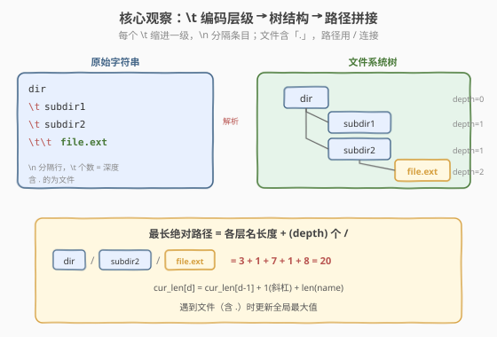
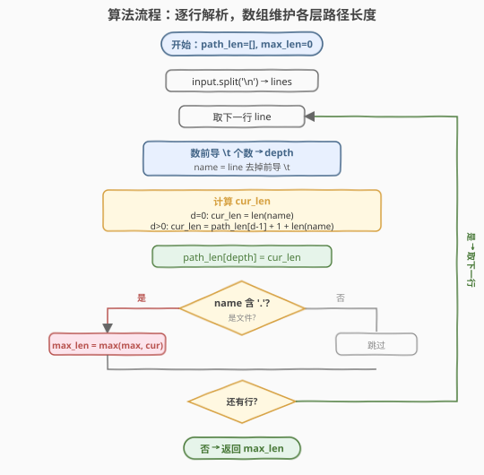
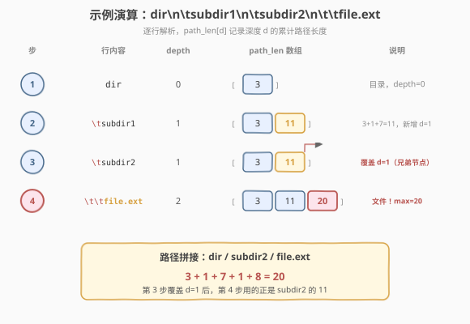

# 文件的最长绝对路径

- **题目名称**：文件的最长绝对路径
- **链接**：[388. 文件的最长绝对路径](https://leetcode.cn/problems/longest-absolute-file-path/)
- **难度**：中等
- **标签**：栈、深度优先搜索、字符串

## 1. 题目概述

给定一个字符串 `input` 表示一个文件系统中所有文件和目录的**层级结构**。其中：

- `\n` 分隔不同的文件/目录条目；
- `\t` 表示一级缩进，**前导 `\t` 的个数**代表该条目所在的深度（`0` 个 `\t` = 根层，`1` 个 `\t` = 第一层子目录，以此类推）；
- 名字中**含 `.`** 的条目是**文件**，不含 `.` 的是目录；
- 绝对路径用 `/` 连接各级名字，如 `dir/subdir2/file.ext`。

要求返回**最长文件绝对路径的长度**。若系统中没有文件，返回 `0`。

> 💡 **一个关键细节**：路径长度是**字符数**，`/` 也算一个字符。如 `"dir/subdir2/file.ext"` 的长度是 $3 + 1 + 7 + 1 + 8 = 20$（三个名字加两个 `/`）。

**示例 1**：

```text
输入：input = "dir\n\tsubdir1\n\tsubdir2\n\t\tfile.ext"

文件系统结构：
dir
    subdir1
    subdir2
        file.ext

输出：20
解释：最长路径为 "dir/subdir2/file.ext"，长度 = 3+1+7+1+8 = 20
```

**示例 2**：

```text
输入：input = "dir\n\tsubdir1\n\t\tfile1.ext\n\t\tsubsubdir1\n\tsubdir2\n\t\tsubsubdir2\n\t\t\tfile2.ext"

文件系统结构：
dir
    subdir1
        file1.ext
        subsubdir1
    subdir2
        subsubdir2
            file2.ext

输出：32
解释：最长路径为 "dir/subdir2/subsubdir2/file2.ext"，长度 = 3+1+7+1+10+1+9 = 32
```

**示例 3**：

```text
输入：input = "a"
输出：0
解释：没有文件，"a" 不含 "."，是目录而非文件
```

**约束条件**：

- $1 \leq \text{input.length} \leq 10^4$
- `input` 可能包含小写/大写英文字母、数字、`\n`、`\t`、`.`、空格等
- 输入保证是合法的文件系统表示

> 💡 本题的本质是**把字符串还原成树，再求从根到「文件叶节点」的最长路径**。`\t` 的个数编码了深度，每行就是树的一个节点。核心套路是**用一个数组 `path_len[d]` 维护深度 `d` 处的累计路径长度**——每遇到一个新行，根据其深度查询父层长度、加上 `/` 和当前名字长度即可。遇到文件时更新全局最大值。

---

## 2. 解题思路

### 2.1 暴力思路：先建树再 DFS

最直观的做法是把字符串**解析成一棵树**，每个节点存名字和子节点列表，然后 DFS 遍历所有「根到叶」路径，在文件叶节点处统计路径长度取最大。

```text
1. split('\n') 得到所有行
2. 逐行解析 depth 和 name，按 depth 构建树（栈维护当前父节点链）
3. DFS 遍历树，到达文件叶节点时计算路径长度，更新 max
```

问题：建树过程需要额外的节点对象和指针维护，空间开销 $O(n)$（$n$ 为条目数）；DFS 又需 $O(n)$ 遍历。逻辑虽正确，但**建树是多余的中间步骤**——我们只关心「根到当前节点的累计路径长度」，不必真正保存树结构。

> ⚠️ **为什么不优雅**：建树引入了不必要的中间表示。路径长度是**可增量计算的**——知道父层路径长度，加一个 `/` 和当前名字即可得到当前层。把所有节点存成树再遍历，是「先全建好再扫」，完全可以用「边解析边计算」的一遍扫描替代。

### 2.2 核心观察：\t 编码层级，数组维护累计路径长度



关键在于认清两件事：

**观察一：`\t` 个数 = 深度 = 树的层级**。每行的前导 `\t` 数量直接给出了该条目在树中的深度。`0` 个 `\t` 是根层，`1` 个 `\t` 是第一层子节点，`2` 个 `\t` 是第二层，依此类推。这和 Python/编辑器中用缩进表示代码块层级完全同构。

**观察二：路径长度可增量递推**。设 `path_len[d]` 表示深度 `d` 处当前条目的**从根到该条目的累计路径长度**（含各级 `/` 分隔符）。则：

$$\text{path\_len}[d] = \text{path\_len}[d-1] + \underbrace{1}_{\text{斜杠}} + \text{len}(\text{name})$$

深度 `0` 时无父层，`path_len[0] = len(name)`（无前导 `/`）。

> 💡 **为什么用一个数组就够了？** 文件系统的字符串表示本质是树的**前序遍历**（先父后子，兄弟按出现顺序排列）。当我们在深度 `d` 处遇到一个新条目时，它的父节点一定是**最近一次出现在深度 `d-1` 的条目**——这正是 `path_len[d-1]` 的当前值。即便之后深度回退到 `d-1` 处理兄弟节点，`path_len[d-1]` 会被新值覆盖，而那个新值正是下一个兄弟子树的正确父层长度。所以**覆盖式更新**天然正确，无需保留历史值。

### 2.3 算法流程图



**完整步骤**：

1. 将 `input` 按 `\n` 切分得到所有行。
2. 初始化 `path_len` 数组（或哈希表，键为深度）和 `max_len = 0`。
3. 逐行处理：
   - **数前导 `\t`** 得到深度 `depth`，剩余部分为名字 `name`。
   - **计算累计长度** `cur_len`：
     - `depth == 0`：`cur_len = len(name)`
     - `depth > 0`：`cur_len = path_len[depth - 1] + 1 + len(name)`
   - **存入数组**：`path_len[depth] = cur_len`（覆盖式更新）。
   - **判断是否为文件**：若 `name` 含 `.`，更新 `max_len = max(max_len, cur_len)`。
4. 遍历结束，返回 `max_len`。

> ⚠️ **两个易错点**：（1）`\t` 是**一个字符**（转义字符），不是两个字符 `\` 和 `t`，数前导 `\t` 时要按字符遍历而非按字符串搜索。（2）**只有文件（含 `.`）才更新 `max_len`**，目录不更新——题目问的是「文件的最长绝对路径」，纯目录路径不算。

### 2.4 示例演算

以 `input = "dir\n\tsubdir1\n\tsubdir2\n\t\tfile.ext"` 为例，逐步追踪 `path_len` 数组的演变：



| 步骤 | 行内容 | depth | name | cur_len 计算 | path_len | 文件? | max_len |
|------|--------|-------|------|-------------|----------|------|---------|
| 1 | `dir` | 0 | `dir` (3) | `3` | `[3]` | 否 | 0 |
| 2 | `\tsubdir1` | 1 | `subdir1` (7) | `3+1+7=11` | `[3, 11]` | 否 | 0 |
| 3 | `\tsubdir2` | 1 | `subdir2` (7) | `3+1+7=11` | `[3, 11]`（覆盖 d=1） | 否 | 0 |
| 4 | `\t\tfile.ext` | 2 | `file.ext` (8) | `11+1+8=20` | `[3, 11, 20]` | **是** | **20** |

最终结果：`20` ✅

> 💡 **关键看第 3 步**：`subdir2` 与 `subdir1` 同处深度 `1`，`path_len[1]` 被 `11` 覆盖（值恰好相同，但语义已切换为 `subdir2` 的路径）。第 4 步 `file.ext` 在深度 `2`，查询 `path_len[1]` 得到 `11`——正是其父节点 `subdir2` 的累计长度。**覆盖式更新**确保了子节点总能拿到正确的父层长度。

---

## 3. 参考代码

### 方法一：数组维护各层路径长度（推荐）

### C++

```cpp
class Solution {
  public:
    int lengthLongestPath(string input) {
        vector<int> path_len;          // path_len[d] = 深度 d 的累计路径长度
        int max_len = 0;
        int i = 0, n = input.size();
        while (i < n) {
            // 1. 数前导 \t 得到深度
            int depth = 0;
            while (i < n && input[i] == '\t') {
                depth++;
                i++;
            }
            // 2. 读名字直到 \n 或末尾，同时判断是否为文件
            int start = i;
            bool is_file = false;
            while (i < n && input[i] != '\n') {
                if (input[i] == '.') is_file = true;
                i++;
            }
            int name_len = i - start;
            if (i < n) i++;             // 跳过 \n

            // 3. 计算累计路径长度
            int cur_len;
            if (depth == 0) {
                cur_len = name_len;
            } else {
                cur_len = path_len[depth - 1] + 1 + name_len;
            }

            // 4. 覆盖式存入数组
            if (depth >= (int)path_len.size()) {
                path_len.push_back(cur_len);
            } else {
                path_len[depth] = cur_len;
            }

            // 5. 文件才更新答案
            if (is_file) {
                max_len = max(max_len, cur_len);
            }
        }
        return max_len;
    }
};
```

### Python

```python
class Solution:
    def lengthLongestPath(self, input: str) -> int:
        path_len = {}                   # depth -> 累计路径长度
        max_len = 0
        for line in input.split('\n'):
            name = line.lstrip('\t')    # 去掉前导 \t 得到名字
            depth = len(line) - len(name)  # 前导 \t 的个数 = 深度
            if depth == 0:
                cur_len = len(name)
            else:
                cur_len = path_len[depth - 1] + 1 + len(name)
            path_len[depth] = cur_len
            if '.' in name:
                max_len = max(max_len, cur_len)
        return max_len
```

> 💡 **Python 的 `lstrip('\t')` 技巧**：`line.lstrip('\t')` 去掉所有前导 `\t`，`len(line) - len(name)` 恰好等于前导 `\t` 的个数（深度）。这比手动数 `\t` 更简洁。注意 `lstrip('\t')` 的参数是**字符集合**（去掉所有前导 `\t` 字符），不是前缀字符串——但这里效果一致，因为前导字符都是 `\t`。

> ⚠️ **C++ 版用 `vector` 还是 `unordered_map`？** 上面 C++ 用 `vector` 按 `depth` 索引，因为深度是连续整数且从 `0` 开始递增，`vector` 的随机访问比 `unordered_map` 更快。Python 用 `dict` 是因为 Python 的 `list` 在深度回退时需要手动截断，而 `dict` 的覆盖式更新天然正确。两者逻辑等价，选顺手即可。

### 方法二：用栈模拟（等价思路）

栈的版本与数组版本质相同——栈中元素就是从根到当前节点路径上各层的名字长度。深度回退时弹栈到对应深度，深度增加时压栈。

### Python

```python
class Solution:
    def lengthLongestPath(self, input: str) -> int:
        stack = []          # 栈存各层名字长度（不含 /）
        max_len = 0
        for line in input.split('\n'):
            name = line.lstrip('\t')
            depth = len(line) - len(name)
            # 弹栈到当前深度（栈大小 = depth）
            while len(stack) > depth:
                stack.pop()
            stack.append(len(name))
            if '.' in name:
                # 路径长度 = 各层名字之和 + (depth 个 /)
                cur_len = sum(stack) + len(stack) - 1
                max_len = max(max_len, cur_len)
        return max_len
```

> ⚠️ 栈版每次遇到文件都要 `sum(stack)`，最坏 $O(\text{depth}^2)$。可优化为栈中存累计长度（即存 `path_len[d]` 而非 `len(name)`），退化为方法一。面试中推荐直接写方法一，栈版仅用于讲解「树的前序遍历」直觉。

---

## 4. 复杂度分析

| 维度 | 复杂度 | 说明 |
|------|--------|------|
| **时间复杂度** | $O(n)$ | $n$ 为输入字符串长度。按 `\n` 切分后逐行处理，每行的前导 `\t` 计数和名字读取都是线性扫描，总扫描字符数 $\leq n$ |
| **空间复杂度** | $O(\text{depth})$ | `path_len` 数组/字典的大小等于最大深度。深度受 `\t` 个数限制，最坏 $O(n)$（全是 `\t` 前导），实际远小于 $n$ |

> 💡 **为什么空间是 $O(\text{depth})$ 而非 $O(n)$？** `path_len` 只存每层**一个**值（当前最新条目的累计长度），不是每个条目存一个。深度 = 最大嵌套层数，通常远小于条目总数。极端情况如 `"\t\t\t...\tfile.ext"`（全是缩进），深度可达 $O(n)$，但这是退化输入。

---

## 5. 扩展：从字符串还原树结构的通用范式

### 5.1 缩进编码树的一般模型

本题的 `\t` 编码层级是一种通用的**「缩进式树序列化」**——用缩进量表示深度、用换行分隔节点。这种编码出现在许多场景：

- **源代码的缩进**（Python、YAML）：缩进量决定代码块的嵌套层级
- **文件系统的 `tree` 命令输出**：用 `├──`、`└──` 和空格表示目录树
- **Markdown 的嵌套列表**：每多一层缩进就是多一层嵌套

通用解法都是：**逐行扫描，用栈/数组维护「当前从根到所在层」的路径**，深度回退时弹出栈顶。本题的 `path_len` 数组就是这个通用模式的体现。

### 5.2 路径长度 vs 路径字符串

本题只要求返回路径**长度**，所以只需维护长度数组。若要求返回**最长路径字符串本身**，则把 `path_len` 换成 `path_str`（存各层名字字符串），文件处拼接 `"/".join(path_str[:depth+1])` 即可。核心逻辑不变，只是把「累加长度」换成「拼接字符串」。

```python
# 返回路径字符串的变体
path_names = {}   # depth -> name
best = ""
for line in input.split('\n'):
    name = line.lstrip('\t')
    depth = len(line) - len(name)
    path_names[depth] = name
    if '.' in name:
        full = "/".join(path_names[d] for d in range(depth + 1))
        if len(full) > len(best):
            best = full
return best
```

---

## 6. 面试要点

1. **为什么用一个数组 `path_len[d]` 覆盖式更新就够？**

   - 文件系统的字符串表示是树的**前序遍历**：父节点在子节点之前出现，兄弟节点按顺序排列。当我们在深度 `d` 遇到新条目时，其父节点一定是**最近一次出现在深度 `d-1` 的条目**——也就是 `path_len[d-1]` 的当前值。即使后续深度回退处理兄弟节点、`path_len[d-1]` 被覆盖，新值也是下一个兄弟子树的正确父层。所以覆盖式更新天然保证 `path_len[d-1]` 始终指向当前节点的正确父层。

2. **`\t` 是一个字符还是两个字符？**

   - **一个字符**。`\t` 是转义字符（Tab，ASCII 9），不是反斜杠加 `t` 两个字符。C++ 中 `input[i] == '\t'` 是单字符比较；Python 中 `line.lstrip('\t')` 去掉前导 Tab 字符。混淆这点会导致深度计算错误。同理 `\n` 也是一个字符（换行，ASCII 10）。

3. **为什么只有文件（含 `.`）才更新 `max_len`？**

   - 题目问的是「文件的最长绝对路径」。目录本身不是合法的输出——如示例 3 中 `"a"` 是目录（不含 `.`），返回 `0`。判断文件的标准是名字中含 `.`（即有扩展名）。注意题目没有说 `.` 必须在末尾，所以用 `'.' in name` 而非 `name.endswith('.ext')` 更通用。

4. **深度回退时数组里残留的旧值会不会影响正确性？**

   - 不会。残留值是**更深层**的旧值（如从深度 3 回退到深度 1 时，`path_len[2]` 和 `path_len[3]` 残留）。但后续只有在深度 $\geq 2$ 时才会读 `path_len[1]` 之上的值，而要到深度 2 必须先经过深度 1 的某个新条目（覆盖 `path_len[1]`），再到深度 2 时又会覆盖 `path_len[2]`——所以**残留值在被读取前一定已被覆盖**。这是前序遍历的有序性保证的。

5. **栈版和数组版有什么区别？**

   - 逻辑等价。栈版存「各层名字长度」，遇到文件时 `sum(stack) + len(stack) - 1`（名字长度之和加 `depth` 个 `/`）；数组版直接存累计长度，$O(1)$ 查询。栈版的优势是直观展示「当前路径栈」的语义；数组版的优势是查询和更新都是 $O(1)$，无需 `sum`。面试推荐数组版，顺便讲清「栈版是其等价物」体现理解深度。

> 💡 **一句话总结**：本题是「缩进编码树 + 增量路径计算」的招牌题。`\t` 个数 = 深度，`path_len[d] = path_len[d-1] + 1 + len(name)`，文件处更新答案。核心思想是用一个数组维护从根到当前层的累计路径长度，覆盖式更新天然适配前序遍历的有序性。掌握这个「缩进还原树」的范式，所有层级字符串解析题都能一通百通。

---

## 7. 同类练习题

- [71. 简化路径](https://leetcode.cn/problems/simplify-path/)（[题解](../0001-0100/71_简化路径.md)）：用栈处理路径分隔与回退，同属「栈维护层级路径」套路
- [394. 字符串解码](https://leetcode.cn/problems/decode-string/)（[题解](../0301-0400/394_字符串解码.md)）：双栈处理嵌套结构，对比「括号嵌套」与「缩进嵌套」的栈式解法异同
- [385. 迷你语法分析器](https://leetcode.cn/problems/mini-parser/)（[题解](../0301-0400/385_迷你语法分析器.md)）：用栈将扁平的序列化字符串还原成嵌套列表，同属「字符串还原嵌套结构」范式
- [429. N 叉树的层序遍历](https://leetcode.cn/problems/n-ary-tree-level-order-traversal/)：树的层级遍历，对比「显式树结构遍历」与本题「隐式缩进编码遍历」
- [1325. 删除给定值的叶子节点](https://leetcode.cn/problems/delete-leaves-with-a-given-value/)：树操作中「叶节点」概念的延伸，对比本题「文件 = 叶节点」的判定逻辑
