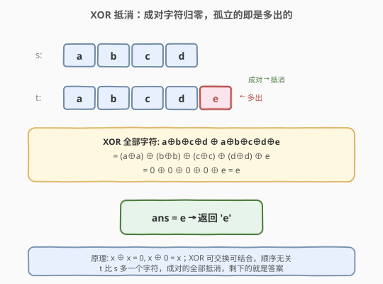
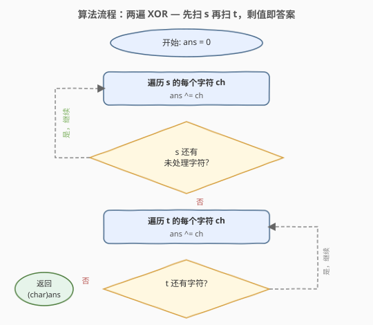
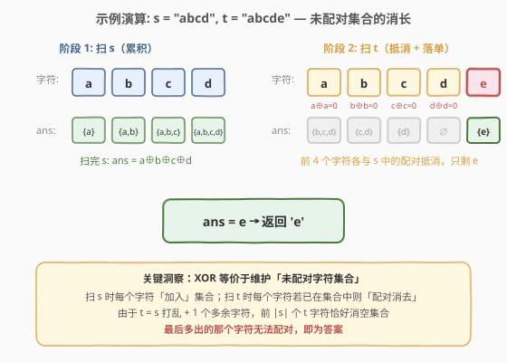

# LeetCode 找不同 题解

## 1. 题目概述

- **标题 / 题号**：找不同（#389，easy）
- **链接**：https://leetcode.cn/problems/find-the-difference/
- **难度**：简单
- **标签**：位运算、哈希表、字符串

**题意**：给你两个字符串 `s` 和 `t`。`t` 是由 `s` 打乱顺序后，在某个随机位置**额外添加一个字母**得到的。请找出 `t` 中那个被多加的字母。

**示例 1**：

```text
输入：s = "abcd", t = "abcde"
输出："e"
解释：t 是 s 打乱后加了 'e'。
```

**示例 2**：

```text
输入：s = "", t = "y"
输出："y"
```

**约束**：

- $0 \le \text{s.length} \le 1000$
- $\text{t.length} = \text{s.length} + 1$
- `s` 和 `t` 仅由**小写英文字母**组成

> 💡 这道题是 [136. 只出现一次的数字](https://leetcode.cn/problems/single-number/) 的字符串版：所有字符都出现**两次**（`s` 和 `t` 各一次），唯独多出的那个出现**奇数次**——用 XOR 一遍抵消即可定位。它也与 [268. 丢失的数字](../0201-0300/268_丢失的数字.md) 同源：后者是「0..n 缺一个」，用 XOR 或求和差均可。

## 2. 解题思路

### 2.1 暴力思路：哈希计数

最直观的做法是复用 [383. 赎金信](383_赎金信.md) / [242. 有效的字母异位词](../0201-0300/242_有效的字母异位词.md) 的计数模板：

1. 建 $26$ 格频次表，先扫 `s` 统计每种字母数量；
2. 再扫 `t`，每遇到一个字符就 `cnt[ch]--`；
3. 某格 `cnt[ch]` 在扣减后变成 **$-1$**，说明该字母在 `t` 中比 `s` 多一个——即为答案。

时间 $O(|s| + |t|) = O(n)$，空间 $O(26) = O(1)$。逻辑正确、易于理解，但多用了一张 $26$ 格的表。

> ⚠️ 计数法虽 $O(1)$ 空间（固定 26 格），但本质上把「多出一个」的信息存进了外部表。若能**不借助任何额外结构**、让数据自身抵消出答案，则更优雅——这就是 XOR 的切入点。

### 2.2 核心观察：XOR 抵消——成对归零，孤立即答案



关键性质：`t` 的每个字符要么在 `s` 中有**恰好一个**对应（成对），要么是那个**多出来的**（孤立）。而异或运算有两条黄金律：

- **自反律**：$x \oplus x = 0$（相同归零）
- **恒等律**：$x \oplus 0 = x$（零可忽略）

且异或**可交换、可结合**——顺序无关。因此把 `s` 和 `t` 的**所有字符**连续 XOR：

$$
\text{ans} = \bigoplus_{c \in s} c \;\oplus\; \bigoplus_{c \in t} c
$$

成对的字符两两抵消为 $0$，最后只剩下那个**多出的字符**与 $0$ 异或——结果就是它本身。

> 💡 **核心转化**：「找多出的字符」$\iff$「在所有字符中找出出现奇数次的那一个」。这与 [136. 只出现一次的数字](https://leetcode.cn/problems/single-number/) 完全同构——那里是「其他数出现两次、唯一个出现一次」，XOR 全部即得答案。

### 2.3 算法流程图



两遍扫描，简洁明了：

1. **初始化**：`ans = 0`（`int` 型，暂存 XOR 累积值）。
2. **第一遍**：遍历 `s` 的每个字符 `ch`，执行 `ans ^= ch`。
3. **第二遍**：遍历 `t` 的每个字符 `ch`，执行 `ans ^= ch`。
4. **返回**：`(char)ans`——累积值就是多出字符的 ASCII 码，转回 `char` 即终。

> 💡 **为什么用 `int` 暂存而非 `char`？** 字符 XOR 的结果仍是整数（ASCII 码），`char` 类型在部分语言中做位运算会隐式转 `int`。用 `int` 累积、最后再 `(char)` 转回，语义清晰、避免中间溢出歧义。C++ 中 `char` 也可直接 XOR，但显式 `int` 更安全。

### 2.4 示例演算



以 `s = "abcd"`、`t = "abcde"` 为例，`ans` 的演化等价于维护一个**未配对字符集合**：

**阶段 1（扫 `s`，累积）**：

| 字符 | 动作 | ans（未配对集合） |
|------|------|-------------------|
| a | `ans ^= 'a'` | $\{a\}$ |
| b | `ans ^= 'b'` | $\{a, b\}$ |
| c | `ans ^= 'c'` | $\{a, b, c\}$ |
| d | `ans ^= 'd'` | $\{a, b, c, d\}$ |

扫完 `s`：$\text{ans} = a \oplus b \oplus c \oplus d$。

**阶段 2（扫 `t`，抵消）**：

| 字符 | 动作 | 效果 | ans |
|------|------|------|-----|
| a | `ans ^= 'a'` | $a \oplus a = 0$，消去 | $\{b, c, d\}$ |
| b | `ans ^= 'b'` | $b \oplus b = 0$，消去 | $\{c, d\}$ |
| c | `ans ^= 'c'` | $c \oplus c = 0$，消去 | $\{d\}$ |
| d | `ans ^= 'd'` | $d \oplus d = 0$，消去 | $\emptyset$ |
| **e** | `ans ^= 'e'` | $0 \oplus e = e$，**孤立** | $\{e\}$ ← 答案 |

前 $4$ 个 `t` 字符恰好各与 `s` 中的对应字符配对消空，最后多出的 `'e'` 无法配对，即为返回值。

## 3. 参考代码

### C++

```cpp
class Solution {
  public:
    char findTheDifference(string s, string t) {
        int ans = 0;
        for (char ch : s) {
            ans ^= ch;
        }
        for (char ch : t) {
            ans ^= ch;
        }
        return (char)ans;
    }
};
```

### Python

```python
class Solution:
    def findTheDifference(self, s: str, t: str) -> str:
        ans = 0
        for ch in s:
            ans ^= ord(ch)
        for ch in t:
            ans ^= ord(ch)
        return chr(ans)
```

> 💡 Python 中 `ch` 是长度为 1 的字符串，不能直接做位运算，需 `ord(ch)` 取码值、最后 `chr(ans)` 转回。也可用 `functools.reduce(operator.xor, map(ord, s + t))` 一行解决，但可读性不如两遍循环。注意 `s + t` 拼接会创建新串，空间 $O(n)$，不如两遍遍历原地 $O(1)$。

## 4. 复杂度分析

| 维度 | XOR 法 | 计数法 | 排序法 |
|------|--------|--------|--------|
| **时间** | $O(n)$ | $O(n)$ | $O(n \log n)$ |
| **空间** | $O(1)$ | $O(1)$（26 格） | $O(\log n)$（排序栈） |
| **额外结构** | 无 | 26 格数组 | 无（原地排序） |
| **常数** | 最小（仅 XOR） | 稍大（建表 + 扣减） | 最大（排序） |

> ⚠️ $n = |s| + |t| = 2|s| + 1$。XOR 法每字符一次异或，总 $2|s|+1$ 次运算，无分支、无随机访问，CPU 流水线友好，常数因子最小。计数法需额外 $26$ 次初始化与最多 $26$ 次终扫（本题提前退出无需），常数略大但仍 $O(n)$。

## 5. 扩展：其他解法

### 5.1 哈希计数法

复用 [383. 赎金信](383_赎金信.md) 的计数模板，扣减时找赤字：

```cpp
char findTheDifference(string s, string t) {
    int cnt[26] = {0};
    for (char ch : s) ++cnt[ch - 'a'];
    for (char ch : t) {
        if (--cnt[ch - 'a'] < 0) {
            return ch;
        }
    }
    return ' ';
}
```

> 💡 逻辑与 383 完全同构——383 判「是否赤字」（布尔），本题「定位赤字的字符」（返回值）。`--cnt < 0` 命中即返，无需扫完。

### 5.2 求和差法

字符本质是 ASCII 码。`t` 所有字符的码值之和减去 `s` 的，差值就是多出字符的码值：

```cpp
char findTheDifference(string s, string t) {
    int sum = 0;
    for (char ch : t) sum += ch;
    for (char ch : s) sum -= ch;
    return (char)sum;
}
```

> 💡 与 [268. 丢失的数字](../0201-0300/268_丢失的数字.md) 的求和法同源：268 用 $\sum_{0}^{n} - \sum_{\text{nums}}$ 找缺数，本题用 $\sum_{t} - \sum_{s}$ 找多数。时间 $O(n)$、空间 $O(1)$，常数与 XOR 法接近。⚠️ 若字符串极长，`sum` 可能溢出 `int`（$1000 \times 122 < 2^{20}$，本题安全；但字符集更大时需注意），而 XOR 法无溢出风险——这是 XOR 相比求和的一个优势。

### 5.3 三种解法对比

| 解法 | 核心思想 | 时间 | 空间 | 优势 | 风险 |
|------|---------|------|------|------|------|
| **XOR** | 成对抵消，孤立即答案 | $O(n)$ | $O(1)$ | 无溢出、常数最小 | 可读性稍低 |
| 计数 | 频次扣减，赤字即答案 | $O(n)$ | $O(1)$ | 直观、易扩展 | 需 26 格表 |
| 求和差 | 码值之差即多出字符 | $O(n)$ | $O(1)$ | 最直观 | 大规模溢出风险 |

面试首推 **XOR 法**：一行核心逻辑 `ans ^= ch` 重复两遍，体现「数据自身抵消」的优雅思想，且与 [136](https://leetcode.cn/problems/single-number/)、[268](../0201-0300/268_丢失的数字.md) 构成 XOR 三题组。

## 6. 面试要点

1. **为什么 XOR 能找到多出的字符？**

   异或满足自反律 $x \oplus x = 0$ 和恒等律 $x \oplus 0 = x$，且可交换可结合。`t` 的每个字符要么在 `s` 中有对应（成对，XOR 归零），要么是多出的（孤立，保留）。把 `s` 和 `t` 所有字符连起来 XOR，成对的全部抵消，最后只剩多出的那个。

2. **XOR 法和 [136. 只出现一次的数字](https://leetcode.cn/problems/single-number/) 有什么关系？**

   完全同构。136 是「其他数出现两次、唯一个出现一次」，XOR 全部即得答案。本题是「其他字符出现两次（`s` 和 `t` 各一次）、多出的出现三次（`s` 一次 + `t` 一次 + 额外一次）」——不对，更准确地说：多出的字符只在 `t` 出现一次（`s` 中没有），其余字符在 `s`、`t` 各出现一次。所以「所有字符」中，多出的出现奇数次（1 次），其余出现偶数次（2 次），XOR 全部即得。

3. **求和差法和 XOR 法各有什么优劣？**

   两者时间空间都是 $O(n)$ / $O(1)$。求和差更直观（码值之差 = 多出字符码值），但**大规模有溢出风险**——若字符集更大或字符串更长，`sum` 可能超出 `int` 范围。XOR 法**无溢出**（异或结果不超过字符码值范围），且常数更小（无需加减进位）。面试中先讲求和差（易理解），再引出 XOR（更优雅无溢出），体现递进思考。

4. **为什么不用排序？**

   排序后逐位比较也能找到不同字符，时间 $O(n \log n)$、空间 $O(\log n)$（排序栈），**劣于** XOR / 计数 / 求和的 $O(n)$ / $O(1)$。仅当输入已有序（本题不保证）时才有意义。可作为暴力起点提及，但非最优。

5. **如果字符集是 Unicode 怎么办？**

   XOR 法和求和差法**完全不受影响**——它们不依赖字符集大小，只对码值做位/算术运算。计数法则需把定长 `int[26]` 换成哈希表，空间变为 $O(|\Sigma|)$。这正是 XOR / 求和相对于计数的另一优势：**字符集无关**。

> 💡 **一句话总结**：`t = s` 打乱 + 1 字符 $\Rightarrow$ 所有字符中唯多出者出现奇数次 $\Rightarrow$ XOR 全部即得。核心就一行 `ans ^= ch`，与 [136](https://leetcode.cn/problems/single-number/) 同构、与 [268](../0201-0300/268_丢失的数字.md) 同源（亦可求和差），构成「找落单/找缺数」的 XOR 三题组。

## 同类练习题

| # | 题目 | 与本题的关联 |
|---|------|-------------|
| 136 | [只出现一次的数字](https://leetcode.cn/problems/single-number/) | XOR 找出出现一次的数（其余出现两次），本题的「数版」母题，完全同构 |
| 268 | [丢失的数字](https://leetcode.cn/problems/missing-number/)（[题解](../0201-0300/268_丢失的数字.md)） | 0..n 缺一个，XOR 或求和差均可，与本题求和差法同源 |
| 383 | [赎金信](https://leetcode.cn/problems/ransom-note/)（[题解](383_赎金信.md)） | 哈希计数扣减判赤字，本题计数法直接复用其模板 |
| 242 | [有效的字母异位词](https://leetcode.cn/problems/valid-anagram/)（[题解](../0201-0300/242_有效的字母异位词.md)） | 频次双向相等的计数判定，计数模板的「全零校验」对照本题「赤字定位」 |
