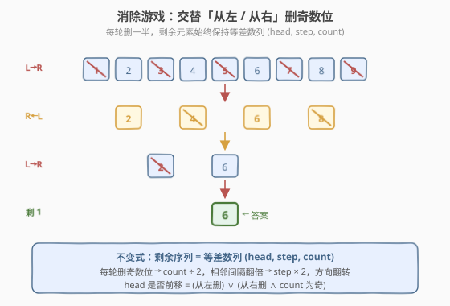
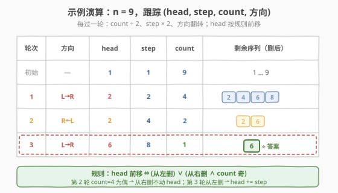
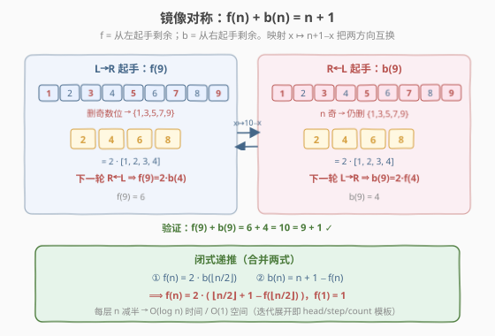

# LeetCode 消除游戏 题解

## 1. 题目概述

- **标题 / 题号**：消除游戏（#390，medium）
- **链接**：https://leetcode.cn/problems/elimination-game/
- **难度**：中等
- **标签**：数学、递归、模拟

**题意**：给定一个整数 `n`，列出 `arr = [1, 2, 3, ..., n]`（升序）。从 `arr` 左端开始，反复执行以下消除过程，直到只剩一个元素：

1. 第一轮：**从左到右**，每隔一个删一个（删第 1、3、5… 个）。
2. 第二轮：**从右到左**，每隔一个删一个（删倒数第 1、3、5… 个）。
3. 第三轮：再从左到右……如此**交替**，直到只剩一个数。

返回最后剩下的那个数。

**示例 1**：

```text
输入：n = 9
输出：6
解释：
  arr = [1, 2, 3, 4, 5, 6, 7, 8, 9]
  第 1 轮（L→R）：[2, 4, 6, 8]
  第 2 轮（R←L）：[2, 6]
  第 3 轮（L→R）：[6]
  → 答案 6。
```

**示例 2**：

```text
输入：n = 1
输出：1
```

**约束**：

- `1 <= n <= 10^9`

> 💡 这是一道**数学/递归**题。`n` 可达 $10^9$，任何"真去删元素"的模拟（数组、链表）都会爆时间爆内存。关键是发现一个**不变式**：每轮消除后，剩余元素始终构成一个**等差数列**，只需跟踪 `(首项 head, 公差 step, 个数 count, 方向)` 四个状态量，每轮 $O(1)$ 更新即可，总复杂度 $O(\log n)$。

## 2. 解题思路

### 2.1 暴力思路：真去删元素

最直觉的做法：用一个数组/双向链表存 `arr`，按方向交替地"隔一个删一个"，直到长度为 1。

```text
arr = [1..n]
left = True
while len(arr) > 1:
    if left:
        del arr[0::2]          # 删下标 0,2,4,...（第 1,3,5,... 个）
    else:
        del arr[-1::-2]        # 从右删下标 -1,-3,-5,...
    left = not left
return arr[0]
```

时间复杂度：每轮删一半，共 $O(\log n)$ 轮，每轮遍历当前长度，总和 $\sum_{k} n/2^k = O(n)$；空间 $O(n)$。当 $n = 10^9$ 时内存直接爆炸，时间也远超限制。

> ⚠️ 暴力法的瓶颈在于"逐个删元素"。换视角：**不必关心谁被删，只问剩余序列的整体形态**——一轮删奇数位后，剩下的元素之间间隔翻倍，整体仍是一个等差数列。

### 2.2 核心观察：剩余序列恒为等差数列 (head, step, count)



**关键一步**：初始 `arr = [1, 2, …, n]` 是一个公差为 1 的等差数列，记为 `(head=1, step=1, count=n)`。每次"隔一个删一个"无论从左还是从右，都会让**相邻存活元素的间隔翻倍**：

- 初始间隔 1（`1,2,3,…`）；
- 一轮后存活的是 `2,4,6,…`，间隔变成 2；
- 再一轮后存活的是 `2,6,10,…`（或 `4,8,…`，视方向），间隔变成 4；
- ……

所以**整个消除过程里，剩余序列永远是一个等差数列**，只需维护 `(head, step, count, 方向)` 四个量，不必存数组本身。

每轮的状态转移：

| 量 | 更新规则 |
|------|----------|
| `count` | `count ← ⌊count / 2⌋`（删一半，向下取整） |
| `step` | `step ← step × 2`（间隔翻倍） |
| `方向` | 翻转 |
| `head` | **当首项被删时**才前移 `head ← head + step`（见下） |

**`head` 前移的判定**（本题唯一的细节）：

- **从左删（L→R）**：首项永远排在第 1 个（奇数位），必被删 → `head` 一定前移。
- **从右删（R←L）**：首项排在**倒数第 `count` 个**。它被删 $\iff$ `count` 为奇数（倒数第奇数位才被删）→ 仅当 `count` 为奇时 `head` 前移。

合并为一句：

$$\text{head 前移} \iff \text{(从左删)} \;\lor\; \text{(从右删} \land \text{count 为奇)}$$

> 💡 **直觉记忆**：从左删永远吃掉队首；从右删只有当队列"对齐"使得队首也落在奇数位时（即 `count` 奇）才会吃到队首。这是面试中最容易讲错的点，务必举 `count=4`（不动）和 `count=5`（前移）两个例子佐证。

当 `count == 1` 时，`head` 即为答案。

### 2.3 算法流程图



迭代流程：

1. 初始化 `head=1, step=1, count=n, left=true`。
2. 当 `count > 1`：
   - 若 `left` 为真 **或** `count` 为奇 → `head += step`。
   - `step *= 2`；`count //= 2`；`left = !left`。
3. 返回 `head`。

以 `n = 9` 为例跟踪四元组（详见上图）：

| 轮次 | 方向 | head | step | count | 剩余序列 |
|------|------|------|------|-------|----------|
| 初始 | —    | 1    | 1    | 9     | 1…9 |
| 1    | L→R  | **2**| 2    | 4     | 2,4,6,8 |
| 2    | R←L  | 2    | 4    | 2     | 2,6（count=4 偶，head 不动）|
| 3    | L→R  | **6**| 8    | 1     | **6** ⭐ |

第 2 轮 `count=4` 为偶、从右删 → 首项 `2` 落在倒数第 4 位（偶数位）幸存，`head` 不动；第 3 轮从左删 → 首项必被删，`head += step` 即 `2 + 4 = 6`。验证示例 ✓。

### 2.4 示例演算：镜像对称与闭式递推



上面的迭代模板本质是"展开"一个**递归闭式**。定义：

- $f(n)$：从 **L→R 起手**、`n` 个元素最终剩下的数（即本题答案）。
- $b(n)$：从 **R←L 起手**、`n` 个元素最终剩下的数。

**观察 1（L→R 半减）**：L→R 一轮后，存活的是 `2, 4, 6, …, 2⌊n/2⌋ = 2·[1..⌊n/2⌋]`，下一轮变成 R←L。整体放大 2 倍，所以：

$$f(n) = 2 \cdot b(\lfloor n/2 \rfloor)$$

**观察 2（镜像对称）**：映射 $x \mapsto n+1-x$ 是 `[1..n]` 上的反序对合，它把"第 1 个"与"倒数第 1 个"互换，于是把 L→R 与 R←L 两种起手互换，剩余数也被镜像。因此：

$$f(n) + b(n) = n + 1 \quad\Longrightarrow\quad b(n) = n + 1 - f(n)$$

**合并两式**即得只用 $f$ 自身的递推：

$$\boxed{\,f(n) = 2 \cdot \big(\lfloor n/2 \rfloor + 1 - f(\lfloor n/2 \rfloor)\big), \quad f(1) = 1\,}$$

以 `n = 9` 验证：$f(9) = 2(4+1 - f(4))$；$f(4) = 2(2+1 - f(2))$；$f(2) = 2(1+1 - f(1)) = 2$；故 $f(4) = 2(3-2) = 2$，$f(9) = 2(5-2) = 6$ ✓。

> 💡 **迭代模板 = 递归闭式的尾递归展开**：递归版本思路最清晰（直接套公式），迭代版本省去递归栈、空间 $O(1)$。面试中可以先讲递归版说清思路，再化为迭代版优化空间。

## 3. 参考代码

### C++（迭代：head/step/count 四元组）

```cpp
class Solution {
  public:
    int lastRemaining(int n) {
        int head = 1, step = 1, count = n;
        bool left = true;
        while (count > 1) {
            // 从左删必动 head；从右删仅当 count 为奇才动 head
            if (left || (count & 1)) {
                head += step;
            }
            step *= 2;
            count /= 2;
            left = !left;
        }
        return head;
    }
};
```

### Python（迭代）

```python
class Solution:
    def lastRemaining(self, n: int) -> int:
        head, step, count = 1, 1, n
        left = True
        while count > 1:
            if left or count % 2 == 1:
                head += step
            step *= 2
            count //= 2
            left = not left
        return head
```

### Python（闭式递推，思路最直观）

```python
class Solution:
    def lastRemaining(self, n: int) -> int:
        if n == 1:
            return 1
        # f(n) = 2 * (n//2 + 1 - f(n//2))
        return 2 * (n // 2 + 1 - self.lastRemaining(n // 2))
```

> ⚠️ 递归版在 `n = 10^9` 时递归深度约 $\log_2 10^9 \approx 30$，完全安全。若语言递归开销大（如 C++），用迭代版更稳。注意 `n//2` 在 Python 是整除，C++ 中 `int` 除法自动截断，等价于 $\lfloor n/2 \rfloor$。

## 4. 复杂度分析

| 维度 | 复杂度 | 说明 |
|------|--------|------|
| 时间复杂度 | $O(\log n)$ | 每轮 `count` 减半，迭代约 $\log_2 n$ 轮；每轮 $O(1)$ |
| 空间复杂度 | $O(1)$ | 迭代版仅 4 个变量；递归版 $O(\log n)$ 栈空间 |

> 💡 相比暴力的 $O(n)$ 时间 + $O(n)$ 空间，不变式归约让 `n = 10^9` 也只需约 30 轮——这正是"先想清楚再写代码"的价值，与 [319. 灯泡开关](../0301-0400/319_灯泡开关.md) 把 $O(n\log n)$ 模拟归约到 $O(1)$ 公式同属一类"降维打击"。

## 5. 扩展：闭式递推的代数化证明

把递推 $f(n) = 2(\lfloor n/2 \rfloor + 1 - f(\lfloor n/2 \rfloor))$ 与 $f(1)=1$ 展开，可发现 $f$ 的二进制结构。记 $n$ 的二进制表示，逐步除 2（右移）每层的 $+1$ 与符号翻转叠加，最终 $f(n)$ 可写成 $n$ 的二进制位的某种重排——具体地，**$f(n)$ 等于把 $n$ 的二进制最高位挪到最低位**（循环左移一位的镜像）。例如：

- $n = 9 = (1001)_2$，最高位挪到最低 → $(0011)_2 = 3$？这里需注意公式给的是 $f(9)=6=(0110)_2$。

更准确的表述：设 $n$ 的二进制为 $1 b_{k-1} \dots b_1 b_0$（共 $k+1$ 位），则

$$f(n) = 2\,(n \bmod 2^k) + 1 - \text{（按递推展开的符号项）}$$

这一闭式不如递推直观，且对实现无帮助（递推已是 $O(\log n)$），故仅作了解。**面试中讲到递推闭式 + 镜像对称即可**，不必追求二进制闭式。

**变体题**：若把"交替方向"改为"始终从左删"，则问题退化为"求 $\le n$ 的最大 2 的幂"，即 $2^{\lfloor \log_2 n \rfloor}$，可在 $O(1)$ 内用位运算 `(1 << (31 - __builtin_clz(n)))` 求得。这是 390 的一个有趣对照：方向交替引入了"镜像对称"这一关键结构。

## 6. 面试要点

1. **为什么剩余序列恒为等差数列？**

   - 初始 `[1..n]` 是公差 1 的等差数列。"隔一个删一个"无论方向，存活元素的原相邻间隔都是 2 倍原 step，因此新序列公差 = 2 × 旧 step，仍为等差数列。归纳即得全程成立。

2. **`head` 什么时候前移？为什么从右删时看 `count` 奇偶？**

   - 从左删：首项永远在第 1 位（奇数位），必被删，`head` 一定前移。
   - 从右删：首项在倒数第 `count` 位。从右删删的是倒数第 1、3、5… 位，首项被删 $\iff$ `count` 为奇。故仅当 `count` 奇时前移。合并：`head 前移 ⇔ (从左删) ∨ (从右删 ∧ count 奇)`。

3. **递推 $f(n) = 2(\lfloor n/2 \rfloor + 1 - f(\lfloor n/2 \rfloor))$ 怎么来的？**

   - 两步：① L→R 一轮后存活 $2·[1..⌊n/2⌋]$，下一轮 R←L，故 $f(n) = 2·b(⌊n/2⌋)$；② 镜像对称 $x↦n+1-x$ 把两起手方向互换，得 $f(n)+b(n)=n+1$，即 $b(n)=n+1-f(n)$。代入即得闭式。

4. **时间复杂度为什么是 $O(\log n)$？$n=10^9$ 大约几轮？**

   - 每轮 `count /= 2`，轮数 = $\lfloor \log_2 n \rfloor + 1$。$n=10^9$ 时约 30 轮，每轮 $O(1)$，总约 30 次整数运算。

5. **如果面试官追问"不交替、始终从左删"会怎样？**

   - 始终从左删等价于反复保留偶数位，最终剩下 $\le n$ 的最大 2 的幂 $2^{\lfloor \log_2 n \rfloor}$（如 $n=9$ 剩 8，$n=16$ 剩 16）。可 $O(1)$ 位运算求得。这说明"方向交替"才是本题引入镜像对称结构的根源。

## 同类练习题

| # | 题目 | 与本题的关联 |
|---|------|-------------|
| 319 | [灯泡开关](https://leetcode.cn/problems/bulb-switcher/)（[站内题解](../0301-0400/319_灯泡开关.md)） | 把 $O(n\log n)$ 模拟归约到 $O(1)$ 数学公式，与本题"模拟→等差数列不变式"同属降维打击 |
| 877 | [石子游戏](https://leetcode.cn/problems/stone-game/)（[站内题解](../0801-0900/877_石子游戏.md)） | 看似要 DP 模拟、实则数学公式秒杀的博弈题，思路同构 |
| 172 | [阶乘后的零](https://leetcode.cn/problems/factorial-trailing-zeroes/)（[站内题解](../0101-0200/172_阶乘后的零.md)） | 数论归约题，"末尾零个数→因子 5 的个数"，与本题"剩余数→等差数列首项"思路同构 |
| 342 | [4 的幂](https://leetcode.cn/problems/power-of-four/)（[站内题解](../0301-0400/342_4的幂.md)） | 位运算 + 数学判定，对照本题扩展中"始终从左删→最大 2 的幂"的位运算闭式 |
| 292 | [Nim 游戏](https://leetcode.cn/problems/nim-game/) | 博弈数学脑筋急转弯，`n % 4 != 0` 即必胜，与本题"不模拟直接出答案"同类 |
