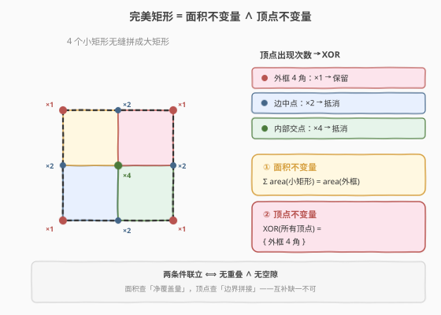
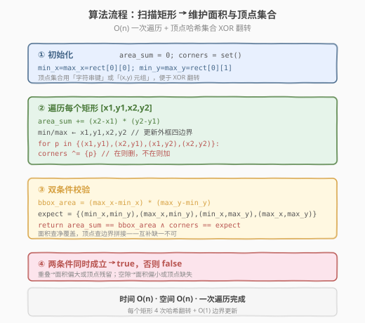
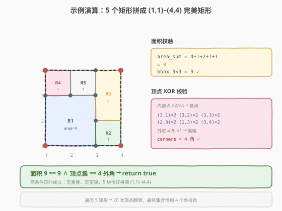

# 完美矩形

- **题目名称**：完美矩形
- **链接**：[391. 完美矩形](https://leetcode.cn/problems/perfect-rectangle/)
- **难度**：困难
- **标签**：数组、几何、哈希表

## 1. 题目概述

给定一个轴对齐矩形的列表 `rectangles`，每个 `rectangles[i] = [xi, yi, ai, bi]` 表示一个矩形，其中 `(xi, yi)` 是该矩形**左下角**坐标，`(ai, bi)` 是该矩形**右上角**坐标。判断所有矩形合在一起是否**恰好**覆盖了一个矩形区域，且**内部没有重叠、没有空隙**。是返回 `true`，否则返回 `false`。

**示例 1**：

```text
输入：rectangles = [[1,1,3,3],[3,1,4,2],[3,2,4,4],[1,3,2,4],[2,3,3,4]]
输出：true
解释：5 个矩形恰好拼满 (1,1) 到 (4,4) 的 3×3 大矩形，无重叠无空隙。
```

**示例 2**：

```text
输入：rectangles = [[1,1,2,3],[1,3,2,4],[3,1,4,2],[3,2,4,4]]
输出：false
解释：左列 x∈[1,2] 与右列 x∈[3,4] 各自拼成一条，中间 x∈[2,3] 空隙，未形成单一矩形。
```

**示例 3**：

```text
输入：rectangles = [[1,1,3,3],[3,1,4,2],[1,3,2,4],[3,2,4,4]]
输出：false
解释：缺少 [2,3,3,4] 这一块，(2,3)–(3,4) 处有空隙。
```

**示例 4**：

```text
输入：rectangles = [[1,1,3,3],[3,1,4,2],[1,3,2,4],[2,2,4,4]]
输出：false
解释：[1,1,3,3] 与 [2,2,4,4] 在 (2,2)–(3,3) 处重叠，覆盖量多算一份。
```

**约束条件**：

- `1 <= rectangles.length <= 2 * 10^4`
- `rectangles[i].length == 4`
- `-10^5 <= xi, yi, ai, bi <= 10^5`
- 题目保证 `xi < ai` 且 `yi < bi`（非退化矩形）

> 💡 本题的难点不在「怎么覆盖」，而在「**如何用一次线性扫描同时判定无重叠 ∧ 无空隙**」。朴素的区间/面积模拟要么写起来复杂、要么吃不准重叠与空隙抵消的边界。最佳解法抓住两个**互补的不变量**：**面积守恒**管「净覆盖量」，**顶点奇偶性**管「边界拼接正确性」，二者联立即是完美覆盖的充要条件，全程 $O(n)$。

---

## 2. 解题思路

### 2.1 暴力思路：成对判重叠 + 网格扫空隙

最直觉的做法分两步：

1. **查重叠**：对每对矩形 `(i, j)` 判断是否相交（轴对齐矩形相交的充要条件是 x、y 两轴投影区间都相交），若有任一对相交则失败。复杂度 $O(n^2)$。
2. **查空隙**：把所有矩形离散化到二维网格上做面积并（类似扫描线 + 线段树），再与外框面积比较。复杂度 $O(n \log n)$，但实现量大。

```text
重叠判定：O(n²) 对 × O(1) 区间相交判断 = O(n²)
空隙判定：扫描线 + 线段树并面积，O(n log n)，代码数百行
```

$n = 2 \times 10^4$ 时 $n^2 = 4 \times 10^8$，C++ 勉强可过、Python 必 TLE；扫描线版本则门槛过高，不适合面试白板。

> ⚠️ 暴力的根本缺陷是把「无重叠」和「无空隙」割裂处理，分别上重武器。但其实两者可以**合并为一个面积等式 + 一个顶点等式**——这是本题的关键观察。

### 2.2 核心观察：面积不变量 + 顶点不变量



**关键洞察一：面积不变量管「净覆盖量」。**

若所有小矩形恰好无重叠无空隙地拼成外框 $B$（由 $\min_x, \min_y, \max_x, \max_y$ 围成），则每个小矩形贡献的面积**恰好累加**为外框面积：

$$
\sum_{i} (a_i - x_i)(b_i - y_i) \;=\; (\max_x - \min_x)(\max_y - \min_y)
$$

- 出现**重叠**时：被重叠区域被多算若干次 → 左侧 $>$ 右侧。
- 出现**空隙**时：空隙区域未被任何矩形覆盖 → 左侧 $<$ 右侧。
- 二者**等量抵消**时（一块大小为 $d$ 的重叠 + 一块大小为 $d$ 的空隙）：面积等式仍成立 → **面积条件不充分**，需配合顶点条件。

**关键洞察二：顶点不变量管「边界拼接」。**

每个小矩形有 4 个角点。把所有 $4n$ 个角点放入一个集合做 **XOR 翻转**（在集合中则删除、不在则加入）。完美覆盖时：

- **外框 4 角**：只被 1 个小矩形「用到」→ 翻转 1 次 → **保留**在集合中。
- **边中点**（两矩形共享边的端点）：被 2 个小矩形各用一次 → 翻转 2 次 → **抵消**。
- **内部交点**（4 个矩形交汇）：被 4 个小矩形各用一次 → 翻转 4 次 → **抵消**。

因此最终集合**应恰为外框的 4 个角**：

$$
\boxed{\;\bigoplus_{i,\, p \in \text{角}(R_i)} p \;=\; \{(\min_x,\min_y),\,(\max_x,\min_y),\,(\min_x,\max_y),\,(\max_x,\max_y)\}\;}
$$

> 💡 **为什么两个条件必须联立？** 面积条件能抓「净覆盖量偏差」但抓不到「重叠 + 等量空隙」的对冲；顶点条件能抓「边界拼接错误」（重叠会在内部多出奇数次角点、空隙会少出该有的抵消对），但单纯角点配平也可能被精心构造的重叠+空隙对骗过。两者**互补**，联立才是充要条件：面积守恒保证了「总覆盖量正确」，顶点守恒保证了「每条边都恰好是两矩形的公共边或外框边」。

### 2.3 算法流程图



**完整步骤**（一次遍历 $O(n)$）：

1. **初始化**：`area_sum = 0`，顶点集合 `corners = set()`，外框边界用第一个矩形初始化 `min_x/max_x/min_y/max_y`。
2. **遍历每个矩形 `[x1, y1, x2, y2]`**：
   - 累加面积 `area_sum += (x2 - x1) * (y2 - y1)`。
   - 用 `x1, y1, x2, y2` 更新 `min_x, min_y, max_x, max_y`。
   - 对 4 个角点 `(x1,y1), (x2,y1), (x1,y2), (x2,y2)` 做 XOR 翻转：在集合中则 `remove`，不在则 `add`。
3. **双条件校验**：
   - `bbox_area = (max_x - min_x) * (max_y - min_y)`，检查 `area_sum == bbox_area`。
   - 期望集合 `expect = {(min_x,min_y),(max_x,min_y),(min_x,max_y),(max_x,max_y)}`，检查 `corners == expect`。
4. 两条件同时成立 → `true`，否则 `false`。

> ⚠️ **顶点键的选型**：C++ 中 `pair<int,int>` 配 `unordered_set` 需自定义哈希；更简便的是把 `(x, y)` 编码成 `long long` 键 `((long long)x << 32) | (unsigned int)y`，避免自定义哈希。Python 直接用元组 `(x, y)` 作集合元素，最简洁。注意坐标范围 $[-10^5, 10^5]$，`x << 32 | (y & 0xffffffff)` 不会溢出 `long long`。

### 2.4 示例演算

以示例 1 `rectangles = [[1,1,3,3],[3,1,4,2],[3,2,4,4],[1,3,2,4],[2,3,3,4]]` 为例：



**第 1 步：遍历累加面积 + 更新外框**

| 矩形 | 坐标 | 宽×高 | 面积 |
|------|------|-------|------|
| R1 | [1,1,3,3] | 2×2 | 4 |
| R2 | [3,1,4,2] | 1×1 | 1 |
| R3 | [3,2,4,4] | 1×2 | 2 |
| R4 | [1,3,2,4] | 1×1 | 1 |
| R5 | [2,3,3,4] | 1×1 | 1 |

- `area_sum = 4 + 1 + 2 + 1 + 1 = 9`
- 外框：`min_x=1, min_y=1, max_x=4, max_y=4`，`bbox_area = 3 × 3 = 9`

**第 2 步：顶点 XOR 翻转**

| 角点 | 出现次数 | 来源 | 最终状态 |
|------|----------|------|----------|
| (1,1) | 1 | R1 | 保留 |
| (4,1) | 1 | R2 | 保留 |
| (1,4) | 1 | R4 | 保留 |
| (4,4) | 1 | R3 | 保留 |
| (3,1) | 2 | R1, R2 | 抵消 |
| (3,2) | 2 | R2, R3 | 抵消 |
| (3,3) | 2 | R1, R5 | 抵消 |
| (1,3) | 2 | R1, R4 | 抵消 |
| (2,3) | 2 | R4, R5 | 抵消 |
| (3,4) | 2 | R3, R5 | 抵消 |
| (2,4) | 2 | R4, R5 | 抵消 |

最终 `corners = {(1,1), (4,1), (1,4), (4,4)}`，恰为外框 4 角。

**第 3 步：双条件校验**

- 面积：$9 = 9$ ✓
- 顶点：`corners == expect` ✓

两条件同时成立 → 返回 `true`。

> 💡 **对照示例 3（空隙）**：去掉 R5 后，`area_sum = 8 < 9`（面积不足），且角点 `(2,3)`、`(3,3)`、`(2,4)`、`(3,4)` 各只出现 1 次，无法抵消 → 顶点集合残留 8 个点 ≠ 4 角。**两个条件同时失败**。
>
> **对照示例 4（重叠）**：R5 换成 `[2,2,4,4]`（与 R1 在 (2,2)–(3,3) 重叠），`area_sum = 4+1+1+4 = 10 > 9`（面积超量），且重叠区的 4 个角 `(2,2),(3,2),(2,3),(3,3)` 出现奇数次 → 顶点集合也残留多余点。**两个条件同时失败**。
>
> 可见重叠与空隙都会**同时**破坏两个不变量——这正是二者联立可靠的直观原因。

---

## 3. 参考代码

### C++

```cpp
class Solution {
public:
    bool isRectangleCover(vector<vector<int>>& rectangles) {
        long long area_sum = 0;
        int min_x = rectangles[0][0], max_x = rectangles[0][2];
        int min_y = rectangles[0][1], max_y = rectangles[0][3];
        unordered_set<long long> corners;

        for (const auto& r : rectangles) {
            int x1 = r[0], y1 = r[1], x2 = r[2], y2 = r[3];
            area_sum += (long long)(x2 - x1) * (y2 - y1);
            min_x = min(min_x, x1);  max_x = max(max_x, x2);
            min_y = min(min_y, y1);  max_y = max(max_y, y2);
            // 4 角 XOR 翻转：(x,y) 编码为 long long 键，避免自定义哈希
            long long p1 = encode(x1, y1), p2 = encode(x2, y1);
            long long p3 = encode(x1, y2), p4 = encode(x2, y2);
            toggle(corners, p1); toggle(corners, p2);
            toggle(corners, p3); toggle(corners, p4);
        }

        long long bbox_area = (long long)(max_x - min_x) * (max_y - min_y);
        if (area_sum != bbox_area) return false;

        // 顶点集合应恰为外框 4 角
        if (corners.size() != 4) return false;
        return corners.count(encode(min_x, min_y))
            && corners.count(encode(max_x, min_y))
            && corners.count(encode(min_x, max_y))
            && corners.count(encode(max_x, max_y));
    }
private:
    static long long encode(int x, int y) {
        // 坐标范围 [-1e5, 1e5]，偏移到非负后塞进 32 位，再拼成 64 位键
        return ((long long)(x + 200000) << 32) | (unsigned int)(y + 200000);
    }
    static void toggle(unordered_set<long long>& s, long long key) {
        if (s.count(key)) s.erase(key);
        else              s.insert(key);
    }
};
```

### Python

```python
class Solution:
    def isRectangleCover(self, rectangles: list[list[int]]) -> bool:
        area_sum = 0
        min_x = rectangles[0][0]; max_x = rectangles[0][2]
        min_y = rectangles[0][1]; max_y = rectangles[0][3]
        corners: set[tuple[int, int]] = set()

        for x1, y1, x2, y2 in rectangles:
            area_sum += (x2 - x1) * (y2 - y1)
            min_x = min(min_x, x1); max_x = max(max_x, x2)
            min_y = min(min_y, y1); max_y = max(max_y, y2)
            for p in [(x1, y1), (x2, y1), (x1, y2), (x2, y2)]:
                # XOR 翻转：在则删，不在则加
                if p in corners: corners.remove(p)
                else:            corners.add(p)

        bbox_area = (max_x - min_x) * (max_y - min_y)
        if area_sum != bbox_area:
            return False
        expect = {(min_x, min_y), (max_x, min_y), (min_x, max_y), (max_x, max_y)}
        return corners == expect
```

> 💡 两版骨架一致：一次遍历同时维护 `area_sum`、外框边界、顶点 XOR 集合，最后双条件校验。核心是 `toggle` 这一步——把每个矩形的 4 个角点对称差进集合，让「成对出现的内部点」自动抵消，只留「奇数次出现的外框角」。
>
> ⚠️ **面积溢出**：$n = 2 \times 10^4$，单矩形最大面积 $(2 \times 10^5)^2 = 4 \times 10^{10}$，总面积可达 $8 \times 10^{14}$，超出 32 位 `int` 范围（约 $2.1 \times 10^9$）。C++ 必须用 `long long` 累加，Python 整数无此问题。

---

## 4. 复杂度分析

| 维度 | 复杂度 | 说明 |
|------|--------|------|
| **时间复杂度** | $O(n)$ | 一次遍历 $n$ 个矩形，每个做 4 次哈希翻转（均摊 $O(1)$）+ $O(1)$ 边界更新；最后 4 次哈希查找 |
| **空间复杂度** | $O(n)$ | 最坏情况下顶点集合存放 $O(n)$ 个未抵消的角点（实际中内部点不断抵消，远小于 $4n$） |
| **最优时间** | $O(n)$ | 至少需访问每个矩形一次，$O(n)$ 为该问题下界 |

> 💡 本题的最优解就是 $O(n)$——面积与顶点两个不变量都可以在一次遍历中增量维护，无需排序、无需扫描线。任何 $O(n \log n)$ 或更高的解法都未充分利用「角点奇偶性」这一性质。

> ⚠️ **哈希常数**：$n = 2 \times 10^4$ 时顶点翻转共 $8 \times 10^4$ 次，每次均摊 $O(1)$。Python 用元组作哈希键略慢，但 $n \le 2 \times 10^4$ 在时限内可过。若需进一步优化，C++ 可改用 `long long` 编码键（如参考代码）省去自定义哈希开销。

---

## 5. 扩展：为什么顶点条件单独不够？

考虑一个反例：外框 $(0,0)$–$(3,2)$，两个矩形 $A = [0,0,2,2]$ 与 $B = [1,1,3,2]$。它们在 $(1,1)$–$(2,2)$ 处重叠，下方 $(2,0)$–$(3,1)$ 处空隙。

- **面积**：$A$ 面积 4，$B$ 面积 2，和 $= 6$；外框面积 $3 \times 2 = 6$ → **面积条件成立**！
- **顶点**：$A$ 角 $(0,0),(2,0),(0,2),(2,2)$；$B$ 角 $(1,1),(3,1),(1,2),(3,2)$。8 个点两两不同，XOR 后全保留，集合大小 8 ≠ 4 → **顶点条件失败**。

此例中面积条件被「重叠 1 + 空隙 1」对冲骗过，但顶点条件抓出了问题。反过来也存在顶点配平但面积不对的精心构造案例。**因此两条件缺一不可**——这是本题最易踩的坑。

> 💡 这也解释了为什么题解界一度有「只用顶点条件」或「只用面积条件」的争议解法：单条件都能通过大部分测试用例，但都会在精心构造的对冲用例上翻车。**联立才是数学上严谨的充要条件**。

---

## 6. 面试要点

1. **为什么用两个不变量而不是一个？**

   > 面积条件管「净覆盖量」，顶点条件管「边界拼接」。单用面积会被「重叠 + 等量空隙」对冲骗过；单用顶点也可能被精心构造的奇偶配平骗过。二者互补，联立才是完美覆盖的充要条件——这是数学上严谨的判定。

2. **顶点 XOR 翻转的物理含义是什么？**

   > 每个矩形的 4 个角点在「拼图」中要么是外框角（只属于 1 个矩形，翻转 1 次保留），要么是两矩形的公共边端点（属于 2 个矩形，翻转 2 次抵消），要么是 4 矩形的内部交汇点（属于 4 个矩形，翻转 4 次抵消）。XOR 翻转天然实现了「奇偶计数」——只有奇数次出现的点会留在集合中，而完美覆盖时奇数次点恰为外框 4 角。

3. **顶点键怎么选才能避免自定义哈希？**

   > C++ 中 `unordered_set<pair<int,int>>` 需自定义哈希函数，啰嗦。把 `(x, y)` 编码成 `long long`：`((long long)(x + offset) << 32) | (unsigned int)(y + offset)`，`offset` 取足够大的正数（如 200000）把负坐标偏移到非负。这样一个 64 位整数就是天然哈希键，零额外代码。Python 直接用元组 `(x, y)`，最简洁。

4. **面积累加为什么必须用 `long long`？**

   > 单矩形最大面积 $(2 \times 10^5)^2 = 4 \times 10^{10}$，$n = 2 \times 10^4$ 个矩形总面积可达 $8 \times 10^{14}$，远超 32 位 `int` 上限 $2.1 \times 10^9$。C++ 用 `int` 累加必然溢出，得用 `long long`。Python 整数任意精度，无需担心。

5. **如果存在退化矩形（面积为 0 的线段或点）怎么办？**

   > 题目保证 `xi < ai` 且 `yi < bi`，不存在退化矩形。若约束放宽允许退化，需先过滤面积为 0 的矩形（它们不贡献面积但会污染顶点集合），再套用本算法。

> 💡 **一句话总结**：本题的灵魂是「**面积守恒 ∧ 顶点 XOR = 外框 4 角**」——两个互补的不变量把「无重叠 ∧ 无空隙」这一几何判定压缩成两次 $O(n)$ 扫描，是「不变量思维」与「奇偶性计数」的优雅联姻。

---

## 7. 同类练习题

- [850. 矩形面积 II](https://leetcode.cn/problems/rectangle-area-ii/)：扫描线 + 线段树求多个矩形并面积，本题的「重型」 counterpart，适合对照理解为何 391 能用轻量不变量绕过扫描线
- [223. 矩形面积](https://leetcode.cn/problems/rectangle-area/)：两个矩形的并面积（重叠减一次），轴对齐矩形相交判定的入门题，承接本题 2.1 暴力思路
- [356. 直线镜像](https://leetcode.cn/problems/line-reflection/)（[题解](../0301-0400/356_直线镜像.md)）：几何 + 哈希集合的对称性判定，与本题同为「用哈希一次扫描验证几何不变量」的范式
- [149. 直线上最多的点数](https://leetcode.cn/problems/max-points-on-a-line/)（[题解](../0101-0200/149_直线上最多的点数.md)）：几何 + 哈希 + 避免浮点（GCD 化简斜率），同为几何哈希招牌题
- [986. 区间列表的交集](https://leetcode.cn/problems/interval-list-intersections/)（[题解](../0901-1000/986_区间列表的交集.md)）：轴对齐区间相交的归并双指针，2.1 暴力重叠判定的区间版基础
