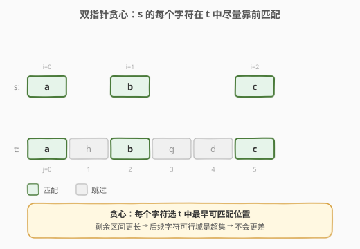
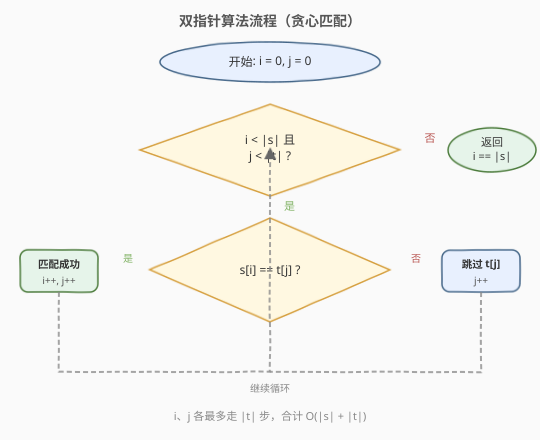
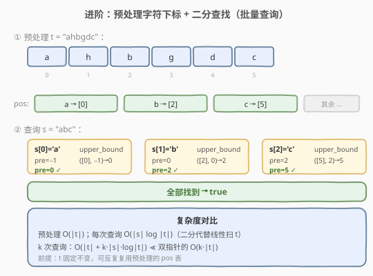

# 判断子序列

- **题目名称**：判断子序列
- **链接**：[392. 判断子序列](https://leetcode.cn/problems/is-subsequence/)
- **难度**：简单
- **标签**：双指针、字符串、二分查找

## 1. 题目概述

给定字符串 **s** 和 **t**，判断 **s** 是否为 **t** 的子序列。

**子序列**是从原字符串中删除一些（也可以不删除）字符后、不改变剩余字符相对顺序得到的新字符串。例如，`"ace"` 是 `"abcde"` 的子序列，而 `"aec"` 不是。

**示例 1**：

```text
输入：s = "abc", t = "ahbgdc"
输出：true
解释：在 t 中依次找到 a(下标0)、b(下标2)、c(下标5)，保序，故 abc 是 ahbgdc 的子序列。
```

**示例 2**：

```text
输入：s = "axc", t = "ahbgdc"
输出：false
解释：t 中没有 'x'，无法匹配 s 的第二个字符。
```

**约束条件**：

- $0 \le \text{s.length} \le 100$
- $0 \le \text{t.length} \le 10^4$
- `s` 和 `t` 仅由小写英文字母组成

> 💡 **进阶要求**：如果有大量输入的 S，即 $S_1, S_2, \dots, S_k$，其中 $k \le 10^9$，你需要依次检查它们是否为 T 的子序列。你会怎么做？

---

## 2. 解题思路

### 2.1 暴力思路

对 s 的每个字符，在 t 中从前往后线性扫描找到第一个匹配位置，且该位置必须严格大于上一次匹配的位置。最坏情况每次都要扫到 t 末尾，$O(|s| \cdot |t|)$。能通过，但完全未利用「t 相对固定」这一性质，也达不到进阶要求的批量高效查询。

### 2.2 核心观察：双指针贪心——匹配越早，留给后续的空间越大



s 的字符顺序必须与在 t 中出现的顺序一致。直觉是：**对 s 的每个字符，在 t 中尽量靠前地匹配**——因为越早匹配，t 中剩余部分越长，后续字符能找到位置的概率越高。这就是「贪心」：局部选最早，全局最优。

> 💡 **为什么贪心正确？** 假设 s[i] 在 t 中有两个可选位置 $p < q$。若选 $q$ 能让后续 s[i+1..] 全部匹配，那么选 $p$（更靠前）时 t 中剩余区间更长，必然也能匹配——因为 $p$ 之后包含了 $q$ 之后的所有位置。所以「选最早」永远不会比「选更晚」差。

两个指针 `i`（扫 s）和 `j`（扫 t）同步推进：

- 若 `s[i] == t[j]`：匹配成功，`i++`（s 前进一位）；
- 无论是否匹配，`j++`（t 总是前进，因为一个 t 字符最多匹配一个 s 字符）。

当 `i` 走完 s 的末尾，说明全部匹配；若 `j` 先走完 t 而 `i` 未走完 s，则失败。

### 2.3 算法流程图



初始化 `i = 0`、`j = 0`。每轮看 `t[j]` 是否等于 `s[i]`：

1. 相等 → `i++`、`j++`（s、t 都前进）；
2. 不等 → 只 `j++`（跳过 t 中这个无关字符）；
3. `i == |s|` 时返回 `true`（s 全部匹配）；
4. `j == |t|` 时返回 `false`（t 用尽仍未匹配完 s）。

`i`、`j` 各最多走 $|t|$ 步，合计 $O(|s| + |t|)$。

### 2.4 示例演算

以 `s = "abc"`、`t = "ahbgdc"` 为例：

| 步骤 | i | j | s[i] | t[j] | 是否匹配 | 动作 |
|------|---|---|------|------|----------|------|
| 1 | 0 | 0 | a | a | ✓ | i=1, j=1 |
| 2 | 1 | 1 | b | h | ✗ | j=2 |
| 3 | 1 | 2 | b | b | ✓ | i=2, j=3 |
| 4 | 2 | 3 | c | g | ✗ | j=4 |
| 5 | 2 | 4 | c | d | ✗ | j=5 |
| 6 | 2 | 5 | c | c | ✓ | i=3, j=6 |

`i = 3 = |s|`，s 全部匹配，返回 `true`。

---

## 3. 参考代码

### 双指针解法（单次查询）

#### C++

```cpp
class Solution {
  public:
    bool isSubsequence(string s, string t) {
        int i = 0, j = 0;
        while (i < s.size() && j < t.size()) {
            if (s[i] == t[j]) i++;
            j++;
        }
        return i == s.size();
    }
};
```

#### Python

```python
class Solution:
    def isSubsequence(self, s: str, t: str) -> bool:
        i = j = 0
        while i < len(s) and j < len(t):
            if s[i] == t[j]:
                i += 1
            j += 1
        return i == len(s)
```

> 💡 Python 还可用迭代器一行写出：`it = iter(t); return all(c in it for c in s)`——`c in it` 会消耗迭代器到匹配位置，巧妙利用了「贪心取最早」的语义。

### 进阶：二分预处理（批量查询）



当有大量 s 要对**同一个 t** 反复判定时，双指针每次都要 $O(|s| + |t|)$，$k$ 次查询就是 $O(k \cdot |t|)$，太慢。优化思路：

1. **预处理**：记录 t 中每个字符出现的所有下标，`pos[c] = [下标升序列表]`。开销 $O(|t|)$。
2. **每次查询**：维护「上一次匹配到的 t 下标」`pre = -1`。对 s 的每个字符 `c`，在 `pos[c]` 中**二分查找第一个大于 `pre` 的下标**：
   - 找到 → 更新 `pre` 为该下标；
   - 找不到（`pos[c]` 中没有比 `pre` 更大的）→ 返回 `false`。
3. 全部字符都找到 → `true`。

每次查询 $O(|s| \log |t|)$，$k$ 次查询 $O(|t| + k \cdot |s| \log |t|)$，远优于反复线性扫描。

#### C++

```cpp
class Solution {
  public:
    bool isSubsequence(string s, string t) {
        vector<vector<int>> pos(26);
        for (int j = 0; j < t.size(); j++) {
            pos[t[j] - 'a'].push_back(j);
        }
        int pre = -1;
        for (char c : s) {
            auto& v = pos[c - 'a'];
            auto it = upper_bound(v.begin(), v.end(), pre);
            if (it == v.end()) return false;
            pre = *it;
        }
        return true;
    }
};
```

#### Python

```python
import bisect


class Solution:
    def isSubsequence(self, s: str, t: str) -> bool:
        pos = {}
        for idx, ch in enumerate(t):
            pos.setdefault(ch, []).append(idx)
        pre = -1
        for c in s:
            v = pos.get(c)
            if not v:
                return False
            k = bisect.bisect_right(v, pre)
            if k == len(v):
                return False
            pre = v[k]
        return True
```

> ⚠️ **二分用 `upper_bound` / `bisect_right`**：要找「严格大于 `pre`」的第一个下标（同一个 t 字符不能被 s 的两个字符重复使用，且必须保序）。`pre = -1` 初始时等价于从 t 的开头找第一个出现的字符。

---

## 4. 复杂度分析

| 维度 | 双指针 | 二分预处理 |
|------|--------|------------|
| 预处理时间 | 无 | $O(|t|)$ |
| 单次查询时间 | $O(|s| + |t|)$ | $O(|s| \log |t|)$ |
| 空间复杂度 | $O(1)$ | $O(|t|)$（存各字符下标） |
| 适用场景 | 查询次数少、t 经常变 | 查询次数多、t 固定不变 |

---

## 5. 扩展：动态规划解法

本题也可用类似编辑距离的二维 DP 求解：令 `dp[i][j]` 表示 `s[0..i)` 是否为 `t[0..j)` 的子序列。

- `dp[0][j] = true`（空串是任何串的子序列）；
- `dp[i][0] = (i == 0)`（非空串不是空串的子序列）；
- `dp[i][j] = dp[i-1][j-1]` 若 `s[i-1] == t[j-1]`，否则 `dp[i][j] = dp[i][j-1]`（跳过 `t[j-1]`）。

答案为 `dp[|s|][|t|]`，时间 $O(|s| \cdot |t|)$、空间 $O(|s| \cdot |t|)$（可滚动数组优化到 $O(|t|)$）。

> 💡 面试中若被追问「不修改 t、要求每次查询 $O(|s| \cdot |t|)$ 之外的解法」，DP 不是首选——双指针更简单更快。DP 的价值在于它是「子序列匹配」类问题的通用框架，能迁移到 [115. 不同的子序列](../0101-0200/115_不同的子序列.md)（计数而非判定）等变体。

---

## 6. 面试要点

1. **为什么双指针贪心是正确的？**

   对 s 的每个字符在 t 中选「最早可匹配位置」是最优的：选得更早，t 剩余部分更长，后续字符的可行域是「选更晚」情形的超集，不会更差。形式化地，若位置 $q$ 可行则 $p < q$ 也可行，故贪心选最小不劣于任何其他选择。

2. **双指针和二分预处理分别适合什么场景？**

   双指针适合**查询次数少**或 **t 经常变化**的场景，无需预处理、空间 $O(1)$；二分预处理适合 **t 固定、s 大量重复查询**（进阶要求 $k \le 10^9$），用 $O(|t|)$ 预处理把每次查询从 $O(|t|)$ 降到 $O(\log |t|)$。

3. **二分查找时为什么用 `upper_bound` 而非 `lower_bound`？**

   需要找「严格大于 `pre`」的下标（同一个 t 字符不能被 s 的两个字符重复使用，且必须保序）。`upper_bound` 返回第一个 $> \text{pre}$ 的位置，正是下一个可用位置；`lower_bound` 找的是第一个 $\ge \text{pre}$，当 `pos` 中存在等于 `pre` 的下标时会错误地复用同一位置。

4. **s 为空串时结果是什么？**

   空串是任何字符串的子序列（删除所有字符即得空串），返回 `true`。双指针代码中 `i == 0 == |s|` 直接命中 `i == s.size()` 返回 `true`，无需特判。同理 t 为空串时，仅当 s 也为空才 `true`。

5. **和 [28. 找出字符串中第一个匹配项的下标](../0001-0100/28_找出字符串中第一个匹配项的下标.md) 有何区别？**

   28 题要求 s 是 t 的**连续子串**（不能跳过字符），用 KMP 在 $O(|s|+|t|)$ 内匹配；本题允许跳过 t 中字符（子序列），双指针贪心即可。二者都是「保序匹配」，但连续性约束不同导致算法不同。

---

## 7. 同类练习题

- [28. 找出字符串中第一个匹配项的下标](https://leetcode.cn/problems/find-the-index-of-the-first-occurrence-in-a-string/)（[题解](../0001-0100/28_找出字符串中第一个匹配项的下标.md)）：连续子串匹配，KMP 模板，与子序列判定对比「连续 vs 可跳过」
- [115. 不同的子序列](https://leetcode.cn/problems/distinct-subsequences/)（[题解](../0101-0200/115_不同的子序列.md)）：求 s 作为 t 子序列的匹配方案数，DP 计数版
- [792. 匹配子序列的单词数](https://leetcode.cn/problems/number-of-matching-subsequences/)：批量判定多个 s 是否为 t 的子序列，正是本题进阶要求，二分预处理模板题
- [76. 最小覆盖子串](https://leetcode.cn/problems/minimum-window-substring/)（[题解](../0001-0100/76_最小覆盖子串.md)）：滑动窗口求包含 t 全部字符的最短子串，另一类「保序/包含」匹配
