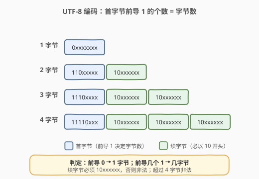
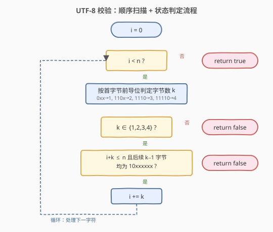
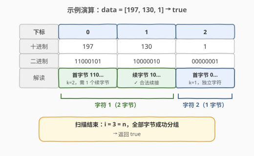

# UTF-8 编码验证

- **题目名称**：UTF-8 编码验证
- **链接**：[393. UTF-8 编码验证](https://leetcode.cn/problems/utf-8-validation/)
- **难度**：中等
- **标签**：位运算、数组、状态机

## 1. 题目概述

给定一个整数数组 `data`，其中每个整数代表一个字节（取值范围 $0 \le \text{data}[i] \le 255$），即 8 位二进制数。请判断该字节序列是否是**合法的 UTF-8 编码**。

UTF-8 是一种变长编码，每个 Unicode 字符占用 $1 \sim 4$ 个字节，规则如下：

- **1 字节字符**：`0xxxxxxx`（最高位为 0，ASCII 兼容）
- **$n$ 字节字符**（$n \in \{2,3,4\}$）：首字节以 $n$ 个连续的 `1` 开头、紧跟一个 `0`；其后 $n-1$ 个**续字节**均以 `10` 开头。

具体四种模式：

| 字节数 | 首字节模式 | 续字节模式 | 续字节数 |
|--------|-----------|-----------|---------|
| 1 | `0xxxxxxx` | — | 0 |
| 2 | `110xxxxx` | `10xxxxxx` | 1 |
| 3 | `1110xxxx` | `10xxxxxx` | 2 |
| 4 | `11110xxx` | `10xxxxxx` | 3 |

> ⚠️ 本题采用 LeetCode 简化规则：只校验上述**位模式**是否合规，不校验「过度长编码」（overlong）、码点范围、代理区等真实 UTF-8 的额外约束（详见第 5 节）。

**示例 1**：

```text
输入：data = [197, 130, 1]
输出：true
解释：
  197  = 11000101 → 首字节 110xxxxx，2 字节字符
  130  = 10000010 → 续字节 10xxxxxx，合法
  1    = 00000001 → 首字节 0xxxxxxx，1 字节字符
  整个序列恰好划分为 [197, 130] + [1] 两个合法字符。
```

**示例 2**：

```text
输入：data = [235, 115, 130, 4]
输出：false
解释：
  235  = 11101011 → 首字节 1110xxxx，3 字节字符，需要 2 个续字节
  115  = 01110011 → 不是 10xxxxxx（最高两位为 01），非法续字节
  → 返回 false
```

**约束条件**：

- $1 \le \text{data.length} \le 2 \times 10^4$
- $0 \le \text{data}[i] \le 255$

---

## 2. 解题思路

### 2.1 暴力思路：递归 / 多重分支

最直观的写法是顺序扫描：读到首字节后判定字节数 $k$，再向后查看 $k-1$ 个字节是否都是 `10xxxxxx`，若中途任何一步失败则返回 `false`，否则跳过这 $k$ 个字节继续判定下一个字符。

这种写法本身没有问题，能 AC。但若用大量 `if-else` 嵌套或递归来表达，代码会冗长且不易维护。关键在于**把首字节分类与续字节校验解耦**——用位掩码一次性判定 $k$，再用统一规则校验续字节。

### 2.2 核心观察：前导 1 的个数决定字节数，位掩码分类



UTF-8 的精妙之处在于**自同步**：无需上下文，仅凭一个字节的高位就能判断它是首字节还是续字节，以及首字节对应几个字节。

- 首字节最高位为 `0` → 1 字节字符；
- 首字节前导 $n$ 个 `1` 后跟 `0`（$n \ge 2$）→ $n$ 字节字符；
- 任意字节最高两位为 `10` → 续字节。

> 💡 **为什么不用前导 1 的「个数」直接计数？** 因为 `111110xx`、`1111110x` 等模式在 UTF-8 中非法（最多 4 字节）。所以需要枚举 $k \in \{1,2,3,4\}$ 的四种首字节模式，其它模式一律拒绝。

用位掩码判定首字节类型（核心技巧）：

| 模式 | 掩码 | 期望值 | 字节数 $k$ |
|------|------|--------|-----------|
| `0xxxxxxx` | `0x80`（`10000000`） | `0x00` | 1 |
| `110xxxxx` | `0xE0`（`11100000`） | `0xC0`（`11000000`） | 2 |
| `1110xxxx` | `0xF0`（`11110000`） | `0xE0`（`11100000`） | 3 |
| `11110xxx` | `0xF8`（`11111000`） | `0xF0`（`11110000`） | 4 |

续字节判定：掩码 `0xC0`（`11000000`），期望值 `0x80`（`10000000`），即 `(b & 0xC0) == 0x80`。

> 💡 **掩码选择思路**：要判断高 $m$ 位是否等于某个固定模式，构造一个掩码把高位 `1`、低位 `0` 隔离出来，再与期望值比较。例如判定 `110xxxxx`，只需关注最高 3 位，掩码 `0xE0` 取出最高 3 位，与 `0xC0` 比较即可——后 5 位 `xxxxx` 是数据位，被掩码屏蔽掉，不影响判定。

### 2.3 算法流程图



顺序扫描 `data`，维护下标 `i`：

1. 若 `i == n`，扫描完成，返回 `true`；
2. 取 `b = data[i]`，按上表用掩码判定字节数 $k$；若不匹配任何模式，返回 `false`；
3. 检查 `i + k <= n`（剩余字节够用），且 `data[i+1..i+k-1]` 每个字节都满足 `(b & 0xC0) == 0x80`；若不足或任一续字节非法，返回 `false`；
4. `i += k`，回到步骤 1。

每个字节最多被访问一次（首字节被外层访问一次，续字节被内层访问一次），总时间 $O(n)$。

### 2.4 示例演算

以 `data = [197, 130, 1]` 为例：



| 步骤 | i | 字节 | 二进制 | 掩码判定 | 动作 |
|------|---|------|--------|---------|------|
| 1 | 0 | 197 | `11000101` | `197 & 0xE0 == 0xC0` → $k=2$ | 需 1 个续字节 |
| 2 | — | 130 | `10000010` | `130 & 0xC0 == 0x80` → 合法续字节 | 字符 1 完成，`i += 2` → `i = 2` |
| 3 | 2 | 1 | `00000001` | `1 & 0x80 == 0x00` → $k=1$ | 无需续字节，字符 2 完成，`i += 1` → `i = 3` |
| 4 | 3 | — | — | `i == n` | 返回 `true` |

---

## 3. 参考代码

### 下标扫描法（主解法）

#### C++

```cpp
class Solution {
  public:
    bool validUtf8(vector<int>& data) {
        int i = 0, n = data.size();
        while (i < n) {
            int b = data[i];
            int k;
            if ((b & 0x80) == 0x00) k = 1;       // 0xxxxxxx
            else if ((b & 0xE0) == 0xC0) k = 2;  // 110xxxxx
            else if ((b & 0xF0) == 0xE0) k = 3;  // 1110xxxx
            else if ((b & 0xF8) == 0xF0) k = 4;  // 11110xxx
            else return false;                    // 10xxxxxx 作首字节 或 >= 111110xx
            if (i + k > n) return false;          // 剩余字节不足
            for (int j = i + 1; j < i + k; j++) {
                if ((data[j] & 0xC0) != 0x80) return false;  // 续字节必须 10xxxxxx
            }
            i += k;
        }
        return true;
    }
};
```

#### Python

```python
class Solution:
    def validUtf8(self, data: List[int]) -> bool:
        i, n = 0, len(data)
        while i < n:
            b = data[i]
            if (b & 0x80) == 0x00:
                k = 1
            elif (b & 0xE0) == 0xC0:
                k = 2
            elif (b & 0xF0) == 0xE0:
                k = 3
            elif (b & 0xF8) == 0xF0:
                k = 4
            else:
                return False
            if i + k > n:
                return False
            for j in range(i + 1, i + k):
                if (data[j] & 0xC0) != 0x80:
                    return False
            i += k
        return True
```

> 💡 **位运算优先级陷阱**：C++ 中 `&` 的优先级低于 `==`，所以必须写成 `(b & 0x80) == 0x00`，不能写 `b & 0x80 == 0x00`（后者等价于 `b & (0x80 == 0x00)` = `b & 0` = `0`，永远为真，逻辑错误）。Python 中 `&` 优先级高于 `==`，但加括号更清晰、可移植。

### 状态机法（更简洁的单遍实现）

把「还需要多少个续字节」作为状态变量 `need`，逐字节消费：

- `need == 0`：当前字节必须是首字节，按掩码设定 `need`（$k-1$）；
- `need > 0`：当前字节必须是续字节，校验后 `need -= 1`；
- 扫描结束时应满足 `need == 0`（不能停在「期待续字节」状态）。

#### C++

```cpp
class Solution {
  public:
    bool validUtf8(vector<int>& data) {
        int need = 0;  // 还需多少个续字节
        for (int b : data) {
            if (need == 0) {
                if ((b & 0x80) == 0x00) need = 0;
                else if ((b & 0xE0) == 0xC0) need = 1;
                else if ((b & 0xF0) == 0xE0) need = 2;
                else if ((b & 0xF8) == 0xF0) need = 3;
                else return false;
            } else {
                if ((b & 0xC0) != 0x80) return false;
                need--;
            }
        }
        return need == 0;
    }
};
```

#### Python

```python
class Solution:
    def validUtf8(self, data: List[int]) -> bool:
        need = 0
        for b in data:
            if need == 0:
                if (b & 0x80) == 0x00:
                    need = 0
                elif (b & 0xE0) == 0xC0:
                    need = 1
                elif (b & 0xF0) == 0xE0:
                    need = 2
                elif (b & 0xF8) == 0xF0:
                    need = 3
                else:
                    return False
            else:
                if (b & 0xC0) != 0x80:
                    return False
                need -= 1
        return need == 0
```

> 💡 两种写法等价，状态机版无需内层循环、无需维护下标 `i`，更接近「流式解析」语义——若输入改为字节流（无法随机访问），状态机仍可用，下标法则不适用。

---

## 4. 复杂度分析

| 维度 | 下标扫描法 | 状态机法 |
|------|-----------|---------|
| 时间复杂度 | $O(n)$ | $O(n)$ |
| 空间复杂度 | $O(1)$ | $O(1)$ |
| 访问模式 | 随机访问（内层 `for` 跳跃读取） | 严格顺序访问（流式） |
| 适用场景 | 输入为数组，可随机访问 | 数组或字节流均适用 |
| 代码简洁度 | 双层循环，稍长 | 单层循环，更简洁 |

两种方法都是单遍 $O(n)$、$O(1)$ 空间，性能相当。状态机版更接近 UTF-8 的「自同步」本质——每个字节独立决定状态转移。

---

## 5. 扩展：真实 UTF-8 的额外约束

本题只校验位模式，真实 UTF-8（RFC 3629）还有更严格的规则：

1. **禁止过度长编码（overlong）**：同一码点必须用最短字节数表示。例如码点 `U+0000` 只能用 1 字节 `0x00`，不能用 2 字节 `0xC0 0x80`——这会引入安全漏洞（绕过过滤）。对应规则：
   - 2 字节首字节范围 `0xC2~0xDF`（`0xC0`、`0xC1` 非法）；
   - 3 字节首字节 `0xE0` 时，第二字节需 `0xA0~0xBF`；`0xED` 时第二字节需 `0x80~0x9F`（避开代理区 `U+D800~U+DFFF`）；
   - 4 字节首字节 `0xF0` 时第二字节需 `0x90~0xBF`；`0xF4` 时第二字节需 `0x80~0x8F`（码点上限 `U+10FFFF`）。

2. **码点上限**：4 字节字符表示的码点不得超过 `U+10FFFF`（即首字节不超过 `0xF4`）。

3. **禁止代理区码点**：`U+D800~U+DFFF` 是 UTF-16 代理保留区，不允许在 UTF-8 中编码。

> ⚠️ 本题只考查「位模式合规」这一最基础的校验层，若面试官追问「真实 UTF-8 验证」，需要补充上述三方面约束。对应的 LeetCode 测试用例也不会构造过度长编码等边界，故本题解法只需覆盖位模式即可。

---

## 6. 面试要点

1. **为什么首字节前导 1 的个数等于字节数？**

   UTF-8 设计的「自同步」特性：首字节用连续 `1` 的个数编码字节数，紧跟一个 `0` 作分隔；续字节统一以 `10` 开头。这样在任何位置开始读取，都能在最多 1 个字节内重新同步到字符边界——这是 UTF-8 相对 UTF-16/UTF-32 的核心优势。

2. **如何用一个字节判断它是首字节还是续字节？**

   看最高两位：`0x` 或 `11x` 开头为首字节（`0xxxxxxx`、`110xxxxx`、`1110xxxx`、`11110xxx`），`10` 开头为续字节。代码上 `(b & 0xC0) == 0x80` 即续字节，否则为首字节。首字节再细看掩码 `0x80/0xE0/0xF0/0xF8` 确定具体字节数。

3. **data 中途用完（续字节不够）怎么办？**

   下标法中 `i + k > n` 提前判定；状态机法中循环结束时 `need > 0` 即说明还在期待续字节。两种写法都返回 `false`。例如 `data = [197]`（只给首字节，缺续字节）→ `false`。

4. **下标法和状态机法有何区别？**

   下标法显式维护 `i`，用内层 `for` 一次性校验 $k-1$ 个续字节，逻辑直观但需随机访问；状态机法把「期待续字节数」作为状态，逐字节消费，单层循环、流式友好。两者复杂度相同，状态机更简洁、更贴近 UTF-8 自同步本质。

5. **本题的简化规则与真实 UTF-8 有何不同？**

   本题只校验位模式（首字节前导位、续字节 `10` 前缀、字节数 $\le 4$）。真实 UTF-8 还需拒绝过度长编码（如 `0xC0 0x80`）、码点上限（$\le \text{U+10FFFF}$）、代理区码点（`U+D800~U+DFFF`）。这些约束限制了首字节与第二字节的有效取值范围，详见第 5 节。

---

## 7. 同类练习题

- [468. 验证 IP 地址](https://leetcode.cn/problems/validate-ip-address/)（[题解](../0401-0500/468_验证IP地址.md)）：同为「按规则分段校验编码格式」的题型，IPv4/IPv6 分段规则校验与 UTF-8 字节模式校验思路相通
- [65. 有效数字](https://leetcode.cn/problems/valid-number/)（[题解](../0001-0100/65_有效数字.md)）：用 DFA 状态机做格式校验，本题的「期待续字节数」状态机是其简化版
- [8. 字符串转换整数 (atoi)](https://leetcode.cn/problems/string-to-integer-atoi/)（[题解](../0001-0100/8_字符串转换整数atoi.md)）：状态机解析输入流，与本题逐字节扫描 + 状态转移思路相通
- [191. 位 1 的个数](https://leetcode.cn/problems/number-of-1-bits/)（[题解](../0001-0100/191_位1的个数.md)）：位运算基础，理解位掩码与移位操作，是本题位判定的前置知识
