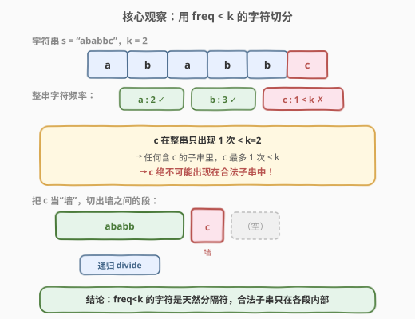
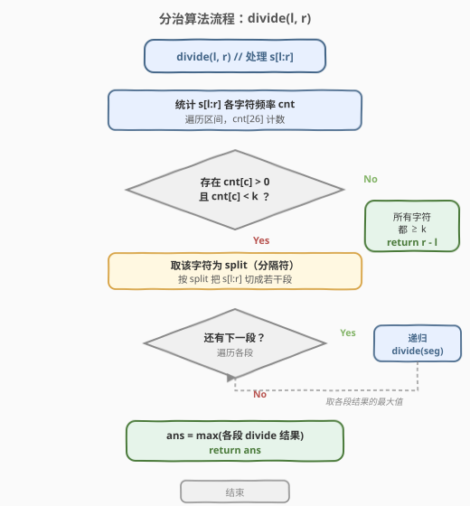
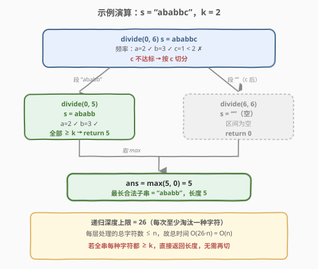

# LeetCode 至少有 K 个重复字符的最长子串 题解

## 1. 题目概述

- **标题 / 题号**：至少有 K 个重复字符的最长子串（#395，medium）
- **链接**：https://leetcode.cn/problems/longest-substring-with-at-least-k-repeating-characters/
- **难度**：中等
- **标签**：字符串、分治、滑动窗口、哈希表

**题意**：给定一个字符串 `s` 和一个整数 `k`，找出 `s` 中**最长子串**的长度，要求该子串中**每个出现的字符都至少出现 `k` 次**。

**示例 1**：

```text
输入：s = "aaabb", k = 3
输出：3
解释：最长子串为 "aaa"，其中 'a' 重复了 3 次。
```

**示例 2**：

```text
输入：s = "ababbc", k = 2
输出：5
解释：最长子串为 "ababb"，其中 'a' 重复 2 次，'b' 重复 3 次。
```

**约束**：

- `1 <= s.length <= 10^4`
- `s` 仅由小写英文字母组成
- $1 \le k \le 10^5$

> **进阶要求**：能否在 $O(n)$ 时间内解决？本题有两种截然不同的 $O(n)$ 思路——分治与滑动窗口，下面逐一拆解。

## 2. 解题思路

### 2.1 暴力思路

枚举所有子串 $O(n^2)$，对每个子串统计字符频率并校验"是否所有字符都出现至少 $k$ 次" $O(n)$，总时间 $O(n^3)$，$n=10^4$ 必然超时。

### 2.2 核心观察：用 freq < k 的字符切分（分治）



关键洞察：**如果一个字符 `c` 在整串 `s` 中的出现次数 `< k`，那么 `c` 绝不可能出现在任何合法子串里**——因为子串里 `c` 的次数不会超过整串里 `c` 的次数。

既然 `c` 不可能属于任何合法子串，它就成了天然的**分隔符**：合法子串只能落在"按 `c` 切开后的各段"内部。于是问题变成：

1. 统计 `s` 各字符频率；
2. 找到一个 `freq < k` 的字符 `c` 作为分隔符；
3. 按 `c` 把 `s` 切成若干段，**对每段递归**求解，取最大值；
4. 若所有字符 `freq >= k`，则整段都合法，直接返回该段长度。

> 💡 **递归为什么一定停？** 每切一刀，至少把一种字符"淘汰"出当前区间（它在该段中要么被当分隔符删除，要么计数仍不达标继续触发切分）。字符集只有 26 个，所以**递归深度最多 26**。

> ⚠️ **别把"整串 freq"和"子段 freq"搞混**：每次递归进入新段后要**重新统计该段频率**。某字符在整串可能 `>= k`，但在某个子段里可能 `< k`，照样要按它继续切。

### 2.3 算法流程图



分治函数 `divide(l, r)` 处理 `s[l:r]`：先统计区间频率，若无 `freq < k` 的字符则返回区间长度；否则取该字符为分隔符，切分区间并对每段递归，返回各段结果的最大值。

### 2.4 示例演算

以 `s = "ababbc"`，`k = 2` 为例：



| 递归调用 | 区间内容 | 字符频率 | 动作 | 返回值 |
|----------|----------|----------|------|--------|
| `divide(0, 6)` | `ababbc` | a=2, b=3, c=1 | c=1 < 2 → 按 `c` 切分 | max(5, 0) |
| `divide(0, 5)` | `ababb` | a=2, b=3 | 全部 ≥ 2 → 直接返回长度 | 5 |
| `divide(6, 6)` | `（空）` | — | 空区间 | 0 |

最终答案 `= max(5, 0) = 5`，对应子串 `"ababb"`。

> 💡 **再看 `s = "aaabb"`，`k = 3`**：整串 `a=3, b=2`，`b=2 < 3` 按 `b` 切 → 段 `"aaa"`、`""`、`""`。递归 `"aaa"`：`a=3 >= 3`，返回 3。答案 3。

## 3. 参考代码

### C++

```cpp
class Solution {
  public:
    int longestSubstring(string s, int k) {
        return divide(s, 0, s.size(), k);
    }

  private:
    int divide(const string& s, int l, int r, int k) {
        vector<int> cnt(26, 0);
        for (int i = l; i < r; i++) cnt[s[i] - 'a']++;

        // 找一个出现次数 >0 且 < k 的字符作为分隔符
        int split = -1;
        for (int i = 0; i < 26; i++) {
            if (cnt[i] > 0 && cnt[i] < k) {
                split = i;
                break;
            }
        }
        if (split == -1) return r - l; // 所有字符都 >= k，整段合法

        // 按 split 字符切分，对每段递归
        int ans = 0, i = l;
        while (i < r) {
            while (i < r && s[i] - 'a' == split) i++; // 跳过分隔符
            int j = i;
            while (j < r && s[j] - 'a' != split) j++; // 收集一段
            ans = max(ans, divide(s, i, j, k));
            i = j;
        }
        return ans;
    }
};
```

### Python

```python
class Solution:
    def longestSubstring(self, s: str, k: int) -> int:
        def divide(l: int, r: int) -> int:
            cnt = collections.Counter(s[l:r])
            # 找一个出现次数 < k 的字符作为分隔符
            split = next((ch for ch, c in cnt.items() if c < k), None)
            if split is None:
                return r - l  # 所有字符都 >= k，整段合法

            # 按 split 切分，对每段递归
            ans, i = 0, l
            while i < r:
                while i < r and s[i] == split:
                    i += 1
                j = i
                while j < r and s[j] != split:
                    j += 1
                ans = max(ans, divide(i, j))
                i = j
            return ans

        return divide(0, len(s))
```

> 💡 **写法对照**：C++ 用 `vector<int> cnt(26)` 计数，分隔符以字母下标 `split` 表示；Python 用 `Counter` 更直观，`next(..., None)` 优雅地取第一个不达标字符。两者都是"先找分隔符，找不到则整段合法"的结构。

> ⚠️ **切分段时用双指针 `i/j`**：先跳过连续的分隔符，再收集一段非分隔符区间 `[i, j)`，对这段递归。注意空段（`i == j`）会自然走到 `divide` 里返回 0，无需特判。

## 4. 复杂度分析

| 维度 | 复杂度 | 说明 |
|------|--------|------|
| 时间复杂度 | $O(n)$ | 每层递归对各区间的总扫描长度 $\le n$；递归深度最多 26（每次至少淘汰一种字符），总计 $O(26n) = O(n)$ |
| 空间复杂度 | $O(n)$ | 递归栈最深 $O(n)$（最坏切成长度递减的链式段），加上每层 $O(26)$ 的计数数组 |

> 💡 **时间下界**：至少要看一遍所有字符才能定夺，$O(n)$ 已最优。字符集大小 26 是常数，故 $O(26n)$ 仍是 $O(n)$。

## 5. 扩展：滑动窗口（枚举窗口内字符种类数）

分治依赖"按不达标字符切分"的洞察，而滑动窗口走的是另一条路：**直接滑窗行不通，因为"每个字符 ≥ k 次"不是随窗口扩缩单调变化的约束**——窗口扩大可能引入新字符，新字符一开始就 `< k`，无法用简单的"满足条件就更新、不满足就收缩"判定。

**破解技巧**：枚举窗口内**允许的不同字符种类数** `target`（从 1 到 26）。对每个固定的 `target`，用标准滑窗维护"窗口内恰好 `target` 种字符"，并跟踪其中有多少种已达到 `k` 次。当 `kind == target` 且 `valid == target` 时，窗口里所有字符都 ≥ k，更新答案。

> 💡 **为什么枚举种类数就能滑窗了？** 固定 `target` 后，"窗口内不同字符数"对窗口扩缩是单调的（扩窗只增不减），于是有了明确的收缩条件：`kind > target` 就收缩左端。这把"非单调的频次约束"转成了"单调的种类数约束"。

```python
def longestSubstringSliding(s: str, k: int) -> int:
    ans = 0
    for target in range(1, 27):        # 枚举窗口内允许的不同字符种类数
        cnt = [0] * 26
        kind = 0                        # 窗口内不同字符数
        valid = 0                       # 窗口内出现次数 >= k 的字符数
        left = 0
        for right, ch in enumerate(s):
            idx = ord(ch) - 97
            if cnt[idx] == 0:
                kind += 1
            cnt[idx] += 1
            if cnt[idx] == k:
                valid += 1
            # 种类数超目标 → 收缩左端
            while kind > target:
                lidx = ord(s[left]) - 97
                if cnt[lidx] == k:
                    valid -= 1
                cnt[lidx] -= 1
                if cnt[lidx] == 0:
                    kind -= 1
                left += 1
            # 恰好 target 种且全部 >= k
            if kind == target and valid == target:
                ans = max(ans, right - left + 1)
    return ans
```

| 解法 | 时间 | 空间 | 优势 |
|------|------|------|------|
| 分治 | $O(n)$ | $O(n)$（递归栈） | 思路直观、易讲解，"不达标即分隔"洞察力强 |
| 滑动窗口 | $O(n)$ | $O(1)$ | 常数空间、无递归，工程上更稳；但"枚举种类数"技巧需想到 |

> ⚠️ **滑动窗口的 `valid` 维护**：`cnt[idx] == k` 时 `valid += 1`，收缩时 `cnt[lidx] == k`（注意是**减 1 之前**判断）则 `valid -= 1`。顺序错了会漏算或多算。

## 6. 面试要点

1. **为什么 freq < k 的字符一定不在合法子串里？**
   - 子串是整串的连续子集，某字符在子串中的出现次数 ≤ 在整串中的次数。若整串里 `c` 出现 `< k` 次，任何含 `c` 的子串里 `c` 也 `< k`，故 `c` 不可能属于任何合法子串。

2. **分治的递归深度为什么最多 26？**
   - 每次切分至少把一种字符从当前区间"淘汰"（它要么是分隔符被删除，要么在子段中仍 `< k` 继续触发切分）。小写字母只有 26 种，故深度 $\le 26$，总时间 $O(26n) = O(n)$。

3. **为什么要重新统计每段的频率，而不是沿用上一层的 cnt？**
   - 切分后某字符在子段中的次数可能远小于整串次数——整串 `>= k` 的字符在子段里可能 `< k`。必须对每个子段重新计数才能找到新的不达标分隔符。

4. **直接滑动窗口为什么不行？枚举种类数后为什么就行了？**
   - "每个字符 ≥ k 次"对窗口扩缩非单调（新字符刚进来必 `< k`），没有干净的收缩判据。固定 `target` 种类数后，"窗口内不同字符数"变单调，`kind > target` 即收缩，约束可滑窗化。

5. **分治和滑动窗口各自适合什么场景？**
   - 字符集小（如 26 个字母）两者都 $O(n)$；若字符集很大，分治的深度上界变成字符集大小，滑动窗口枚举种类数也变贵，此时分治按"实际出现的字符"切分仍较稳。面试中先讲分治（思路顺），再补滑动窗口（空间更优）可展示深度。

6. **空段、整串全合法等边界怎么处理？**
   - 空段 `l == r` 时 `cnt` 全 0，找不到 `freq < k` 的字符……注意此时 `cnt[i] > 0` 条件挡住了空判定，会走到 `split == -1` 返回 `r - l = 0`，正确。整串全合法时同理直接返回 `n`，无需再切。

## 同类练习题

| # | 题目 | 与本题的关联 |
|---|------|-------------|
| 3 | [无重复字符的最长子串](https://leetcode.cn/problems/longest-substring-without-repeating-characters/)（[题解](../0001-0100/3_无重复字符的最长子串.md)） | 滑动窗口求最长子串的基础模板，对比本题"约束在频次而非种类" |
| 76 | [最小覆盖子串](https://leetcode.cn/problems/minimum-window-substring/)（[题解](../0001-0100/76_最小覆盖子串.md)） | 滑动窗口 + `valid` 计数，思想与本题滑窗解法相通 |
| 1248 | [统计「优美子数组」](https://leetcode.cn/problems/count-number-of-nice-subarrays/)（[题解](../1201-1300/1248_统计优美子数组.md)） | 把难约束转化为可滑窗的"至多 K"技巧，与本题"枚举种类数"同思路 |
| 23 | [合并 K 个升序链表](https://leetcode.cn/problems/merge-k-sorted-lists/)（[题解](../0001-0100/23_合并K个升序链表.md)） | 分治模板，对比本题"按分隔符切分再分治"的递归结构 |
| 剑指 Offer 33 | [二叉搜索树的后序遍历序列](https://leetcode.cn/problems/er-cha-sou-suo-shu-de-hou-xu-bian-li-xu-lie-lcof/) | 分治 + "找到不合规元素即切分"的思想，与本题按 `freq < k` 字符切分异曲同工 |
