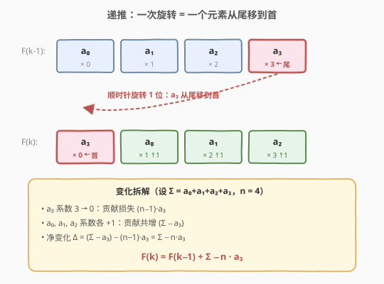
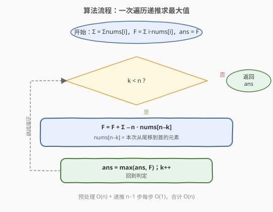
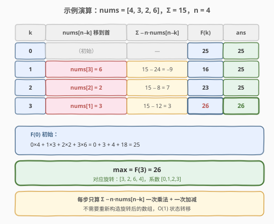

# 旋转函数

- **题目名称**：旋转函数
- **链接**：[396. 旋转函数](https://leetcode.cn/problems/rotate-function/)
- **难度**：中等
- **标签**：数组、数学、动态规划

## 1. 题目概述

给定长度为 `n` 的整数数组 `nums`。设 `arrk` 是 `nums` 顺时针旋转 `k` 个位置后的数组，定义**旋转函数**：

$$F(k) = 0 \cdot arr_k[0] + 1 \cdot arr_k[1] + \dots + (n-1) \cdot arr_k[n-1]$$

返回 $F(0), F(1), \dots, F(n-1)$ 中的**最大值**。生成的测试用例让答案符合 **32 位**整数。

**示例 1**：

```text
输入：nums = [4, 3, 2, 6]
输出：26
解释：
F(0) = 0*4 + 1*3 + 2*2 + 3*6 = 0 + 3 + 4 + 18 = 25
F(1) = 0*6 + 1*4 + 2*3 + 3*2 = 0 + 4 + 6 + 6 = 16
F(2) = 0*2 + 1*6 + 2*4 + 3*3 = 0 + 6 + 8 + 9 = 23
F(3) = 0*3 + 1*2 + 2*6 + 3*4 = 0 + 2 + 12 + 12 = 26
最大值 = F(3) = 26
```

**示例 2**：

```text
输入：nums = [100]
输出：0
解释：n = 1，F(0) = 0 * 100 = 0。
```

**约束条件**：

- $n = \text{nums.length}$
- $1 \le n \le 10^5$
- $-100 \le \text{nums}[i] \le 100$

> 💡 **关键规模**：$n$ 高达 $10^5$，意味着 $O(n^2)$ 的暴力枚举（每轮重算 $F(k)$）会超时，必须找到 $O(n)$ 的递推。

---

## 2. 解题思路

### 2.1 暴力思路

对每个 $k \in [0, n-1]$，构造旋转后的数组 $arr_k$，再按定义累加 $F(k)$。构造 $O(n)$、累加 $O(n)$，共 $n$ 轮，总时间 $O(n^2)$。$n = 10^5$ 时约 $10^{10}$ 次运算，必然超时。

### 2.2 核心观察：相邻旋转只差一个元素的位置



**关键洞察**：从 $F(k-1)$ 到 $F(k)$，旋转只把**最后一个元素**移到了开头。其余 $n-1$ 个元素的相对顺序未变，只是各自在乘法中的系数都 **+1**。

设 $arr_{k-1} = [a_0, a_1, \dots, a_{n-1}]$，记 $\Sigma = \sum_{i=0}^{n-1} a_i$（也就是 $\sum \text{nums}$，旋转不改变总和）。旋转 1 位后：

$$arr_k = [a_{n-1}, a_0, a_1, \dots, a_{n-2}]$$

对照两式系数：

| 元素 | 在 $F(k-1)$ 中系数 | 在 $F(k)$ 中系数 | 变化 |
|------|--------------------|------------------|------|
| $a_{n-1}$（被移到首） | $n-1$ | $0$ | $-(n-1) \cdot a_{n-1}$ |
| $a_0, a_1, \dots, a_{n-2}$ | $0, 1, \dots, n-2$ | $1, 2, \dots, n-1$ | $+(\Sigma - a_{n-1})$ |

净变化：

$$\Delta = (\Sigma - a_{n-1}) - (n-1) \cdot a_{n-1} = \Sigma - n \cdot a_{n-1}$$

于是得到 **$O(1)$ 状态转移**：

$$\boxed{F(k) = F(k-1) + \Sigma - n \cdot a_{n-1}}$$

> 💡 **$a_{n-1}$ 是谁？** 它是 $arr_{k-1}$ 的末尾元素。由于 $arr_k$ 是 $nums$ 顺时针旋转 $k$ 位的结果，可推得 $arr_{k-1}$ 的末尾元素正是 $nums[n-k]$（即原数组中下标为 $n-k$ 的元素，从 $k=1$ 起依次是 $nums[n-1], nums[n-2], \dots, nums[1]$）。故递推式可写成：

$$F(k) = F(k-1) + \Sigma - n \cdot nums[n-k], \quad k = 1, 2, \dots, n-1$$

> ⚠️ **别把 `nums[n-k]` 写反**：$k=1$ 时移走的是 $nums[n-1]$（原数组最后一位），$k=n-1$ 时移走的是 $nums[1]$。$k$ 不取到 $n$（因为 $F(n) = F(0)$，旋转一整圈回到原数组）。

### 2.3 算法流程图



1. **预处理**：一趟扫描计算 $\Sigma = \sum nums[i]$ 与 $F(0) = \sum i \cdot nums[i]$，初始化 `ans = F(0)`；
2. **递推**：对 $k = 1, 2, \dots, n-1$，执行 $F \gets F + \Sigma - n \cdot nums[n-k]$，并更新 `ans = max(ans, F)`；
3. **返回** `ans`。

### 2.4 示例演算

以 `nums = [4, 3, 2, 6]`（$\Sigma = 15$，$n = 4$）为例：



| $k$ | $nums[n-k]$（移到首） | $\Sigma - n \cdot nums[n-k]$ | $F(k)$ | ans |
|-----|------------------------|------------------------------|--------|-----|
| 0 | —（初始） | — | 25 | 25 |
| 1 | $nums[3] = 6$ | $15 - 24 = -9$ | $25 - 9 = 16$ | 25 |
| 2 | $nums[2] = 2$ | $15 - 8 = 7$ | $16 + 7 = 23$ | 25 |
| 3 | $nums[1] = 3$ | $15 - 12 = 3$ | $23 + 3 = 26$ | **26** |

$F(0) = 0 \times 4 + 1 \times 3 + 2 \times 2 + 3 \times 6 = 25$，递推 3 步得到 $F(3) = 26$，最大值 `ans = 26`。

> 💡 **观察负数情况**：虽然本题 $nums[i]$ 可为负，但递推公式对正负一视同仁——只要正确维护 $\Sigma$ 与 $F$，符号自动处理。若所有元素相同，则 $\Sigma - n \cdot nums[n-k] = 0$，所有 $F(k)$ 相等，递推稳定。

---

## 3. 参考代码

### C++

```cpp
class Solution {
  public:
    int maxRotateFunction(vector<int>& nums) {
        int n = nums.size();
        long long sum = 0, f = 0;
        for (int i = 0; i < n; i++) {
            sum += nums[i];
            f += (long long)i * nums[i];
        }
        long long ans = f;
        for (int k = 1; k < n; k++) {
            f = f + sum - (long long)n * nums[n - k];
            ans = max(ans, f);
        }
        return (int)ans;
    }
};
```

### Python

```python
class Solution:
    def maxRotateFunction(self, nums: List[int]) -> int:
        n = len(nums)
        total = sum(nums)
        f = sum(i * nums[i] for i in range(n))
        ans = f
        for k in range(1, n):
            f = f + total - n * nums[n - k]
            ans = max(ans, f)
        return ans
```

> 💡 **写法对照**：C++ 用 `long long` 防 32 位溢出（$n \le 10^5$、$|nums[i]| \le 100$，$F$ 量级达 $10^5 \times 10^5 \times 100 = 10^{12}$，超出 `int` 范围）；Python 整数任意精度无需担心。循环里 `nums[n - k]` 当 $k=1$ 取末位、$k=n-1$ 取 $nums[1]$，正好枚举完所有"会被移到首"的元素。

> ⚠️ **边界 $n = 1$**：循环 `for k in range(1, 1)` 不执行，直接返回 `f = 0 * nums[0] = 0`，符合示例 2。

---

## 4. 复杂度分析

| 维度 | 复杂度 | 说明 |
|------|--------|------|
| 时间复杂度 | $O(n)$ | 预处理一趟 $O(n)$；递推 $n-1$ 步每步 $O(1)$ |
| 空间复杂度 | $O(1)$ | 仅维护 `sum`、`f`、`ans` 三个变量，原地计算 |

> 💡 **时间下界**：至少要读完全部 $n$ 个数才能算出 $\Sigma$ 与 $F(0)$，$O(n)$ 已最优。

---

## 5. 扩展：递推公式的代数推导

除"系数对照表"外，也可直接做代数减法。设 $arr_{k-1}$ 末尾元素为 $a_{n-1}$，由旋转定义 $arr_k[i] = arr_{k-1}[(i-1) \bmod n]$：

$$
\begin{aligned}
F(k) &= \sum_{i=0}^{n-1} i \cdot arr_k[i] = \sum_{i=0}^{n-1} i \cdot arr_{k-1}[(i-1) \bmod n] \\
&= \sum_{i=1}^{n-1} i \cdot arr_{k-1}[i-1] + 0 \cdot arr_{k-1}[n-1] \\
&= \sum_{j=0}^{n-2} (j+1) \cdot arr_{k-1}[j] \quad (j = i-1) \\
&= \sum_{j=0}^{n-2} j \cdot arr_{k-1}[j] + \sum_{j=0}^{n-2} arr_{k-1}[j] \\
&= \big(F(k-1) - (n-1) \cdot a_{n-1}\big) + (\Sigma - a_{n-1}) \\
&= F(k-1) + \Sigma - n \cdot a_{n-1}.
\end{aligned}
$$

这与"系数对照"得到的结果完全一致。代数法的优势在于：当旋转规则改变（如逆时针旋转、跳跃旋转）时，仍可套用同样的"展开 + 拆分"思路推出新递推。

---

## 6. 面试要点

1. **为什么 $F(k)$ 可以由 $F(k-1)$ 在 $O(1)$ 内推出？**

   相邻两次旋转只差"末尾元素移到首位"这一步。该元素系数从 $n-1$ 变为 $0$（损失 $(n-1) \cdot a_{n-1}$），其余元素系数各 $+1$（共增 $\Sigma - a_{n-1}$）。两者合并得 $\Delta = \Sigma - n \cdot a_{n-1}$，与 $F(k-1)$ 相加即可。

2. **`nums[n-k]` 这个下标怎么来的？为什么不是 `nums[k]`？**

   $arr_{k-1}$ 是 $nums$ 顺时针旋转 $k-1$ 位的结果，其末尾元素对应原数组中下标 $n-k$。$k=1$ 时移走 $nums[n-1]$，$k=n-1$ 时移走 $nums[1]$，正好枚举完所有"会被移到首位"的元素（唯独不取 $nums[0]$，因为 $F(n)=F(0)$ 不必再算）。

3. **为什么答案符合 32 位整数，但中间过程要用 `long long`？**

   题目保证**最终答案**在 32 位范围内，但中间的 $F(k)$ 可能暂时溢出（例如 $\Sigma$ 与单项乘积量级可达 $10^{12}$）。C++ 必须用 `long long` 维护 `f`、`sum`、`ans`，最后再转回 `int`；Python 整数无此问题。

4. **如果改成"逆时针旋转"或"求最小值"，递推式怎么变？**

   逆时针旋转时是**首元素移到末尾**，系数变化相反：$a_0$ 从 $0$ 变 $n-1$（增 $(n-1) \cdot a_0$），其余系数各 $-1$（共减 $\Sigma - a_0$），故 $F(k) = F(k-1) - \Sigma + n \cdot a_0$。求最小值只需把 `ans = max(ans, f)` 换成 `ans = min(ans, f)`。

5. **暴力 $O(n^2)$ 会被卡到什么程度？**

   $n = 10^5$ 时 $O(n^2) \approx 10^{10}$ 次运算，C++ 一秒约 $10^8 \sim 10^9$ 次，必然超时（10 倍以上）。$O(n)$ 与 $O(n^2)$ 在本题规模下是"通过 / 超时"的分水岭，面试官常据此考察"能否发现递推"。

---

## 7. 同类练习题

- [189. 轮转数组](https://leetcode.cn/problems/rotate-array/)（[题解](../0101-0200/189_轮转数组.md)）：同样是数组旋转，但关注"如何原地构造旋转结果"，对比本题"如何利用旋转结构做递推"
- [724. 寻找数组的中心下标](https://leetcode.cn/problems/find-pivot-index/)：用前缀和 $O(n)$ 求左右两侧等和，与本题"预处理 $\Sigma$ 后 $O(1)$ 增量更新"思路相通
- [303. 区域和检索 - 数组不可变](https://leetcode.cn/problems/range-sum-query-immutable/)（[题解](../0301-0400/303_区域和检索 - 数组不可变.md)）：前缀和预处理 + $O(1)$ 查询，本题预处理 $\Sigma$ 与 $F(0)$ 是同一范式
- [528. 按权重随机选择](https://leetcode.cn/problems/random-pick-with-weight/)（[题解](../0501-0600/528_按权重随机选择.md)）：前缀和 + 一次扫算权重，与本题"一趟预处理 + 增量递推"结构类似
- [918. 最大环形子数组和](https://leetcode.cn/problems/maximum-sum-circular-subarray/)（[题解](../0901-1000/918_最大环形子数组和.md)）：环形结构上的最大值问题，与本题"旋转（环形）下求最值"有相似的环形处理思路
