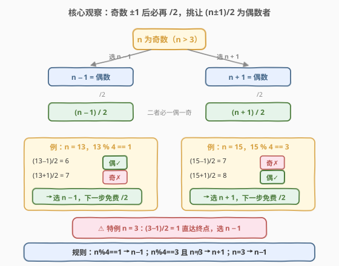
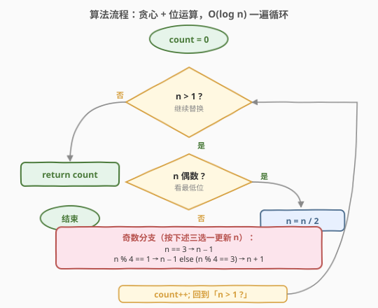
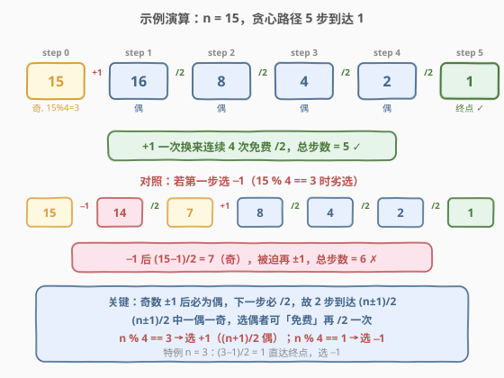

# 整数替换

- **题目名称**：整数替换
- **链接**：[397. 整数替换](https://leetcode.cn/problems/integer-replacement/)
- **难度**：中等
- **标签**：贪心、位运算、递归、记忆化搜索

## 1. 题目概述

给定一个正整数 `n`，可以做如下操作：

1. 若 `n` 是**偶数**，用 `n / 2` 替换 `n`；
2. 若 `n` 是**奇数**，用 `n + 1` 或 `n - 1` 替换 `n`。

返回 `n` 变为 `1` 所需的**最小替换次数**。

**示例 1**：

```text
输入：n = 8
输出：3
解释：8 -> 4 -> 2 -> 1
```

**示例 2**：

```text
输入：n = 7
输出：4
解释：7 -> 8 -> 4 -> 2 -> 1
      或 7 -> 6 -> 3 -> 2 -> 1
```

**示例 3**：

```text
输入：n = 4
输出：2
```

**约束条件**：

- $1 \le n \le 2^{31} - 1$

> ⚠️ **数据范围藏的坑**：`n` 上界是 `INT_MAX`（$2^{31}-1$）。当 `n` 为奇数时，`n + 1` 会溢出 32 位有符号 `int`。C++ 若直接对 `int` 做 `n + 1` 触发未定义行为，必须改用 `unsigned int` 或 `long long`。这是本题最高频的踩坑点（见第 3 节代码注解）。

---

## 2. 解题思路

### 2.1 暴力思路：递归 + 记忆化

直接按题意翻译成递归：偶数直接折半，奇数两条分支取较小者。

```text
f(1) = 0
f(n) = 1 + f(n / 2)                           n 偶
f(n) = 1 + min( f(n - 1), f(n + 1) )          n 奇
```

朴素递归对奇数会**两条分支同时展开**，状态空间呈指数爆炸。但稍作观察即可发现：**奇数 `n` 的两个后继 `n-1` 与 `n+1` 都是偶数，下一步必然 `/2`**。于是可以把「奇数 ±1」与「随后的 /2」**合并成一步**，递推变为：

$$
f(n) = 1 + \min\big(f((n-1)/2),\ f((n+1)/2)\big) \quad (n \text{ 奇},\ n > 1)
$$

合并后每个状态两步内**至少折半一次**，递归深度 $O(\log n)$。再配一个哈希表做记忆化，重复子问题不重算，整体复杂度可控。这是工程上稳妥、易写的解法。

> ⚠️ **记忆化的局限**：状态数虽为 $O(\log n)$，但 `n` 高达 $2^{31}$，哈希表在极端用例下常数较大；且奇数 `n + 1` 仍可能临时超出 `INT_MAX`，Python 无碍，C++ 必须用 `unsigned`/`long long` 承载。能否做到 $O(1)$ 空间、循环一遍？——这就引出贪心。

### 2.2 核心观察：奇数的贪心选择——让 `(n±1)/2` 落到偶数



关键直觉是：**奇数无论选 `+1` 还是 `-1`，结果都是偶数，下一步必然 `/2`。所以选哪个，本质是在比 `(n-1)/2` 与 `(n+1)/2` 谁更「好」。**

「好」的标准是什么？**偶数比奇数好**——因为偶数可以立刻再 `/2`，相当于「免费多吃一步折半」。考察 `(n-1)/2` 与 `(n+1)/2`，它们相差 `1`，**必为一偶一奇**：

| $n \bmod 4$ | $(n-1)/2$ | $(n+1)/2$ | 选谁（让结果为偶） |
|-------------|-----------|-----------|--------------------|
| $1$         | 偶        | 奇        | $n - 1$            |
| $3$         | 奇        | 偶        | $n + 1$            |

> 💡 **证明一偶一奇**：$n$ 奇数意味着 $n-1$ 与 $n+1$ 都是偶数。$\frac{n-1}{2}$ 与 $\frac{n+1}{2}$ 相差 $1$；又 $n \bmod 4$ 为 $1$ 时 $n-1$ 被 $4$ 整除（故 $(n-1)/2$ 偶），$n \bmod 4$ 为 $3$ 时 $n+1$ 被 $4$ 整除（故 $(n+1)/2$ 偶）。两者一偶一奇，证毕。

**特例 $n = 3$**：按规则 $3 \bmod 4 = 3$ 应选 $+1$，得 $4 \to 2 \to 1$（共 $3$ 步）；但选 $-1$ 得 $2 \to 1$（共 $2$ 步）。原因在于 $(3-1)/2 = 1$ **直接命中终点**，而 $(3+1)/2 = 2$ 还需一步。这是唯一的特例：**$n = 3$ 时选 $-1$**。

**为什么「选偶」严格最优？** 设 $n$ 奇、$n > 3$，记 $a = (n-1)/2$、$b = (n+1)/2 = a + 1$，一偶一奇。不失一般性设 $a$ 偶（即 $n \bmod 4 = 1$，应选 $n-1$）。若选错走 $b$（奇），则 $b$ 又要再 $\pm 1$ 一步才能折半，**多花一步却得不到更大的折半收益**（$a$ 与 $b$ 仅差 $1$，折半后量级相同）。形式化地，可对 $n$ 做归纳：$f(a) \le f(b)$ 当 $a$ 偶 $b$ 奇且 $a = b - 1$，故选 $a$ 不劣。归纳基础 $n \le 4$ 直接验证。

> ⚠️ 归纳的关键步骤：**偶数状态 $a$ 可以「免费」先 `/2` 一次**，即 $f(a) = 1 + f(a/2) \le 1 + f(a/2)$；而奇数状态 $b$ 必须 $1 + \min(f(b-1), f(b+1)) \ge 1 + f((b \pm 1)/2)$。把 $a = b - 1$ 代入展开可证 $f(a) \le f(b)$。完整的严格证明见第 5 节扩展。

### 2.3 算法流程图



由核心观察，算法只需一个循环：

1. **$n = 1$**：结束，返回 `count`。
2. **$n$ 偶**：`n /= 2`，`count++`（无脑折半，永远最优）。
3. **$n$ 奇**：
   - $n = 3$：`n -= 1`（特例）。
   - $n \bmod 4 = 1$：`n -= 1`（让 `(n-1)/2` 为偶）。
   - $n \bmod 4 = 3$：`n += 1`（让 `(n+1)/2` 为偶）。
   - `count++`。
4. 回到步骤 1。

> 💡 **每两步至少折半一次**：偶数直接折半；奇数 ±1 后下一步必折半。故循环体执行 $O(\log n)$ 次，$n \le 2^{31}-1$ 时至多约 $32$ 次。

### 2.4 示例演算

以 $n = 15$ 为例，展示贪心如何用 **5 步**到达 1，并与「第一步选 $-1$」的劣选路径（6 步）对照：



| 步 | 当前 $n$ | 性质 | 操作 | 下一 $n$ | 说明 |
|----|----------|------|------|----------|------|
| 1  | 15       | 奇, $15 \bmod 4 = 3$ | $+1$ | 16 | $(15+1)/2 = 8$ 为偶，选 $+1$ |
| 2  | 16       | 偶   | $/2$ | 8  | 免费折半 |
| 3  | 8        | 偶   | $/2$ | 4  | 免费折半 |
| 4  | 4        | 偶   | $/2$ | 2  | 免费折半 |
| 5  | 2        | 偶   | $/2$ | 1  | 到达终点 ✓ |

**对照（第一步误选 $-1$）**：$15 \xrightarrow{-1} 14 \xrightarrow{/2} 7 \xrightarrow{+1} 8 \xrightarrow{/2} 4 \xrightarrow{/2} 2 \xrightarrow{/2} 1$，共 **6 步**。多出的那一步正来自 $(15-1)/2 = 7$ 是奇数，被迫再 $\pm 1$ 一次——这就是「选错让后继落到奇数」的代价。

> 💡 一次 $+1$ 换来连续四次免费折半（$16 \to 8 \to 4 \to 2 \to 1$），这是贪心的典型收益结构：**用 1 步代价换 4 步免费下行**。

---

## 3. 参考代码

> 下面给出**两套**实现。面试中先讲记忆化递归（思路最直、容易写对），再被追问「$O(1)$ 空间」时引出贪心循环版——「先 baseline 再进阶」的节奏非常加分。

### 方案一：记忆化递归（思路直观，$O(\log n)$ 空间）

#### C++

```cpp
class Solution {
  public:
    int integerReplacement(int n) {
        unordered_map<unsigned, int> memo;
        return dfs((unsigned)n, memo);
    }
  private:
    int dfs(unsigned n, unordered_map<unsigned, int>& memo) {
        if (n == 1) return 0;
        auto it = memo.find(n);
        if (it != memo.end()) return it->second;
        int res;
        if (n % 2 == 0) {
            res = 1 + dfs(n / 2, memo);          // 偶数直接折半
        } else {
            // 奇数：合并「±1」与「随后的 /2」为一步
            res = 1 + min(dfs((n - 1) / 2, memo),
                          dfs((n + 1) / 2, memo));
        }
        memo[n] = res;
        return res;
    }
};
```

#### Python

```python
from functools import lru_cache

class Solution:
    def integerReplacement(self, n: int) -> int:
        @lru_cache(None)
        def dfs(x: int) -> int:
            if x == 1:
                return 0
            if x % 2 == 0:
                return 1 + dfs(x // 2)
            # 奇数：合并 ±1 与随后的 /2 为一步
            return 1 + min(dfs(x // 2), dfs((x + 1) // 2))
            # 注意 x//2 即 (x-1)//2（x 为奇时向下取整）
        return dfs(n)
```

> ⚠️ **Python `lru_cache` 的哈希键就是 `n` 本身**，状态数 $O(\log n)$，缓存不会爆。但若写 `dfs(n-1)` 与 `dfs(n+1)` 不合并 `/2`，奇数分支会多一层无意义的展开，常数变大——合并是关键优化。

### 方案二：贪心循环（$O(1)$ 空间，最优解）

#### C++

```cpp
class Solution {
  public:
    int integerReplacement(int n) {
        int count = 0;
        unsigned m = (unsigned)n;                // 防 n+1 溢出 INT_MAX
        while (m > 1) {
            if (m % 2 == 0) {
                m >>= 1;                         // 偶数：折半
            } else if (m == 3) {
                --m;                             // 特例：3 选 -1
            } else if (m % 4 == 1) {
                --m;                             // (n-1)/2 为偶
            } else {                            // m % 4 == 3
                ++m;                             // (n+1)/2 为偶
            }
            ++count;
        }
        return count;
    }
};
```

#### Python

```python
class Solution:
    def integerReplacement(self, n: int) -> int:
        count = 0
        while n > 1:
            if n % 2 == 0:
                n //= 2
            elif n == 3:
                n -= 1
            elif n % 4 == 1:
                n -= 1
            else:                               # n % 4 == 3
                n += 1
            count += 1
        return count
```

> ⚠️ **C++ 溢出陷阱**：`n` 形参是 `int`，当 `n = INT_MAX`（$2^{31}-1$，奇数）时，`n % 4 == 3`，算法要求 `n += 1`——但 `INT_MAX + 1` 是**有符号整数溢出，未定义行为**。解法是把 `n` 转成 `unsigned` 后再操作（`unsigned` 溢出是良定义的回绕），故第 4 行 `unsigned m = (unsigned)n;` 不可省。Python 无此问题。
>
> 💡 **位运算写法**：偶数折半用 `m >>= 1` 比 `m /= 2` 略快且语义明确；`m % 4` 也可写作 `m & 3`，但可读性稍差，本题不是性能瓶颈，保留 `% 4` 更清晰。

---

## 4. 复杂度分析

| 维度 | 方案一 记忆化递归 | 方案二 贪心循环 | 说明 |
|------|-------------------|-----------------|------|
| **时间复杂度** | $O(\log n)$ | $O(\log n)$ | 每 1~2 步至少折半一次，$n \le 2^{31}-1$ 时至多约 32 次迭代 |
| **空间复杂度** | $O(\log n)$（递归栈 + 哈希表） | $O(1)$ | 方案一状态数 $O(\log n)$；方案二仅用 `count` 与 `m` 两个变量 |
| **常数** | 较大（哈希 + 递归） | 极小 | 方案二是位运算 + 整数比较，pipeline 友好 |

> 💡 **严格说**，方案一的状态数上界是 $O(\log n)$：每个奇数状态 $n$ 会派生两个子状态 $(n-1)/2$ 与 $(n+1)/2$，但这两者差 $1$，后续展开大量重叠，记忆化去重后总状态数线性于递归深度。$n = 2^{31}-1$ 时实测状态数约几十，远低于理论宽松上界。

---

## 5. 扩展：贪心正确性的严格证明

第 2.2 节给出了直觉论证，这里补一份完整的归纳证明。

**命题**：对任意奇数 $n > 3$，设 $a = (n-1)/2$、$b = (n+1)/2 = a + 1$。若 $a$ 偶（$n \bmod 4 = 1$），则 $f(a) \le f(b)$；若 $b$ 偶（$n \bmod 4 = 3$），则 $f(b) \le f(a)$。即**选偶者不劣**。

**证明**（对 $n$ 强归纳，假设命题对所有 $< n$ 的奇数成立）：

不失一般性设 $a$ 偶、$b = a+1$ 奇（即 $n \bmod 4 = 1$，需证 $f(a) \le f(b)$）。

- $f(a) = 1 + f(a/2)$（$a$ 偶，直接折半）。
- $f(b) = 1 + \min\big(f((b-1)/2),\ f((b+1)/2)\big) = 1 + \min\big(f(a/2),\ f((a+2)/2)\big)$。

注意 $(b-1)/2 = a/2$。比较 $f(a/2)$ 与 $f((a+2)/2)$：

- 若 $a/2$ 与 $(a+2)/2 = a/2 + 1$ 一偶一奇，由归纳假设（两者都 $< n$），选偶者不劣，即 $\min$ 取到偶者对应的 $f$ 值，且该值 $\le f(\text{奇者})$。
- 于是 $f(b) = 1 + f(a/2)_{\min} \ge 1 + f(a/2)_{\min}$，而 $f(a/2)_{\min} = f(a/2)$（因 $a/2$ 本身就是候选之一），故 $f(b) \ge 1 + f(a/2) = f(a)$。

归纳成立。**归纳基础**：$n \le 4$ 直接枚举验证（$n=3$ 特例已说明）。

> 💡 这条证明的本质是**交换论证**：若最优解在某步「选了奇者」，把这一步换成「选偶者」后续路径不会更长——因为偶者可以免费多吃一步折半，把失去的「1 步代价」赚回来。

### 位运算等价写法

很多题解写成「$n \bmod 4 = 3$ 且 $n \ne 3$ 选 $+1$」的位运算版本，本质相同：

```cpp
if ((n & 3) == 3 && n != 3) ++n; else --n;
```

可读性见仁见智，建议面试时用 `% 4` 版本讲清思路，再用 `& 3` 提一句「位运算等价」展示功底即可。

---

## 6. 面试要点

1. **为什么奇数选「让 `(n±1)/2` 为偶数」的那一侧？**

   - 奇数 $\pm 1$ 后必为偶数，下一步必然 `/2`。所以选 `+1` 还是 `-1`，本质在比 `(n-1)/2` 与 `(n+1)/2`。
   - 两者相差 1，必一偶一奇。偶者可以立刻再 `/2`（免费折半），奇者还要再花一步 $\pm 1$。故选偶者严格不劣。
   - $n \bmod 4 = 1$ 时 $(n-1)/2$ 偶，选 $-1$；$n \bmod 4 = 3$ 时 $(n+1)/2$ 偶，选 $+1$。

2. **特例 $n = 3$ 为什么选 $-1$？**

   - $3 \bmod 4 = 3$，按规则应选 $+1$：$3 \to 4 \to 2 \to 1$，3 步。
   - 但选 $-1$：$3 \to 2 \to 1$，2 步。因为 $(3-1)/2 = 1$ 直接命中终点，省下了「$+1$ 后再折半到 2 再折半到 1」的额外两步。
   - 这是唯一特例：当 $(n-1)/2 = 1$ 即 $n = 3$ 时，$-1$ 路径直接结束，比「让后继为偶」更优。

3. **$n = 2^{31}-1$ 时 C++ 会出什么问题？怎么解决？**

   - `INT_MAX` 是奇数，`n % 4 == 3`，算法要求 `n += 1`。但 `INT_MAX + 1` 是**有符号 int 溢出，未定义行为**，可能得到负数或触发_trap。
   - 解法：把 `n` 转成 `unsigned int`（或 `long long`）后再做加减。`unsigned` 溢出是良定义的模 $2^{32}$ 回绕，`UINT_MAX + 1 == 0`，但本题 `n` 至多 `INT_MAX`，`+1` 后得 $2^{31}$，仍在 `unsigned` 范围内，安全。
   - Python 整数无限精度，无此问题。

4. **递归 + 记忆化为什么也 $O(\log n)$？状态不是会指数展开吗？**

   - 朴素递归（不合并 `/2`）确实指数爆炸。但只要把「奇数 $\pm 1$」与「随后的 `/2`」**合并成一步**，递推变为 $f(n) = 1 + \min(f((n-1)/2), f((n+1)/2))$，每步状态至少折半。
   - 两个子状态 $(n-1)/2$ 与 $(n+1)/2$ 相差 1，后续展开大量重叠，记忆化去重后总状态数 $O(\log n)$。
   - 不合并的话，$f(n-1)$ 与 $f(n+1)$ 各自再展开奇数分支，状态数会膨胀到 $O(n)$ 量级，超时。

5. **能否不用循环/递归，直接位运算算出答案？**

   - 可以分析二进制中 `1` 的分布得到一个公式版本，但本质上还是 $O(\log n)$ 地数位，且要处理特例 $n=3$ 与末尾连续 `1` 的情况，可读性差。
   - 面试中循环版已是最优复杂度，公式版属于炫技，不建议主动写。若面试官追问，可口头提一句「答案与 $n$ 的二进制位中 `1` 的段长有关」即可。

> 💡 **一句话总结**：397 是「奇数贪心」的招牌题——偶数无脑折半，奇数选让 `(n±1)/2` 为偶的一侧（$n \bmod 4 = 1$ 选 $-1$、$=3$ 选 $+1$），特例 $n = 3$ 选 $-1$。$O(\log n)$ 时间、$O(1)$ 空间。最大坑是 C++ 的 `INT_MAX + 1` 溢出，务必用 `unsigned` 承载。

---

## 7. 同类练习题

- [258. 各位相加](https://leetcode.cn/problems/add-digits/)（[题解](../0201-0300/258_各位相加.md)）：同为「用最少操作把数化到最小」的数学型题，对照「$O(\log n)$ 模拟」与「$O(1)$ 数学公式」两种思路。
- [29. 两数相除](https://leetcode.cn/problems/divide-two-integers/)（[题解](../0001-0100/29_两数相除.md)）：禁用运算符、用位运算模拟除法，与本题同属「把算术运算翻译成位运算」家族，且都要警惕 32 位溢出。
- [371. 两整数之和](https://leetcode.cn/problems/sum-of-two-integers/)（[题解](../0301-0400/371_两整数之和.md)）：位运算模拟加法，承接 29，与 397 共同打牢「按位思考」基本功。
- [191. 位 1 的个数](https://leetcode.cn/problems/number-of-1-bits/)（[题解](../0001-0100/191_位1的个数.md)）：`n & (n-1)` 抹最低设置位，位运算基础母题，配合本题理解二进制末两位与 $n \bmod 4$ 的关系。
- [453. 最小操作次数使数组元素相等](https://leetcode.cn/problems/minimum-moves-to-equal-array-elements/)：同样是「最少操作次数」型贪心，逆向思考「$n-1$ 等价于其它 $+1$」，与 397 的「选哪一侧」对照阅读。
