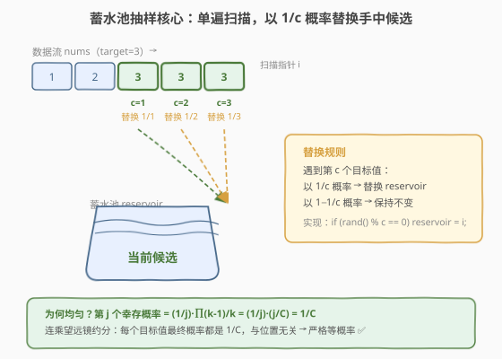
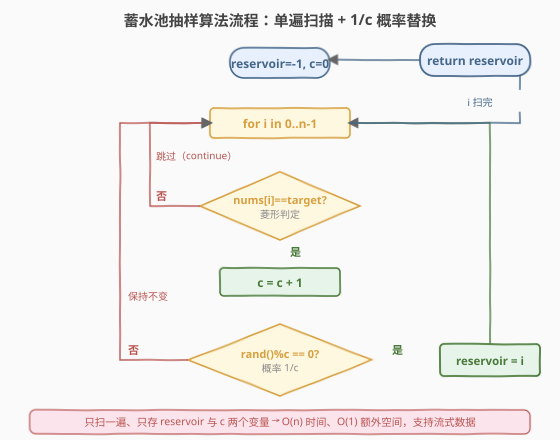
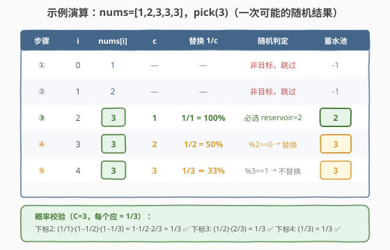

# LeetCode 随机数索引 题解

## 1. 题目概述

- **标题 / 题号**：随机数索引（#398，medium）
- **链接**：https://leetcode.cn/problems/random-pick-index/
- **难度**：中等
- **标签**：水塘/蓄水池抽样、哈希表、概率与随机、设计

**题意**：给定一个**可能包含重复元素**的整数数组 `nums`，请实现一个类，支持「随机返回一个等于 `target` 的元素下标」的操作。所有等于 `target` 的下标被选中的概率必须**相等**。可以多次调用 `pick(target)`。

```cpp
Solution(vector<int>& nums)   // 用数组 nums 初始化
int pick(int target)          // 随机返回一个满足 nums[i] == target 的下标 i
```

**示例 1**：

```text
输入：
["Solution", "pick", "pick", "pick"]
[[[1, 2, 3, 3, 3]], [3], [1], [3]]
输出：
[null, 4, 0, 2]

解释：
Solution solution = new Solution([1, 2, 3, 3, 3]);
solution.pick(3);  // nums 中等于 3 的下标有 {2, 3, 4}，三者等概率返回，这里返回 4
solution.pick(1);  // 等于 1 的下标只有 {0}，必然返回 0
solution.pick(3);  // 再次等概率从 {2, 3, 4} 中返回，这里返回 2
```

**约束**：

- `1 <= nums.length <= 2 * 10^4`
- `-2^31 <= nums[i] <= 2^31 - 1`
- `target` 一定存在于 `nums` 中
- `pick` 最多被调用 `10^4` 次

> 💡 **进阶要求（面试常被追问）**：能否给出一个 **`O(1)` 额外空间**的解法？如果数组**极大**（无法全部装入内存）、或者数据以**数据流**形式逐个到达、长度未知，又该如何等概率采样？——这正是**蓄水池抽样（Reservoir Sampling）**的招牌场景。本题是「**一道题学一个模板**」的典型：掌握 R 算法后可迁移到「未知总量的流式均匀采样」一整类问题。

## 2. 解题思路

### 2.1 直观思路：哈希表预存下标

最直觉的做法是在初始化时遍历一遍 `nums`，用哈希表把「每个值 → 出现过的所有下标列表」存下来。查询时取出 `target` 对应的下标列表，再等概率挑一个返回。

```text
初始化：pos = defaultdict(list)
        for i, x in nums: pos[x].append(i)
查询：  v = pos[target]
        return v[rand() % len(v)]
```

这个做法完全正确：预处理 `O(n)` 时间、`O(n)` 空间；每次 `pick` 是 `O(1)`。当 `pick` 调用次数很多、数组能装入内存时，它是工程上最优的选择。

> ⚠️ 但它有两个**硬伤**：(1) 需要 `O(n)` 额外空间存所有下标；(2) 必须事先知道整个数组并全部遍历一遍。若数组大到放不进内存、或数据是**流式到达**（一次扫过、无法回头），哈希表方案直接失效——而这正是面试官的进阶追问。

### 2.2 核心观察：蓄水池抽样（Reservoir Sampling, R 算法 k=1）



关键直觉是：**不必先知道有多少个目标值，一边扫描一边「以递减的概率」替换手中的候选，扫完时手中那个就是均匀抽到的。**

设扫描过程中已经遇到 `c` 个等于 `target` 的元素。规则非常简单：

> 💡 遇到第 `c` 个目标值时（`c = 1, 2, 3, ...`），以概率 $\dfrac{1}{c}$ **用它替换手中的候选下标**（即「蓄水池」），以概率 $1 - \dfrac{1}{c}$ **保持不变**。

第 1 个目标值必然被选中（概率 $1/1 = 1$）；第 2 个以 $1/2$ 概率顶替它；第 3 个以 $1/3$ 概率顶替……越往后，单个新元素「顶替成功」的概率越小，但**累积起来**却恰好让每个元素地位平等。

**为什么这样是均匀的？** 设最终共有 $C$ 个目标值，考察第 $j$ 个目标值（$1 \le j \le C$）成为最终候选的概率。它要成为最终结果，需要满足两件事：

1. 它在被扫描到时**被选中**：概率 $\dfrac{1}{j}$；
2. 它**没有被任何一个后续**第 $k$ 个（$j < k \le C$）目标值顶替掉：每个后续第 $k$ 个以 $1 - \dfrac{1}{k} = \dfrac{k-1}{k}$ 的概率不顶替，连乘起来。

于是

$$
P(j\text{ 幸存}) = \frac{1}{j} \cdot \prod_{k=j+1}^{C}\frac{k-1}{k}
$$

这个连乘是经典的**望远镜积（telescoping product）**，中间项逐项约掉：

$$
\prod_{k=j+1}^{C}\frac{k-1}{k} = \frac{j}{j+1}\cdot\frac{j+1}{j+2}\cdots\frac{C-1}{C} = \frac{j}{C}
$$

代回得

$$
P(j\text{ 幸存}) = \frac{1}{j}\cdot\frac{j}{C} = \frac{1}{C}
$$

即每个目标值最终被选中的概率都是 $\dfrac{1}{C}$，与下标无关，**严格均匀** ✅。

> ⚠️ 注意「以概率 $1/c$ 替换」的标准实现是 `rand() % c == 0`：`rand() % c` 在 `[0, c)` 均匀分布，等于 `0` 的概率恰为 $1/c$。务必用 `c`（已见的目标值计数）做分母，**不是**当前数组下标 `i`——因为非目标值不参与抽样。

### 2.3 算法流程图



```text
1. 初始化 reservoir = -1, c = 0
2. 顺序扫描 nums[i]，i = 0 .. n-1：
      若 nums[i] != target：跳过
      若 nums[i] == target：
          c++                              // 这是第 c 个目标值
          if rand() % c == 0:              // 以 1/c 概率替换
              reservoir = i
3. 扫描结束，返回 reservoir
```

> 💡 整个过程**只扫一遍**、**只存一个候选下标**，满足进阶追问的 `O(1)` 额外空间与流式数据要求。即便数据以流形式逐个到达、长度未知，算法照常工作——这正是蓄水池抽样的威力。

### 2.4 示例演算

以 `nums = [1, 2, 3, 3, 3]`、`pick(3)` 为例（目标值 `3` 共出现 3 次，下标分别为 2、3、4，期望每个被选中概率 $1/3$）：



| 步骤 | i | nums[i] | c | 替换概率 1/c | 随机判定（一次可能结果） | 蓄水池 |
|------|---|---------|---|--------------|--------------------------|--------|
| ① | 0 | 1 | — | — | 非目标，跳过 | -1 |
| ② | 1 | 2 | — | — | 非目标，跳过 | -1 |
| ③ | 2 | 3 | 1 | 1/1 = 100% | 必选 → reservoir = 2 | **2** |
| ④ | 3 | 3 | 2 | 1/2 = 50% | 假设 rand()%2 == 0 → 替换 | **3** |
| ⑤ | 4 | 3 | 3 | 1/3 ≈ 33% | 假设 rand()%3 == 1 → 不替换 | 3 |
| — | — | — | — | — | 扫描结束，返回 reservoir | **3** |

校验概率：下标 2 幸存需「选中(1/1)×不被④顶替(1/2)×不被⑤顶替(2/3)」= $1 \times \frac{1}{2} \times \frac{2}{3} = \frac{1}{3}$ ✅；下标 3 幸存需「选中(1/2)×不被⑤顶替(2/3)」= $\frac{1}{3}$ ✅；下标 4 幸存需「选中(1/3)」= $\frac{1}{3}$ ✅。三者严格相等。

## 3. 参考代码

> 下面给出**两套**实现。面试中先讲哈希表版（直观、高效），再被追问「`O(1)` 空间 / 流式数据」时自然引出蓄水池抽样版——这种「先给 baseline，再给进阶」的节奏非常加分。

### 方案一：哈希表预存（O(n) 空间，O(1) 查询）

#### C++

```cpp
// 随机数索引.cpp —— 方案一：哈希表预存下标
#include <vector>
#include <unordered_map>
#include <cstdlib>
using namespace std;

class Solution {
    unordered_map<int, vector<int>> pos;
public:
    Solution(vector<int>& nums) {
        for (int i = 0; i < (int)nums.size(); ++i)
            pos[nums[i]].push_back(i);          // 每个值 -> 它的所有下标
    }
    int pick(int target) {
        auto& v = pos[target];
        return v[rand() % v.size()];             // 等概率挑一个
    }
};
```

#### Python

```python
from collections import defaultdict
import random

class Solution:
    def __init__(self, nums: list[int]):
        self.pos: dict[int, list[int]] = defaultdict(list)
        for i, x in enumerate(nums):
            self.pos[x].append(i)

    def pick(self, target: int) -> int:
        v = self.pos[target]
        return random.choice(v)
```

### 方案二：蓄水池抽样（O(1) 额外空间，流式友好）

#### C++

```cpp
// 随机数索引.cpp —— 方案二：蓄水池抽样 R 算法 (k=1)
#include <vector>
#include <cstdlib>
using namespace std;

class Solution {
    vector<int> nums;
public:
    Solution(vector<int>& nums) : nums(nums) {}

    int pick(int target) {
        int reservoir = -1, c = 0;
        for (int i = 0; i < (int)nums.size(); ++i) {
            if (nums[i] != target) continue;    // 非目标值不参与抽样
            ++c;                                // 第 c 个目标值
            if (rand() % c == 0)                // 以 1/c 概率替换蓄水池
                reservoir = i;
        }
        return reservoir;
    }
};
```

#### Python

```python
import random

class Solution:
    def __init__(self, nums: list[int]):
        self.nums = nums

    def pick(self, target: int) -> int:
        reservoir = -1
        c = 0
        for i, x in enumerate(self.nums):
            if x != target:
                continue                        # 非目标值不参与抽样
            c += 1                              # 第 c 个目标值
            if random.randrange(c) == 0:        # 以 1/c 概率替换蓄水池
                reservoir = i
        return reservoir
```

> ⚠️ **实现易错点**：
> - 分母必须是**目标值计数 `c`**，不能写成 `rand() % (i + 1)`——非目标值不参与抽样，否则会破坏均匀性（详见面试要点 Q3）。
> - `rand() % c` 在大多数实现里均匀性足够；若对随机质量要求极高，可用 `std::uniform_int_distribution<int>(0, c - 1)` 配合 `std::mt19937`。
> - `c == 0` 时不要做 `rand() % c`（除零）。本题保证 `target` 存在，循环结束 `c >= 1`，但写代码时让 `rand() % c` 只在 `c >= 1` 的分支内执行更稳妥。

## 4. 复杂度分析

| 维度 | 方案一 哈希表 | 方案二 蓄水池抽样 | 说明 |
|------|--------------|-------------------|------|
| **预处理时间** | `O(n)` | `O(1)`（仅存引用） | 方案一初始化时遍历一次建表 |
| **单次 `pick` 时间** | `O(1)` 平均 | `O(n)` | 方案二每次都要扫一遍数组找目标值 |
| **额外空间** | `O(n)` | `O(1)` | 方案一存所有下标；方案二只存一个 `reservoir` 与计数 `c` |
| **流式 / 未知总量** | ❌ 不支持 | ✅ 支持 | 方案二不需要预先知道数据总量，也不必回头重扫 |

> 💡 **如何选型？** 若 `pick` 调用次数多、数组能装入内存 → **方案一**（均摊 `O(1)` 查询更优）；若数组极大 / 数据流式到达 / 只查一两次 / 面试官追问 `O(1)` 空间 → **方案二**。两者并非替代关系，而是**适用场景互补**——能在面试中讲清这个权衡是拿满分的关键。

## 5. 扩展：抽样 k 个样本（R 算法一般形式）

「蓄水池」之名正来自「水池里始终保留 `k` 个样本」的意象。当需要从长度未知的流中**等概率抽取 `k` 个**样本时，R 算法推广为：

1. 把流的前 `k` 个元素直接放入蓄水池（填满 `k` 格）。
2. 对第 `i` 个元素（`i > k`，从 1 计数），以概率 $\dfrac{k}{i}$ 决定是否放入蓄水池；若放入，则**随机踢掉蓄水池中已有的一个**（等概率选一个替换）。

可以证明（用与第 2.2 节类似的望远镜积），扫完整条流后，**每个元素留在蓄水池中的概率都是 $\dfrac{k}{n}$**（`n` 为流的总长度）。`k = 1` 时即退化为本题的版本：以 $\dfrac{1}{i}$ 概率替换，等价于「以 $\dfrac{1}{c}$ 概率替换」（`c` 是目标值计数）。

```cpp
// 从流 stream 中等概率抽取 k 个样本
vector<int> reservoirSampleK(istream& stream, int k) {
    vector<int> pool;
    int x, i = 0;
    while (stream >> x) {
        ++i;
        if ((int)pool.size() < k) {
            pool.push_back(x);                 // 前 k 个直接放入
        } else if (rand() % i < k) {           // 以 k/i 概率放入
            pool[rand() % k] = x;               // 随机替换池中一个
        }
    }
    return pool;
}
```

> 💡 这条通用模板在「**线上 A/B 实验从流量中均匀采样**」「**日志采样**」「**大数据等概率抽样**」等工程场景里直接可用，是算法工程师面试的高频加分项。

## 6. 面试要点

1. **蓄水池抽样为什么是均匀的？请给出证明。**

   - 设共有 $C$ 个目标值。第 $j$ 个成为最终结果，需要「被选中（$1/j$）」且「不被任何后续第 $k$ 个顶替（每个不顶替概率 $(k-1)/k$）」。
   - $P = \dfrac{1}{j}\displaystyle\prod_{k=j+1}^{C}\dfrac{k-1}{k}$，连乘**望远镜约分**得 $\dfrac{j}{C}$，故 $P = \dfrac{1}{j}\cdot\dfrac{j}{C} = \dfrac{1}{C}$，与 $j$ 无关，严格均匀。

2. **为什么分母用目标值计数 `c`，而不是当前下标 `i+1`？**

   - 蓄水池抽样要求「在**所有候选**中等概率选一个」。这里的候选是**等于 `target` 的元素**，非目标值根本不参与抽样。
   - 若用 `i+1` 做分母，则两次目标值之间夹的非目标值数量会改变替换概率，导致不同目标值的被选概率不再相等。用 `c`（候选计数）保证「第 `c` 个候选以 $1/c$ 替换」，这是均匀性证明的前提。

3. **哈希表方案和蓄水池方案，面试时该写哪个？**

   - 先写**哈希表**（baseline）：直观、`pick` 均摊 `O(1)`，是工程默认选择。然后主动指出它的两个局限：`O(n)` 空间、不能流式处理。
   - 接着给出**蓄水池抽样**作为进阶：`O(1)` 空间、流式友好，代价是单次 `pick` 升到 `O(n)`。讲清「**场景互补**」而非互相替代，体现工程权衡意识。

4. **`rand() % c == 0` 真的是 1/c 概率吗？有没有陷阱？**

   - `rand()` 返回 `[0, RAND_MAX]` 的整数，`rand() % c` 在 `[0, c-1]` 上**近似**均匀。当 `RAND_MAX + 1` 不能被 `c` 整除时存在**模偏差**（modulo bias），但对于本题 `c` 远小于 `RAND_MAX`，偏差可忽略。
   - 若面试官追问随机质量，改用 `std::uniform_int_distribution<int>(0, c-1)`（C++）或 `random.randrange(c)`（Python）消除模偏差。

5. **如果 `pick` 要被调用 `10^4` 次，蓄水池方案每次都 `O(n)` 会不会太慢？**

   - 会。$10^4 \times 2\times10^4 = 2\times10^8$ 次比较，在时间敏感的评测下可能超时。此时应切回**哈希表方案**（`O(n)` 预处理 + `O(1)` 查询）。
   - 蓄水池抽样的价值不在「多查高效」，而在「**单查省空间 / 流式可用**」。它的典型应用是「只采样一次、数据量巨大或流式」——选型时务必对应场景，而非无脑套用。

> 💡 **一句话总结**：398 是蓄水池抽样的招牌题——单遍扫描、`O(1)` 空间、以 $1/c$ 概率替换手中候选，扫完即得等概率样本。均匀性靠**望远镜积**证明；分母必须用**候选计数 `c`** 而非下标。它与哈希表方案**场景互补**，面试先给 baseline 再引出进阶，是「概率采样」家族的母题。

## 同类练习题

| # | 题目 | 与本题的关联 |
|---|------|-------------|
| 382 | [链表随机节点](https://leetcode.cn/problems/linked-list-random-node/) | 链表上等概率取一个节点，链表长度未知且不可下标访问，蓄水池抽样 `k=1` 的最纯净应用。 |
| 470 | [用 Rand7() 实现 Rand10()](https://leetcode.cn/problems/implement-rand10-using-rand7/)（[题解](../0401-0500/470_用Rand7实现Rand10.md)） | 另一类概率采样套路——**拒绝采样**，与蓄水池抽样互为补充。 |
| 528 | [按权重随机选择](https://leetcode.cn/problems/random-pick-with-weight/) | 按权重抽样，用**前缀和 + 二分**实现，对比「等概率」与「加权概率」两种采样。 |
| 497 | [非重叠矩形中的随机点](https://leetcode.cn/problems/random-point-in-non-overlapping-rectangles/) | 按面积加权前缀和 + 二分定位 + 拒绝/直接采样，概率采样的综合题。 |
| 710 | [黑名单中的随机数](https://leetcode.cn/problems/random-pick-with-blacklist/) | 在带黑名单的范围内均匀采样，用哈希重映射把「不均匀」化归为「均匀」，采样问题进阶。 |
