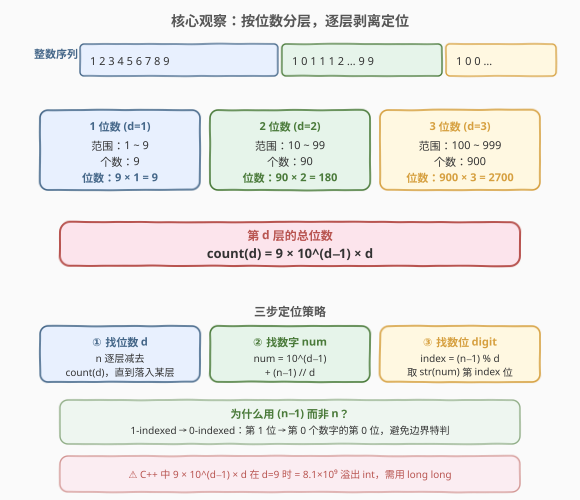
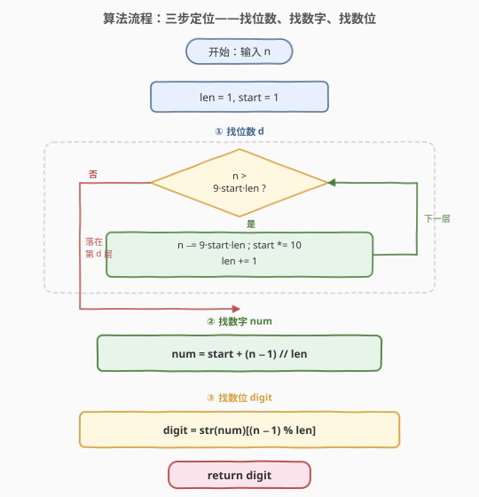
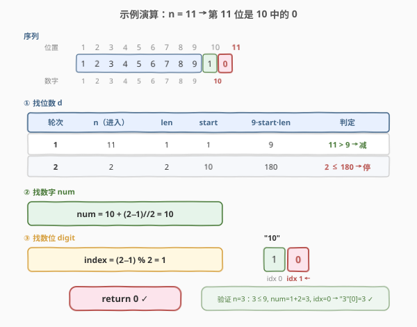

# 第 N 位数字

- **题目名称**：第 N 位数字
- **链接**：[400. 第 N 位数字](https://leetcode.cn/problems/nth-digit/)
- **难度**：中等
- **标签**：数学、模拟

## 1. 题目概述

在无限整数序列 `[1, 2, 3, 4, 5, 6, 7, 8, 9, 10, 11, ...]` 中，返回第 `n` 位上的数字。

**示例 1**：

```text
输入：n = 3
输出：3
```

**示例 2**：

```text
输入：n = 11
输出：0
解释：第 11 位数字在序列 1, 2, 3, 4, 5, 6, 7, 8, 9, 10, 11, ... 里是 0，它是 10 的一部分。
```

**约束条件**：

- $1 \le n \le 2^{31} - 1$

> ⚠️ $n$ 可达 $2^{31}-1 \approx 2.15 \times 10^9$。任何"逐位遍历序列"的模拟都会超时——前 $10^9$ 位的序列包含近 $10^8$ 个数字，遍历不可行。必须从**按位数分层**的结构切入，用 $O(\log n)$ 的数学定位直接锁定目标数字。

---

## 2. 解题思路

### 2.1 暴力思路：逐位拼接再数

最直白的做法：从 1 开始逐个数字拼成字符串 `"123456789101112..."`，取第 $n$ 位。

```text
s = ""
i = 1
while len(s) < n:
    s += str(i)
    i += 1
return int(s[n - 1])
```

问题：$n = 2^{31}-1$ 时字符串长达 20 亿字符，内存远超限制；构造时间 $O(n)$ 也远超时限。

> 💡 暴力法的浪费在于：它把所有数字**平铺**成一个序列，丢失了"数字按位数天然分层"的结构。换视角：不必构造序列，而是**逐层减去每层的数字总位数**，直接定位第 $n$ 位落在哪个数字的哪一位。

### 2.2 核心观察：按位数分层，逐层剥离



整数序列按**数字的位数** $d$ 天然分层：

| 位数 $d$ | 数字范围 | 数字个数 | 该层总位数 |
|----------|----------|----------|-----------|
| 1 | $1$ ~ $9$ | $9$ | $9 \times 1 = 9$ |
| 2 | $10$ ~ $99$ | $90$ | $90 \times 2 = 180$ |
| 3 | $100$ ~ $999$ | $900$ | $900 \times 3 = 2700$ |
| $d$ | $10^{d-1}$ ~ $10^d-1$ | $9 \times 10^{d-1}$ | $9 \times 10^{d-1} \times d$ |

**定位策略**——三步走：

1. **找位数 $d$**：从 $d=1$ 起，逐层减去该层总位数 $9 \times 10^{d-1} \times d$，直到剩余的 $n$ 落在某一层内。
2. **找数字**：剩余 $n$ 是该层内的第 $n$ 位（从 1 开始计）。该层起始数字为 $10^{d-1}$，每个数字占 $d$ 位，所以目标数字是第 $\lfloor (n-1)/d \rfloor$ 个（从 0 开始计），即 $\text{num} = 10^{d-1} + \lfloor (n-1)/d \rfloor$。
3. **找数位**：在数字 $\text{num}$ 中，目标位是第 $(n-1) \bmod d$ 位（从 0 开始计，从左到右）。

> 💡 **为什么用 $(n-1)/d$ 而不是 $n/d$？** 因为"第 1 位"应对应"第 0 个数字"（同数字内第 0 位）。把 1-indexed 的 $n$ 转成 0-indexed 后做整除与取余，可避免边界特判——这与 [704. 二分查找](../0001-0100/704_二分查找.md) 中"左闭右闭 $[l, r]$ 模板"使用 $\le$ 判定是同一类"统一边界"思想。

### 2.3 算法流程图



迭代流程：

1. 初始化 `len = 1, start = 1`（`start` = 该层起始数字 $10^{\text{len}-1}$）。
2. **第一步——找位数**：当 `n > 9 * start * len` 时，执行 `n -= 9 * start * len; start *= 10; len += 1`。
3. **第二步——找数字**：`num = start + (n - 1) // len`。
4. **第三步——找数位**：`digit = str(num)[(n - 1) % len]`。
5. 返回 `digit` 对应的整数值。

> ⚠️ **溢出注意**：`9 * start * len` 在 `len = 9` 时为 $9 \times 10^8 \times 9 = 8.1 \times 10^9$，超过 `int` 上界 $2^{31}-1 \approx 2.15 \times 10^9$。C++ 中必须用 `long long` 计算，详见第 5 节。

### 2.4 示例演算



以 $n = 11$ 为例：

**第一步——找位数**：

| 轮次 | n（进入） | len | start | $9 \cdot \text{start} \cdot \text{len}$ | 判定 | 动作 |
|------|----------|-----|-------|---------------------------------------|------|------|
| 1 | 11 | 1 | 1 | 9 | $11 > 9$ ✓ | $n = 11 - 9 = 2$，`start *= 10`, `len++` |
| 2 | 2 | 2 | 10 | 180 | $2 \le 180$ ✗ | 停在第 2 层 |

**第二步——找数字**：

$$\text{num} = \text{start} + \left\lfloor\frac{n-1}{\text{len}}\right\rfloor = 10 + \left\lfloor\frac{1}{2}\right\rfloor = 10 + 0 = 10$$

**第三步——找数位**：

$$\text{index} = (n-1) \bmod \text{len} = 1 \bmod 2 = 1$$

数字 $10$ 的字符串 `"10"` 的第 1 位（0-indexed）是 `'0'`，返回 **0** ✓。

再快速验证 $n = 3$：$3 \le 9$（第 1 层），$\text{num} = 1 + \lfloor 2/1 \rfloor = 3$，$\text{index} = 2 \bmod 1 = 0$，`"3"[0]` $= 3$ ✓。

---

## 3. 参考代码

### C++

```cpp
class Solution {
  public:
    int findNthDigit(int n) {
        int len = 1;
        long long start = 1;
        while (n > 9 * start * len) {
            n -= 9 * start * len;
            start *= 10;
            len++;
        }
        long long num = start + (n - 1) / len;
        string s = to_string(num);
        return s[(n - 1) % len] - '0';
    }
};
```

### Python

```python
class Solution:
    def findNthDigit(self, n: int) -> int:
        len_ = 1          # 当前层的位数 d
        start = 1         # 当前层起始数字 10^(d-1)
        while n > 9 * start * len_:
            n -= 9 * start * len_
            start *= 10
            len_ += 1
        num = start + (n - 1) // len_
        return int(str(num)[(n - 1) % len_])
```

> 💡 两版逻辑完全一致，核心是三步定位。Python 用 `len_` 而非 `len` 避免遮蔽内置函数。C++ 中 `start` 必须为 `long long`，因为 `9 * start * len` 在 `len=9` 时溢出 `int`（详见第 5 节）。

---

## 4. 复杂度分析

| 维度 | 复杂度 | 说明 |
|------|--------|------|
| 时间复杂度 | $O(\log n)$ | `while` 循环每轮 `start` 乘 10（即位数 $d$ 加 1），$n \le 2^{31}-1$ 时 $d \le 9$，至多 9 轮；后续 `to_string` 也 $O(d) = O(\log n)$ |
| 空间复杂度 | $O(\log n)$ | `to_string(num)` 生成 $d$ 位字符串，$d \le 9$；若用数学取位替代字符串转换可降到 $O(1)$ |

> 💡 之所以是对数时间，是因为我们没有遍历序列，而是按**位数分层**直接定位——每层一次减法 $O(1)$，层数 $O(\log_{10} n)$。这与 [172. 阶乘后的零](../0101-0200/172_阶乘后的零.md) 按 $5$ 的幂次分层累加、[390. 消除游戏](../0301-0400/390_消除游戏.md) 按等差数列不变式递推同属"结构降维"一族。

---

## 5. 扩展：溢出分析与取位优化

### 5.1 为什么 C++ 必须用 `long long`

题目约束 $n \le 2^{31}-1 \approx 2.15 \times 10^9$。各层的总位数累加如下：

| 层数 $d$ | 该层位数 $9 \times 10^{d-1} \times d$ | 累计位数 |
|----------|---------------------------------------|----------|
| 1 | 9 | 9 |
| 2 | 180 | 189 |
| 3 | 2,700 | 2,889 |
| 4 | 36,000 | 38,889 |
| 5 | 450,000 | 488,889 |
| 6 | 5,400,000 | 5,888,889 |
| 7 | 63,000,000 | 68,888,889 |
| 8 | 720,000,000 | 788,888,889 |
| 9 | 8,100,000,000 | 8,888,888,889 |

$n$ 最大落在第 9 层。循环条件 `9 * start * len` 在 $d=9$ 时为 $9 \times 10^8 \times 9 = 8.1 \times 10^9$，远超 `int` 上界 $2.15 \times 10^9$。若 `start` 为 `int`，乘法中间结果溢出，导致错误判定。

**解法**：将 `start` 声明为 `long long`，则 `9 * start * len` 自动提升为 `long long` 运算，安全无溢出。`num` 同理需 `long long`（$d=9$ 时目标数字可达 $10^8$ 量级，虽不溢出 `int` 但为统一安全仍用 `long long`）。

### 5.2 取位优化：避免 `to_string`

`to_string(num)` 需要 $O(d)$ 空间存字符串。若追求严格 $O(1)$ 空间，可用数学方法取第 $k$ 位（从左数）：

$$\text{digit} = \left\lfloor \frac{\text{num}}{10^{\text{len} - 1 - \text{index}}} \right\rfloor \bmod 10$$

其中 $\text{index} = (n-1) \bmod \text{len}$ 是目标位在数字中从左数的 0-indexed 位置。等价于先把数字右移 $(\text{len}-1-\text{index})$ 位使目标位变到个位，再取模 10。

```cpp
int idx = (n - 1) % len;
int power = 1;
for (int i = 0; i < len - 1 - idx; ++i) power *= 10;
return (num / power) % 10;
```

实际面试中 `to_string` 写法更直观、$d \le 9$ 空间可忽略，推荐优先使用。

---

## 6. 面试要点

1. **为什么不能逐位拼接字符串？**

   > $n$ 可达 $2^{31}-1 \approx 21.5$ 亿，字符串长达 20 亿字符，内存远超限制；构造时间 $O(n)$ 也远超时限。必须从"按位数分层"的结构切入，用 $O(\log n)$ 定位。

2. **三步定位分别是什么？**

   > ① **找位数** $d$：逐层减去 $9 \times 10^{d-1} \times d$，直到 $n$ 落在某一层。② **找数字**：$\text{num} = 10^{d-1} + \lfloor(n-1)/d\rfloor$。③ **找数位**：取 `str(num)` 的第 $(n-1) \bmod d$ 位。

3. **为什么用 $(n-1)/d$ 而不是 $n/d$？**

   > 把 1-indexed 的 $n$ 转成 0-indexed 后做整除与取余，使"第 1 位"对应"第 0 个数字的第 0 位"，避免边界特判。这是处理"第 k 个"类问题的通用技巧。

4. **C++ 中为什么 `start` 要用 `long long`？**

   > 循环条件 `9 * start * len` 在 $d=9$ 时为 $8.1 \times 10^9$，超过 `int` 上界。若 `start` 为 `int`，乘法中间结果溢出。声明为 `long long` 后乘法自动提升为 64 位运算。

5. **时间复杂度为什么是 $O(\log n)$？**

   > `while` 循环每轮位数 $d$ 加 1（即 `start` 乘 10），$n \le 2^{31}-1$ 时 $d \le 9$，至多 9 轮。每轮 $O(1)$，总 $O(\log_{10} n)$。

6. **如果面试官追问"第 $n$ 位是哪个数字的第几位"怎么答？**

   > 就是三步定位的后两步：数字 $\text{num} = 10^{d-1} + \lfloor(n-1)/d\rfloor$，位序 $(n-1) \bmod d$（0-indexed 从左）。先定层再定数字再定位，三步 $O(\log n)$。

> 💡 **一句话总结**：400 是"按位数分层定位"的招牌题——整数序列按位数 $d$ 天然分层，每层贡献 $9 \times 10^{d-1} \times d$ 位；逐层减去层贡献锁定层数，再用 $(n-1)/d$ 与 $(n-1) \bmod d$ 定数字与数位，$O(\log n)$ 搞定。核心洞察是"不构造序列，按结构定位"，与 172、390 同属数学降维一族。

---

## 7. 同类练习题

- [440. 字典序的第 K 小数字](https://leetcode.cn/problems/k-th-smallest-in-lexicographical-order/)：在字典序的整数序列中找第 $k$ 小，同样用"按层计数 + 逐层推进"的思路定位，是 400 的"字典序版"姊妹题
- [357. 统计各位数字都不同的数字个数](https://leetcode.cn/problems/count-numbers-with-unique-digits/)（[站内题解](../0301-0400/357_统计各位数字都不同的数字个数.md)）：按位数分类计数，与 400 的"按位数分层"思路同构
- [172. 阶乘后的零](https://leetcode.cn/problems/factorial-trailing-zeroes/)（[站内题解](../0101-0200/172_阶乘后的零.md)）：按 $5$ 的幂次分层累加，同属"按结构分层"的数学降维题
- [233. 数字 1 的个数](https://leetcode.cn/problems/number-of-digit-one/)：按位值分解统计 $[1,n]$ 中数字 1 出现次数，同为"按数位分层"的计数题
- [390. 消除游戏](https://leetcode.cn/problems/elimination-game/)（[站内题解](../0301-0400/390_消除游戏.md)）：用等差数列不变式把 $O(n)$ 模拟降维到 $O(\log n)$，与 400 的"不构造直接定位"同属降维打击
