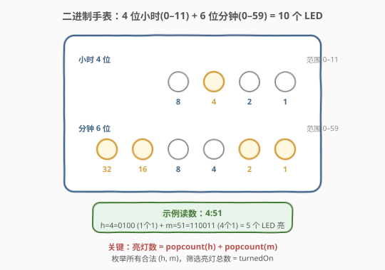
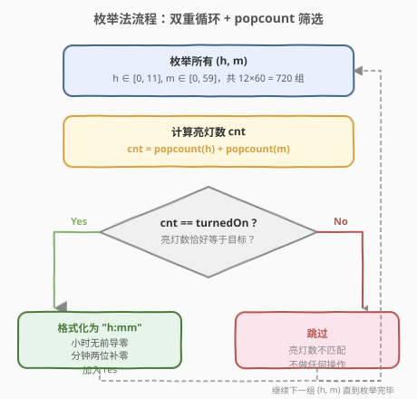
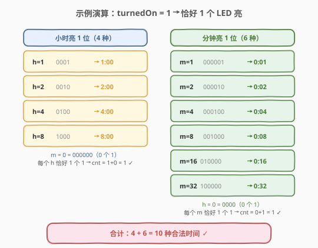

# 二进制手表

- **题目名称**：二进制手表
- **链接**：[401. 二进制手表](https://leetcode.cn/problems/binary-watch/)
- **难度**：简单
- **标签**：位运算、枚举、回溯

## 1. 题目概述

二进制手表顶部有 **4 个 LED** 代表小时（0–11），底部有 **6 个 LED** 代表分钟（0–59）。每个 LED 代表一个 0 或 1，最低位在右侧。给定整数 `turnedOn` 表示当前亮着的 LED 数量，返回二进制手表可以表示的所有可能时间。

- 小时不以零开头（如 `"1:00"` 而非 `"01:00"`）。
- 分钟必须由两位数组成，可以以零开头（如 `"10:02"` 而非 `"10:2"`）。

**示例 1**：

```text
输入：turnedOn = 1
输出：["0:01","0:02","0:04","0:08","0:16","0:32","1:00","2:00","4:00","8:00"]
```

**示例 2**：

```text
输入：turnedOn = 9
输出：[]
```

**约束条件**：

- $0 \le \text{turnedOn} \le 10$

> 💡 **搜索空间极小**：10 个 LED 共 $2^{10} = 1024$ 种亮灭组合；合法时间仅 $12 \times 60 = 720$ 种。无论哪种枚举方式都是常数级，无需担心性能。

---

## 2. 解题思路

### 2.1 暴力思路：枚举 LED 亮灭组合

最直接的想法：枚举 10 个 LED 的所有亮灭组合（共 $2^{10} = 1024$ 种），对每种组合：

1. 把高 4 位解码成小时 $h$，低 6 位解码成分钟 $m$。
2. 检查合法性：$h \le 11$ 且 $m \le 59$。
3. 若合法且亮灯数恰好等于 `turnedOn`，格式化加入结果。

> ⚠️ 缺点：需要先解码再校验合法性，且 $1024$ 种中有大量非法组合（如 $h > 11$）被丢弃，做了无用功。

### 2.2 核心观察：反转视角——枚举合法时间，数 1 的位数



关键观察：**与其枚举 LED 组合再解码，不如直接枚举所有合法时间 $(h, m)$，再数其二进制中 1 的个数**。

- 小时 $h \in [0, 11]$，分钟 $m \in [0, 59]$，共 $12 \times 60 = 720$ 组。
- 对每组 $(h, m)$，计算 $\text{popcount}(h) + \text{popcount}(m)$。
- 若总和等于 `turnedOn`，则这是一种合法亮法，格式化为 `"h:mm"` 加入结果。

> 💡 **为何更优**：720 < 1024，且每组都是合法时间，无需丢弃。更重要的是——**合法时间天然枚举了所有可能的 $(h, m)$，而亮灯数是其属性**，用属性做筛选比用模式做校验更自然。这是「枚举合法解空间 + 属性筛选」的经典范式。

### 2.3 算法流程图



算法分三步：

1. **枚举**：双重循环遍历 $h \in [0, 11]$、$m \in [0, 59]$，共 $720$ 组。
2. **计数**：对每组计算 $\text{cnt} = \text{popcount}(h) + \text{popcount}(m)$。
3. **筛选**：若 $\text{cnt} = \text{turnedOn}$，格式化为 `"h:mm"`（分钟两位补零）加入结果；否则跳过。

### 2.4 示例演算

以 `turnedOn = 1` 为例，只有「恰好 1 个 LED 亮」的时间才合法：



| 来源 | h | h 二进制 | m | m 二进制 | 亮灯数 | 时间 |
|------|---|---------|---|---------|--------|------|
| 小时亮 1 位 | 1 | 0001 | 0 | 000000 | 1+0=1 | 1:00 |
| 小时亮 1 位 | 2 | 0010 | 0 | 000000 | 1+0=1 | 2:00 |
| 小时亮 1 位 | 4 | 0100 | 0 | 000000 | 1+0=1 | 4:00 |
| 小时亮 1 位 | 8 | 1000 | 0 | 000000 | 1+0=1 | 8:00 |
| 分钟亮 1 位 | 0 | 0000 | 1 | 000001 | 0+1=1 | 0:01 |
| 分钟亮 1 位 | 0 | 0000 | 2 | 000010 | 0+1=1 | 0:02 |
| 分钟亮 1 位 | 0 | 0000 | 4 | 000100 | 0+1=1 | 0:04 |
| 分钟亮 1 位 | 0 | 0000 | 8 | 001000 | 0+1=1 | 0:08 |
| 分钟亮 1 位 | 0 | 0000 | 16 | 010000 | 0+1=1 | 0:16 |
| 分钟亮 1 位 | 0 | 0000 | 32 | 100000 | 0+1=1 | 0:32 |

共 **10 种**，与示例 1 一致 ✓。

> 💡 当 `turnedOn ≥ 9` 时无解：小时最多 3 个 1（$11 = 1011_2$），分钟最多 5 个 1（$59 = 111011_2$），合计最多 8。

---

## 3. 参考代码

### C++

```cpp
class Solution {
public:
    vector<string> readBinaryWatch(int turnedOn) {
        vector<string> res;
        for (int h = 0; h < 12; ++h) {
            for (int m = 0; m < 60; ++m) {
                if (__builtin_popcount(h) + __builtin_popcount(m) == turnedOn) {
                    res.push_back(to_string(h) + ":" + (m < 10 ? "0" : "") + to_string(m));
                }
            }
        }
        return res;
    }
};
```

### Python

```python
class Solution:
    def readBinaryWatch(self, turnedOn: int) -> List[str]:
        res = []
        for h in range(12):
            for m in range(60):
                if bin(h).count('1') + bin(m).count('1') == turnedOn:
                    res.append(f"{h}:{m:02d}")
        return res
```

> 💡 Python 的 `bin(x).count('1')` 是最直观的 popcount 写法；`f"{h}:{m:02d}"` 一行搞定「小时无前导零、分钟两位补零」的格式要求。C++ 用 `__builtin_popcount` 内建函数，GCC/Clang 均支持。

---

## 4. 复杂度分析

| 维度 | 复杂度 | 说明 |
|------|--------|------|
| 时间复杂度 | $O(1)$ | 双重循环 $12 \times 60 = 720$ 次迭代，每次 $O(1)$ 的位计数与比较，与输入规模无关 |
| 空间复杂度 | $O(1)$ | 结果列表最多 $720$ 个字符串（常数级），不计入额外空间则 $O(1)$ |

> 💡 严格来说结果数量是 $O(\min(\text{turnedOn 的合法解数}, 720))$，但上界为常数 720，故记 $O(1)$。这是「搜索空间本身为常数」的典型题目。

---

## 5. 扩展：回溯法（按 LED 位选/不选）

若面试官要求用**回溯**实现（本题在 LeetCode 上标记为「回溯」），可从 10 个 LED 位中选 `turnedOn` 个亮起：

```python
class Solution:
    def readBinaryWatch(self, turnedOn: int) -> List[str]:
        res = []
        def dfs(i: int, count: int, h: int, m: int):
            if count == turnedOn:
                if h < 12 and m < 60:
                    res.append(f"{h}:{m:02d}")
                return
            if i == 10:
                return
            # 不选第 i 位
            dfs(i + 1, count, h, m)
            # 选第 i 位（前 4 位是小时，权重 1<<i；后 6 位是分钟，权重 1<<(i-4)）
            if i < 4:
                nh = h | (1 << i)
                if nh < 12:
                    dfs(i + 1, count + 1, h | (1 << i), m)
            else:
                nm = m | (1 << (i - 4))
                if nm < 60:
                    dfs(i + 1, count + 1, h, m | (1 << (i - 4)))
        dfs(0, 0, 0, 0)
        return res
```

回溯法的搜索树大小为 $C(10, \text{turnedOn})$，在 `turnedOn = 5` 时最大约 252 个叶节点，比枚举法的 720 还小。但实现更复杂，且在选的过程中就做了剪枝（`h < 12`、`m < 60` 在选某位时即判定，不满足则不进入该分支）。

> ⚠️ 回溯法中的**剪枝时机**是关键：在选某位时立即检查 `h | (1 << i) < 12` 或 `m | (1 << (i-4)) < 60`，若越界则直接不进入该分支。这比「选完再判」更高效——提前截断非法子树。若不在选时剪枝，则退化为枚举 $2^{10}$ 再筛选，失去了回溯的意义。

---

## 6. 面试要点

1. **为什么枚举时间比枚举 LED 组合更好？**
   - 枚举时间：$12 \times 60 = 720$ 组，全部合法，只需 popcount 筛选。枚举 LED：$2^{10} = 1024$ 组，需解码 + 合法性校验，且有 $304$ 组非法被丢弃。前者搜索空间更小、逻辑更直接。

2. **`__builtin_popcount` 和 `bin(x).count('1')` 有什么区别？**
   - 前者是编译器内建函数，可能映射到 CPU 指令级实现（POPCNT），效率高；后者需构造字符串再遍历计数，常数更大但代码更直观。本题搜索空间极小，两者无实质差异。

3. **为什么 `turnedOn ≥ 9` 时一定无解？**
   - 小时最大 $11 = 1011_2$（3 个 1），分钟最大 $59 = 111011_2$（5 个 1），合计最多 8 个 1。故 `turnedOn ≥ 9` 时返回空列表。

4. **如何处理输出格式「小时无前导零、分钟两位补零」？**
   - C++：`to_string(h) + ":" + (m < 10 ? "0" : "") + to_string(m)`。Python：`f"{h}:{m:02d}"`，其中 `:02d` 表示两位补零。注意小时不能用 `:02d`，否则 `"01:00"` 不合法。

5. **回溯法与枚举法的时间复杂度有何差异？**
   - 枚举法恒定 720 次迭代。回溯法为 $C(10, k)$，在 $k=5$ 时最大约 252，$k=0$ 或 $k=10$ 时为 1。回溯法平均更小但需递归开销；枚举法更简洁且无递归。面试中两者均可，枚举法代码更短更不易错。

---

## 7. 同类练习题

- [191. 位 1 的个数](https://leetcode.cn/problems/number-of-1-bits/)（[题解](../0001-0100/191_位1的个数.md)）：popcount 的母题，`n & (n-1)` 消最低位 1 的技巧，本题位计数的基础
- [78. 子集](https://leetcode.cn/problems/subsets/)（[题解](../0001-0100/78_子集.md)）：回溯法选/不选的招牌题，本题回溯解法即为其变体（在 10 个 LED 位上选 turnedOn 个）
- [77. 组合](https://leetcode.cn/problems/combinations/)（[题解](../0001-0100/77_组合.md)）：从 n 个中选 k 个的组合模板，对应 $C(10, \text{turnedOn})$ 的回溯框架
- [231. 2 的幂](https://leetcode.cn/problems/power-of-two/)（[题解](../0201-0300/231_2的幂.md)）：位运算基础，`n & (n-1) == 0` 判单 1，与 popcount 互为表里
