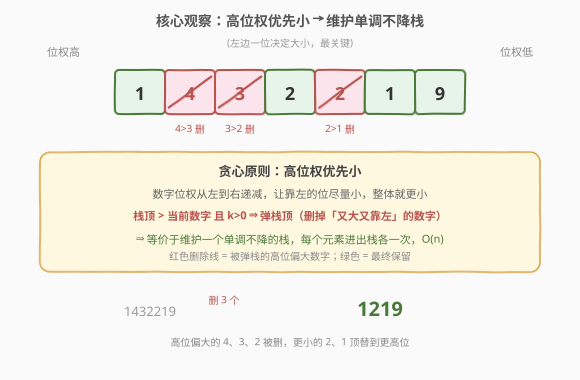
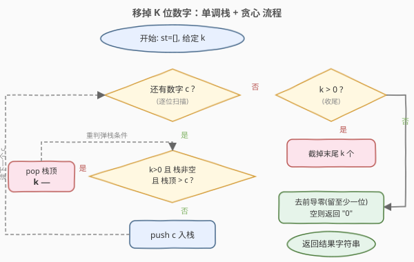
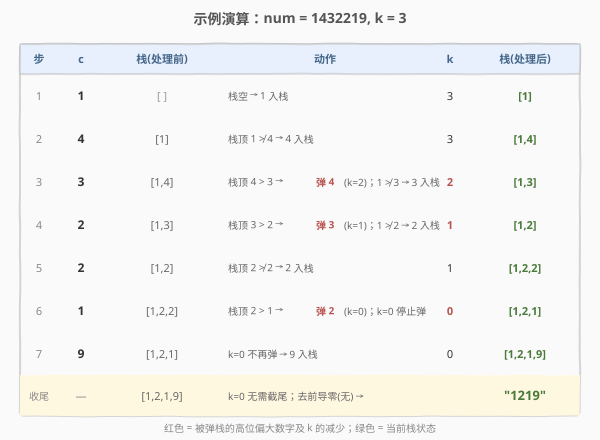

# 移掉K位数字

- **题目名称**：移掉K位数字
- **链接**：[402. 移掉 K 位数字](https://leetcode.cn/problems/remove-k-digits/)
- **难度**：中等
- **标签**：栈、贪心、单调栈、字符串

## 1. 题目概述

给你一个以字符串表示的非负整数 `num` 和一个整数 `k`，请从 `num` 中移除 `k` 个数字，使剩下的数字**尽可能小**。返回移除 `k` 个数字后所能得到的**最小数字字符串**。

结果可能含前导零，需去除；若结果为空则返回 `"0"`。

**示例 1**：

```text
输入：num = "1432219", k = 3
输出："1219"
解释：移掉 4、3、2 三个数字后得到 1219，这是所有可能中最小的。
```

**示例 2**：

```text
输入：num = "10200", k = 1
输出："200"
解释：移掉最前面的 1，剩下 0200，去掉前导零后为 200。
```

**示例 3**：

```text
输入：num = "10", k = 2
输出："0"
解释：移掉所有数字，结果为空，返回 "0"。
```

**约束条件**：

- `1 <= k <= num.length <= 10^5`
- `num` 仅由数字 `0-9` 组成
- `num` 不含前导零（除非 `num` 本身就是 `"0"`）

> 💡 **关键信号词**：「从数字中移除若干位使剩余最小」+ 字符串长度达 $10^5$ → 这是**单调栈 + 贪心**的经典题型。核心不在「选哪几位删」，而在「让小的数字尽量占据高位」。

---

## 2. 解题思路

### 2.1 暴力思路

从 `n` 位中选 `n-k` 位保留，使组成的数字最小。最朴素的做法是枚举所有 $\binom{n}{k}$ 种删除方案，每种方案花 $O(n)$ 拼接比较，总复杂度 $O(\binom{n}{k}\cdot n)$，$n=10^5$ 时完全不可行。

另一种朴素贪心：依次确定结果的第 $1,2,\dots,n-k$ 位。确定第 $i$ 位时，在第 $i$ 个原始位置到第 $i+k$ 个位置（保证后面还剩够位数）的窗口里选最小数字。每次选完窗口起点右移，最坏 $O(n\cdot k)$，$k$ 接近 $n$ 时退化为 $O(n^2)$，仍会超时。

> 💡 朴素贪心的方向是对的——「高位优先选小」——只是每次重新扫描窗口太慢。用**单调栈**可以把「在窗口里找更小的」均摊成 $O(1)$。

### 2.2 核心观察：高位优先小 → 维护单调不降栈



数字的**位权从左到右递减**：最左边的位最关键。要让整体尽量小，就要让**靠左的数字尽量小**。

于是逐位扫描 `num`，用一个**单调不降的栈**累积保留的数字：

- 当前数字 `c` 比栈顶**大**时，直接入栈（它暂时「占住」高位，等后面有没有更小的来替换它）。
- 当前数字 `c` 比栈顶**小**时，只要还能删（`k > 0`），就**弹出栈顶**——因为栈顶又大又靠左，留着不划算，删掉它能让更小的 `c` 顶替到更高的位。

> 💡 一句话：**「栈顶比我大、还能删，就删栈顶」**。弹栈本质上是贪心地删除「高位上偏大的数字」。每个元素最多入栈、出栈各一次，所以总耗时 $O(n)$。

> ⚠️ 弹栈条件是**严格大于** `st.back() > c`。写成 `>=` 也能过，但严格大于更省操作：相等时谁占该位都一样，保留先来的不必弹。两种写法结果一致。

### 2.3 算法流程图



主循环结束后还可能剩 `k > 0`：此时栈已**单调不降**，没有「高位偏大」可删，最优做法是**截掉末尾 `k` 个**（最低位上最大的那些）。最后去除前导零（保留至少一位），空串返回 `"0"`。

### 2.4 示例演算



以 `num = "1432219"`、`k = 3` 为例，逐步追踪栈的变化：

| 当前数字 | 栈（处理前） | 动作 | k | 栈（处理后） |
|----------|--------------|------|---|--------------|
| 1 | `[]` | 1 入栈 | 3 | `[1]` |
| 4 | `[1]` | 栈顶 1 < 4，不弹；4 入栈 | 3 | `[1,4]` |
| 3 | `[1,4]` | 栈顶 4 > 3，弹 4；1 < 3 停。3 入栈 | 2 | `[1,3]` |
| 2 | `[1,3]` | 栈顶 3 > 2，弹 3；1 < 2 停。2 入栈 | 1 | `[1,2]` |
| 2 | `[1,2]` | 栈顶 2 ≯ 2，不弹；2 入栈 | 1 | `[1,2,2]` |
| 1 | `[1,2,2]` | 栈顶 2 > 1，弹 2（k 用完） | 0 | `[1,2,1]` |
| 9 | `[1,2,1]` | k=0 不再弹；9 入栈 | 0 | `[1,2,1,9]` |

循环结束 `k=0`，无需截尾；去前导零（无）→ 结果 `"1219"`。

---

## 3. 参考代码

### C++

```cpp
class Solution {
  public:
    string removeKdigits(string num, int k) {
        string st;                                 // 用 string 充当单调栈
        for (char c : num) {
            while (k > 0 && !st.empty() && st.back() > c) {
                st.pop_back();                     // 弹掉「又大又靠左」的栈顶
                k--;
            }
            st.push_back(c);
        }
        while (k-- > 0) st.pop_back();             // 栈已单调不降，截掉末尾剩余
        int i = 0;
        while (i + 1 < (int)st.size() && st[i] == '0') i++;  // 去前导零，保留至少一位
        st.erase(0, i);
        return st.empty() ? "0" : st;
    }
};
```

### Python

```python
class Solution:
    def removeKdigits(self, num: str, k: int) -> str:
        st = []
        for c in num:
            while k > 0 and st and st[-1] > c:
                st.pop()                           # 删掉又大又靠左的栈顶
                k -= 1
            st.append(c)
        if k > 0:                                  # 栈已单调不降，截掉末尾 k 个
            st = st[:-k]
        s = "".join(st).lstrip("0")                # 去前导零
        return s if s else "0"
```

> ⚠️ **三个易错点**：
> 1. **循环后仍要处理剩余的 `k`**。若原串本身单调不降（如 `"12345"`），主循环里一次都不会弹，`k` 原封不动；此时必须截掉**末尾** `k` 个（最低位上最大的），而不是开头。
> 2. **去前导零要保留至少一位**。`"0200"` 应变成 `"200"`，而 `"000"` 应变成 `"0"`，不能变空串。C++ 用 `i + 1 < size` 保证至少留最后一位；Python 用 `lstrip("0")` 后判空补 `"0"`。
> 3. **`k` 可能大于剩余栈长吗？** 不会。约束 `k <= n`，且每个数字最多被删一次，主循环用掉的配额加上剩余 `k` 始终不超过 `n`，截尾时栈一定够长。

---

## 4. 复杂度分析

| 维度 | 复杂度 | 说明 |
|------|--------|------|
| 时间复杂度 | O(n) | 每个字符最多入栈、出栈各一次，主循环均摊 $O(1)$；截尾与去前导零各 $O(n)$ |
| 空间复杂度 | O(n) | 栈（`string`/`list`）最坏存放全部 `n` 个字符 |

---

## 5. 扩展：「删 n−k 个」等价于「保留 k 个最小字典序」

本题要求删 `k` 个使剩余最小，等价于**保留 `n-k` 个**使字典序最小。换一个视角看，模板变成「在必须保留 `L = n-k` 个的前提下，维护单调不降栈，但只有在「栈内已有 + 剩余可用 > L」时才允许弹栈」。

- 本题里 `k` 就是「允许弹栈的次数配额」，弹满即止，逻辑更直接。
- [1673. 找出最具竞争力的子序列] 直接给出「保留 `k` 个」的问法，是同一模板的姊妹题，可用「剩余够补」的判断替代「配额」判断，本质完全相同。

> 💡 看到「移除/保留若干位使结果字典序最小」→ 一律单调栈。「配额」与「剩余够补」是同一约束的两种写法，面试时按题面选更顺手的那个即可。

---

## 6. 面试要点

1. **为什么贪心方向是「高位优先小」？为什么不会因为局部贪心错失全局最优？**

   - 数字大小由高位到低位依次决定：高位小一位，比后面所有低位都小一位更重要（如 `2xxx < 3xxx` 恒成立）。所以让靠左的位尽量小是严格更优的。当 `c` 比栈顶小时，删掉栈顶让 `c` 占据更高位，这一步在**任何后续选择下都不会更差**，具有贪心选择性质。

2. **为什么用单调栈，朴素贪心 $O(nk)$ 哪里慢？**

   - 朴素贪心每定一位都要在窗口里重扫最小值，窗口移动时重复扫描。单调栈把「前面是否有比我大、且可删的数字」压成栈顶比较，删过的不再回看，每个元素进出栈各一次，总 $O(n)$。

3. **主循环结束后 `k > 0` 怎么办？为什么截尾而不是截头？**

   - 主循环结束意味着栈已**单调不降**，没有「高位偏大」可删。剩下的删除配额用在最低位（末尾）上最大的数字最划算——删末尾不影响任何高位，损失最小。截头反而会删掉最小的高位，必然更差。

4. **弹栈条件用 `>` 还是 `>=`？**

   - 都正确。`>`（严格大于）在相等时不弹，省一次操作；`>=` 会弹掉相等的栈顶。由于相等数字互换位置结果不变，两种写法最终答案一致。习惯上用 `>`，更贴近「只在确实更大时才删」的直觉。

5. **前导零如何处理？空串为什么要返回 `"0"`？**

   - 用 `lstrip("0")`（Python）或跳过连续前导零（C++）去掉多余前导零，但必须保留至少一位。当 `k == n`（删完所有位）或剩余全是零时结果为空，按题意返回 `"0"`。

---

## 7. 同类练习题

- [316. 去除重复字母](https://leetcode.cn/problems/remove-duplicate-letters/)（[题解](../0301-0400/316_去除重复字母.md)）：单调栈 + 贪心的进阶，额外要求「每个字母必须保留一次」，需配合剩余出现计数判断能否弹栈
- [1673. 找出最具竞争力的子序列](https://leetcode.cn/problems/find-the-most-competitive-subsequence/)：「保留 k 个使字典序最小」，与本题「删 n−k 个」等价，同一模板的姊妹题
- [321. 拼接最大数](https://leetcode.cn/problems/create-maximum-number/)：单调栈的困难变体，需从两个数组各取若干位拼成最大数，单栈模板 + 双数组枚举
- [738. 单调递增的数字](https://leetcode.cn/problems/monotone-increasing-digits/)：贪心构造 $\leq N$ 的最大单调不降数，对比「删位求最小」与「造数求最大」
- [1081. 不同字符的最小子序列](https://leetcode.cn/problems/smallest-subsequence-of-distinct-characters/)：与 316 完全同模板，练手单调栈 + 去重
