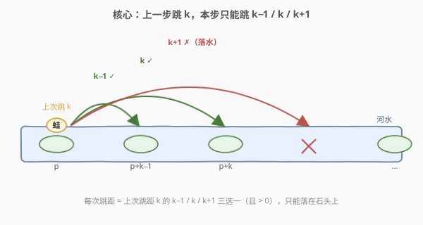
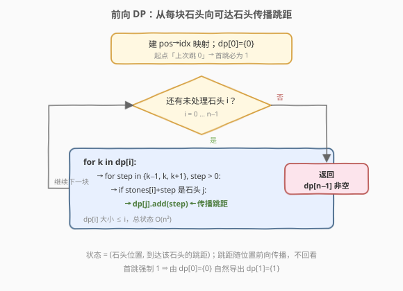
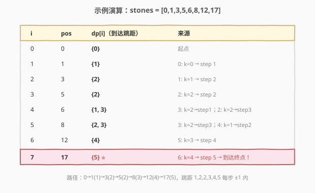

# LeetCode 青蛙过河 题解

## 1. 题目概述

- **标题 / 题号**：青蛙过河（#403，hard）
- **链接**：https://leetcode.cn/problems/frog-jump/
- **难度**：困难
- **标签**：动态规划、哈希表、数组

**题意**：青蛙要过一条河，河被分成若干单元格，部分单元格上有石头。青蛙初始在第一块石头上（位置 `0`），**第一步只能跳 1 个单位**。此后若上一次跳了 `k` 个单位，则下一步只能跳 `k-1`、`k` 或 `k+1` 个单位（必须向前、跳距 $> 0$），且只能落在石头上。

给定**严格升序**的石头位置数组 `stones`，判断青蛙能否落在最后一块石头上。

**示例 1**：

```text
输入：stones = [0,1,3,5,6,8,12,17]
输出：true
解释：0→1(跳1)→3(跳2)→5(跳2)→8(跳3)→12(跳4)→17(跳5)
```

**示例 2**：

```text
输入：stones = [0,1,2,3,4,8,9,11]
输出：false
解释：到位置 4 时最大跳距仅 2，下一步最多跳 3，最远到 7，但下一块石头在 8，无法跨越。
```

**约束**：

- `2 <= stones.length <= 2000`
- `stones[0] == 0`，`stones` 严格递增
- 题目保证第一块石头为位置 0、第二块为位置 1（首跳 1 必能落地）

## 2. 解题思路

### 2.1 暴力思路：DFS 枚举每步三选一

从位置 0 出发，每一步在 `k-1 / k / k+1` 三种跳距中选一种，若落点是石头则继续递归。最坏每步 3 分支，深度可达 `n`，复杂度 $O(3^n)$，`n=2000` 完全不可行。问题在于**同一「位置 + 上次跳距」组合被反复搜索**——这是引入记忆化 / DP 的信号。

### 2.2 核心观察：状态 = (石头位置, 到达该石头的跳距)



关键观察：青蛙能否继续跳，**只取决于当前所在石头位置和上一步的跳距 `k`**，与之前怎么到达的无关。于是定义状态：

- $\text{dp}[p]$ = **能到达位置 $p$ 的所有「上次跳距」组成的集合**。

转移：对位置 $p$ 的每个跳距 $k \in \text{dp}[p]$，下一步可跳 $k-1$、$k$、$k+1$（要求 $>0$），落点 $p+\text{step}$ 若是石头 $j$，就把 $\text{step}$ 加入 $\text{dp}[j]$：

$$
\text{dp}[p+\text{step}].\text{add}(\text{step}), \quad \text{step} \in \{k-1,\ k,\ k+1\},\ \text{step} > 0
$$

> 💡 **首跳如何自然导出**：初始化 $\text{dp}[0]=\{0\}$（视作「到达起点时上次跳了 0」）。由 $k=0$ 得 $\text{step}\in\{-1,0,1\}$，唯有 $\text{step}=1$ 合法，于是 $\text{dp}[1].\text{add}(1)$——首跳强制为 1，无需特判。

> ⚠️ 位置值可达 $2^{31}$，但状态按**石头下标**索引；用哈希表存「位置→下标」即可 $O(1)$ 判断某落点是否为石头。

### 2.3 算法流程图



整体是一个**前向传播**过程：按石头下标从小到大遍历，把每块石头可达的跳距「推」给后面的石头。无需回看——因为后面石头的跳距只可能由前面的石头传播而来。

> 💡 **复杂度保证**：到达第 $i$ 块石头至少要跳 $i$ 次，每次跳距至多增长 1，故 $\text{dp}[i]$ 中的跳距 $\le i$，集合大小 $\le i$。总状态数 $\sum_{i=1}^{n} i = O(n^2)$，每个状态做 3 次转移，总时间 $O(n^2)$。

### 2.4 示例演算



以 `stones = [0,1,3,5,6,8,12,17]` 为例，逐步累积每块石头的跳距集合：

| i | pos | dp[i]      | 来源                          |
|---|-----|------------|-------------------------------|
| 0 | 0   | {0}        | 起点                          |
| 1 | 1   | {1}        | 0: k=0 → step 1               |
| 2 | 3   | {2}        | 1: k=1 → step 2               |
| 3 | 5   | {2}        | 2: k=2 → step 2               |
| 4 | 6   | {1, 3}     | 3: k=2→step1；2: k=2→step3    |
| 5 | 8   | {2, 3}     | 3: k=2→step3；4: k=1→step2    |
| 6 | 12  | {4}        | 5: k=3 → step 4               |
| 7 | 17  | {5} ⭐     | 6: k=4 → step 5 → 到达终点！  |

`dp[7]={5}` 非空 ⇒ 返回 `true`。对应路径 `0→1→3→5→8→12→17`，跳距序列 `1,2,2,3,4,5`，相邻差均在 $\pm 1$ 内。

## 3. 参考代码

### C++

```cpp
class Solution {
  public:
    bool canCross(vector<int>& stones) {
        int n = stones.size();
        unordered_map<int, int> pos2idx;          // 位置 -> 下标
        for (int i = 0; i < n; ++i) pos2idx[stones[i]] = i;

        vector<unordered_set<int>> dp(n);          // dp[i] = 到达石头 i 的跳距集合
        dp[0].insert(0);

        for (int i = 0; i < n; ++i) {
            for (int k : dp[i]) {
                for (int step = k - 1; step <= k + 1; ++step) {
                    if (step <= 0) continue;       // 必须向前跳
                    auto it = pos2idx.find(stones[i] + step);
                    if (it != pos2idx.end() && it->second > i) {
                        dp[it->second].insert(step);
                    }
                }
            }
        }
        return !dp[n - 1].empty();
    }
};
```

### Python

```python
class Solution:
    def canCross(self, stones: List[int]) -> bool:
        n = len(stones)
        pos2idx = {p: i for i, p in enumerate(stones)}
        dp = [set() for _ in range(n)]
        dp[0].add(0)

        for i in range(n):
            for k in dp[i]:
                for step in (k - 1, k, k + 1):
                    if step <= 0:
                        continue
                    j = pos2idx.get(stones[i] + step)
                    if j is not None and j > i:
                        dp[j].add(step)
        return len(dp[n - 1]) > 0
```

> ⚠️ **易错点**：`step` 必须严格大于 0；判断落点时加 `j > i` 保证只向后面的石头传播（位置递增时其实恒成立，但能挡掉 `step=0` 退化为自环的隐患）。

## 4. 复杂度分析

| 维度 | 复杂度 | 说明 |
|------|--------|------|
| 时间复杂度 | $O(n^2)$ | 到达第 $i$ 块石头的跳距 $\le i$，集合大小 $\le i$，总状态 $\sum i = O(n^2)$，每个状态 3 次转移 |
| 空间复杂度 | $O(n^2)$ | 最坏所有 $\text{dp}[i]$ 共存 $O(n^2)$ 个跳距；外加位置哈希表 $O(n)$ |

> 💡 `n ≤ 2000` 时 $n^2 = 4\times10^6$，可接受。哈希表常数较大，实际运行中由于很多石头不可达，状态远小于理论上界。

## 5. 扩展：记忆化 DFS 与提前剪枝

### 5.1 自顶向下记忆化搜索

状态 `(i, k)` = 「在石头 i 且上次跳距为 k 时，能否到达终点」。从 `(0, 0)` 出发递归，用哈希记忆化避免重复：

```python
from functools import lru_cache

class Solution:
    def canCross(self, stones: List[int]) -> bool:
        pos = set(stones)
        target = stones[-1]

        @lru_cache(None)
        def dfs(p, k):
            if p == target:
                return True
            for step in (k - 1, k, k + 1):
                if step > 0 and p + step in pos and dfs(p + step, step):
                    return True
            return False

        return dfs(0, 0)
```

思路与迭代 DP 完全等价，只是方向相反。迭代版按拓扑序（下标递增）天然无重复，记忆化版靠缓存兜底。

### 5.2 大间距提前剪枝

到达第 $i$ 块石头时的跳距 $\le i \le n$，故任意**相邻石头间距 $> n$** 时，青蛙永远跨不过这道鸿沟，可直接返回 `false`。当石头位置跨度极大（如接近 $2^{31}$）而数量不多时，这一剪枝能立刻终止：

```cpp
for (int i = 1; i < n; ++i)
    if (stones[i] - stones[i - 1] > n) return false;
```

## 6. 面试要点

1. **为什么状态定义为「到达某石头的跳距集合」而非「能否到达」？**
   - 「能否到达」不足以决定后续——后续可选跳距依赖**上一步的跳距**。必须把跳距作为状态的一部分，否则会丢失信息。这也是本题相比普通图可达性的关键区别。

2. **为什么复杂度是 $O(n^2)$ 而不是 $O(n^3)$？**
   - 看似每块石头要遍历跳距集合再各做 3 次转移，但**跳距集合大小有上界**：到达第 $i$ 块石头至少跳 $i$ 次，跳距至多增长到 $i$，故 $|\text{dp}[i]| \le i$。总状态 $\sum_{i} i = O(n^2)$，而非每块石头都 $O(n)$。

3. **为什么用哈希表存位置→下标，而不是二分查找？**
   - 转移时每次都要判断「某位置是否为石头」，哈希表 $O(1)$ 查询优于二分 $O(\log n)$。位置值虽可达 $2^{31}$，但哈希表只存 $n$ 个键，空间 $O(n)$。

4. **首跳为什么不用特判？**
   - 初始化 $\text{dp}[0]=\{0\}$，由 $k=0$ 推出的合法 step 只有 1，自然得到 $\text{dp}[1]=\{1\}$。把「首跳为 1」编码进初始状态，比写 `if (i==0)` 特判更优雅。

5. **如果题目改为「跳距可以是 $k-2$ 到 $k+2$」，如何调整？**
   - 只把转移里的 step 枚举范围从 $\{k-1,k,k+1\}$ 改为 $\{k-2,k-1,k,k+1,k+2\}$。跳距上界变为 $2i$，总状态仍 $O(n^2)$。这正是把「跳距」作为状态维度的可扩展性体现。

## 同类练习题

| # | 题目 | 与本题的关联 |
|---|------|-------------|
| 55 | [跳跃游戏](https://leetcode.cn/problems/jump-game/) | 一维可达性 DP，跳距在 `[1, nums[i]]` 内更宽松，体会「状态维度」差异 |
| 45 | [跳跃游戏 II](https://leetcode.cn/problems/jump-game-ii/)（[题解](../0001-0100/45_跳跃游戏II.md)） | 同模型求最少步数，贪心维护当前能达最远 |
| 139 | [单词拆分](https://leetcode.cn/problems/word-break/)（[题解](../0001-0100/139_单词拆分.md)） | 前向 DP + 哈希查询，结构相似的「前向传播」 |
| 322 | [零钱兑换](https://leetcode.cn/problems/coin-change/)（[题解](../0301-0400/322_零钱兑换.md)） | 完全背包前向 DP，对照本题「状态带额外维度」的设计 |
