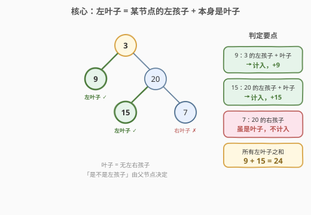
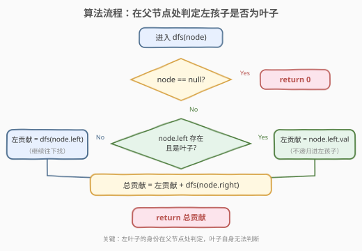
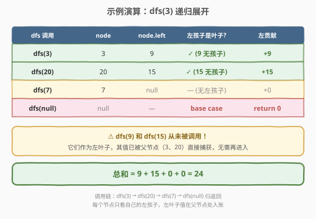

# 左叶子之和

- **题目名称**：左叶子之和
- **链接**：[404. 左叶子之和](https://leetcode.cn/problems/sum-of-left-leaves/)
- **难度**：简单
- **标签**：树、深度优先搜索、二叉树

## 1. 题目概述

给定一棵二叉树的根节点 `root`，返回**所有左叶子之和**。

> 💡 **左叶子**：某节点的**左孩子**，且该左孩子本身是**叶子节点**（没有左右孩子）。两个条件缺一不可——必须是左孩子，也必须是叶子。

**示例 1**：

```text
输入：root = [3,9,20,null,null,15,7]
输出：24
解释：在这个二叉树中，有两个左叶子，值分别是 9 和 15。

        3
       / \
      9  20
        /  \
       15   7
```

- `9` 是 `3` 的左孩子，且无孩子 → 左叶子，计入
- `15` 是 `20` 的左孩子，且无孩子 → 左叶子，计入
- `7` 是 `20` 的右孩子，虽是叶子但**不是左孩子** → 不计入
- 总和 = 9 + 15 = 24

**示例 2**：

```text
输入：root = [1]
输出：0
解释：根节点本身没有父节点，不可能是「某节点的左孩子」，因此即使它是叶子也不计入。
```

**约束条件**：

- 节点数目在范围 `[1, 1000]` 内
- `-1000 <= Node.val <= 1000`

> 💡 本题是树 DFS 的「**身份判定**」入门题。和 [112. 路径总和](../0101-0200/112_路径总和.md) 的「在叶子处判定」不同，本题的关键不在叶子自身、而在**父节点**——只有站在父节点的视角，才能判断「左孩子是不是叶子」。掌握这种「身份由父节点赋予」的视角，是理解 [250. 统计同值子树](../0201-0300/250_统计同值子树.md) 等后序传递题的基础。

---

## 2. 解题思路

### 2.1 暴力思路

遍历每个节点，判断它是否为左叶子，若是则把它的值累加。问题在于：**站在节点自身无法知道自己是「左孩子」还是「右孩子」**——这是父节点才能给出的信息。所以有两种暴力写法：

1. **给每个节点打标记**：DFS 时额外传一个布尔参数 `isLeft`，表示当前节点是不是父的左孩子。到叶子处若 `isLeft` 为真就累加。可行但多了一个参数。
2. **在父节点处判定**：遍历到每个节点时，**看它的左孩子是不是叶子**——若是，直接把左孩子的值加入答案，不再递归进左孩子；若不是，正常递归。这更自然，无需额外参数。

下面采用第 2 种，它更贴近「左叶子」的定义本身。

### 2.2 核心观察：左叶子的身份在父节点处判定



关键观察：**一个节点是不是左叶子，不是它自己能决定的，而是由它的父节点决定的**。

- 节点自身只能判断「我是不是叶子」（`left == null && right == null`）
- 但「我是不是**左**孩子」这一信息，只有父节点知道

因此算法设计为：**在每个节点处，检查它的左孩子是否为叶子**：

- 若 `node.left` 存在，且 `node.left` 没有左右孩子 → `node.left` 是左叶子，把 `node.left.val` 直接计入，**不再递归进入 `node.left`**（它已是叶子，进去也只会返回 0）
- 否则 → 正常递归 `dfs(node.left)`，在更深一层继续寻找左叶子
- 右子树无论何种情况都正常递归 `dfs(node.right)`

> 💡 **为什么左叶子命中后不再递归进左孩子？** 因为左叶子本身就是叶子，对它调用 `dfs` 时，它的 `left` 为 `null`，`dfs(null)` 返回 0，不会贡献任何左叶子。直接取 `val` 后跳过，省掉一次无意义的调用。这正是「父节点处判定」带来的常数优化。

> ⚠️ **常见错误**：在节点自身判定 `if (isLeaf && isLeftChild)`。这要求额外传入 `isLeftChild` 参数，且**根节点没有父节点**——根永远不会被计入（即使根是叶子，如示例 2），这与题意一致但容易让人困惑。父节点视角的写法天然规避了根的问题：根没有父，自然没人把根当左叶子判定。

### 2.3 算法流程图



**DFS 递归逻辑**：

| 情况 | 处理 |
|------|------|
| `node == null` | 返回 `0`（空子树无左叶子） |
| `node.left` 存在且 `node.left` 是叶子 | 左贡献 = `node.left.val`（直接取值，不递归进左孩子） |
| 否则 | 左贡献 = `dfs(node.left)`（继续往下找） |
| **统一** | 右贡献 = `dfs(node.right)`，返回 `左贡献 + 右贡献` |

> 💡 判定「左孩子是叶子」的条件：`node.left != null && node.left.left == null && node.left.right == null`。三个条件缺一不可——先确保左孩子存在，再确保它没有孩子。

### 2.4 示例演算

以示例 1（`root = [3,9,20,null,null,15,7]`）为例，追踪 `dfs(3)` 的完整递归展开：



| dfs 调用 | node | node.left | 左孩子是叶子? | 左贡献 | 右递归 |
|----------|------|-----------|---------------|--------|--------|
| `dfs(3)` | 3 | 9 | ✓（9 无孩子） | +9 | `dfs(20)` |
| `dfs(20)` | 20 | 15 | ✓（15 无孩子） | +15 | `dfs(7)` |
| `dfs(7)` | 7 | null | —（无左孩子） | `dfs(null)` = 0 | `dfs(null)` = 0 |
| `dfs(null)` | null | — | base case | return 0 | — |

**归并返回**：

- `dfs(7)` = 0 + 0 = 0
- `dfs(20)` = 15 + `dfs(7)` = 15 + 0 = 15
- `dfs(3)` = 9 + `dfs(20)` = 9 + 15 = **24**

> 💡 **关键细节**：`dfs(9)` 和 `dfs(15)` **从未被调用**！它们作为左叶子，其值已被父节点（3、20）直接捕获，无需再进入。这是「父节点处判定」写法的精髓——左叶子的值在父节点入账，叶子节点本身根本不进递归。

---

## 3. 参考代码

### C++

```cpp
/**
 * Definition for a binary tree node.
 * struct TreeNode {
 *     int val;
 *     TreeNode *left;
 *     TreeNode *right;
 *     TreeNode() : val(0), left(nullptr), right(nullptr) {}
 *     TreeNode(int x) : val(x), left(nullptr), right(nullptr) {}
 *     TreeNode(int x, TreeNode *left, TreeNode *right) : val(x), left(left), right(right) {}
 * };
 */
class Solution {
  public:
    int sumOfLeftLeaves(TreeNode* root) {
        if (root == nullptr) return 0;                          // 空树：无左叶子

        int leftVal = 0;
        if (root->left && root->left->left == nullptr
                       && root->left->right == nullptr) {       // 左孩子是叶子
            leftVal = root->left->val;                          // 直接取值，不递归进左孩子
        } else {
            leftVal = sumOfLeftLeaves(root->left);              // 否则继续往下找
        }
        int rightVal = sumOfLeftLeaves(root->right);            // 右子树照常递归
        return leftVal + rightVal;
    }
};
```

### Python

```python
class Solution:
    def sumOfLeftLeaves(self, root: Optional[TreeNode]) -> int:
        if root is None:                                        # 空树：无左叶子
            return 0

        if root.left and not root.left.left and not root.left.right:
            left_val = root.left.val                            # 左孩子是叶子：直接取值
        else:
            left_val = self.sumOfLeftLeaves(root.left)          # 否则继续往下找
        right_val = self.sumOfLeftLeaves(root.right)            # 右子树照常递归
        return left_val + right_val
```

> 💡 **更简短的写法**（把判定条件内联到表达式里，逻辑等价但可读性略降）：
> ```python
> def sumOfLeftLeaves(self, root: Optional[TreeNode]) -> int:
>     if not root:
>         return 0
>     left_val = (root.left.val
>                 if root.left and not root.left.left and not root.left.right
>                 else self.sumOfLeftLeaves(root.left))
>     return left_val + self.sumOfLeftLeaves(root.right)
> ```

---

## 4. 复杂度分析

| 维度 | 复杂度 | 说明 |
|------|--------|------|
| **时间复杂度** | $O(n)$ | 每个节点至多被访问一次；左叶子命中时其孩子不再展开，但最坏仍遍历全部 $n$ 个节点 |
| **空间复杂度** | $O(h)$ | 递归调用栈深度 = 树高 $h$。平衡树 $h = O(\log n)$；链状树 $h = O(n)$ |

> ⚠️ 本题 $n \le 1000$，即便链状树（栈深 1000）Python 默认递归上限 1000 也可能在边界上 `RecursionError`。若担心栈溢出，可改用下节的迭代写法，或临时 `sys.setrecursionlimit`。面试中递归写法为主，迭代写法作为「能否转为非递归」的追问准备。

---

## 5. 扩展：迭代写法（显式栈 / BFS）

把递归栈显式化，避免栈溢出。逻辑与递归版完全对应——**每个节点出栈时，检查它的左孩子是不是叶子**：

```python
class Solution:
    def sumOfLeftLeaves(self, root: Optional[TreeNode]) -> int:
        if not root:
            return 0
        ans = 0
        stack = [root]
        while stack:
            node = stack.pop()
            if node.left:
                if not node.left.left and not node.left.right:
                    ans += node.left.val          # 左孩子是叶子：直接累加，不压栈
                else:
                    stack.append(node.left)       # 否则继续处理左子树
            if node.right:
                stack.append(node.right)          # 右子树照常压栈
        return ans
```

> 💡 用 `stack.pop()` 取末尾是 DFS（先入后出）；换成 `collections.deque` + `popleft()` 即变成 BFS——层序遍历同样能遍历所有节点，本题中两者效率相同。迭代版与递归版的**唯一区别**是：递归版把「左贡献」作为返回值向上归并，迭代版用一个全局 `ans` 直接累加。二者访问节点的顺序和判定逻辑完全一致。

---

## 6. 面试要点

1. **为什么在父节点处判定，而不是在叶子节点自身判定？**

   - 「是不是叶子」是节点自身的属性（看 `left/right` 是否为空），但「是不是**左**孩子」是父节点才知道的信息。站在叶子自身，无法区分自己是父的左孩子还是右孩子。因此最自然的做法是在父节点处检查 `node.left` 是否为叶子——这样「左」和「叶子」两个条件在同一个位置同时满足。

2. **能不能给每个节点传一个 `isLeft` 参数来判定？**

   - 可以：`dfs(node, isLeft)`，到叶子处若 `isLeft` 为真就累加 `node.val`。逻辑正确，但多一个参数。更重要的是，根节点调用时 `isLeft` 该传什么？通常传 `False`（因为根没有父，不是任何人的左孩子），这与题意一致但容易引入 off-by-one。父节点视角的写法天然规避了根的问题——根没有父，自然没人把根当左叶子判定，无需特殊处理。

3. **左叶子命中后为什么不再递归进左孩子？**

   - 左叶子本身是叶子（`left == null && right == null`），对它调用 `dfs` 时，它的 `left` 为 `null`，`dfs(null)` 返回 0，不会贡献任何左叶子值。所以直接取 `val` 后跳过，省掉一次无意义的调用。这是一个常数优化，不影响正确性。

4. **空树和单节点树分别返回什么？**

   - 空树（`root == null`）返回 `0`——没有节点就没有左叶子。单节点树（只有一个根）也返回 `0`——根没有父节点，不可能是「某节点的左孩子」，即使它是叶子也不计入。这正是示例 2 的情形。

5. **迭代版和递归版访问节点的顺序一样吗？**

   - 递归版是「先处理当前节点（判定左孩子），再递归左、右」——本质是前序。迭代版用 `stack.pop()`（后入先出）时，若先压右再压左，则弹出顺序是先左后右，与递归的前序一致。但本题的累加发生在「弹出时判定左孩子」，不依赖左右子树的访问先后顺序——只要每个节点都被弹出并判定一次即可，所以前序/中序/后序/BFS 均可，不影响结果。

> 💡 **一句话总结**：404 是树 DFS「**身份判定**」的母题——左叶子的身份由父节点赋予，在父节点处检查 `node.left` 是否为叶子，命中即取值、不命中即递归。掌握这种「信息在父子之间传递」的视角，是理解 250（同值子树后序传递）、968（监控树后序状态机）等题的基础。

---

## 7. 同类练习题

- [112. 路径总和](https://leetcode.cn/problems/path-sum/)：同样是「在叶子处做判定」的树 DFS，但 112 的判定信息（目标和）沿根下传，404 的判定信息（左孩子身份）在父节点处产生（[题解](../0101-0200/112_路径总和.md)）
- [250. 统计同值子树](https://leetcode.cn/problems/count-univalue-subtrees/)：后序 DFS + 布尔返回值向上传递子树性质，同样是「叶子天然满足、内部节点需综合子节点信息」的判定模式（[题解](../0201-0300/250_统计同值子树.md)）
- [129. 求根节点到叶节点数字之和](https://leetcode.cn/problems/sum-root-to-leaf-numbers/)：在叶子处累加贡献的树 DFS，对比 404 在父节点处累加左叶子值
- [958. 二叉树的完全性检验](https://leetcode.cn/problems/check-completeness-of-a-binary-tree/)：层序遍历中对节点「身份」（是否有孩子）做判定，同属「遍历时检查节点性质」一类
- [1315. 祖父节点值为偶数的节点之和](https://leetcode.cn/problems/sum-of-nodes-with-even-valued-grandparent/)：信息从祖父节点向下传递两层，是 404「父节点信息」思想的扩展——信息传递链更长
