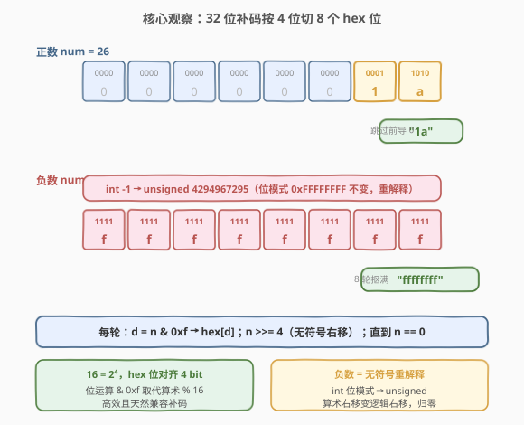
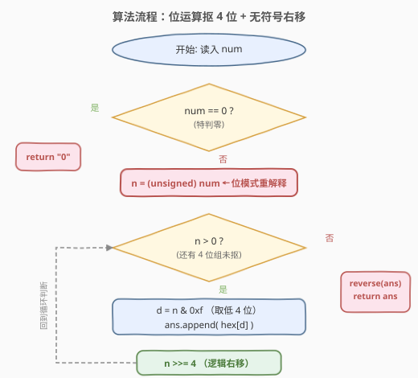
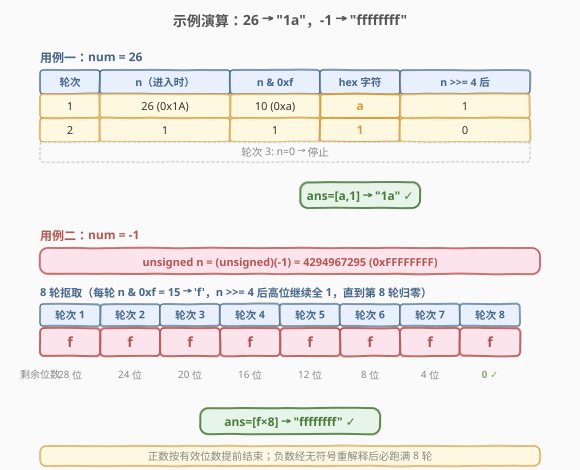

# LeetCode 数字转换为十六进制数 题解

## 1. 题目概述

- **标题 / 题号**：数字转换为十六进制数（#405，easy）
- **链接**：https://leetcode.cn/problems/convert-a-number-to-hexadecimal/
- **难度**：简单
- **标签**：位运算、数学

**题意**：给定一个整数 `num`，返回其十六进制的字符串表示。对于负整数，采用**补码**（two's complement）表示法——即把 `num` 看作 32 位有符号整数，按其在内存中的 32 位补码形式转换。

**注意**：

- 不能使用库函数直接格式化（如 C++ 的 `sprintf("%x")` / Python 的 `hex()`）。
- 结果中**不含前导零**，除了数字 `0` 本身返回 `"0"`。

**示例 1**：

```text
输入：num = 26
输出："1a"
```

**示例 2**：

```text
输入：num = -1
输出："ffffffff"
```

**示例 3**：

```text
输入：num = 0
输出："0"
```

**约束**：

- $-2^{31} \le \text{num} \le 2^{31} - 1$（即 32 位有符号整数范围）

> 💡 负数是本题唯一的小坎。`-1` 在 32 位补码中是 `0xFFFFFFFF`（32 个全 1），转十六进制正是 `"ffffffff"`。若直接对负数做「除 16 取余」会因为 C++/Java 的负数整除向零取整、负数取余为负而陷入麻烦——用**位运算按 4 位一组抠位**才是正解，且天然兼容补码。

## 2. 解题思路

### 2.1 暴力思路：模拟除 16 取余

模仿 [168. Excel表列名称](../0001-0100/168_Excel表列名称.md) 的「除 K 取余」模板：循环 `num % 16` 抠最低位，再 `num /= 16` 缩小，最后反转字符串。对于**正数**这条路完全可行。

但对**负数**会出问题：

- C++/Java 中 `-1 % 16 = -1`，余数是负的，无法直接映射到 `0~f`；
- 负数整除 `-1 / 16 = 0`，循环立即结束，根本抠不出 8 个 `f`。

修修补底的做法是「对负数取绝对值再算、最后补符号位」——但这与补码表示不符（补码不是「绝对值的十六进制加负号」），`-1` 应是 `ffffffff` 而非 `-1`。所以必须换思路。

### 2.2 核心观察：位运算按 4 位分组 + 无符号重解释



破局点是把「十六进制」与「二进制位」绑定：**一个十六进制位恰好对应 4 个二进制位**（$16 = 2^4$）。32 位 `int` 正好切成 8 组 4 位，每组映射成一个 hex 字符。这样转换完全不依赖算术取余，只依赖**位与 `& 0xf`**（取低 4 位）和**右移 `>> 4`**（去掉低 4 位）。

**负数怎么处理？** 关键一招：把 `int` 重解释成 `unsigned int`——**位模式不变，只是把 32 个 bit 重新读成一个无符号数**。于是 `-1`（位模式 `0xFFFFFFFF`）被读成 `4294967295`，对这个大正数做 `& 0xf` 抠出最低 4 位 `1111` → `'f'`，再 `>>= 4`（无符号右移，高位补 0）继续抠，8 轮后归零，正好产出 `"ffffffff"`。

> ⚠️ **为什么必须用无符号右移？** 有符号 `int` 的 `>>` 在多数语言里是**算术右移**（高位补符号位）。对负数 `-1 = 0xFFFFFFFF`，每 `>> 4` 高位继续补 1，结果仍是 `0xFFFFFFFF`，**永远归不了零**，死循环。转成 `unsigned` 后 `>>` 变成**逻辑右移**（高位补 0），8 轮后必然归零。这一步是把「补码表示」与「逐位抠取」对接的桥梁。

以 `num = 26`（正数，验证基本流程）为例：$26 = (0001\,1010)_2$，低 4 位 `1010` = 10 → `'a'`，右移 4 位得 `0001` = 1 → `'1'`，再右移归零。产出 `['a','1']`，反转得 `"1a"` ✓。

以 `num = -1`（负数，验证补码兼容）为例：重解释为无符号 $4294967295 = (\underbrace{1111\cdots1111}_{32})_2$，每轮 `& 0xf` 都得 `1111` = 15 → `'f'`，右移 4 位补 0 但高位仍是 1，直到第 8 轮才归零。产出 8 个 `'f'`，反转得 `"ffffffff"` ✓。

> 💡 **与「除 K 取余」的对照**：两者都是「从低位到高位、每轮抠一位、最后反转」。差别仅在抠位手段——十进制/Excel 列名用算术取余 `% K`，十六进制因 $K=2^4$ 恰好对齐位边界，改用位与 `& 0xf` + 移位 `>> 4`，更高效（位运算快于除法）且天然兼容补码（无符号重解释绕开负数取余的坑）。这是「进制基数是 2 的幂」时的统一优化。

### 2.3 算法流程图



整体只有一个循环：先把 `num` 重解释成 `unsigned n`，然后只要 `n > 0` 就重复「`d = n & 0xf` 取低 4 位 → 追加 `hex[d]` → `n >>= 4`」。循环结束后反转字符串即得答案。`num == 0` 需特判返回 `"0"`（否则循环不执行，返回空串）。

### 2.4 示例演算



**用例一：`num = 26` → `"1a"`**

| 轮次 | `n`（进入时） | `n & 0xf` | hex 字符 | `n >>= 4` 后 |
|------|---------------|-----------|----------|---------------|
| 1 | 26 (`0x1A`) | 10 (`0xa`) | `a` | 1 |
| 2 | 1 | 1 | `1` | 0 |
| 3 | 0 | — | 停止 | — |

产出序列 `['a', '1']`，反转得 `"1a"` ✓。两轮即结束——正数不会产出前导零，因为高位全 0 时 `n` 已归零，循环自然停止。

**用例二：`num = -1` → `"ffffffff"`**

先把 `-1` 重解释为 `unsigned n = 4294967295`（位模式 `0xFFFFFFFF`）。

| 轮次 | `n & 0xf` | hex 字符 | `n >>= 4` 后（剩余位数） |
|------|-----------|----------|--------------------------|
| 1 | 15 | `f` | 28 位全 1 |
| 2 | 15 | `f` | 24 位全 1 |
| 3 | 15 | `f` | 20 位全 1 |
| 4 | 15 | `f` | 16 位全 1 |
| 5 | 15 | `f` | 12 位全 1 |
| 6 | 15 | `f` | 8 位全 1 |
| 7 | 15 | `f` | 4 位全 1 |
| 8 | 15 | `f` | 0 |

8 轮后 `n` 归零，产出 8 个 `'f'`，反转得 `"ffffffff"` ✓。负数的循环次数固定为 8（32 位补码），正数则取决于有效位数，最多 8 轮。

> ⚠️ **为什么循环条件是 `n > 0` 而不是固定 8 次？** 用 `n > 0` 让正数自动提前结束、省去前导零的过滤；负数经无符号重解释后 `n` 是个大正数，必然跑满 8 轮才归零。两种情况被同一个条件优雅覆盖。若改成固定 8 次循环，则需要额外「跳过前导零」的逻辑处理正数（如 `num = 26` 只需 2 位，前 6 位是 0）。

## 3. 参考代码

### C++

```cpp
class Solution {
  public:
    string toHex(int num) {
        if (num == 0) return "0";
        const string hex = "0123456789abcdef";
        string ans;
        unsigned n = num;            // 位模式重解释：负数自动变补码对应的大正数
        while (n > 0) {
            ans.push_back(hex[n & 0xf]);   // 取低 4 位映射成 hex 字符
            n >>= 4;                        // 逻辑右移 4 位（unsigned 高位补 0）
        }
        reverse(ans.begin(), ans.end());    // 低位先产出，最后反转
        return ans;
    }
};
```

### Python

```python
class Solution:
    def toHex(self, num: int) -> str:
        if num == 0:
            return "0"
        hex_chars = "0123456789abcdef"
        ans = []
        # Python 整数无固定位宽，用 & 0xffffffff 模拟 32 位补码截断
        n = num & 0xffffffff
        while n > 0:
            ans.append(hex_chars[n & 0xf])   # 取低 4 位
            n >>= 4                          # 逻辑右移 4 位
        return "".join(ans[::-1])             # 反转成高位在前
```

> ⚠️ **三个易错点**：
> 1. **必须用无符号类型/掩码处理负数**。C++ 用 `unsigned n = num` 重解释位模式；Python 整数任意精度且无「无符号」概念，改用 `num & 0xffffffff` 把负数截成 32 位补码对应的大正数（如 `-1 & 0xffffffff = 4294967295`）。若直接对负数 `>> 4`，Python 虽是逻辑右移但会无限补 1 不归零，C++ 算术右移同理——都会死循环。
> 2. **`num == 0` 要特判**。否则 `n = 0` 时循环不执行，`ans` 为空，反转后仍是空串，无法返回 `"0"`。
> 3. **产出顺序是低位在前，最后必须反转**。与 168 / 415 同理——`& 0xf` 总是抠当前最低位，先写入的是低位字符，需 `reverse` 一次。

## 4. 复杂度分析

| 维度 | 复杂度 | 说明 |
|------|--------|------|
| 时间复杂度 | $O(\log_{16} \lvert n \rvert)$ | 每轮 `n` 缩小到原来的 $1/16$，循环次数即十六进制位数；负数固定 8 轮，正数最多 8 轮，整体 $\le 8$，可视为 $O(1)$ |
| 空间复杂度 | $O(\log_{16} \lvert n \rvert)$ | 结果字符串长度等于循环次数，至多 8 字符；不计输出则 $O(1)$ |

> 💡 32 位整数最多 8 个十六进制位（$32 / 4 = 8$），故循环次数有常数上界 8，时间与空间均为 $O(1)$。但按位数增长的渐进界 $O(\log_{16} n)$ 是更本质的刻画，便于推广到 64 位（最多 16 轮）等情形。

## 5. 扩展：位运算是「2 的幂进制」的统一武器

本题的 `& 0xf` + `>> 4` 模板可推广到任意「基数为 2 的幂」的进制转换：

| 目标进制 | 基数 | 抠位掩码 | 右移位数 | 对应题目 |
|----------|------|----------|----------|----------|
| 二进制 | $2$ | `& 0x1` | `>> 1` | 打印二进制表示 |
| 八进制 | $8$ | `& 0x7` | `>> 3` | [504. 七进制数](https://leetcode.cn/problems/base-7/) 的 2 幂变体 |
| 十六进制 | $16$ | `& 0xf` | `>> 4` | 本题 |

**为什么基数是 2 的幂时位运算可行？** 因为 $2^k$ 进制的一位恰好对应 $k$ 个二进制位——掩码 $2^k - 1$（低 $k$ 位全 1）取一组，右移 $k$ 位去掉一组，分组边界与位边界对齐。基数不是 2 的幂时（如十进制、七进制），一位无法对齐整数个二进制位，必须退回算术取余 `% K` + 整除 `/ K`。

**负数处理的两种范式对照**：

- **位运算 + 无符号重解释**（本题）：把 `int` 位模式读成 `unsigned`，算术右移变逻辑右移，负数自动按补码处理。适合 2 幂进制。
- **算术取余 + 绝对值**（[504. 七进制数](https://leetcode.cn/problems/base-7/)）：记录符号后对 `abs(num)` 做 `% 7` / `/ 7`，最后补负号。适合非 2 幂进制，因为七进制无法用位运算抠位。

> 💡 一句话：**进制基数是 2 的幂 → 位运算抠位 + 无符号重解释；否则 → 算术取余 + 符号单独处理**。掌握这条判据，任意进制转换都能立刻选对工具。

## 6. 面试要点

1. **为什么不能直接用「除 16 取余」处理负数？**

   > C++/Java 中负数取余结果为负（`-1 % 16 = -1`），无法映射到 `0~f`；且负数整除向零取整（`-1 / 16 = 0`），循环立即结束抠不出 8 个 `f`。即便取绝对值再算，得到的是「绝对值的十六进制加负号」（`-1` → `-1`），与补码表示（`-1` → `ffffffff`）不符。必须用位运算按 4 位一组抠位，并借无符号重解释让负数自动按补码处理。

2. **`unsigned n = num` 到底做了什么？为什么能解决负数问题？**

   > 它是**位模式重解释**（C++ 的 `reinterpret_cast` 语义）：32 个 bit 完全不变，只是把「最高位当符号位的有符号数」重新读成「最高位当数据位的无符号数」。`-1` 的位模式 `0xFFFFFFFF` 被读成 `4294967295`。这之后 `>> 4` 是逻辑右移（高位补 0），8 轮后必然归零；而若仍当 `int`，`>> 4` 是算术右移（高位补 1），`-1` 永远是 `-1`，死循环。

3. **为什么循环条件是 `n > 0` 而不是固定循环 8 次？**

   > 用 `n > 0` 让正数自动在有效位抠完后提前结束，天然避免前导零（`26` 只抠 2 轮得 `"1a"` 而非 `"0000001a"`）；负数经无符号重解释后是个大正数，必然跑满 8 轮才归零。两种情况被同一条件优雅覆盖。若用固定 8 次，则需额外跳过前导零的逻辑。

4. **`num = 0` 为什么要特判？**

   > `n = 0` 时 `n > 0` 为假，循环不执行，`ans` 为空，反转后仍是空串。题目要求 `0` 返回 `"0"`，故需在开头特判直接返回。也可改为「循环后若 `ans` 为空则赋 `"0"`」，效果相同。

5. **Python 没有无符号类型，怎么模拟 32 位补码？**

   > 用 `num & 0xffffffff` 截断成 32 位无符号整数。`-1 & 0xffffffff = 4294967295`，等价于 C++ 的 `unsigned n = num`。之后 `>> 4` 在 Python 里对正数是逻辑右移（Python 整数无符号位概念，右移就是地板除以 $2^k$），8 轮后归零。注意若不截断直接对 `-1` 做 `>> 4`，Python 会无限补 1 不归零（因为 Python 整数是无限精度的补码，`-1 >> 4` 仍是 `-1`）。

6. **和 [168. Excel表列名称](../0001-0100/168_Excel表列名称.md) 的「除 K 取余」有什么异同？**

   > 同：都是从低位到高位、每轮抠一位、最后反转。异：① 抠位手段——168 用算术 `% 26`，本题用位运算 `& 0xf`（因 $16 = 2^4$ 对齐位边界）；② 数码偏移——168 数码 $1 \sim 26$ 不含 0，须先减 1 平移到 $0 \sim 25$，本题十六进制数码 $0 \sim 15$ 含 0，无须平移；③ 负数——168 输入恒正无需考虑，本题须处理 32 位补码。

> 💡 **一句话总结**：405 是「2 幂进制转换」的招牌题——用 `& 0xf` 抠低 4 位、`>> 4` 右移、`unsigned` 重解释处理补码负数，$O(\log_{16} n)$/O(1) 一趟扫完。核心洞察是「十六进制位恰好对齐 4 个二进制位」，让位运算取代算术取余，天然兼容补码。

## 同类练习题

| # | 题目 | 与本题的关联 |
|---|------|-------------|
| 504 | [七进制数](https://leetcode.cn/problems/base-7/) | 非 2 幂进制转换，对比「算术取余 + 符号处理」与本题「位运算 + 无符号重解释」两种负数范式的差异 |
| 191 | [位 1 的个数](https://leetcode.cn/problems/number-of-1-bits/)（[题解](../0001-0100/191_位1的个数.md)） | 同样遍历 32 位补码的位运算题，`n & (n-1)` 消最低位 1 vs 本题 `n & 0xf` 取低 4 位，共享位运算工具箱 |
| 168 | [Excel表列名称](https://leetcode.cn/problems/excel-sheet-column-title/)（[题解](../0001-0100/168_Excel表列名称.md)） | 1-indexed 26 进制分解（除 K 取余），与本题 0-indexed 16 进制分解对比，理解「含 0 数码无须平移」与「2 幂进制可用位运算」两条规律 |
| 371 | [两整数之和](https://leetcode.cn/problems/sum-of-two-integers/)（[题解](../0301-0400/371_两整数之和.md)） | 位运算模拟加法，与本题同为「用位运算替代算术运算」的母题，共享 `&` / `>>` / `<<` 工具 |
| 231 | [2 的幂](https://leetcode.cn/problems/power-of-two/)（[题解](../0201-0300/231_2的幂.md)） | `n & (n-1)` 判单 1，与本题 `& 0xf` 取位同为「掩码抠位」思想的运用 |
