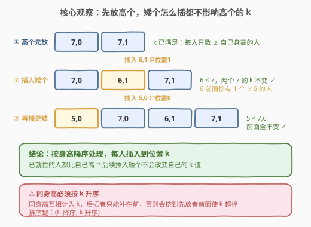
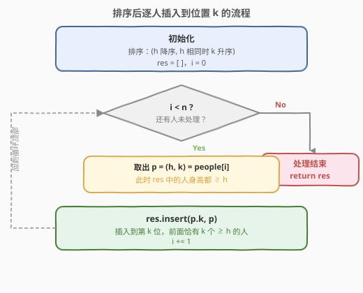
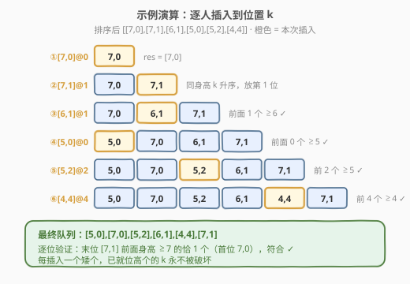

# LeetCode 根据身高重建队列 题解

## 1. 题目概述

- **标题 / 题号**：根据身高重建队列（#406，medium）
- **链接**：https://leetcode.cn/problems/queue-reconstruction-by-height/
- **难度**：中等
- **标签**：贪心、排序、插入、区间问题

**题意**：给定一组人的身高信息 `people`，其中 `people[i] = [h_i, k_i]`：

- `h_i` 表示第 `i` 个人的身高；
- `k_i` 表示**排在这个人前面**且身高**大于或等于** `h_i` 的人数。

请重构并返回正确的队列顺序。题目保证输入可被重构为唯一队列。

**示例 1**：

```text
输入：people = [[7,0],[4,4],[7,1],[5,0],[6,1],[5,2]]
输出：[[5,0],[7,0],[5,2],[6,1],[4,4],[7,1]]
解释：编号 0 的人身高为 5，前面没有大于等于 5 的人；
      编号 6 的人身高为 7，前面有 1 个（身高 7）大于等于 7 的人，以此类推。
```

**示例 2**：

```text
输入：people = [[6,0],[5,0],[4,0],[3,2],[2,2],[1,4]]
输出：[[4,0],[5,0],[2,2],[3,2],[1,4],[6,0]]
```

**约束**：

- $1 \leq n = \text{people.length} \leq 2000$
- $0 \leq h_i \leq 10^6$
- $0 \leq k_i < n$
- 题目保证可以重构出合法队列

> 💡 这道题的关键不是「模拟排队」，而是发现一个**与处理顺序无关的不变量**：一旦把高个先排好，后续插入矮个时，高个的 $k$ 值再也不会被破坏。这是一道典型的**贪心 + 排序**题。

## 2. 解题思路

### 2.1 暴力思路

枚举所有人的全排列（$n!$ 种），对每种排列检查每个人的 $k$ 是否满足，取第一个合法解。$n=2000$ 时完全不可行。

> 💡 全排列爆炸说明必须借助身高结构的**偏序关系**。核心观察是：**矮个的存在与否，不影响高个的 $k$ 值**——因为 $k$ 只数「大于等于自己身高」的人。

### 2.2 核心观察：先高后矮，按 k 插入



把人**按身高降序**处理；同身高则**按 $k$ 升序**。每取出一个人，就把它**插入到结果数组的第 $k$ 个位置**。

为什么这样一定对？分两点看：

- **高个先就位**：当处理身高为 $h$ 的人时，结果数组里**已经全都是身高 $\geq h$ 的人**。把它插到位置 $k$，恰好让前面有 $k$ 个「$\geq h$」的人，立刻满足它的 $k$ 值。
- **矮个后插入不影响高个**：后续插入的都是身高 $< h$ 的人，它们对身高 $h$ 的人的 $k$（只数 $\geq h$ 的人）**没有任何贡献**，无论插到哪里都不会改变高个前面「$\geq h$」的人数。

> ⚠️ 同身高为什么要按 $k$ 升序？因为同身高的人互相也算「$\geq$ 自己」。若先放 $k$ 大的，后放 $k$ 小的会插到它前面，导致 $k$ 大的那个人前面多了一个同身高的人，$k$ 就错了。按 $k$ 升序保证后插的同身高人只可能出现在更前面、不会挤到先放的人前面。

### 2.3 算法流程图



维护状态：

- `res`：结果数组，初始为空；
- 按排序后的顺序遍历每个人 `p = (h, k)`，执行 `res.insert(p.k, p)`。

> 💡 插入操作天然「把后面的人整体后移」，这正是我们想要的——新插入的人不会覆盖已有的，而已有高个的相对顺序和 $k$ 值都保持不变。

### 2.4 示例演算

以 `people = [[7,0],[4,4],[7,1],[5,0],[6,1],[5,2]]` 为例。排序（$h$ 降序，$h$ 相同 $k$ 升序）后为 `[[7,0],[7,1],[6,1],[5,0],[5,2],[4,4]]`，逐人插入：



| 步骤 | 取出的人 | 插入位置 k | 插入后 res | 说明 |
|------|----------|-----------|------------|------|
| ① | [7,0] | 0 | [7,0] | 首个，放第 0 位 |
| ② | [7,1] | 1 | [7,0],[7,1] | 同身高 k=1，放第 1 位 |
| ③ | [6,1] | 1 | [7,0],[6,1],[7,1] | 前面有 1 个 ≥6 的人 |
| ④ | [5,0] | 0 | [5,0],[7,0],[6,1],[7,1] | 前面 0 个 ≥5 |
| ⑤ | [5,2] | 2 | [5,0],[7,0],[5,2],[6,1],[7,1] | 前面 2 个 ≥5 |
| ⑥ | [4,4] | 4 | [5,0],[7,0],[5,2],[6,1],[4,4],[7,1] | 前面 4 个 ≥4 |

最终结果 `[[5,0],[7,0],[5,2],[6,1],[4,4],[7,1]]`，与期望输出一致 ✓。可逐位验证：第 5 位 `[7,1]` 前面身高 $\geq 7$ 的恰有 1 个（首位 `[7,0]`... 注意 `[5,0]` 不算），正确。

## 3. 参考代码

### C++

```cpp
class Solution {
  public:
    vector<vector<int>> reconstructQueue(vector<vector<int>>& people) {
        // 按 h 降序；h 相同按 k 升序
        sort(people.begin(), people.end(),
             [](const auto& a, const auto& b) {
                 return a[0] == b[0] ? a[1] < b[1] : a[0] > b[0];
             });
        vector<vector<int>> res;
        for (const auto& p : people) {
            res.insert(res.begin() + p[1], p);   // 插入到位置 k
        }
        return res;
    }
};
```

### Python

```python
class Solution:
    def reconstructQueue(self, people: List[List[int]]) -> List[List[int]]:
        # 按 h 降序；h 相同按 k 升序
        people.sort(key=lambda x: (-x[0], x[1]))
        res: List[List[int]] = []
        for p in people:
            res.insert(p[1], p)   # 插入到位置 k
        return res
```

> ⚠️ 排序比较器两个维度缺一不可：身高降序决定「先放谁」，同身高的 $k$ 升序决定「同身高内部的相对位置」。若只按身高降序、忽略 $k$ 升序，同身高的人可能互相挤位导致 $k$ 越界或错误。

## 4. 复杂度分析

| 维度 | 复杂度 | 说明 |
|------|--------|------|
| 时间复杂度 | $O(n^2)$ | 排序 $O(n \log n)$；每次 `insert` 最坏 $O(n)$，共 $n$ 次，插入主导 |
| 空间复杂度 | $O(n)$ | 结果数组 `res`（不计输出则为 $O(\log n)$ 排序栈） |

> 💡 对于 $n \leq 2000$，$O(n^2) \approx 4 \times 10^6$ 完全可接受。若 $n$ 更大，可用**树状数组 / 线段树**二分找第 $k$ 个空位，把插入优化到 $O(n \log n)$，见第 5 节。

## 5. 扩展：贪心正确性证明与 $O(n \log n)$ 优化

### 5.1 正确性（归纳法）

对排序后的序列 $p_1, p_2, \dots, p_n$（$h$ 降序，同 $h$ 时 $k$ 升序）归纳：

- **基础**：插入 $p_1$（最高且 $k$ 最小）到位置 $k_1$。此时结果数组为空，前面恰好 $k_1$ 个空位……但注意 $k_1$ 通常为 $0$（最高的人前面没有更高的人），插入合法。
- **归纳**：假设前 $i-1$ 个人都已正确就位。插入 $p_i = (h_i, k_i)$ 到位置 $k_i$ 时：
  - 已在 `res` 中的人身高都 $\geq h_i$，所以 $p_i$ 前面恰好有 $k_i$ 个「$\geq h_i$」的人，满足其 $k$ 值；
  - 后续插入的人身高 $< h_i$，不会改变 $p_i$ 前面「$\geq h_i$」的计数，$p_i$ 的 $k$ 永久满足。
- 同身高按 $k$ 升序：处理 $p_i$ 时，已在数组中的同身高人都是 $k$ 更小的，它们只可能排在 $p_i$ 的**前面或同位置之前**，不会因后插而挤到 $p_i$ 前面增加计数。

故贪心得到唯一合法解。

### 5.2 $O(n \log n)$ 优化思路

把「插入到第 $k$ 个位置」转化为「在 $n$ 个空位中找第 $k$ 个空位填入」：

- 初始有 $n$ 个空位，从矮到高（或反向）处理；
- 对每个人，用**树状数组**维护前缀空位数，二分找到第 $k+1$ 个空位的位置，填入并标记该位非空；
- 单次查询 $O(\log n)$，整体 $O(n \log n)$。

> ⚠️ 这种写法把插入的 $O(n)$ 后移成本换成树状数组的 $O(\log n)$ 查询，适合 $n$ 上到 $10^5$ 量级的变体题。面试中 $O(n^2)$ 的插入解法已是最常考、最易讲解的版本。

## 6. 面试要点

1. **为什么先排高个、后插矮个？**
   - 因为矮个不影响高个的 $k$（$k$ 只数 $\geq$ 自己身高的人）。先把高个按 $k$ 安置好，再让矮个往里插，高个的 $k$ 永远不会被破坏，问题被「降维」成只关心当前最高的人。

2. **同身高为什么要按 $k$ 升序？**
   - 同身高互相计入 $k$。若先放 $k$ 大的同身高人，后放的 $k$ 小者可能插到它前面，使 $k$ 大者前面多一个同身高的人而超标。按 $k$ 升序保证后插者只补在前，不影响先放者的计数。

3. **插入位置为什么就是 $k$？会不会越界？**
   - 处理 $p=(h,k)$ 时，`res` 中已有的人身高都 $\geq h$，总数 $\geq k$（因为合法解中它前面至少有 $k$ 个 $\geq h$ 的人，而这些人都已就位），所以 `k` 一定是 `res` 内合法下标，不会越界。

4. **时间复杂度 $O(n^2)$ 会不会超时？如何优化？**
   - $n \leq 2000$ 时 $O(n^2)$ 足够。优化用树状数组 + 二分把「找第 $k$ 个空位」降到 $O(\log n)$，整体 $O(n \log n)$，适合更大 $n$ 的变体。

5. **这题和「无重叠区间 / 合并区间」这类贪心有什么共同点？**
   - 都是「排序 + 单遍贪心」套路，但本题的贪心选择是**身高降序**（高个优先就位），排序键直接来自问题偏序结构；区间题的排序键则是端点。核心都是找一个让「后续操作不影响已做决策」的顺序。

## 同类练习题

| # | 题目 | 与本题的关联 |
|---|------|-------------|
| 315 | [计算右侧小于当前元素的数](https://leetcode.cn/problems/count-of-smaller-numbers-after-self/) | 同样可用树状数组 / 归并排序，是本题 $O(n \log n)$ 优化的同源技法 |
| 327 | [区间和的个数](https://leetcode.cn/problems/count-of-range-sum/) | 树状数组 + 离散化的进阶应用，强化「在线维护前缀计数」 |
| 1365 | [有多少小于当前数字的数字](https://leetcode.cn/problems/how-many-numbers-are-smaller-than-the-current-number/) | 排序 + 计数的简化版，适合作为本题的预热 |
| 435 | [无重叠区间](https://leetcode.cn/problems/non-overlapping-intervals/)（[题解](435_无重叠区间.md)） | 同为「排序 + 贪心」家族，对比排序键与贪心选择的不同来源 |
| 56 | [合并区间](https://leetcode.cn/problems/merge-intervals/)（[题解](../0001-0100/56_合并区间.md)） | 排序 + 单遍扫描的祖师题，巩固「先排序再线性处理」的通用框架 |
