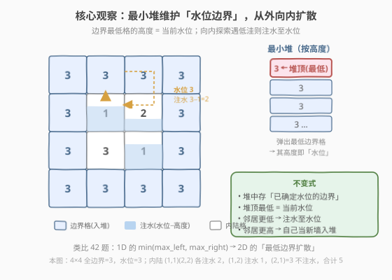
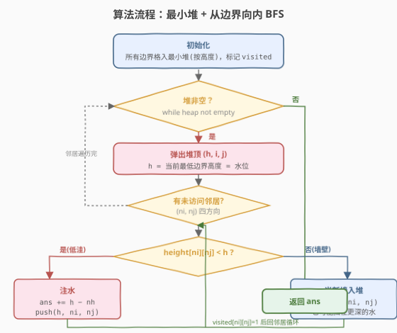
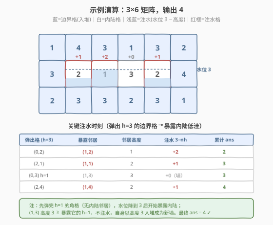

# 接雨水 II

- **题目名称**：接雨水 II
- **链接**：[407. 接雨水 II](https://leetcode.cn/problems/trapping-rain-water-ii/)
- **难度**：困难
- **标签**：堆、优先队列、广度优先搜索、图

## 1. 题目概述

给定一个 `m x n` 的非负整数矩阵 `heightMap`，每个元素表示该位置柱子的高度。下雨后，水会被周围更高的柱子挡住，计算这个**二维高度图**能接多少雨水。

这是 [42. 接雨水](../0001-0100/42_接雨水.md) 的二维版本：从「一维数组的左右两边界」升级到「二维网格的四周一圈边界」。

**示例 1**：

```text
输入：heightMap = [
  [1,4,3,1,3,2],
  [3,2,1,3,2,4],
  [2,3,3,2,3,1]
]
输出：4
解释：上图是输入的二维高度图，下雨后能接 4 个单位的雨水（蓝色区域）。
```

**示例 2**：

```text
输入：heightMap = [
  [3,3,3,3,3],
  [3,2,2,2,3],
  [3,2,1,2,3],
  [3,2,2,2,3],
  [3,3,3,3,3]
]
输出：10
```

**约束条件**：

- `m == heightMap.length`
- `n == heightMap[i].length`
- `1 <= m, n <= 200`
- `0 <= heightMap[i][j] <= 2 * 10^4`

---

## 2. 解题思路

### 2.1 暴力思路

对每个**内陆格** `(i, j)`，独立求它能接多少水。仿照 42 题的「左右最大值」思路：在 2D 中，一个格子能接的水量 =「从它出发逃到矩阵边界所需的最低路径高度」减去自身高度。即对所有从 `(i, j)` 到任意边界格的路径，取路径上**最大高度**的最小值（minimax 路径），再减 `heightMap[i][j]`。

对每个格子做一次 BFS/DFS 求最短「最大高度」路径，最坏 `O((M×N)^2)`，`200×200` 时约 16 亿次，明显超时。

### 2.2 核心观察：最小堆维护「水位边界」



**关键直觉**（承接 42 题）：

- 42 题里，每个位置的水位 = `min(max_left, max_right)`——由「左右两侧最高柱子的较小者」决定，因为水会从较矮的一侧溢出。
- 407 题把「左右两端」推广成「**四周一圈边界**」。能挡住某内陆格水的，是包围它的**整圈边界**；而水会从**边界上最矮的那个缺口**溢出，所以**当前水位 = 边界上的最低高度**。

> 💡 **为什么是边界最低格决定水位？** 想象把边界看成一道「围堤」。围堤最低处就是水会最先溢出的缺口——只要水位没涨到这个最低高度，内陆所有比它低的洼地都淹不到外面；一旦涨到这里，水才开始外溢。所以「最低边界高度」就是当前能维持的最高水位。

**做法**：用一个**最小堆**保存「当前已确定水位的边界格」，按高度排序：

1. 初始把矩阵**四周一圈格**全部入堆，标记 visited。
2. 每次弹出**堆顶**（高度最小的边界格 `(h, i, j)`）——`h` 就是当前水位。
3. 看它的四个邻居（未访问的）：
   - 若 `heightMap[ni][nj] < h`：邻居是低洼，**注水** `h - heightMap[ni][nj]`；注水后该格有效高度变成 `h`（水面与水位齐平），以 `h` 入堆。
   - 若 `heightMap[ni][nj] >= h`：邻居不低于水位，不注水，**自己当新墙**入堆（以其自身高度入堆，它可能在未来挡住更深的水）。
   - 标记邻居 visited。

> ⚠️ **为什么入堆时取 `max(h, heightMap[ni][nj])`？** 一个格子的「有效边界高度」= 它自身高度与暴露它的水位 `h` 取较大者。若它比水位高，它就是一道更高的墙，应以自身高度入堆；若它比水位低，水面会把它填到水位 `h`，所以以 `h` 入堆。统一写 `push(max(h, nh), ni, nj)`，注水量为 `max(0, h - nh)`。

**不变式**：堆中始终保存「**已确定水位的边界**」，堆顶最低 = 当前全局水位。每次弹出一个格，相当于把边界向内推一格；推入的新格以「水位与自身高度的较大者」加入边界。这本质上是 **Dijkstra 算法**在「minimax 路径」上的应用——每个格子的最终水位 = 从它到原始边界的 minimax 路径高度，按该值从小到大松弛。

### 2.3 算法流程图



**步骤**：

1. **初始化**：把所有边界格（第 0 行、末行、第 0 列、末列）以 `(height, i, j)` 入最小堆，`visited[i][j] = true`。
2. **主循环**（`while` 堆非空）：
   - 弹出堆顶 `(h, i, j)`。
   - 对四个方向邻居 `(ni, nj)`：
     - 越界或已 visited 则跳过。
     - `water += max(0, h - heightMap[ni][nj])`。
     - `push(max(h, heightMap[ni][nj]), ni, nj)`，标记 visited。
3. 堆空，返回 `water`。

### 2.4 示例演算



以示例 1 的 `3×6` 矩阵为例，**内陆格只有 4 个**：`(1,1)=2`、`(1,2)=1`、`(1,3)=3`、`(1,4)=2`。

| 步骤 | 弹出 (h) | 暴露邻居 | 邻居高度 | 注水 | 累计 |
|------|----------|----------|----------|------|------|
| 先弹完 h=1 的角格 | (0,0)(0,3)(2,5) 等 | 无内陆邻居 | — | 0 | 0 |
| 水位降到 3 | (0,2) h=3 | (1,2) | 1 | +2 | 2 |
| | (2,1) h=3 | (1,1) | 2 | +1 | 3 |
| | (0,3) h=1 暴露 (1,3) | (1,3) | 3 ≥ 1 | +0（当新墙以 3 入堆） | 3 |
| | (2,4) h=3 | (1,4) | 2 | +1 | 4 |

观察要点：

- **角格不暴露内陆**：`(0,0)=1` 这类角格弹掉后，邻居都是边界格（已 visited），不产生注水。
- **水位由 3 决定**：`(0,2)=3`、`(2,1)=3`、`(2,4)=3` 这几个高度为 3 的边界格，是真正暴露内陆洼地的「缺口」，所以内陆水位 = 3。
- **`(1,3)=3` 不注水**：它被 `(0,3)=1` 暴露，但自身 3 ≥ 水位 1，所以不注水，反而以自身高度 3 入堆成为新墙。最终它也不被任何更高水位淹没（四周水位都是 3）。
- 最终 `ans = 4`，与示例输出一致。

> 💡 **对比 42 题的演算**：42 题是「每个位置算 `min(max_left, max_right) - h[i]`」，一维两端向中间收；407 题是「四周一圈向内收，最低边界决定水位」，本质上把 `min(max_left, max_right)` 推广成了「包围圈的最小高度」。

---

## 3. 参考代码

### C++

```cpp
class Solution {
    int dx[4] = {0, 0, 1, -1};
    int dy[4] = {1, -1, 0, 0};

  public:
    int trapRainWater(vector<vector<int>>& heightMap) {
        int m = heightMap.size();
        int n = heightMap[0].size();
        if (m < 3 || n < 3) return 0; // 内陆格不存在

        // 最小堆：(height, i, j)
        priority_queue<tuple<int, int, int>,
                       vector<tuple<int, int, int>>,
                       greater<tuple<int, int, int>>> pq;
        vector<vector<char>> visited(m, vector<char>(n, 0));

        // 1. 四周边界格入堆
        for (int j = 0; j < n; j++) {
            pq.emplace(heightMap[0][j], 0, j);
            pq.emplace(heightMap[m - 1][j], m - 1, j);
            visited[0][j] = visited[m - 1][j] = 1;
        }
        for (int i = 1; i < m - 1; i++) {
            pq.emplace(heightMap[i][0], i, 0);
            pq.emplace(heightMap[i][n - 1], i, n - 1);
            visited[i][0] = visited[i][n - 1] = 1;
        }

        int water = 0;
        // 2. 不断弹出最低边界，向内扩散
        while (!pq.empty()) {
            auto [h, i, j] = pq.top();
            pq.pop();
            for (int d = 0; d < 4; d++) {
                int ni = i + dx[d], nj = j + dy[d];
                if (ni < 0 || ni >= m || nj < 0 || nj >= n) continue;
                if (visited[ni][nj]) continue;
                int nh = heightMap[ni][nj];
                if (nh < h) water += h - nh;     // 低洼注水
                visited[ni][nj] = 1;
                pq.emplace(max(h, nh), ni, nj);  // 有效边界高度
            }
        }
        return water;
    }
};
```

### Python

```python
class Solution:
    def trapRainWater(self, heightMap: List[List[int]]) -> int:
        import heapq
        m, n = len(heightMap), len(heightMap[0])
        if m < 3 or n < 3:
            return 0

        heap = []
        visited = [[False] * n for _ in range(m)]

        # 1. 四周边界格入堆
        for j in range(n):
            heapq.heappush(heap, (heightMap[0][j], 0, j))
            heapq.heappush(heap, (heightMap[m - 1][j], m - 1, j))
            visited[0][j] = visited[m - 1][j] = True
        for i in range(1, m - 1):
            heapq.heappush(heap, (heightMap[i][0], i, 0))
            heapq.heappush(heap, (heightMap[i][n - 1], i, n - 1))
            visited[i][0] = visited[i][n - 1] = True

        water = 0
        dirs = [(0, 1), (0, -1), (1, 0), (-1, 0)]
        # 2. 不断弹出最低边界，向内扩散
        while heap:
            h, i, j = heapq.heappop(heap)
            for di, dj in dirs:
                ni, nj = i + di, j + dj
                if 0 <= ni < m and 0 <= nj < n and not visited[ni][nj]:
                    nh = heightMap[ni][nj]
                    if nh < h:
                        water += h - nh            # 低洼注水
                    visited[ni][nj] = True
                    heapq.heappush(heap, (max(h, nh), ni, nj))  # 有效边界高度
        return water
```

> 💡 **常见坑**：入堆时**不要写 `heightMap[ni][nj]`**，而要写 `max(h, nh)`。若直接用邻居原始高度入堆，注过水的格子（被填到水位 `h`）会以较低的原始高度重新进堆，导致后续算出的水位偏低、漏算水量。`max(h, nh)` 表示「该格作为新边界时，水面所在的高度」。

---

## 4. 复杂度分析

| 维度 | 复杂度 | 说明 |
|------|--------|------|
| 时间复杂度 | `O(M×N log(M×N))` | 每个格子入堆、出堆各 1 次，共 `M×N` 次堆操作，每次 `O(log(M×N))` |
| 空间复杂度 | `O(M×N)` | `visited` 矩阵 `O(M×N)`；堆最坏存 `O(M×N)` 个元素 |

> ⚠️ 看似有「弹出一个再 push 多个邻居」的嵌套，但每个格子**只入堆一次**（`visited` 去重），所以总 push/pop 次数 = `2×M×N`，整体 `O(M×N log(M×N))`。`200×200 = 40000` 个格，约 `40000 × 16 ≈ 6.4×10^5` 次操作，远在时限内。

---

## 5. 扩展：与 42 题、Dijkstra 的本质联系

### 5.1 与 42 题的对应关系

| 维度 | 42 题（1D） | 407 题（2D） |
|------|-------------|--------------|
| 边界 | 数组左右两端 | 矩阵四周一圈 |
| 水位 | `min(max_left, max_right)` | 包围圈最低高度 |
| 推进方式 | 双指针从两端向中间 | 最小堆从四周向内 BFS |
| 复杂度 | `O(n)` 时间 `O(1)` 空间 | `O(MN log(MN))` 时间 `O(MN)` 空间 |

42 题的双指针之所以能 `O(1)` 空间，是因为 1D 的边界只有「左、右」两个候选，比较 `left_max`/`right_max` 即可决策移动哪侧。2D 的边界是「一圈」，无法用常数个指针维护「最小边界」，必须用最小堆动态取最小。这是 2D 退化到 1D 时复杂度从 `O(n)` 升到 `O(n log n)` 的根本原因。

### 5.2 本质是 Dijkstra 求 minimax 路径

定义每个格子 `c` 的「**逃生高度**」`level(c)` = 从 `c` 走到任意原始边界格的所有路径中，路径上**最大高度**的最小值。则：

$$
\text{water}(c) = \max(0,\ \text{level}(c) - \text{height}(c))
$$

这正是图上「minimax 路径」问题，等价于把 Dijkstra 的「路径长度累加」换成「路径最大高度取最小」。最小堆每次松弛当前 `level` 最小的格子，向邻居扩展时 `level(邻居) = max(level(当前), height(邻居))`——与 Dijkstra 中 `dist(邻居) = dist(当前) + w` 的结构完全同构。

> 💡 一旦认出这是 Dijkstra，就能解释为什么 `visited` 后不再更新：Dijkstra 基于「非负权 + 贪心」，先弹出的格子其 `level` 已是最小，不可能被后续更大的 `level` 改进。

---

## 6. 面试要点

1. **为什么用最小堆而不是最大堆？**

   - 水从**最矮的缺口**溢出，所以决定水位的是边界上的**最小值**。最小堆每次取出当前最低边界，对应「当前全局水位」。若用最大堆，弹出的是最高墙，无法确定水位。

2. **为什么入堆用 `max(h, nh)` 而不是 `nh`？**

   - 邻居被暴露时的有效高度 = 自身高度与水位的较大者。若邻居比水位低（注水了），水面把它填到水位 `h`，应以 `h` 入堆；若邻居比水位高（当新墙），以自身 `nh` 入堆。统一为 `max(h, nh)`。直接用 `nh` 会让注水后的格子以原始低高度入堆，后续水位被低估、漏算水量。

3. **这题和 42 题思路怎么衔接？**

   - 42 题 `min(max_left, max_right)` 是「两端边界最小值」；407 题推广到「四周一圈边界最小值」。42 题双指针维护 `left_max`/`right_max`，407 题用最小堆维护「整圈边界的最小值」。2D 边界是一圈无法常数维护，所以升到 `O(MN log MN)`。

4. **为什么不能用 BFS/DFS 仿照 42 题 DP？**

   - 42 题 DP 预处理 `left_max[i]`、`right_max[i]` 一遍扫即可；2D 中「从 `(i,j)` 到边界的 minimax 路径」无法用一两个方向数组预处理——它取决于整圈边界的拓扑。必须用最小堆在线松弛，本质是 Dijkstra。

5. **`visited` 之后还能再更新吗？**

   - 不能。这题等价于 Dijkstra 求 minimax 路径，先弹出的格 `level` 已最小（贪心正确性来自非负高度），后续 `level` 只会更大，不会改进已 visited 的格子。所以 `visited` 一旦置真即可跳过。

6. **退化情况要注意什么？**

   - `m < 3 || n < 3` 时没有内陆格（边界占满），直接返回 0，避免空堆/越界。
   - 全 0 矩阵或全等高矩阵：水位 = 该高度，洼地高度等于水位，注水 0，结果正确。

---

## 7. 同类练习题

- [42. 接雨水](https://leetcode.cn/problems/trapping-rain-water/)（[题解](../0001-0100/42_接雨水.md)）：1D 原版，双指针/单调栈，理解本题的基石
- [743. 网络延迟时间](https://leetcode.cn/problems/network-delay-time/)（[题解](../0701-0800/743_网络延迟时间.md)）：堆优化 Dijkstra 模板，本题的算法骨架（把路径和换成路径最大高度）
- [417. 太平洋大西洋水流问题](https://leetcode.cn/problems/pacific-atlantic-water-flow/)（[题解](417_太平洋大西洋水流问题.md)）：同样「从边界反向 BFS」的网格水流感，但用普通 DFS 即可（无需优先级）
- [1631. 最小消耗到达目的地的最短路径](https://leetcode.cn/problems/path-with-minimum-effort/)：与本题同属「minimax 路径」家族，最小堆 + BFS，可对照练习
- [994. 腐烂的橘子](https://leetcode.cn/problems/rotting-oranges/)：多源 BFS 网格扩散模板，对照「从边界向内扩散」的结构
