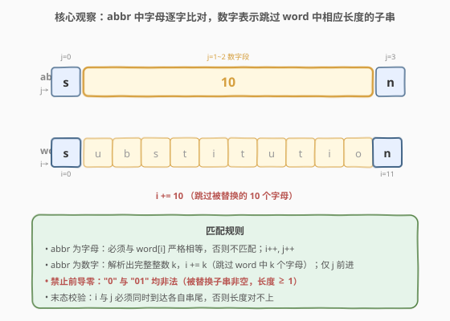
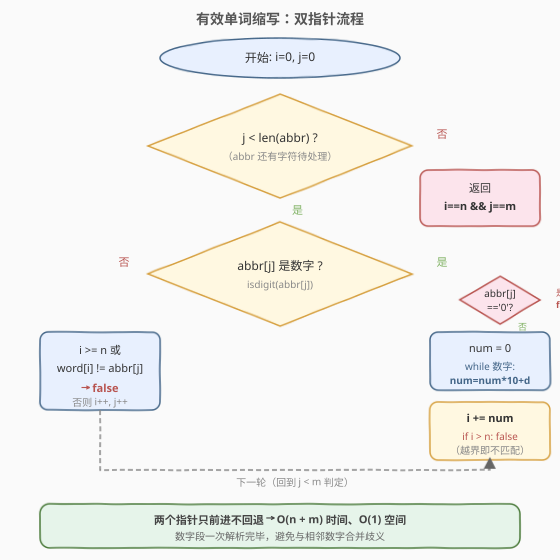
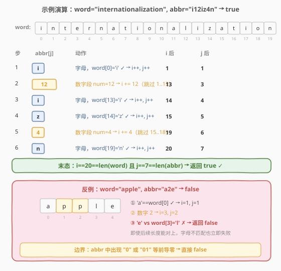

# 有效单词缩写

- **题目名称**：有效单词缩写
- **链接**：[408. 有效单词缩写](https://leetcode.cn/problems/valid-word-abbreviation/)
- **难度**：简单
- **标签**：字符串、双指针、模拟

## 1. 题目概述

给定一个**非空**字符串 `word` 和一个缩写 `abbr`，判断 `abbr` 是否是 `word` 的合法缩写。

「缩写」的构造规则：把 `word` 中**任意若干个非空、不相邻**的子串替换为它们的长度（数字串），其余字符保留原样。数字串**不允许有前导零**。

> 💡 一句话理解：`abbr` 里出现字母就要求与 `word` 对应位置严格相等；出现数字 `k` 就表示「跳过 `word` 中连续 `k` 个字符」。被跳过的若干段之间彼此由保留的字母隔开，因此相邻数字段天然非法（会合并成一个更大的数）。

**示例 1**：

```text
输入：word = "internationalization", abbr = "i12iz4n"
输出：true
解释：i + 跳过 12 个字符 (nternational) + i + z + 跳过 4 个字符 (atio) + n
      恰好还原 "internationalization"。
```

**示例 2**：

```text
输入：word = "apple", abbr = "a2e"
输出：false
解释：a + 跳过 2 个字符 (pp) + e，此时 i 停在 'l' 而非 'e'，字母不匹配。
```

**约束条件**：

- $1 \le \text{word.length} \le 20$
- `word` 仅由小写英文字母组成
- $1 \le \text{abbr.length} \le 10$
- `abbr` 由小写英文字母和数字组成
- `abbr` 中的所有整数在 32 位整数范围内

> ⚠️ **三个易错点**：① **前导零**：单独的 `"0"` 或 `"01"` 均非法（被替换子串非空，长度至少为 1）；② **末态校验**：`i` 和 `j` 必须同时到达串尾，缺一不可；③ **越界**：跳过 `k` 个字符后 `i` 不能超过 `n`。

---

## 2. 解题思路

### 2.1 暴力思路

枚举 `word` 的所有「保留/替换」方案（每个非空子串选择是否替换为长度），生成全部合法缩写，再看 `abbr` 是否在集合中。$2^{n}$ 级别组合，`n=20` 时约 $10^6$ 还可接受，但生成去重代价大、且需额外保证「替换段不相邻」「无前导零」，实现繁琐。

> 💡 暴力法把「生成」与「匹配」混在一起。其实题目只需**判定**，不必生成所有缩写——直接用双指针同步扫描 `word` 与 `abbr` 即可。

### 2.2 核心观察：双指针同步扫描



设 `i` 指向 `word` 当前字符，`j` 指向 `abbr` 当前字符。两者都从 0 出发，按 `abbr[j]` 的类型分两支推进：

- **`abbr[j]` 是字母**：必须与 `word[i]` 严格相等（且 `i` 未越界），否则不匹配；相等则 `i++, j++`。
- **`abbr[j]` 是数字**：连续读取整段数字得到整数 `num`（同时校验前导零），令 `i += num`，`j` 停在数字段之后。这一步只动 `i`，因为数字消耗的是 `word` 的一段，而 `abbr` 自身只占这串数字符。

**两个关键不变量**：

1. **同步对齐**：每一步处理完，`word[0..i)` 与 `abbr` 已处理部分「等长且字符一致」。字母步骤让两侧各前进 1；数字步骤让 `i` 前进 `num`、`j` 前进数字位数，两侧「消耗的语义长度」相同（`abbr` 数字段的语义长度就是 `num`）。
2. **单调推进**：`i`、`j` 只增不减，所以总扫描量为 $O(n + m)$。

### 2.3 算法流程图



流程要点：

- 数字分支先判 `abbr[j] == '0'`，命中即返回 `false`（前导零 / 单零都非法）；否则 `num = num * 10 + d` 连续累加。
- `i += num` 之后立即判 `i > n`，越界返回 `false`（跳过的字符超出 `word` 长度）。
- 字母分支判 `i >= n || word[i] != abbr[j]`，命中返回 `false`。
- 循环退出后还要做末态校验：`i == n && j == m`。常见坑：`abbr` 末尾是字母但 `word` 已耗尽，或 `abbr` 已耗尽但 `word` 还有剩余。

### 2.4 示例演算



以 `word = "internationalization"`（长度 20）、`abbr = "i12iz4n"` 为例，逐步推进：

| 步 | `abbr[j]` | 类型 | 动作 | `i` 后 | `j` 后 |
|----|-----------|------|------|--------|--------|
| 1 | `i` | 字母 | `word[0]='i'` ✓ | 1 | 1 |
| 2 | `12` | 数字 | `num=12, i+=12`（跳过 `nternational`，下标 1..12） | 13 | 3 |
| 3 | `i` | 字母 | `word[13]='i'` ✓ | 14 | 4 |
| 4 | `z` | 字母 | `word[14]='z'` ✓ | 15 | 5 |
| 5 | `4` | 数字 | `num=4, i+=4`（跳过 `atio`，下标 15..18） | 19 | 6 |
| 6 | `n` | 字母 | `word[19]='n'` ✓ | 20 | 7 |

末态：`i == 20 == n` 且 `j == 7 == m`，返回 `true`。

反例 `word = "apple"`、`abbr = "a2e"`：`'a'` 匹配 `word[0]` → `i=1`；数字 `2` → `i=3`；`'e'` 对 `word[3]='l'` 不匹配 → `false`。

---

## 3. 参考代码

### C++

```cpp
class Solution {
public:
    bool validWordAbbreviation(string word, string abbr) {
        int i = 0, j = 0;
        int n = word.size(), m = abbr.size();
        while (j < m) {
            if (isdigit(abbr[j])) {
                if (abbr[j] == '0') return false;        // 前导零 / 单零非法
                int num = 0;
                while (j < m && isdigit(abbr[j])) {
                    num = num * 10 + (abbr[j] - '0');
                    ++j;
                }
                i += num;
                if (i > n) return false;                  // 跳过越界
            } else {
                if (i >= n || word[i] != abbr[j]) return false;
                ++i; ++j;
            }
        }
        return i == n && j == m;                          // 末态双指针对齐
    }
};
```

### Python

```python
def validWordAbbreviation(word: str, abbr: str) -> bool:
    i, j = 0, 0
    n, m = len(word), len(abbr)
    while j < m:
        if abbr[j].isdigit():
            if abbr[j] == '0':                # 前导零 / 单零非法
                return False
            num = 0
            while j < m and abbr[j].isdigit():
                num = num * 10 + int(abbr[j])
                j += 1
            i += num
            if i > n:                         # 跳过越界
                return False
        else:
            if i >= n or word[i] != abbr[j]:
                return False
            i += 1
            j += 1
    return i == n and j == m                  # 末态双指针对齐
```

---

## 4. 复杂度分析

| 维度 | 复杂度 | 说明 |
|------|--------|------|
| **时间** | $O(n + m)$ | `i` 扫过 `word` 至多一遍、`j` 扫过 `abbr` 至多一遍；两指针单调推进不回退 |
| **空间** | $O(1)$ | 仅用 `i`、`j`、`num` 等常数个变量 |
| **正确性** | 单遍扫描 + 末态校验 | 三类非法情形（前导零、字母失配、长度不齐）均被分支覆盖 |

> 💡 **为何数字段要一次读完**：`abbr` 中相邻数字字符合并成一个整数（如 `"12"` 表示 12 而非两个 1）。逐位 `num = num*10 + d` 把整段数字解析为单个 `num`，与「被替换子串非空、不相邻」的语义一致；同时这一步天然处理了前导零（首位为 `'0'` 直接判非法）。

---

## 5. 扩展： Unique Word Abbreviation 与缩写互斥

本题判定「单个 `abbr` 是否匹配单个 `word`」。同系列还有：

- [288. 单词的唯一缩写](https://leetcode.cn/problems/unique-word-abbreviation/)：维护一个字典里所有单词的缩写，查询某缩写是否「唯一」对应某单词。把每个单词按本题规则算出**规范缩写**（如 `"internationalization" → "i18n"`，即首字母 + 中间长度 + 尾字母）作哈希键，再判计数即可。
- [320. 列举单词的全部缩写](https://leetcode.cn/problems/generalized-abbreviation/)：对单个 `word` 生成**所有合法缩写**（回溯：每个位置选保留字母或并入当前数字段）。

三者关系：408 是**判定**（双指针）、288 是**索引**（哈希计数）、320 是**枚举**（回溯生成）。本题的双指针判定可作为 288 中「规范缩写」的快速校验工具。

---

## 6. 面试要点

1. **为什么前导零（包括单独的 `"0"`）要判非法？**

   - 缩写规则要求被替换子串**非空**，长度至少为 1，故 `"0"` 没有对应的有效子串；而 `"01"` 与 `"1"` 表示同一长度但写法歧义，统一禁止前导零。代码中只需检查数字段首位是否为 `'0'`。

2. **末态为什么必须 `i == n && j == m`，而不是只看 `j == m`？**

   - `j == m` 只保证 `abbr` 扫完，但 `word` 可能还剩字符（如 `word="abc"`、`abbr="a1"`，`i=2 ≠ 3`）。两侧消耗的「语义长度」必须完全相等，故 `i` 也必须恰为 `n`。

3. **跳过 `num` 个字符后 `i > n` 为什么直接判 false？**

   - `i` 超过 `n` 意味着 `abbr` 要求跳过比 `word` 剩余字符更多的字符，无法对齐；即便后续还有字母也无法挽回（指针只前进）。注意判 `>` 而非 `>=`：`i == n` 仍合法，只要 `abbr` 也恰好扫完。

4. **数字段能否用 `int(num)` 直接转？**

   - 可以，但需先切片并校验前导零。手写 `num = num*10 + d` 更直观、且能把前导零检查与解析合并在一次扫描里，避免对 `"01"` 单独处理。约束下整数不会溢出 32 位。

5. **若 `word` 与 `abbr` 都很长（放宽约束），算法是否仍优？**

   - 仍是 $O(n+m)$ 时间、$O(1)$ 空间，且常数极小。没有更快下界（必须读完两个串才能判定），已是最优。

---

## 7. 同类练习题

- [288. 单词的唯一缩写](https://leetcode.cn/problems/unique-word-abbreviation/)：把单词转成规范缩写作哈希键查询，承接 408 的缩写语义
- [320. 列举单词的全部缩写](https://leetcode.cn/problems/generalized-abbreviation/)：回溯枚举单个单词的所有合法缩写，408 的「生成」对应版
- [125. 验证回文串](https://leetcode.cn/problems/valid-palindrome/)（[题解](../0101-0200/125_验证回文串.md)）：同样是双指针扫描字符串 + 字符类型判定，对照练习
- [392. 判断子序列](https://leetcode.cn/problems/is-a-subsequence/)（[题解](../0301-0400/392_判断子序列.md)）：双指针同步推进的另一种形态（一串匹配另一串的子序列），承接双指针套路
