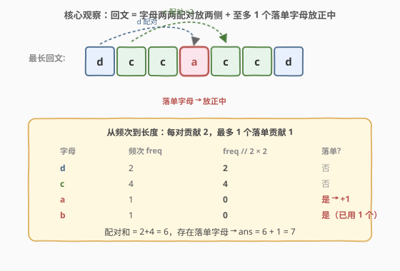
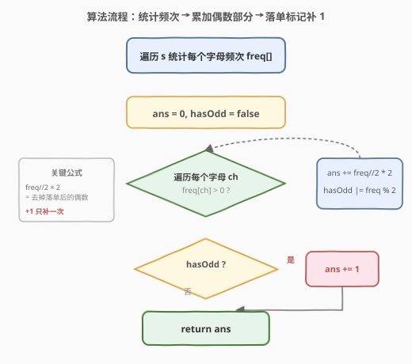
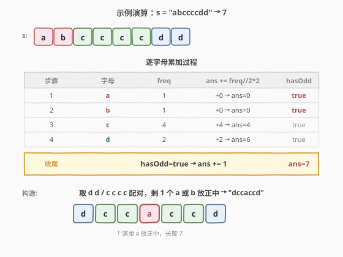

# LeetCode 最长回文串 题解

## 1. 题目概述

- **标题 / 题号**：最长回文串（#409，easy）
- **链接**：https://leetcode.cn/problems/longest-palindrome/
- **难度**：简单
- **标签**：哈希表、字符串、贪心

**题意**：给定一个由**大写字母和小写字母**组成的字符串 `s`，返回用这些字母能构造出的**最长回文串**的长度。

构造时**区分大小写**：`"Aa"` 不能视为回文（`'A'` 与 `'a'` 是不同字母）。字母的顺序、挑选哪些字母可自由重排，只关心能拼出的最长回文长度。

**示例 1**：

```text
输入：s = "abccccdd"
输出：7
解释：可构造的最长回文串是 "dccaccd"，长度为 7。
```

**示例 2**：

```text
输入：s = "a"
输出：1
```

**约束**：

- $1 \le \text{s.length} \le 2000$
- `s` 只由小写和/或大写英文字母组成

> 💡 一句话理解：回文的两侧天然对称，每种字母在两侧总是**成对出现**；正中可放至多 1 个落单字母。问题转化为「统计每种字母能凑出多少对，再加上可能的 1 个中心」。

## 2. 解题思路

### 2.1 暴力思路

枚举 `s` 的所有重排，逐个判断是否回文，取最长。重排数为 $n!$，完全不可行。

退一步：枚举「每种字母的使用数量」组合，使总量等于 $n$，再校验这些数量能否排成回文（至多一个奇数量）。字母种类 $|\Sigma|$ 在 ASCII 大小写混合下为 $52$，组合空间仍以指数级膨胀，且校验繁琐。

> 💡 暴力法把「构造具体串」与「求最大长度」耦合在一起。其实题目只要**长度**，不必关心具体怎么排——只要知道每种字母能贡献多少对、是否还有落单即可。

### 2.2 核心观察：频次配对 + 至多一个中心



回文的对称结构决定了：

- **每个字母在两侧成对出现**：字母 `ch` 出现 `freq` 次，能贡献的对数为 $\lfloor \text{freq} / 2 \rfloor$，对回文长度的贡献为 $\lfloor \text{freq} / 2 \rfloor \times 2$（偶数部分）。
- **正中至多 1 个落单字母**：只要存在**任意**一个 `freq` 为奇数的字母，就可在正中放 1 个，总长度再 $+1$。多个奇数频次字母也只能取 1 个做中心，其余各减 1 凑成偶数对。

故答案为：

$$
\text{ans} = \sum_{ch} \left\lfloor \frac{\text{freq}[ch]}{2} \right\rfloor \times 2 \;+\; \begin{cases} 1, & \text{若存在 } \text{freq}[ch] \text{ 为奇数} \\ 0, & \text{否则} \end{cases}
$$

> ⚠️ **大小写敏感**：`'A'` 与 `'a'` 视作不同字母，分别计数。题目保证 `s` 只含英文字母，故可用长度 128 的数组（覆盖 ASCII）或哈希表。

### 2.3 算法流程图



流程要点：

- 第一步遍历 `s` 累加频次；第二步遍历「字母集合」累加偶数部分并记录是否存在奇数频次。
- `freq // 2 * 2` 一步把「奇数频次」自动砍掉落单的 1 个，等效于「能配多少对就配多少对」。
- 末尾若 `hasOdd` 为真则 `ans += 1`，**只补一次**：无论有几个奇数频次字母，中心只能放 1 个。

### 2.4 示例演算



以 `s = "abccccdd"` 为例：

| 步 | 字母 | freq | `ans += freq//2*2` | hasOdd |
|----|------|------|--------------------|--------|
| 1 | a | 1 | +0 → 0 | true |
| 2 | b | 1 | +0 → 0 | true |
| 3 | c | 4 | +4 → 4 | true |
| 4 | d | 2 | +2 → 6 | true |
| 收尾 | — | — | hasOdd=true → +1 | ans=7 |

最终 `ans = 7`。可构造的回文如 `"dccaccd"`：`d d`、`c c c c` 各配对放两侧，落单的 `a`（或 `b`）放正中。

## 3. 参考代码

### C++

```cpp
class Solution {
public:
    int longestPalindrome(string s) {
        int freq[128] = {0};
        for (char ch : s) ++freq[(int)ch];          // 大小写敏感，分别计数
        int ans = 0;
        bool hasOdd = false;
        for (int i = 0; i < 128; ++i) {
            ans += freq[i] / 2 * 2;                 // 取偶数部分
            if (freq[i] % 2) hasOdd = true;
        }
        return ans + (hasOdd ? 1 : 0);              // 至多补 1 个中心
    }
};
```

### Python

```python
class Solution:
    def longestPalindrome(self, s: str) -> int:
        from collections import Counter
        ans = 0
        has_odd = False
        for freq in Counter(s).values():            # Counter 天然区分大小写
            ans += freq // 2 * 2                    # 取偶数部分
            if freq % 2:
                has_odd = True
        return ans + (1 if has_odd else 0)          # 至多补 1 个中心
```

## 4. 复杂度分析

| 维度 | 复杂度 | 说明 |
|------|--------|------|
| **时间** | $O(n + |\Sigma|)$ | 一次遍历 `s` 统计频次 $O(n)$；再遍历字母集合累加，$|\Sigma| \le 128$ 为常数 |
| **空间** | $O(|\Sigma|)$ | 频次数组 / 哈希表，常数级（大小写字母共 52 种，ASCII 数组 128） |
| **正确性** | 配对 + 中心贪心 | 回文对称性 ⇒ 每种字母偶数部分必可用；中心唯一 ⇒ 至多补 1；贪心取全部偶数部分即最优 |

> 💡 **为何贪心是最优**：任何回文中每种字母的使用数要么全偶、要么恰有一种为奇（中心字母）。要让总长度最大，应把每种字母的偶数部分全用上——少用任何一对都会让长度减少 2，无任何收益。因此「偶数部分全取 + 至多一个奇数补 1」即为上界，且可构造达到。

## 5. 扩展：奇数频次的处理技巧

`freq // 2 * 2` 把奇数砍 1 凑偶；末尾统一 `+1` 补中心。也可换写法：

```python
ans = sum(f & ~1 for f in Counter(s).values())   # f & ~1 等价于 f//2*2
return ans + (ans < len(s))                       # 若有落单则 ans < n，补 1
```

`f & ~1` 利用位运算清掉最低位，把奇数变偶。判定「是否存在落单」则转化为 `ans < len(s)`：若所有频次都为偶，`ans == n`；只要有一个奇数频次，偶数部分之和就严格小于 `n`，必有一个落单可补中心。两种写法等价，后者更短但需解释位运算。

> ⚠️ 位运算写法仅适用于非负整数频次；`f & ~1` 在 Python 中对负数会得到意外结果（频次恒非负，故本题安全）。

## 6. 面试要点

1. **为什么答案不是简单地 `sum(freq) - 奇数频次个数 + 1`？**

   - 公式要对：若有 $k$ 个奇数频次字母，每个奇数频次要砍掉 1 个凑偶，共砍 $k$ 个；再把其中 1 个放回正中，故 `ans = n - k + (k > 0 ? 1 : 0)`。这与「偶数部分求和 + 至多补 1」等价。常见误区是忘记 `k > 0` 时才补 1，或误把所有奇数都补回。

2. **大小写为什么要分别计数？**

   - 题目明确 `"Aa"` 不是回文。`'A'` 与 `'a'` ASCII 码不同（65 vs 97），分别计数才能保证只有同字符才能配对。用 `int(ch)` 作下标或 `Counter(s)` 天然区分。

3. **能否在统计频次的同时直接累加答案？**

   - 可以。维护一个 `pair_count`，每来一个字符 `ch`，若 `freq[ch]` 已为奇数则说明这次能凑一对，`ans += 2` 并把 `freq[ch]` 置偶；否则 `freq[ch]` 置奇。最后若有任意奇数标记则 `+1`。一次遍历即可，但可读性略低于两段式写法。

4. **若字母集合扩展为任意 Unicode 字符，算法是否仍成立？**

   - 仍成立。把定长数组换成哈希表即可，时间复杂度不变 $O(n)$，空间为 $O(\text{不同字符数})$。核心「配对 + 中心」结论与字符集无关。

5. **`ans + (hasOdd ? 1 : 0)` 与 `ans + (ans < len(s))` 哪个更好？**

   - 前者语义直观、易解释；后者省一个 `hasOdd` 变量且把判定合并进返回表达式，更简洁。面试中先讲前者讲清原理，再提后者作为优化，体现对位运算与不变量的理解。

## 同类练习题

| # | 题目 | 与本题的关联 |
|---|------|-------------|
| 5 | [最长回文子串](https://leetcode.cn/problems/longest-palindromic-substring/)（[题解](../0001-0100/5_最长回文子串.md)） | 本题求「能构造的最长回文长度」，5 求「原串中的最长回文子串」，对照理解回文的两类问题 |
| 9 | [回文数](https://leetcode.cn/problems/palindrome-number/)（[题解](../0001-0100/9_回文数.md)） | 回文判定的数字版，承接回文对称性的基本认知 |
| 125 | [验证回文串](https://leetcode.cn/problems/valid-palindrome/) | 判定给定串是否回文，本题「构造」与 125「判定」互为补充 |
| 242 | [有效的字母异位词](https://leetcode.cn/problems/valid-anagram/) | 同样基于字母频次统计，对照频次哈希的另一种用法 |
| 647 | [回文子串](https://leetcode.cn/problems/palindromic-substrings/) | 回文计数的中心扩展法，配合本题理解回文「中心」概念 |
