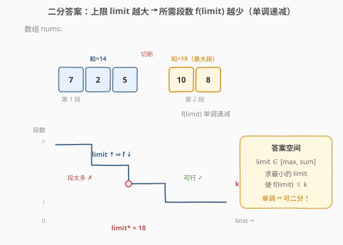
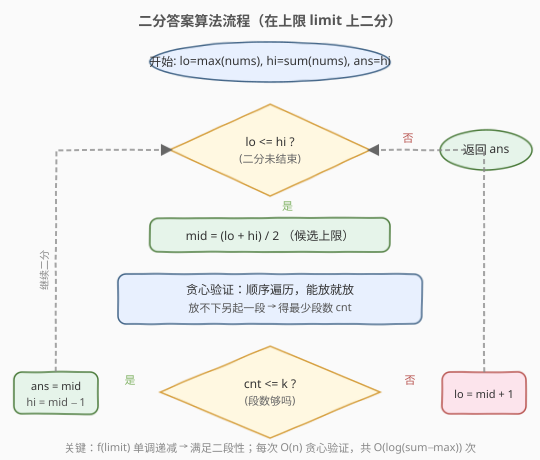

# 分割数组的最大值

- **题目名称**：分割数组的最大值
- **链接**：[410. 分割数组的最大值](https://leetcode.cn/problems/split-array-largest-sum/)
- **难度**：困难
- **标签**：数组、二分查找、贪心、动态规划

## 1. 题目概述

给定一个非负整数数组 `nums` 和一个整数 `k`，将 `nums` 分成 `k` 个**非空连续子数组**，使得这 `k` 个子数组各自求和后，**最大和尽可能小**。返回这个最小化的最大和。

**示例 1**：

```text
输入：nums = [7,2,5,10,8], k = 2
输出：18
解释：最优切分是 [7,2,5] 与 [10,8]，两段和分别为 14、18，最大者为 18。
     其它切分如 [7,2,5,10] 与 [8] 最大和为 24；[7] 与 [2,5,10,8] 最大和为 25，都不如 18。
```

**示例 2**：

```text
输入：nums = [1,2,3,4,5], k = 2
输出：9
解释：最优切分是 [1,2,3] 与 [4,5]，两段和分别为 6、9，最大者为 9。
```

**约束条件**：

- `1 <= nums.length <= 1000`
- `0 <= nums[i] <= 10^6`
- `1 <= k <= min(50, nums.length)`

---

## 2. 解题思路

### 2.1 暴力思路

最直接的想法是**枚举所有切分方案**：在 `n-1` 个相邻间隙中选 `k-1` 个位置切断，共 $\binom{n-1}{k-1}$ 种方案，每种方案计算最大段和取最小。`n=1000`、`k=50` 时组合数是天文数字，必然超时。

换个角度：答案（最小化的最大和）一定落在 $[\max(\text{nums}),\ \sum \text{nums}]$ 之间。能否**不枚举方案，而是枚举答案**？对每个候选值「上限 `limit`」，只需判断「能否在段和不超过 `limit` 的前提下切成不超过 `k` 段」。从 `max(nums)` 到 `sum(nums)` 逐个试，验证单个值是 $O(n)$，整体 $O(n \cdot (\sum - \max))$，$\sum$ 可达 $10^9$，依然超时。

### 2.2 核心观察：二分答案



关键直觉是：**所需段数 `f(limit)` 关于上限 `limit` 单调递减**。

- `limit` 越大（每段容量越宽），需要切的段数越少。
- `limit = max(nums)` 时每段至多放一个最大元素，段数最多（趋近 `n`）；`limit = sum(nums)` 时一段装完，段数为 1。

于是存在一个**分界点** `limit*`：

```text
limit < limit* → f(limit) > k   (段太多，容量不够)
limit >= limit* → f(limit) <= k  (容量够，能切成 ≤ k 段)
```

这正是二分查找所需的**二段性**。把「求最小可行上限」转化为：在有序区间 $[\max,\ \sum]$ 上二分，每次 $O(n)$ 贪心验证 `mid` 是否可行，可行则去左半找更小的，不可行则去右半放宽。

> 💡 **识别信号**：题目求「最小的最大值」「最大的最小值」，且能 $O(n)$ 验证某候选值是否合法 → 想「二分答案」。本题与 [爱吃香蕉的珂珂](../0801-0900/875_爱吃香蕉的珂珂.md)、[在 D 天内送达包裹的能力](../1001-1100/1011_在D天内送达包裹的能力.md) 同骨架，只是 `check()` 换成了「贪心划段数」。

> ⚠️ **为什么 `f(limit) <= k` 就算可行？** 因为段数不足 `k` 时，总能把某段再切断细分（切断只会让每段和更小，不会超过 `limit`），直到恰好 `k` 段。前提是 `k <= n`，题目已保证。所以判定条件是 `<=` 而非 `==`。

### 2.3 算法流程图



注意判定为「可行」时**先记录 `ans = mid` 再收缩右界**（`hi = mid - 1`），保证最终保留的是「最小的可行上限」。

### 2.4 示例演算

![示例演算：nums = [7,2,5,10,8], k = 2](../images/sals_example_walkthrough.svg)

以 `nums = [7,2,5,10,8]`、`k = 2` 为例，`max = 10`、`sum = 32`，在 `[10, 32]` 上二分：

- **第 1 轮** `[10,32]`，`mid=21`，贪心切分：`[7,2,5]=14`、`[10,8]=18`，段数 `2 ≤ 2` ✓ → 可行，记 `ans=21`，去左半 `[10,20]`。
- **第 2 轮** `[10,20]`，`mid=15`，贪心切分：`[7,2,5]=14`、`[10]=10`、`[8]=8`，段数 `3 > 2` ✗ → 容量不够，去右半 `[16,20]`。
- **第 3 轮** `[16,20]`，`mid=18`，贪心切分：`[7,2,5]=14`、`[10,8]=18`，段数 `2 ≤ 2` ✓ → 可行，记 `ans=18`，`hi=17`。
- **第 4 轮** `[16,17]`，`mid=16`，贪心切分：`[7,2,5]=14`、`[10]=10`、`[8]=8`，段数 `3 > 2` ✗ → `lo=17`。
- **第 5 轮** `[17,17]`，`mid=17`，贪心切分：`[7,2,5]=14`、`[10]=10`、`[8]=8`（`10+8=18>17`），段数 `3 > 2` ✗ → `lo=18`。
- **第 6 轮** `lo=18 > hi=17`，循环结束，返回 `ans=18`。

> 💡 观察第 3 轮与第 1 轮：`limit=18` 和 `limit=21` 时贪心切分结果相同（都是 `[7,2,5]`、`[10,8]`），说明 `[18,21]` 这个区间内段数恒为 2，二分只需找到这个平台的**左端点** 18。

---

## 3. 参考代码

### 方法一：二分答案 + 贪心验证（推荐）

### C++

```cpp
class Solution {
  public:
    int splitArray(vector<int>& nums, int k) {
        // 答案落在 [max(nums), sum(nums)]，二分最小的"最大段和"
        long lo = 0, hi = 0;
        for (int x : nums) {
            lo = max(lo, (long)x);
            hi += x;
        }
        long ans = hi;
        while (lo <= hi) {
            long mid = lo + (hi - lo) / 2;
            // 贪心验证：cap = mid 时至少需要多少段
            int cnt = 1;
            long cur = 0;
            for (int x : nums) {
                if (cur + x > mid) {
                    cnt++;        // 当前段放不下，另起一段
                    cur = x;
                } else {
                    cur += x;
                }
            }
            if (cnt <= k) {
                ans = mid;        // 可行，尝试更小
                hi = mid - 1;
            } else {
                lo = mid + 1;     // 段太多，需要放宽上限
            }
        }
        return (int)ans;
    }
};
```

### Python

```python
class Solution:
    def splitArray(self, nums: List[int], k: int) -> int:
        lo, hi = max(nums), sum(nums)
        ans = hi

        while lo <= hi:
            mid = (lo + hi) // 2
            # 贪心验证：cap = mid 时至少需要多少段
            cnt, cur = 1, 0
            for x in nums:
                if cur + x > mid:
                    cnt += 1      # 当前段放不下，另起一段
                    cur = x
                else:
                    cur += x
            if cnt <= k:
                ans = mid         # 可行，尝试更小
                hi = mid - 1
            else:
                lo = mid + 1      # 段太多，需要放宽上限
        return ans
```

> ⚠️ **两个易错点**：
> 1. **下界取 `max(nums)` 而非 0**：保证 `mid >= max(nums)`，这样贪心时单个元素 `x` 永远 `<= mid`，不会出现某段只放一个 `x` 仍超上限的死循环。若 `nums[i]` 均非负，`max(nums)` 即合法下界。
> 2. **判定用 `cnt <= k` 而非 `==`**：段数不足 `k` 时总能再细分到恰好 `k` 段（细分只减和不增），所以「不超过 `k`」即合法。
> 3. **C++ 溢出**：`sum` 可达 $10^9$（$1000 \times 10^6$），`lo/hi/mid/cur` 用 `long` 累加，避免 `int` 溢出；Python 无此问题。

---

## 4. 复杂度分析

| 维度 | 方法 | 复杂度 | 说明 |
|------|------|--------|------|
| 时间复杂度 | 二分答案 | $O(n \log(\sum - \max))$ | 二分 $O(\log \sum)$ 次，每次贪心验证 $O(n)$ |
| 空间复杂度 | 二分答案 | $O(1)$ | 仅用常数额外变量 |
| 时间复杂度 | 动态规划 | $O(n^2 k)$ | 状态 $O(nk)$，每次转移枚举切点 $O(n)$ |
| 空间复杂度 | 动态规划 | $O(nk)$ | 二维 DP 表 |

> ⚠️ 本题 `n=1000`、`k=50`，DP 的 $n^2 k = 5 \times 10^7$ 勉强可过；二分答案 $n \log \sum \approx 1000 \times 30 = 3 \times 10^4$，快了三个数量级，**面试首选二分答案**。

---

## 5. 扩展：动态规划解法

除二分答案外，本题也是**区间划分型 DP**的经典题。定义：

$$dp[i][j] = \text{将前 } i \text{ 个元素切成 } j \text{ 段的最小化最大和}$$

**转移**：枚举最后一段的起点 `p`（前 `p` 个元素切成 `j-1` 段，第 `p+1..i` 个元素作为第 `j` 段）：

$$dp[i][j] = \min_{p \in [j-1,\ i-1]} \max\big(dp[p][j-1],\ \text{sum}(p+1,\ i)\big)$$

其中 $\text{sum}(p+1, i)$ 是 `nums[p..i-1]` 的区间和，可用前缀和 $O(1)$ 求出。

**边界**：$dp[0][0] = 0$；$dp[i][1] = \text{sum}(1, i)$（前 `i` 个一段装完）。

**答案**：$dp[n][k]$。

### C++

```cpp
class Solution {
  public:
    int splitArray(vector<int>& nums, int k) {
        int n = nums.size();
        vector<long> pre(n + 1, 0);          // 前缀和
        for (int i = 0; i < n; ++i)
            pre[i + 1] = pre[i] + nums[i];

        // dp[i][j]：前 i 个元素切 j 段的最小最大和
        vector<vector<long>> dp(n + 1, vector<long>(k + 1, LONG_MAX));
        dp[0][0] = 0;
        for (int i = 1; i <= n; ++i)
            dp[i][1] = pre[i];               // 一段装完

        for (int i = 1; i <= n; ++i) {
            for (int j = 2; j <= min(i, k); ++j) {
                for (int p = j - 1; p < i; ++p) {
                    long cur = max(dp[p][j - 1], pre[i] - pre[p]);
                    dp[i][j] = min(dp[i][j], cur);
                }
            }
        }
        return (int)dp[n][k];
    }
};
```

> 💡 **DP vs 二分答案的取舍**：DP 直接刻画「最小化最大和」的最优结构，思路自然但 $O(n^2 k)$ 偏慢；二分答案把最优化问题转成判定问题，利用单调性把复杂度压到 $O(n \log \sum)$。当答案域可二分且 `check()` 是线性时，二分答案几乎总是更优。两套思路都值得掌握——DP 是「划分型最优化」的通法，二分答案是「求最小最大值」的招牌。

---

## 6. 面试要点

1. **为什么能二分？二段性体现在哪？**

   - 所需段数 `f(limit)` 随上限 `limit` 单调递减。存在分界点 `limit*`，使 `limit < limit*` 时段数 `> k`（不合法）、`limit >= limit*` 时段数 `<= k`（合法）。这种「左不合法 / 右合法」的结构就是二段性，可用二分定位 `limit*`。

2. **下界为什么取 `max(nums)` 而不是 0 或 1？**

   - 至少有一个子数组包含 `max(nums)`，所以最大段和 $\ge \max(\text{nums})$，它是合法下界。同时保证 `mid >= max(nums)`，使贪心验证时单个元素不会超上限，避免 `cnt` 计数失真或死循环。

3. **判定条件为什么是 `cnt <= k` 而不是 `cnt == k`？**

   - 当段数 `cnt < k` 时，可把任意长度 $\ge 2$ 的段再切断（细分后每段和只减不增，仍 $\le limit$），直到恰好 `k` 段。题目保证 `k <= n`，总能细分到位。故「不超过 `k`」即合法，用 `<=`。

4. **贪心验证为什么是对的？是否会漏掉更优切分？**

   - 二分答案里 `check()` 只需判定「能否」切成 $\le k$ 段，不要求最优切分。贪心「能放就放、放不下另起一段」给出的是**给定 `limit` 下的最少段数**——因为每段尽量塞满，段数必然最少。若最少段数仍 `> k`，则任何切法都 `> k`，`limit` 必不合法。故贪心判定正确。

5. **和 [1011. 在 D 天内送达包裹的能力](../1001-1100/1011_在D天内送达包裹的能力.md) 有何异同？**

   - 完全同骨架：都是「最小化最大值」+ 二分答案 + 贪心顺序划分。区别只在 `check()` 语义——1011 是「按天装货、装不下换下一天」，本题是「按段装数、放不下另起一段」；1011 判 `need <= days`，本题判 `cnt <= k`。学会一道即会一类。

6. **如果 `nums[i]` 可能为负数，还能用二分答案吗？**

   - 不能。负数破坏了「段数随 `limit` 单调递减」的性质（加入负数可能让段和变小，贪心「能放就放」不再给出最少段数），二段性失效。此时需改用 DP 或其它方法。

---

## 7. 同类练习题

- [875. 爱吃香蕉的珂珂](https://leetcode.cn/problems/koko-eating-bananas/)：同模板，二分吃速，`check` 用向上取整求和
- [1011. 在 D 天内送达包裹的能力](https://leetcode.cn/problems/capacity-to-ship-packages-within-d-days/)：同骨架，二分船的运载能力，`check` 贪心按天装货
- [719. 找出第 K 小的数对距离](https://leetcode.cn/problems/find-k-th-smallest-pair-distance/)：二分距离上限，`check` 用双指针统计满足条件的数对数
- [4. 寻找两个正序数组的中位数](https://leetcode.cn/problems/median-of-two-sorted-arrays/)：另一类二分——在有序数组上二分划分位置，难度更高
- [2064. 分配给商店的最小商品数量](https://leetcode.cn/problems/minimized-maximum-of-products-distributed-to-any-store/)：最大化最小值的二分答案，`check` 统计所需商店数
