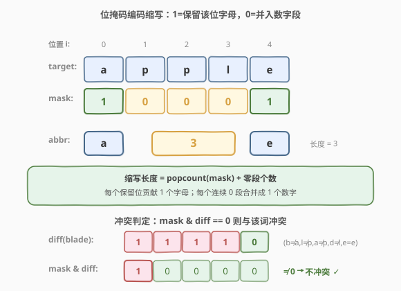
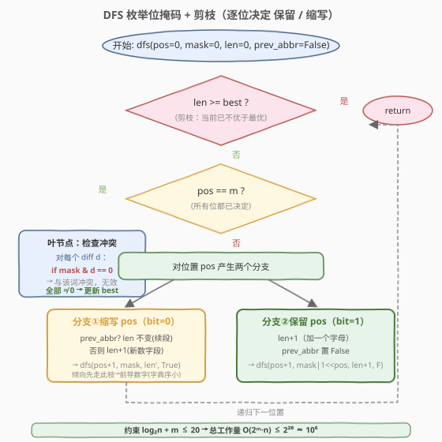

# LeetCode 最短独占单词缩写 题解

## 1. 题目概述

- **标题 / 题号**：最短独占单词缩写（#411，hard）
- **链接**：https://leetcode.cn/problems/minimum-unique-word-abbreviation/
- **难度**：困难
- **标签**：位运算、回溯、深度优先搜索、字符串

**题意**：一个字符串 `word` 可以通过「缩写」来压缩：把其中**任意若干非空、不相邻**子串替换为它们的长度（数字串），其余字符保留原样；数字串不允许有前导零。例如 `"word"` 的全部合法缩写为：

```text
["word", "1ord", "w1rd", "wo1d", "wor1", "2rd", "w2d", "wo2", "1o1d", "1or1", "w1r1", "1o2", "2r1", "3d", "w3", "4"]
```

缩写的**长度**定义为：其中每个数字或每个字母都算 1。例如 `"a32bc"` 长度为 4（字母 a、数字 32、字母 b、字母 c）。

> 💡 一句话理解：缩写里出现的字母必须与 `target` 对应位置严格相同；出现的数字 `k` 表示「跳过 `k` 个连续字符」。整个缩写覆盖的字符总数必须恰好等于 `word` 的长度。

现给定目标串 `target` 与词典 `dictionary`，求 `target` 的一个缩写，满足：

1. **不冲突**：该缩写**不是**词典中任何一个单词的合法缩写（即它不能同时匹配某个词典词）；
2. **尽可能短**：长度最小。若有多解，返回字典序最小者。

**示例 1**：

```text
输入：target = "apple", dictionary = ["blade"]
输出："a4"
解释："5"（全跳过）和 "4e"（跳过前 4 + e）都能匹配 "blade"，故冲突；"a4"（a + 跳过 4）保留的 'a' 与 "blade"[0]='b' 不同，不冲突。
```

**示例 2**：

```text
输入：target = "apple", dictionary = ["plain","amber","blade"]
输出："1p3"
解释：长度 1 的 "5" 与所有词冲突；长度 2 的 "a4" 与 "amber" 冲突、"4e" 与 "blade" 冲突；
      长度 3 中 "1p3"（跳过 1 + p + 跳过 3）不与任何词冲突，且字典序最小。
      其它合法解包括 "ap3"、"a3e"、"2p2"、"3le"、"3l1"。
```

**约束**：

- `target` 仅由小写英文字母组成
- `1 <= target.length <= 21`（记为 $m$）
- `0 <= dictionary.length <= 1000`（记为 $n$）
- `dictionary[i]` 仅由小写英文字母组成
- $\log_2(n) + m \le 20$（**关键约束**：保证位掩码枚举总工作量不超过 $2^{20}$）

> ⚠️ **三个易错点**：① **缩写必须覆盖整个 `target`**——所有数字之和 + 字母个数 = $m$，不能只描述前缀；② **长度相同的词典词才有冲突可能**——长度不同直接不可能匹配，先过滤；③ **若词典中存在与 `target` 完全相同的词**则无解（任何缩写都冲突），题目隐含保证有解。

## 2. 解题思路

### 2.1 暴力思路

对 `target` 生成**全部** $2^m$ 种「保留/替换」方案，每种方案转成缩写字符串，再逐一验证「是否与词典中任意词冲突」。冲突判定可复用 [408. 有效单词缩写](../0401-0500/408_有效单词缩写.md) 的双指针匹配：把候选缩写当 `abbr`、词典词当 `word` 跑一遍 `validWordAbbreviation`。

但这样对每个候选缩写都要对每个词典词跑一次 $O(m)$ 匹配，总复杂度 $O(2^m \cdot n \cdot m)$，$m=20$ 时约 $2 \times 10^7 \cdot n$，偏慢且常数大。

> 💡 暴力法把「枚举」和「冲突判定」耦合。其实**冲突判定可以用位运算 $O(1)$ 完成**——只需预先算出每个词典词与 `target` 的「差异位掩码」。

### 2.2 核心观察：位掩码编码 + 位运算判冲突



**编码**：用一个 $m$ 位的掩码 `mask` 描述一种缩写方案——

- 第 $i$ 位为 `1`：**保留** `target[i]`（在缩写里写一个字母）；
- 第 $i$ 位为 `0`：**替换** `target[i]`（并入一个数字段，连续的 0 合并成一个数字）。

于是缩写字符串由 `mask` 唯一确定：扫描 `mask`，遇到 `1` 输出 `target[i]`，遇到一段连续 `0`（长度 $L$）输出 `str(L)`。

**缩写长度**（核心公式）：

$$\text{len}(\text{mask}) = \text{popcount}(\text{mask}) + \text{零段个数}$$

- `popcount`：保留的字母数，每个贡献 1；
- 零段个数：`mask` 中**极大连续 0 段**的数目，每段合并成 1 个数字。

例如 `target = "apple"`、`mask = 10001`（保留 a 与 e）：`popcount=2`，零段=1（中间 `000`），长度 $= 3$，即 `"a3e"`。

**冲突判定**（关键加速）：对每个**等长**词典词 $w$，预算「差异掩码」

$$\text{diff}_w = \sum_{i:\, w[i] \neq \text{target}[i]} 2^i$$

即 `diff` 的第 $i$ 位为 1 当且仅当 $w$ 与 `target` 在位置 $i$ 不同。那么：

> 缩写 `mask` 与词典词 $w$ **冲突** $\iff$ `mask & diff_w == 0`。

直觉：`mask & diff_w == 0` 意味着「`mask` 保留的所有位置上 $w$ 都与 `target` 相同」，于是缩写里的字母全部能对上 $w$，数字段又天然匹配等长，故缩写也能匹配 $w$ → 冲突。反之，只要 `mask` 保留了**至少一个差异位**，缩写里那个字母就对不上 $w$，不冲突。

**合法条件**：`mask` 对**所有**等长词典词都满足 `mask & diff_w != 0`。这本质是一个**集合覆盖**——选一组「保留位」命中每个 `diff`，同时最小化 `popcount + 零段数`。

> 💡 **识别信号**：$m \le 21$ 立刻想「位掩码枚举」；「最短 + 多解取字典序最小」+ 约束 $\log_2 n + m \le 20$ → DFS 逐位决策 + 剪枝。本题与 [320. 列举单词的全部缩写](https://leetcode.cn/problems/generalized-abbreviation/)、[408. 有效单词缩写](../0401-0500/408_有效单词缩写.md) 同源：320 是「枚举全部」、408 是「判定单个」、411 是「在全部里挑最短且不冲突的」。

### 2.3 算法流程图



DFS 自左向右逐位决定 `mask` 的每一位，并**增量维护缩写长度**：

- **进入时剪枝**：若当前 `length > best_len`（严格大于，便于等长时做字典序 tie-break），直接返回；
- **到达叶节点**（`pos == m`）：用位运算 $O(n)$ 检查是否对所有 `diff` 都 `mask & diff != 0`；通过则生成缩写字符串，按 `(length, string)` 字典序更新最优；
- **非叶节点**：产生两个分支——
  - **分支①缩写该位**（`bit=0`）：若上一位置已在数字段中（`prev_abbr=True`），长度不变（续段）；否则 `length+1`（开新数字段）。**先走此枝**，倾向于产生前导数字（字典序更小）。
  - **分支②保留该位**（`bit=1`）：`length+1`（加一个字母），`prev_abbr` 置 `False`。

> ⚠️ **为何用 `length > best_len` 而非 `>=`**：题目要求等长时取字典序最小，故等长分支仍需探索以做 tie-break。剪枝只砍掉「严格更长」的分支。增量长度只增不减，故剪枝安全。

> 💡 **复杂度保证**：约束 $\log_2 n + m \le 20$ 意味着 $n \le 2^{20-m}$，于是 $2^m \cdot n \le 2^{20} \approx 10^6$，叶节点检查总工作量被牢牢压在百万级。剪枝进一步大幅缩减实际搜索量。

### 2.4 示例演算

![示例演算：apple + [plain, amber, blade] → "1p3"](../images/muwa_walkthrough.svg)

以 `target = "apple"`（$m=5$）、`dictionary = ["plain","amber","blade"]` 为例。

**第一步**：过滤等长词，算 `diff`（位 $i$：`target[i] != w[i]` 记 1，左到右对应 pos 0..4）：

| 词典词 | pos0 | pos1 | pos2 | pos3 | pos4 | diff（二进制 pos4..0） | 十进制 |
|--------|------|------|------|------|------|------------------------|--------|
| plain  | 1    | 1    | 1    | 1    | 1    | `11111`                | 31     |
| amber  | 0    | 1    | 1    | 1    | 1    | `11110`                | 30     |
| blade  | 1    | 1    | 1    | 1    | 0    | `01111`                | 15     |

（`amber` 的 pos0 = 'a' = `target`[0]，相同记 0；`blade` 的 pos4 = 'e' = `target`[4]，相同记 0。）

**第二步**：按长度从短到长试探，命中首个无冲突者。

- **len=1**：`mask=00000`（`"5"`）。`&` 任意 `diff` 都为 0 → 与全部词冲突 ✗。
- **len=2**：单保留位 + 单零段，保留位只能在 pos0（`"a4"`）或 pos4（`"4e"`）。
  - `"a4"`（`mask=00001`，保留 pos0）：`&amber(11110)=0` → 与 amber 冲突 ✗。
  - `"4e"`（`mask=10000`，保留 pos4）：`&blade(01111)=0` → 与 blade 冲突 ✗。
- **len=3**：保留位落在中间会生两个零段（如 pos1 → `"1p3"`）。
  - `"1p3"`（`mask=00010`，保留 pos1）：`&plain=00010≠0`✓、`&amber=00010≠0`✓、`&blade=00010≠0`✓ → **全部不冲突，命中！**
  - 字典序最小（数字 `'1'` 开头 < 字母 `'a'` 开头的 `"ap3"`/`"a3e"`）。

**解码 `mask=00010` → 缩写**：pos0 零段长 1 → `"1"`；pos1 保留 → `"p"`；pos2-4 零段长 3 → `"3"`。拼成 `"1p3"`。返回 `"1p3"`。✓

> 💡 **为何 len=2 时保留位只能落在两端**：单保留位若落在 pos $k$（$0 < k < m-1$），其左右各有一段连续 0 → 两个零段 + 一个字母 = 长度 3。只有落在 pos0 或 pos $m-1$ 时只有一个零段 → 长度 2。这就解释了「中间保留位天然贵 1 个长度」。

## 3. 参考代码

### C++

```cpp
class Solution {
  public:
    string minAbbreviation(string target, vector<string>& dictionary) {
        int m = target.size();
        vector<int> diffs;
        for (auto& w : dictionary) {
            if ((int)w.size() == m) {           // 只关心等长词
                int d = 0;
                for (int i = 0; i < m; ++i)
                    if (w[i] != target[i]) d |= (1 << i);
                diffs.push_back(d);
            }
        }
        if (diffs.empty()) return to_string(m); // 无等长词，全数字最短

        bestLen = m;
        bestStr = target;              // 兜底：全保留即 target 本身
        t = target;
        n = m;
        diff = diffs;
        dfs(0, 0, 0, false);
        return bestStr;
    }

  private:
    int bestLen;
    string bestStr;
    string t;
    int n;
    vector<int> diff;

    void dfs(int pos, int mask, int length, bool prevAbbr) {
        if (length > bestLen) return;           // 严格更长才剪枝（等长留作 tie-break）
        if (pos == n) {
            for (int d : diff)
                if ((mask & d) == 0) return;    // 与该词冲突
            string cand = build(mask);
            if (length < bestLen ||
                (length == bestLen && cand < bestStr)) {
                bestLen = length;
                bestStr = cand;
            }
            return;
        }
        // 分支①缩写该位（bit=0）：续段则长度不变，否则 +1
        dfs(pos + 1, mask, length + (prevAbbr ? 0 : 1), true);
        // 分支②保留该位（bit=1）：+1 个字母
        dfs(pos + 1, mask | (1 << pos), length + 1, false);
    }

    string build(int mask) {
        string res;
        int i = 0;
        while (i < n) {
            if (mask & (1 << i)) {
                res.push_back(t[i]);
                ++i;
            } else {
                int j = i;
                while (j < n && !(mask & (1 << j))) ++j;
                res += to_string(j - i);
                i = j;
            }
        }
        return res;
    }
};
```

### Python

```python
class Solution:
    def minAbbreviation(self, target: str, dictionary: List[str]) -> str:
        m = len(target)
        diffs = []
        for w in dictionary:
            if len(w) == m:                      # 只关心等长词
                d = 0
                for i in range(m):
                    if w[i] != target[i]:
                        d |= (1 << i)
                diffs.append(d)
        if not diffs:                            # 无等长词，全数字最短
            return str(m)

        best = [m, target]                 # [best_len, best_str]，兜底全保留即 target

        def build(mask: int) -> str:
            res = []
            i = 0
            while i < m:
                if mask & (1 << i):
                    res.append(target[i])
                    i += 1
                else:
                    j = i
                    while j < m and not (mask & (1 << j)):
                        j += 1
                    res.append(str(j - i))
                    i = j
            return "".join(res)

        def dfs(pos: int, mask: int, length: int, prev_abbr: bool) -> None:
            if length > best[0]:                 # 严格更长才剪枝
                return
            if pos == m:
                for d in diffs:
                    if (mask & d) == 0:          # 与该词冲突
                        return
                cand = build(mask)
                if length < best[0] or (length == best[0] and cand < best[1]):
                    best[0] = length
                    best[1] = cand
                return
            # 分支①缩写该位（bit=0）
            dfs(pos + 1, mask, length + (0 if prev_abbr else 1), True)
            # 分支②保留该位（bit=1）
            dfs(pos + 1, mask | (1 << pos), length + 1, False)

        dfs(0, 0, 0, False)
        return best[1]
```

> ⚠️ **两个易错点**：
> 1. **`diff` 只对等长词计算**：长度不同的词永远不可能被同一缩写匹配（缩写覆盖的字符数 = $m$ 固定），先过滤掉可省去大量无效判定。
> 2. **等长 tie-break 用 `length > best_len` 而非 `>=`**：剪枝过狠（用 `>=`）会跳过所有等长解，无法保证字典序最小；用严格 `>` 则保留等长分支参与比较。增量长度单调不减，剪枝仍安全。
> 3. **空词典或无等长词特判**：直接返回 `str(m)`（全数字，长度 1，最短）。

## 4. 复杂度分析

| 维度 | 复杂度 | 说明 |
|------|--------|------|
| **时间** | $O(2^m \cdot (n + m))$ | 最坏枚举全部 $2^m$ 个掩码；每个叶节点 $O(n)$ 判冲突 + $O(m)$ 生成字符串。约束 $\log_2 n + m \le 20 \Rightarrow 2^m \cdot n \le 2^{20}$ |
| **空间** | $O(n + m)$ | `diffs` 数组 $O(n)$；DFS 递归栈 $O(m)$；生成字符串 $O(m)$ |
| **实际** | 远小于上界 | `length > best_len` 剪枝大幅砍枝；一旦找到短解，长分支几乎全被裁掉 |

> 💡 **约束 $\log_2 n + m \le 20$ 的含义**：$m$ 越大允许的 $n$ 越小（$m=20 \Rightarrow n \le 1$），$n$ 越大允许的 $m$ 越小（$n=1024 \Rightarrow m \le 10$），保证「掩码数 × 词典数」恒不超过 $2^{20}$。这是本题能用位掩码枚举的根本保证。

## 5. 扩展：集合覆盖视角与进一步优化

**集合覆盖视角**：把每个 `diff` 看作一个需要被「命中」的集合，`mask` 的保留位是「选择的元素」。合法 `mask` 必须命中所有 `diff`（即每个 `diff` 至少有一个被保留的差异位）。目标是最小化 $\text{popcount} + \text{零段数}$，而非单纯的 $\text{popcount}$——这使得它比普通集合覆盖更难（零段数依赖保留位的**排列结构**），不能直接套贪心。

**优化①：增量维护「未覆盖 diff 集」**。DFS 时传一个「尚未被命中的 diff 列表」，保留位 $i$ 时把所有含位 $i$ 的 diff 移出。一旦列表空，剩余位可全部缩写（必然不冲突），提前收敛。可把叶节点检查从 $O(n)$ 摊到 $O(1)$。

**优化②：Trie 压缩 diff**。把所有 `diff` 组织成二叉 Trie（按位区分），DFS 时同步下行，可快速判定「当前前缀下是否还有未覆盖的 diff」，进一步剪枝。

**优化③：先按 `popcount` 升序枚举**。用 Gosper's hack 按固定 1-位数枚举掩码，从少保留位开始，配合零段数估算下界剪枝。但实现复杂，本题约束下朴素 DFS 已足够。

> 💡 这些优化在 $m \le 21$ 的小规模下收益有限，朴素 DFS + 位运算判冲突已是性价比最高的方案。

## 6. 面试要点

1. **为什么能用位掩码编码缩写？**

   - 缩写的本质是「每个位置二选一：保留字母 / 并入数字」。$m$ 个位置 $\Rightarrow$ $m$ 位二进制 $\Rightarrow$ $2^m$ 种方案。$m \le 21$ 时 $2^m \le 2 \times 10^6$，可枚举。连续的「并入」位自动合并成一个数字段，与缩写语义天然吻合。

2. **冲突判定为什么是 `mask & diff == 0`？**

   - `mask & diff == 0` 表示「保留的所有位都不是差异位」，即保留位上词典词与 `target` 全相同。于是缩写里的字母全对得上、数字段又匹配等长 → 缩写也能匹配该词 → 冲突。反之保留任一差异位则那个字母对不上 → 不冲突。

3. **为什么要先过滤等长词典词？**

   - 缩写覆盖的字符数恒为 $m$，只能匹配长度恰为 $m$ 的词。长度不同的词天然不冲突，预先过滤既减少 `diff` 数量（降低 $n$），又避免无意义的冲突判定。

4. **为什么 DFS 用 `length > best_len` 而不是 `>=` 剪枝？**

   - 题目要求等长时取字典序最小。若用 `>=` 会跳过所有等长解，只保留「最先找到的那个」，无法保证字典序最小。用严格 `>` 保留等长分支参与比较，同时仍剪掉严格更长的分支。由于增量长度单调不减，剪枝正确性不受影响。

5. **若词典中存在与 `target` 完全相同的词怎么办？**

   - 此时 `diff = 0`，任意 `mask & 0 == 0`，**所有**缩写都冲突，无解。题目隐含保证有解（`target` 不与任何等长词典词完全相同）。代码中若遇此情况，`best_str` 保持初始空串——可据题意补充兜底返回 `target` 本身或抛错。

6. **和 [408. 有效单词缩写](../0401-0500/408_有效单词缩写.md) 的关系？**

   - 408 是**判定**「给定 `abbr` 是否匹配给定 `word`」（双指针 $O(m)$）；411 是**搜索**「在 $2^m$ 个候选 `abbr` 里找最短且不匹配任何词典词的」。本题用位掩码 + 预算 `diff` 把 408 的「逐字符匹配」升维成「一次位与判冲突」，把 $O(m)$ 判定压成 $O(1)$，是 408 思想在「批量判定」场景下的位运算加速。

## 同类练习题

| # | 题目 | 与本题的关联 |
|---|------|-------------|
| 408 | [有效单词缩写](https://leetcode.cn/problems/valid-word-abbreviation/)（[题解](../0401-0500/408_有效单词缩写.md)） | 缩写判定的母题，双指针判定单个 `abbr` 是否匹配 `word`，411 的冲突判定基础 |
| 320 | [列举单词的全部缩写](https://leetcode.cn/problems/generalized-abbreviation/) | 回溯枚举单个 `word` 的所有合法缩写，411 的「生成」对应版（不涉及冲突） |
| 288 | [单词的唯一缩写](https://leetcode.cn/problems/unique-word-abbreviation/) | 维护词典的规范缩写哈希查询唯一性，缩写家族的「索引」版 |
| 526 | [优美的排列](https://leetcode.cn/problems/beautiful-arrangement/)（[题解](../0301-0400/526_优美的排列.md)） | 同样用位掩码 + DFS 剪枝枚举方案，$n \le 15$ 的状态压缩甜区 |
| 187 | [重复的 DNA 序列](https://leetcode.cn/problems/repeated-dna-sequences/)（[题解](../0101-0200/187_重复的DNA序列.md)） | 把字符串切片编码成位掩码做哈希，位运算处理字符串问题的另一形态 |
