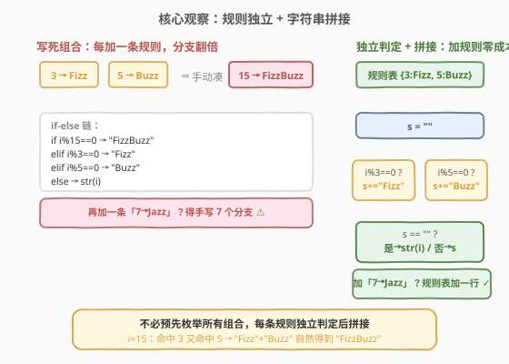
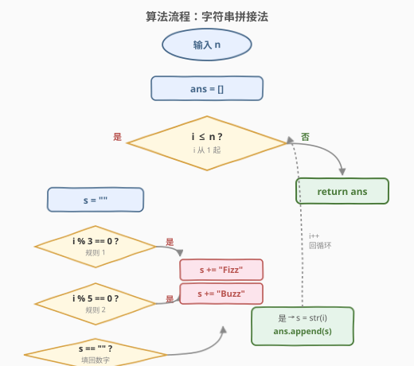
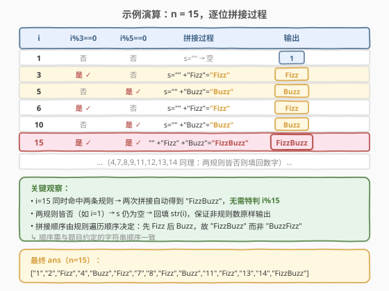

# LeetCode Fizz Buzz 题解

## 1. 题目概述

- **标题 / 题号**：Fizz Buzz（#412，easy）
- **链接**：https://leetcode.cn/problems/fizz-buzz/
- **难度**：简单
- **标签**：数学、字符串、模拟

**题意**：给你一个整数 `n`，返回从 `1` 到 `n` 的每个数字对应的**字符串表示**构成的列表 `answer`（下标从 1 开始），规则如下：

- `answer[i] == "FizzBuzz"`：若 `i` 同时能被 3 和 5 整除；
- `answer[i] == "Fizz"`：若 `i` 能被 3 整除但不能被 5 整除；
- `answer[i] == "Buzz"`：若 `i` 能被 5 整除但不能被 3 整除；
- `answer[i] == str(i)`：其余情况（即 `i` 不能被 3 或 5 整除）。

**示例 1**：

```text
输入：n = 3
输出：["1","2","Fizz"]
```

**示例 2**：

```text
输入：n = 5
输出：["1","2","Fizz","4","Buzz"]
```

**示例 3**：

```text
输入：n = 15
输出：["1","2","Fizz","4","Buzz","Fizz","7","8","Fizz","Buzz","11","Fizz","13","14","FizzBuzz"]
```

**约束**：

- `1 <= n <= 10^4`

> 💡 `n` 规模很小（≤ $10^4$），任何 $O(n)$ 的单趟扫描都绰绰有余。本题的考点不在性能，而在**代码组织**——如何避免把「同时被 3 和 5 整除」这一组合情况单独硬编码成 `i % 15 == 0`，从而让规则可扩展、可维护。

## 2. 解题思路

### 2.1 暴力思路

最直觉的写法是 if-else 链：先判 `i % 15 == 0` 输出 `"FizzBuzz"`，再依次判 `i % 3 == 0`、`i % 5 == 0`，最后兜底输出 `str(i)`。它能跑通，但有两个味道不对的地方：

1. **重复取模**：`i % 15` 已经隐含了 `i % 3 == 0` 与 `i % 5 == 0` 两个判定，后面又分别判了一次，对同一信息查了三遍。
2. **不可扩展**：一旦需求增加一条「`i` 能被 7 整除输出 `"Jazz"`」，组合情况从 $2^2=4$ 爆炸到 $2^3=8$（`Fizz`/`Buzz`/`Jazz`/`FizzBuzz`/`FizzJazz`/`BuzzJazz`/`FizzBuzzJazz`/数字），必须手写 7 个 elif 分支。规则越多越不可维护。

### 2.2 核心观察：规则独立 + 字符串拼接

跳出来想：每个输出其实是**若干规则命中结果的拼接**。`"FizzBuzz"` 不是一条独立规则，而是「命中 3」和「命中 5」**两个独立事件的组合**。那么就不必预先枚举所有组合——每条规则**独立判定一次**，命中就把对应字符串拼到累加器 `s` 上，全部判完后：

- 若 `s` 非空 → `s` 即输出（已自动拼好 `"FizzBuzz"`）；
- 若 `s` 仍为空 → 说明一条规则都没命中，回填 `str(i)`。



**为什么这样更好？**

- **零重复取模**：每条规则只判定一次，`i % 3` 与 `i % 5` 各算一遍，`i % 15` 干脆不出现。
- **天然处理组合**：`i=15` 时两条规则都命中，`"Fizz" + "Buzz"` 自然得到 `"FizzBuzz"`，无需为「同时整除」写特判。
- **可扩展**：新增规则只需在规则表加一行（如 `{3:"Fizz", 5:"Buzz", 7:"Jazz"}`），循环体不变。这是把「数据」从「控制流」里剥离出来的经典手法。

> 💡 **组合的来源**：`i % 15 == 0` 当且仅当 `i % 3 == 0` 且 `i % 5 == 0`，因为 $\gcd(3,5)=1$（3 与 5 互素）。一般地，若 $a, b$ 互素，则 $a \mid i \land b \mid i \Leftrightarrow ab \mid i$。本题组合情况的存在性来自 3、5 互素，但拼接法**不依赖**这个性质——即便规则改成 `{4:"Fizz", 6:"Buzz"}`（不互素），拼接法依旧正确，而「`i % 24 == 0` 表示同时命中」的写法会**错**（因为 12 也同时命中却不是 24 的倍数）。这是拼接法比硬编码组合更稳健的深层原因。

### 2.3 算法流程图



整体只有一层循环遍历 `i = 1..n`，循环体里串行执行若干「判定 + 拼接」，最后做一次「空则回填」的收尾。规则条数是常数（本题 2 条），所以循环体是 $O(1)$。

### 2.4 示例演算

以 `n = 15` 为例，关注几个关键下标（普通数字只展示 `i=1` 作对照，其余同构）：



| i | i%3==0 | i%5==0 | 拼接过程 | 输出 |
|---|--------|--------|----------|------|
| 1 | 否 | 否 | `""` → 空 → 回填 | `"1"` |
| 3 | 是 | 否 | `"" + "Fizz"` | `"Fizz"` |
| 5 | 否 | 是 | `"" + "Buzz"` | `"Buzz"` |
| 6 | 是 | 否 | `"" + "Fizz"` | `"Fizz"` |
| 10 | 否 | 是 | `"" + "Buzz"` | `"Buzz"` |
| 15 | 是 | 是 | `"" + "Fizz" + "Buzz"` | `"FizzBuzz"` |

`i=15` 是关键：两条规则都命中，两次 `+=` 自然拼出 `"FizzBuzz"`，**没有任何 `i % 15` 的特判**。而 `i=1` 两规则皆否，`s` 保持空串，触发回填 `str(1)`。

> ⚠️ **拼接顺序即输出顺序**：先判 3 后判 5，故 `i=15` 得到 `"Fizz"+"Buzz"="FizzBuzz"`；若把两规则对调，会得到 `"BuzzFizz"`，与题意不符。规则遍历顺序需与题目约定的字符串顺序一致——这是拼接法唯一的「顺序敏感」点。

## 3. 参考代码

### C++

```cpp
class Solution {
  public:
    vector<string> fizzBuzz(int n) {
        vector<string> ans(n);
        for (int i = 1; i <= n; ++i) {
            string s;
            if (i % 3 == 0) s += "Fizz";
            if (i % 5 == 0) s += "Buzz";
            ans[i - 1] = s.empty() ? to_string(i) : s;
        }
        return ans;
    }
};
```

### Python

```python
class Solution:
    def fizzBuzz(self, n: int) -> list[str]:
        ans = []
        for i in range(1, n + 1):
            s = ""
            if i % 3 == 0:
                s += "Fizz"
            if i % 5 == 0:
                s += "Buzz"
            ans.append(str(i) if s == "" else s)
        return ans
```

> ⚠️ **两个易错点**：
> 1. **判定之间用 `if` 而非 `elif`**。两条规则是**独立**事件，必须都判定。若写成 `elif i % 5 == 0`，`i=15` 时第一个 `if` 命中后跳过第二个，只会得到 `"Fizz"` 而非 `"FizzBuzz"`。
> 2. **回填判空用 `s.empty()` / `s == ""`**，不要用「`i % 3 != 0 && i % 5 != 0`」再判一次——那又把取模做了一遍，且把「规则皆未命中」这个语义和具体规则耦合死了，加规则时还得改这行。判 `s` 是否为空是最干净的一次性收尾。

## 4. 复杂度分析

| 维度 | 复杂度 | 说明 |
|------|--------|------|
| 时间复杂度 | $O(n)$ | 单趟遍历 `1..n`，每个位置做常数次取模与字符串拼接（规则数为常数） |
| 空间复杂度 | $O(n)$ | 输出列表含 `n` 个字符串；不计输出则 $O(1)$ |

> 💡 本题瓶颈在输出的线性规模，$O(n)$ 已是下界（光写答案就要写 `n` 项）。规则数 $k$ 是常数时循环体 $O(1)$；若把规则数也视作变量，循环体为 $O(k)$，总复杂度 $O(nk)$。

## 5. 扩展：规则表驱动（去耦合）

把规则从 `if` 语句提成**数据**——一张「除数 → 字符串」的映射表，循环体只负责遍历这张表。这样加规则**不改循环体**，只改数据：

```cpp
class Solution {
  public:
    vector<string> fizzBuzz(int n) {
        // 规则表：除数 -> 拼接串（顺序即拼接顺序）
        vector<pair<int, string>> rules = {{3, "Fizz"}, {5, "Buzz"}};
        vector<string> ans(n);
        for (int i = 1; i <= n; ++i) {
            string s;
            for (auto& [d, str] : rules) {
                if (i % d == 0) s += str;
            }
            ans[i - 1] = s.empty() ? to_string(i) : s;
        }
        return ans;
    }
};
```

要支持「7 → Jazz」，只需把 `rules` 改成 `{{3,"Fizz"}, {5,"Buzz"}, {7,"Jazz"}}`，其余一行不动。这是「表驱动 / 数据驱动」设计——把易变的规则数据与稳定的算法骨架分离。生产代码里（编译器 warning 分级、路由表、税率表）随处可见同一思想。

> 💡 进一步可把规则表做成构造函数参数，让 `FizzBuzz` 类变成一个通用的「整除映射器」，本题退化为 `FizzBuzz({{3,"Fizz"},{5,"Buzz"}})`。但对一道 LeetCode 简单题，这已是过度设计，面试时口头提一句即可，不必落到代码里。

## 6. 面试要点

1. **为什么用字符串拼接而不是 if-else 链？**
   - 拼接法让每条规则独立判定、互不干扰，组合情况（`FizzBuzz`）由两次 `+=` 自然产生，无需硬编码 `i % 15 == 0`。同时避免对同一信息重复取模，且新增规则只需加一行，可扩展性远胜 if-else。

2. **两个 `if` 能否换成 `if-elif`？**
   - 不能。两条规则是独立事件，`i=15` 需要两个 `if` 都执行才能拼出 `"FizzBuzz"`；写成 `elif` 会在命中第一条后跳过第二条，结果只剩 `"Fizz"`。

3. **为什么不需要特判 `i % 15 == 0`？**
   - 因为 3 与 5 互素，$3 \mid i \land 5 \mid i \Leftrightarrow 15 \mid i$。拼接法把「同时命中」表达为「两条独立规则都命中」，等价但不依赖预先算出 15 这个组合数，反而更稳健（见 2.2 关于不互素情形的讨论）。

4. **若规则改成 `{4:"Fizz", 6:"Buzz"}`，硬编码 `i % 24` 会出什么错？**
   - 4 与 6 不互素（$\gcd=2$），同时被 4、6 整除等价于被 $\mathrm{lcm}(4,6)=12$ 整除，而非 24。`i=12` 同时命中两条规则，但 `12 % 24 != 0`，硬编码组合会漏判。拼接法无需算 lcm，照常正确。这正是拼接法的健壮性所在。

5. **结果列表是 0 下标还是 1 下标？**
   - 题目要求 `answer[i]` 对应数字 `i`（1 开始），而数组下标从 0 开始，故 `ans[i-1]` 存数字 `i` 的结果。C++ 里直接 `vector<string> ans(n)` 预分配，循环内 `ans[i-1] = ...` 赋值，避免 `push_back` 反复扩容。

6. **`n` 很大时（如 $10^8$）还能这么做吗？**
   - 算法仍是 $O(n)$，但输出本身就有 $n$ 项字符串，光 I/O 与内存就扛不住。实际场景里若只需查询某一位 `i` 的结果，可改成 $O(1)$ 在线查询函数，不预生成整个列表。本题 $n \le 10^4$，预生成无压力。

## 同类练习题

| # | 题目 | 与本题的关联 |
|---|------|-------------|
| 1195 | [Fizz Buzz Multithreaded](https://leetcode.cn/problems/fizz-buzz-multithreaded/) | 多线程版 Fizz Buzz，规则与本题相同，但需用互斥锁/条件变量协调四个线程的输出顺序，是「相同规则、不同执行模型」的并发延伸 |
| 12 | [整数转罗马数字](https://leetcode.cn/problems/integer-to-roman/)（[题解](../0001-0100/12_整数转罗马数字.md)） | 贪心按面值配对，同样是「规则映射表驱动输出」的思想，面值表即规则表 |
| 728 | [自除数](https://leetcode.cn/problems/self-dividing-numbers/) | 逐位取模判定数字能否整除自身每一位，是「取模判定」在数位层面的延伸练习 |
| 507 | [完美数](https://leetcode.cn/problems/perfect-number/) | 枚举约数求和验证等于自身，整除性应用的另一面，对照本题的「整除即触发规则」 |
