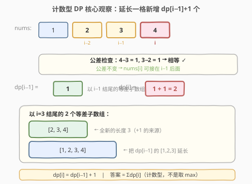
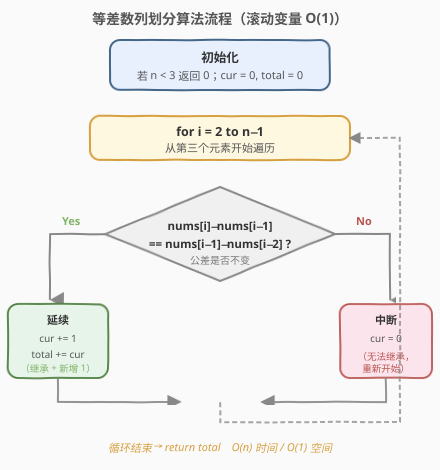
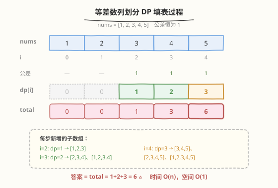

# 等差数列划分

- **题目名称**：等差数列划分
- **链接**：[413. 等差数列划分](https://leetcode.cn/problems/arithmetic-slices/)
- **难度**：中等
- **标签**：数组、动态规划

## 1. 题目概述

给定一个整数数组 `nums`，返回数组中**连续等差子数组**的数目。等差子数组是指长度**至少为 3**、且相邻元素差值恒定（公差相同）的连续子数组。

**示例 1**：

```text
输入：nums = [1,2,3,4]
输出：3
解释：有 3 个等差子数组：[1,2,3]、[2,3,4]、[1,2,3,4]。
```

**示例 2**：

```text
输入：nums = [1]
输出：0
解释：数组长度不足 3，没有等差子数组。
```

**约束条件**：

- `1 <= nums.length <= 5000`
- `-1000 <= nums[i] <= 1000`

> ⚠️ **两个易错点**：① 子数组必须**连续**（不是子序列）；② 长度**至少为 3**，长度为 2 的不算。

---

## 2. 解题思路

### 2.1 暴力思路

枚举所有连续子数组 `[i, j]`（共 `O(n²)` 个），对每个长度 ≥ 3 的子数组检查是否等差（再花 `O(n)`）。总复杂度 `O(n³)`，`n=5000` 时不可行。

### 2.2 核心观察：计数型 DP



**定义**：`dp[i]` = **以 `nums[i]` 结尾**的、长度 ≥ 3 的等差子数组个数。

**关键直觉**：若 `nums[i]` 能接在以 `nums[i-1]` 结尾的等差子数组后面（即公差不变），那么以 `nums[i-1]` 结尾的每个等差子数组都能延长一格，再加上一个**全新的长度为 3** 的子数组 `[nums[i-2], nums[i-1], nums[i]]`。

于是有转移：

$$
dp[i] = \begin{cases} dp[i-1] + 1, & \text{若 } nums[i]-nums[i-1] = nums[i-1]-nums[i-2] \\ 0, & \text{否则} \end{cases}
$$

- `dp[i-1]`：把以 `i-1` 结尾的每个等差子数组都延长到 `i`。
- `+1`：新增的那个长度恰好为 3 的子数组 `[nums[i-2], nums[i-1], nums[i]]`。

> 💡 **为什么是 +1 而不是 +某个数**：以 `i-1` 结尾、长度 ≥ 2 的等差子数组恰有 `dp[i-1] + 1` 个（多出的 1 个是长度为 2 的 `[nums[i-2], nums[i-1]]`，它不进入 `dp[i-1]` 的计数）。延长后全部变成长度 ≥ 3，故 `dp[i] = dp[i-1] + 1`。

**答案**：所有 `dp[i]` 之和（每个等差子数组按其结尾位置唯一计数，不重不漏）。

### 2.3 算法流程图



只需一个变量 `cur` 滚动记录 `dp[i]`，无需数组，空间 `O(1)`。

### 2.4 示例演算



以 `nums = [1,2,3,4,5]` 为例：

| 步骤 | i | nums[i] | 公差检查 | cur (dp[i]) | 新增子数组 | total |
|------|---|---------|----------|-------------|-----------|-------|
| 1 | 0 | 1 | — | 0 | — | 0 |
| 2 | 1 | 2 | — | 0 | — | 0 |
| 3 | 2 | 3 | 3−2=1, 2−1=1 ✓ | 1 | [1,2,3] | 1 |
| 4 | 3 | 4 | 4−3=1, 3−2=1 ✓ | 2 | [2,3,4]、[1,2,3,4] | 3 |
| 5 | 4 | 5 | 5−4=1, 4−3=1 ✓ | 3 | [3,4,5]、[2,3,4,5]、[1,2,3,4,5] | 6 |

最终 `total = 6` ✓。

再看公差中断的例子 `nums = [1,2,3,8,9,10]`：

| 步骤 | i | nums[i] | 公差检查 | cur | total |
|------|---|---------|----------|-----|-------|
| 1 | 2 | 3 | 1==1 ✓ | 1 | 1 |
| 2 | 3 | 8 | 5≠1 ✗ | 0 | 1 |
| 3 | 4 | 9 | 1≠5 ✗ | 0 | 1 |
| 4 | 5 | 10 | 1==1 ✓ | 1 | 2 |

公差一旦中断，`cur` 归零，重新开始累加。最终 `total = 2`（[1,2,3] 与 [8,9,10]）。

---

## 3. 参考代码

### C++

```cpp
// 方法一：计数型 DP，O(n) / O(n)
class Solution {
public:
    int numberOfArithmeticSlices(vector<int>& nums) {
        int n = nums.size();
        if (n < 3) return 0;
        vector<int> dp(n, 0);
        int total = 0;
        for (int i = 2; i < n; i++) {
            if (nums[i] - nums[i - 1] == nums[i - 1] - nums[i - 2]) {
                dp[i] = dp[i - 1] + 1;
                total += dp[i];
            }
        }
        return total;
    }
};

// 方法二：滚动变量，O(n) / O(1)
class Solution {
public:
    int numberOfArithmeticSlices(vector<int>& nums) {
        int n = nums.size();
        if (n < 3) return 0;
        int cur = 0, total = 0;
        for (int i = 2; i < n; i++) {
            if (nums[i] - nums[i - 1] == nums[i - 1] - nums[i - 2]) {
                cur += 1;
                total += cur;
            } else {
                cur = 0;
            }
        }
        return total;
    }
};
```

### Python

```python
# 方法一：计数型 DP，O(n) / O(n)
def numberOfArithmeticSlices(nums):
    n = len(nums)
    if n < 3:
        return 0
    dp = [0] * n
    total = 0
    for i in range(2, n):
        if nums[i] - nums[i - 1] == nums[i - 1] - nums[i - 2]:
            dp[i] = dp[i - 1] + 1
            total += dp[i]
    return total

# 方法二：滚动变量，O(n) / O(1)
def numberOfArithmeticSlices(nums):
    n = len(nums)
    if n < 3:
        return 0
    cur = total = 0
    for i in range(2, n):
        if nums[i] - nums[i - 1] == nums[i - 1] - nums[i - 2]:
            cur += 1
            total += cur
        else:
            cur = 0
    return total
```

---

## 4. 复杂度分析

| 维度 | DP 数组 O(n) | 滚动变量 O(1) |
|------|--------------|---------------|
| **时间** | `O(n)` | `O(n)` |
| **空间** | `O(n)`（dp 数组） | `O(1)`（仅 cur、total） |
| **可读性** | 直观，便于调试 | 简洁，面试首选 |
| **适用场景** | 需要还原各位置计数 | 只需总数 |

> 💡 **公差用减法而非除法**：判断 `nums[i]-nums[i-1] == nums[i-1]-nums[i-2]` 用减法避免除零和浮点误差。若担心整数溢出（本题值域 `[-1000,1000]` 不会），可用 `long long` 或 Python 的大整数。

---

## 5. 扩展：等差子序列（不要求连续）

[446. 等差数列划分 II - 子序列](https://leetcode.cn/problems/arithmetic-slices-ii-subsequence/) 把「连续」放宽为「子序列」，长度仍 ≥ 3。此时 `dp[i]` 不再只看 `i-1`，而要枚举所有 `j < i`，用**哈希表**记录 `dp[i][diff]` = 以 `i` 结尾、公差为 `diff`、长度 ≥ 2 的子序列个数。时间 `O(n²)`，空间 `O(n²)`。

核心差异：

- 本题（413）：连续 → 只看相邻三元，`O(n)`。
- 446：不连续 → 枚举所有前驱 + 哈希表存公差，`O(n²)`。

---

## 6. 面试要点

1. **为什么 `dp[i] = dp[i-1] + 1` 而不是别的？**

   - 以 `i-1` 结尾、长度 ≥ 2 的等差子数组共 `dp[i-1] + 1` 个（`dp[i-1]` 个长度 ≥ 3 的，外加 1 个长度恰为 2 的 `[nums[i-2], nums[i-1]]`）。公差不变时它们全部可延长到 `i`，且延长后长度都 ≥ 3，故 `dp[i] = dp[i-1] + 1`。

2. **答案为什么是 `sum(dp[i])` 而不是 `max(dp[i])`？**

   - 这是**计数型 DP**，不是优化型 DP。`dp[i]` 统计的是「以 `i` 结尾的子数组个数」，每个合法子数组按结尾位置唯一归属，全部相加才是不重不漏的总数。求最值（如 LIS）才取 `max`。

3. **公差中断后为什么 `cur` 直接归零？**

   - 中断意味着 `nums[i]` 无法和前两个元素构成等差三元，任何以 `i` 结尾的子数组都无法继承之前的等差性，故以 `i` 结尾的等差子数组数为 0。但中断不影响后续：只要 `nums[i+1]-nums[i] == nums[i]-nums[i-1]`，`cur` 又能从 0 重新累加。

4. **如何优化到 O(1) 空间？**

   - `dp[i]` 只依赖 `dp[i-1]`，用单个变量 `cur` 滚动即可。中断时 `cur = 0`，延续时 `cur += 1`，每步 `total += cur`。

5. **与滑动窗口计数（如 713、560）的区别？**

   - 713/560 用滑动窗口或前缀和，依赖**窗口单调性或前缀关系**；本题的等差性不具备那种单调可扩展结构，但具有「延长一格只需比一次公差」的局部传递性，因此用一维 DP 的 `+1` 递推更自然。

---

## 7. 同类练习题

- [446. 等差数列划分 II - 子序列](https://leetcode.cn/problems/arithmetic-slices-ii-subsequence/)：放宽为子序列，DP + 哈希表存公差，`O(n²)`
- [713. 乘积小于 K 的子数组](https://leetcode.cn/problems/subarray-product-less-than-k/)（[题解](../0701-0800/713_乘积小于K的子数组.md)）：滑动窗口计数 `right−left+1`，另一种「数子数组个数」套路
- [560. 和为 K 的子数组](https://leetcode.cn/problems/subarray-sum-equals-k/)（[题解](../0501-0600/560_和为K的子数组.md)）：前缀和 + 哈希计数，第三种「数子数组个数」套路
- [1248. 统计「优美子数组」](https://leetcode.cn/problems/count-number-of-nice-subarrays/)：恰好 K 个奇数的子数组计数，前缀和或滑动窗口
