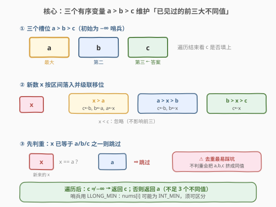
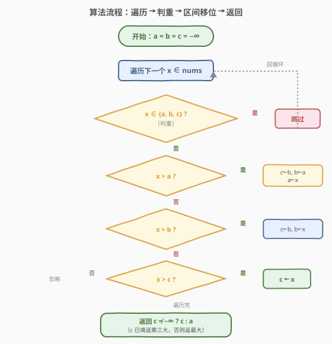

# 第三大的数

- **题目名称**：第三大的数
- **链接**：[414. 第三大的数](https://leetcode.cn/problems/third-maximum-number/)
- **难度**：简单
- **标签**：数组、一次遍历、有序变量维护

## 1. 题目概述

给你一个非空数组 `nums`，返回其中**第三大的数**。若不存在第三大的数（即不同数字少于 3 个），则返回数组中**最大的数**。

> ⚠️ **「第三大」按不同数字排序**：重复数字只算一个。例如 `[2, 2, 3, 1]` 的不同数字为 $\{3, 2, 1\}$，第三大是 $1$，而非按原数组下标排序的某个 $2$。

**示例 1**：

```text
输入：nums = [3, 2, 1]
输出：1
解释：第三大的数是 1。
```

**示例 2**：

```text
输入：nums = [1, 2]
输出：2
解释：第三大的数不存在，返回最大的数 2。
```

**示例 3**：

```text
输入：nums = [2, 2, 3, 1]
输出：1
解释：不同数字为 {3, 2, 1}，第三大为 1。
```

**约束条件**：

- $1 \le \text{nums.length} \le 10^4$
- $-2^{31} \le \text{nums}[i] \le 2^{31} - 1$

**进阶**：设计 $O(n)$ 时间复杂度的解法。

> 💡 **关键陷阱**：`nums[i]` 取值范围覆盖 `INT_MIN`，因此不能用 `INT_MIN` 当哨兵——必须用更小的 `LLONG_MIN`（`long long`），或维护「已填位数」计数器，避免 `INT_MIN` 与哨兵无法区分。

---

## 2. 解题思路

### 2.1 暴力思路

- **排序去重**：先对数组降序排序，再跳过重复元素，取第 3 个不同值；若不足 3 个则返回最大值。时间 $O(n \log n)$，空间 $O(\log n)$（排序栈）。
- **哈希集合去重 + 排序**：放入 `set` 去重后转数组排序，取倒数第三个。时间 $O(n \log n)$，空间 $O(n)$。

> ⚠️ 两种做法都能通过（数据规模 $n \le 10^4$），但都不满足进阶的 $O(n)$ 时间要求。突破口是：题目只需要**第 3 大**，维护**三个有序变量**即可，无需排序整个数组——这是「Top-K 的 K=3 退化版」。

### 2.2 核心观察：维护三个有序变量 a > b > c



关键观察有两点：

1. **只需 3 个变量**：要找第 3 大，只需维护当前见过的**前三大不同值**，记为 $a > b > c$。遍历结束时，若 $c$ 已被填上，则 $c$ 即为答案；否则返回 $a$。
2. **新数的归类——三种区间 + 去重**：对每个新数 $x$，先判重（$x$ 已等于 $a/b/c$ 之一则跳过）；否则按 $x$ 落入的区间做**级联移位**：
   - $x > a$：$c \leftarrow b,\ b \leftarrow a,\ a \leftarrow x$（三者整体下移一格）
   - $a > x > b$：$c \leftarrow b,\ b \leftarrow x$（$b,c$ 下移）
   - $b > x > c$：$c \leftarrow x$（仅替换 $c$）
   - $x < c$：忽略

> 💡 **为什么先判重再比较**：若不先去重，重复的最大值会把 $a,b,c$ 全部挤成同一个值，导致「第三大」错算成最大值本身。判重是本题最易踩的坑——示例 3 就是用 `[2,2,3,1]` 专门测这一点。

### 2.3 算法流程图



```
初始化：a = b = c = −∞（用 LLONG_MIN 当哨兵）
for 每个 x ∈ nums：
    if x == a 或 x == b 或 x == c：跳过        // 去重
    else if x > a：c=b; b=a; a=x               // 落在 a 之上
    else if x > b：c=b; b=x                    // 落在 a、b 之间
    else if x > c：c=x                         // 落在 b、c 之间
    // x < c：无操作
返回：c != −∞ ? c : a
```

> ⚠️ **哨兵选择**：`nums[i]` 可以是 `INT_MIN`，若用 `INT_MIN` 当哨兵，遇到数组真含 `INT_MIN` 时会把「合法值」误判为「未填」。用 `long long` 类型的 `LLONG_MIN`（约 $-9.2 \times 10^{18}$）当哨兵可彻底回避——它远小于任何 `int` 值。

### 2.4 示例演算

以 `nums = [2, 2, 3, 1]` 为例，完整走一遍：

![示例演算：[2,2,3,1] 逐步更新 a,b,c 三变量，三种分支各命中一次](../images/third_max_example_walkthrough.svg)

| 步骤 | x | 判重 | 区间判定 | a | b | c | 说明 |
|------|---|------|----------|---|---|---|------|
| 初始 | — | — | — | −∞ | −∞ | −∞ | 三个哨兵 |
| 1 | 2 | 否 | x > a（−∞） | **2** | −∞ | −∞ | 整体下移，a=2 |
| 2 | 2 | **是（== a）** | — | 2 | −∞ | −∞ | 跳过去重 |
| 3 | 3 | 否 | x > a（2） | **3** | **2** | −∞ | a 下移到 b，a=3 |
| 4 | 1 | 否 | b > x > c（−∞） | 3 | 2 | **1** | 仅替换 c=1 |
| 收集 | — | — | — | 3 | 2 | 1 | c ≠ −∞ → 返回 **c = 1** ✓ |

最终结果为 **1**。注意步骤 2 的去重是关键——若不跳过第二个 2，会错误地把 2 再塞进 $b$ 槽，最终错算成第三大为 $-\infty$ 而返回最大值 3。

---

## 3. 参考代码

### C++

```cpp
class Solution {
  public:
    int thirdMax(vector<int>& nums) {
        long long a = LLONG_MIN, b = LLONG_MIN, c = LLONG_MIN;
        for (int x : nums) {
            if (x == a || x == b || x == c) continue;   // 去重
            if (x > a) {
                c = b; b = a; a = x;
            } else if (x > b) {
                c = b; b = x;
            } else if (x > c) {
                c = x;
            }
        }
        return c != LLONG_MIN ? (int)c : (int)a;
    }
};
```

### Python

```python
class Solution:
    def thirdMax(self, nums: List[int]) -> int:
        a = b = c = float('-inf')
        for x in nums:
            if x in (a, b, c):          # 去重
                continue
            if x > a:
                a, b, c = x, a, b
            elif x > b:
                b, c = x, b
            elif x > c:
                c = x
        return c if c != float('-inf') else a
```

> 💡 **C++ 必须用 `long long`**：`INT_MIN` 与 `int` 哨兵无法区分。Python 用 `float('-inf')` 天然比任何 `int` 小且与 `INT_MIN` 可区分，更清爽。Python 的元组赋值 `a, b, c = x, a, b` 一步完成级联移位，无需临时变量。

---

## 4. 复杂度分析

| 维度 | 复杂度 | 说明 |
|------|--------|------|
| 时间复杂度 | $O(n)$ | 单趟遍历，每个元素至多做 3 次比较 + 3 次赋值，均摊 $O(1)$ |
| 空间复杂度 | $O(1)$ | 仅 3 个变量 a, b, c，原地计算 |

> 💡 这是该题的最优解：时间已达下界 $O(n)$（必须至少看一遍所有元素才能确定前三），空间为常数。本质是「Top-K 问题 K=3 的退化版」——当 $K$ 很小且固定时，用 $K$ 个有序变量比堆更直接（无需堆化开销）。

---

## 5. 扩展：从三变量到 Top-K

### 5.1 K 变大时怎么办？

若题目改成「第 $K$ 大」（如 [215. 数组中的第 K 个最大元素](https://leetcode.cn/problems/kth-largest-element-in-an-array/)），$K$ 不再是 3 这种小常数，维护 $K$ 个变量会退化为 $O(nK)$。此时两种主流方案：

- **小顶堆维护 K 个最大值**：堆大小 $K$，遍历时比堆顶大则替换并下沉。时间 $O(n \log K)$，空间 $O(K)$。当 $K \ll n$ 时高效。
- **快速选择（Quickselect）**：基于快排的 partition，期望 $O(n)$，最坏 $O(n^2)$（随机化 pivot 可规避）。原地 $O(1)$ 额外空间。

> 💡 **选择法则**：$K$ 小且固定（如本题 $K=3$）→ 有序变量；$K$ 中等（如 $K \le 100$）→ 小顶堆；$K$ 较大或需多次查询不同 $K$ → 快速选择 / 直接排序。

### 5.2 有序集合方案

Java 可用 `TreeSet`（红黑树）维护前三大，自动去重 + 有序：

```java
TreeSet<Integer> s = new TreeSet<>();
for (int x : nums) {
    s.add(x);
    if (s.size() > 3) s.pollFirst();   // 维持大小为 3，踢最小
}
return s.size() == 3 ? s.first() : s.last();
```

思路更通用（任意 $K$ 改 `size() > K` 即可），但每次操作 $O(\log K)$，常数比三变量大。C++ 的 `std::set` 同理。Python 无内置有序集合，需 `sortedcontainers` 第三方库或自实现——所以三变量法对 Python 反而最自然。

---

## 6. 面试要点

1. **为什么用 `LLONG_MIN` 而不是 `INT_MIN` 当哨兵？**
   - `nums[i]` 取值范围是 $[-2^{31}, 2^{31}-1]$，恰好覆盖 `INT_MIN`。若用 `INT_MIN` 当哨兵，数组里真有 `INT_MIN` 时会被误判成「未填」，导致错误返回最大值。`LLONG_MIN` 远小于任何 `int`，与所有合法值可区分。

2. **去重判据 `x == a || x == b || x == c` 能否省略？只靠 `>` 比较行不行？**
   - 不行。若不先判重，重复的最大值 $x = a$ 会触发 `x > a` 为假、`x > b` 为真（因 $a = b$ 时 $b$ 已被前一轮填成同值），把 $b$ 再次覆盖成 $a$，逐步把 $a,b,c$ 全挤成同一个值。最终 $c$ 等于 $a$，第三大错算成最大值本身。示例 3 专门测这一点。

3. **级联移位 `c = b; b = a; a = x` 的顺序能换吗？**
   - 顺序不能随意换。必须**先更新下游再更新上游**：先把 $b$ 存进 $c$，再把 $a$ 存进 $b$，最后把 $x$ 存进 $a$。若先 `a = x`，则原 $a$ 已丢失，`b = a` 拿到的是新 $x$ 而非旧 $a$。Python 的元组赋值 `a, b, c = x, a, b` 利用右端先求值再统一赋值，天然规避此坑。

4. **如何判断「第三大存在」？**
   - 看 $c$ 是否仍等于哨兵 `LLONG_MIN`。若遍历完 $c$ 仍是哨兵，说明不同数字少于 3 个，返回 $a$；否则返回 $c$。也可额外维护一个 `cnt` 计数器记录已填入的不同值数量，`cnt >= 3` 时返回 $c$——这种写法对哨兵依赖更弱，可读性更好。

5. **本题与 [215. 数组中的第 K 个最大元素](https://leetcode.cn/problems/kth-largest-element-in-an-array/) 的关系？**
   - 同属「Top-K 问题」家族。414 是 $K=3$ 的特例，因 $K$ 极小可用三变量 $O(n)$；215 的 $K$ 可大到 $n$，需快速选择期望 $O(n)$ 或小顶堆 $O(n \log K)$。面试中若被追问「$K$ 很大怎么办」，能从三变量流畅过渡到堆 / 快速选择，体现 Top-K 体系的全局观。

---

## 7. 同类练习题

- [215. 数组中的第 K 个最大元素](https://leetcode.cn/problems/kth-largest-element-in-an-array/)（[题解](../0201-0300/215_数组中的第K个最大元素.md)）：Top-K 通用版，$K$ 可大，用快速选择期望 $O(n)$ 或小顶堆 $O(n \log K)$，承接 414 的三变量退化思路
- [703. 数据流中的第 K 个最大元素](https://leetcode.cn/problems/kth-largest-element-in-a-stream/)：414 的「流式版」——数据持续流入，固定大小 $K$ 的小顶堆维护前 $K$ 大，每次 add 返回第 $K$ 大
- [378. 有序矩阵中第 K 小的元素](https://leetcode.cn/problems/kth-smallest-element-in-a-sorted-matrix/)（[题解](../0301-0400/378_有序矩阵中第K小的元素.md)）：Top-K 在二维有序结构上的变体，小顶堆 k 路归并或二分值域计数
- [347. 前 K 个高频元素](https://leetcode.cn/problems/top-k-frequent-elements/)：先哈希计数再 Top-K，桶排序或小顶堆，频率维度的 Top-K
- [704. 二分查找](https://leetcode.cn/problems/binary-search/)（[题解](../0701-0800/704_二分查找.md)）：虽非 Top-K，但快速选择的 partition 思想源于二分——理解「缩区间」范式有助于贯通 414 → 215 → 快速选择的技术链
