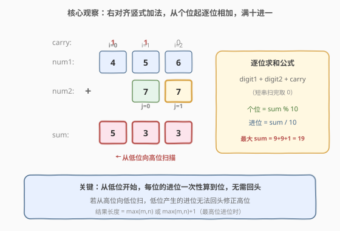
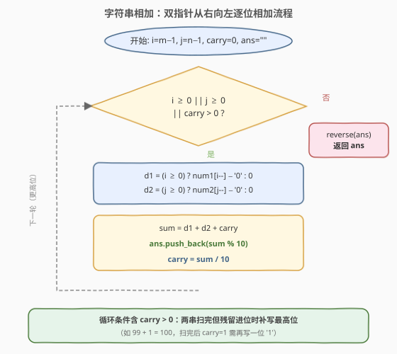
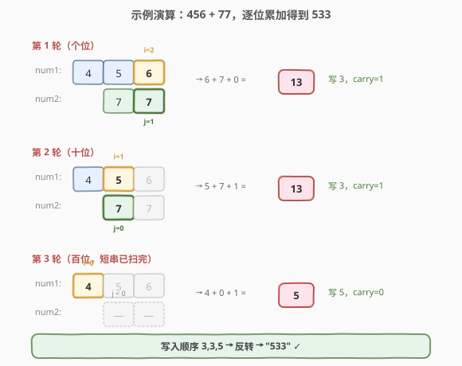

# 字符串相加

- **题目名称**：字符串相加
- **链接**：[415. 字符串相加](https://leetcode.cn/problems/add-strings/)
- **难度**：简单
- **标签**：字符串、数学、模拟

## 1. 题目概述

给定两个以字符串表示的非负整数 `num1` 和 `num2`，返回 `num1 + num2` 的和，**和同样以字符串形式表示**。

注意：不能使用任何内建的 BigInteger 库，也不能**直接**将输入字符串转换为整数（如 `stoi` / `int()`）。

**示例 1**：

```text
输入：num1 = "11", num2 = "123"
输出："134"
```

**示例 2**：

```text
输入：num1 = "456", num2 = "77"
输出："533"
```

**示例 3**：

```text
输入：num1 = "0", num2 = "0"
输出："0"
```

**约束条件**：

- `1 <= num1.length, num2.length <= 10^4`
- `num1` 和 `num2` 只包含数字 `0-9`。
- `num1` 和 `num2` 均不含前导零，除了数字 `0` 本身。

> 💡 长度可达 $10^4$，意味着数字数值可达 $10^{10000}$，远超 64 位整数（约 20 位）能表示的范围。因此**不能**依赖内置整数类型，必须像手算加法那样**逐位模拟**。这也是本题被归为「字符串 / 模拟」而非「数学」技巧题的原因。

---

## 2. 解题思路

### 2.1 暴力思路

最直觉的偷懒做法是直接 `stoi` 转整数再相加——题目明确**禁止**，且会溢出。另一种是「把 `num2` 累加 `num1` 次」：每次做一次字符串 `+1`，循环 `value(num1)` 次。但 `num1` 表示的数值可达 $10^{10^4}$，循环次数是天文数字，直接超时，不可行。

因此必须回到**小学竖式加法**：两个数右对齐，从个位起逐位相加，满十进一。

### 2.2 核心观察：竖式加法 + 进位

竖式加法的关键不是「怎么加」（单 digit 相加最多 $9 + 9 + 1 = 19$，可放进一个 `int`），而是「**从低位到高位逐位累加，把进位 carry 一直向左传递**」。只要每一步把 `digit1 + digit2 + carry` 算出来，个位写入结果、十位变成新的 carry，就能一趟从右扫到左完成求和。



**为什么要从低位到高位？** 因为进位是「从低位向高位」传播的：个位满 10 进 1 到十位，十位再加上这个进位可能再次满 10，继续向百位进。若从高位向低位扫，低位产生的进位无法回头修正高位，必须返工。从低位开始则每个位置的进位**一次性**算到位，无需回头。

> 💡 **为什么结果是 `max(m, n) + 1` 位？** 两个数分别 $< 10^m$、$< 10^n$，和 $< 10^{\max(m,n)} + 10^{\max(m,n)} = 2 \cdot 10^{\max(m,n)} < 10^{\max(m,n)+1}$，至多 `max(m,n)+1` 位；又 $\geq 10^{\max(m,n)-1}$，至少 `max(m,n)` 位。所以结果长度**要么等于较长者，要么多一位**（最高位进位）。代码里无需预估，循环结束后若 `carry > 0` 再补一位即可。

### 2.3 算法流程图



整体只有一层循环：两个指针 `i`、`j` 分别从 `num1`、`num2` 的末尾出发，只要还有位没处理完（`i ≥ 0` 或 `j ≥ 0` 或 `carry > 0`）就继续。每轮取 `digit1`（`i ≥ 0` 时为 `num1[i]`，否则 `0`）、`digit2` 同理，与 `carry` 三者相加得 `sum`，把 `sum % 10` 追加到结果、`sum / 10` 更新为新的 `carry`。循环结束后反转字符串即得答案。

### 2.4 示例演算

以 `num1 = "456"`、`num2 = "77"`（示例 2）为例，右对齐后逐位相加：



| 轮次 | num1 位 (i) | num2 位 (j) | carry (入) | sum | 写入位 | carry (出) |
|------|------------|------------|-----------|-----|--------|-----------|
| 1 | `6` (i=2) | `7` (j=1) | 0 | $6+7+0=13$ | `3` | 1 |
| 2 | `5` (i=1) | `7` (j=0) | 1 | $5+7+1=13$ | `3` | 1 |
| 3 | `4` (i=0) | —（j<0 取 0） | 1 | $4+0+1=5$ | `5` | 0 |

三轮后 `i < 0`、`j < 0`、`carry = 0`，循环结束。写入位按「先低位后高位」顺序为 `3, 3, 5`，反转后得 `"533"`，与 $456 + 77 = 533$ 一致。

> ⚠️ 第 3 轮是「短串已扫完、长串剩高位」的典型情况：`j < 0` 时 `digit2` 取 0，仍需继续处理 `num1` 的高位与残留 `carry`。同理，若两串都扫完但 `carry > 0`（如 `99 + 1 = 100`），还要再补一轮把 carry 写成最高位。这就是循环条件必须包含 `carry > 0` 的原因。

---

## 3. 参考代码

### C++

```cpp
class Solution {
  public:
    string addStrings(string num1, string num2) {
        int i = num1.size() - 1, j = num2.size() - 1, carry = 0;
        string ans;
        while (i >= 0 || j >= 0 || carry > 0) {
            int d1 = i >= 0 ? num1[i--] - '0' : 0;
            int d2 = j >= 0 ? num2[j--] - '0' : 0;
            int sum = d1 + d2 + carry;
            ans.push_back('0' + sum % 10);   // 个位追加到尾部
            carry = sum / 10;                // 进位留给下一位（更高位）
        }
        reverse(ans.begin(), ans.end());     // 反转成正常顺序
        return ans;
    }
};
```

### Python

```python
class Solution:
    def addStrings(self, num1: str, num2: str) -> str:
        i, j, carry = len(num1) - 1, len(num2) - 1, 0
        ans = []
        while i >= 0 or j >= 0 or carry > 0:
            d1 = ord(num1[i]) - 48 if i >= 0 else 0
            i -= 1 if i >= 0 else 0
            d2 = ord(num2[j]) - 48 if j >= 0 else 0
            j -= 1 if j >= 0 else 0
            total = d1 + d2 + carry
            ans.append(chr(total % 10 + 48))   # 个位追加到尾部
            carry = total // 10                 # 进位留给下一位（更高位）
        return "".join(ans[::-1])               # 反转成正常顺序
```

> ⚠️ **两个易错点**：
> 1. **循环条件必须包含 `carry > 0`**。若只写 `i >= 0 || j >= 0`，当 `99 + 1` 两串同时扫完、`carry = 1` 时会提前退出，丢失最高位的 `1`，得到 `"00"` 而非 `"100"`。
> 2. **写入是「低位在前」，最后必须反转**。因为每轮处理的都是当前最低位，先写入的 `3` 实际是个位、最后写入的 `5` 是百位，字符串顺序与数值顺序相反，需 `reverse` 一次。若用双端队列从头部插入则可省去反转，但 `push_back + reverse` 在大多数实现里更高效（连续内存、无逐次前移）。

---

## 4. 复杂度分析

| 维度 | 复杂度 | 说明 |
|------|--------|------|
| 时间复杂度 | $O(\max(m, n))$ | 单层循环遍历较长串的每一位，每轮做 $O(1)$ 的加法与取模 |
| 空间复杂度 | $O(\max(m, n))$ | 结果字符串长度至多 $\max(m, n)+1$（输出字符串不计入额外空间则为 $O(1)$） |

> 💡 本题瓶颈在逐位加法的线性扫描。对于 $m, n \leq 10^4$，约 $10^4$ 次操作，毫秒级完成。当位数达到 $10^5$ 量级（如计算几何 / 大数竞赛题）时，逐位加法仍是 $O(n)$，已无更优解；而**乘法**才需 FFT 把 $O(n^2)$ 降到 $O(n \log n)$——这是加法与乘法的本质区别。

---

## 5. 扩展：任意进制加法

本题是**十进制**加法（满十进一）。把模板稍作推广即可处理任意进制 $B$：

- 取模与除法换成 `$B$`：`sum % B` 写入当前位，`sum / B` 作为进位。
- 字符映射要处理 `A-Z` 表示 $10\sim 35$（如十六进制）。

典型变体是 [67. 二进制求和](https://leetcode.cn/problems/add-binary/)（$B=2$），把 `sum % 10`、`sum / 10` 换成 `sum & 1`、`sum >> 1` 即可，核心循环结构完全一致。掌握了这套「双指针从右扫 + carry 传递」模板，任意进制大数加法都是换汤不换药。

---

## 6. 面试要点

1. **为什么不能直接转整数相加？**
   - 题目明确禁止使用 BigInteger 与直接 `int()` 转换；且长度可达 $10^4$，远超 64 位整数范围（约 20 位），会溢出。必须逐位模拟。

2. **为什么要从低位向高位加？**
   - 进位从低位向高位传播：个位满 10 进 1 到十位，十位可能再次满 10 继续进。若从高位向低位扫，低位产生的进位无法回头修正高位。从低位开始则每个位置的进位一次性算到位，无需回头。

3. **循环条件为什么要有 `carry > 0`？**
   - 两串都扫完时，可能还残留一个进位（如 `99 + 1 = 100` 的最高位 `1`）。若不继续循环，会丢失这个最高位，得到 `"00"` 而非 `"100"`。

4. **结果最多多少位？**
   - 两个数分别 $< 10^m$、$< 10^n$，和 $< 2 \cdot 10^{\max(m,n)} < 10^{\max(m,n)+1}$，至多 `max(m,n)+1` 位；又 $\geq 10^{\max(m,n)-1}$，至少 `max(m,n)` 位。所以结果长度要么等于较长者，要么多一位。

5. **`digit1 + digit2 + carry` 最大是多少，会溢出 int 吗？**
   - 单 digit 最大 $9$，进位最大 $1$（因为 $9+9+1=19$，进位 $1$），三者之和最大 $19$，远在 `int` 范围内。任意进制下只要 $B$ 不超过 `int` 上界，单步和 $\leq 2(B-1)+1$ 同样安全。

6. **遇到 `num1 = "0"` 怎么办？**
   - 无需特判。所有位为 0，`sum` 始终等于 `carry`，第一轮 `carry=0` 时写入 `0`，循环一轮即结束，返回 `"0"`。若想提前返回可在开头加 `if (num1 == "0") return num2;` 作为小优化。

---

## 7. 同类练习题

- [43. 字符串相乘](https://leetcode.cn/problems/multiply-strings/)（[题解](../0001-0100/43_字符串相乘.md)）：大数乘法版，逐位相乘 + 位置映射累加，是本题的乘法进阶姊妹题
- [67. 二进制求和](https://leetcode.cn/problems/add-binary/)：二进制字符串相加，进位基数为 2，换汤不换药的进位模拟
- [66. 加一](https://leetcode.cn/problems/plus-one/)：digit 数组 +1，最简单的进位传播入门
- [445. 两数相加 II](https://leetcode.cn/problems/add-two-numbers-ii/)（[题解](../0401-0500/445_两数相加 II.md)）：链表版字符串相加，用栈把链表逆序后再做进位加法
- [2. 两数相加](https://leetcode.cn/problems/add-two-numbers/)（[题解](../0001-0100/2_两数相加.md)）：链表逆序存储的加法模拟，与本题同为「逐位运算 + 进位」核心套路
