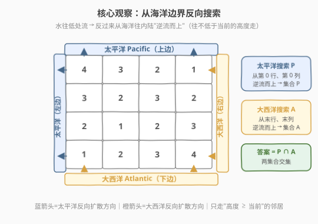
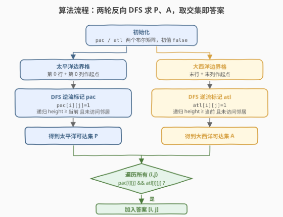
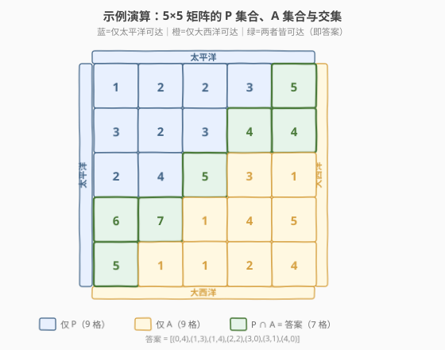

# LeetCode 太平洋大西洋水流问题 题解

## 1. 题目概述

- **标题 / 题号**：太平洋大西洋水流问题（#417，medium）
- **链接**：https://leetcode.cn/problems/pacific-atlantic-water-flow/
- **难度**：中等
- **标签**：图、DFS、BFS、逆向思维

**题意**：给定一个 `m x n` 的非负整数矩阵 `heights`，`heights[r][c]` 表示坐标 `(r, c)` 位置的**地形高度**。

- **太平洋**（Pacific）紧贴矩阵的**上边界**和**左边界**；
- **大西洋**（Atlantic）紧贴矩阵的**下边界**和**右边界**。
- 雨水从某个格子出发，可以沿**上/下/左/右**四个方向流到**相邻**格子，条件是相邻格子的高度 `<=` 当前格子的高度（水往低处流，等高也可流）。
- 如果一条路径能到达太平洋边界，则称该格子的水能流入太平洋；同理大西洋。

返回所有**同时**能流入太平洋和大西洋的格子坐标 `[r, c]`。结果顺序不限。

**示例 1**：

```text
输入：heights = [
  [1,2,2,3,5],
  [3,2,3,4,4],
  [2,4,5,3,1],
  [6,7,1,4,5],
  [5,1,1,2,4]
]
输出：[[0,4],[1,3],[1,4],[2,2],[3,0],[3,1],[4,0]]
解释：上图中蓝色格子只能流入太平洋，橙色格子只能流入大西洋，绿色格子两者皆可流入。
```

**示例 2**：

```text
输入：heights = [[2,1],[1,2]]
输出：[[0,0],[1,1]]
解释：(0,0) 高 2，可向右流到 (0,1)=1 入大西洋、向下流到 (1,0)=1 入太平洋；(1,1) 同理。
```

**约束**：

- `m == heights.length`
- `n == heights[i].length`
- `1 <= m, n <= 200`
- `0 <= heights[r][c] <= 10^5`

## 2. 解题思路

### 2.1 暴力思路

对每个格子 `(r, c)` 分别做一次 DFS/BFS，顺着"水往低处流"的方向探索，看能否碰到太平洋边界、能否碰到大西洋边界。若两者都能碰到则收入答案。

这样每个格子都要单独搜索一次，最坏 `O((M×N)^2)`：`M×N` 个起点 × 每次搜索最多遍历 `M×N` 个格子。`200×200` 时约 16 亿次操作，明显超时。

### 2.2 核心观察：反向搜索（从海洋逆流而上）



> 💡 **逆向思维**：与其对每个格子问"你能不能流到海洋"，不如反过来问"**海洋能逆流影响到哪些格子**"。水往低处流，那么从海洋边界往内陆走，只要**下一步不低于当前高度**（即逆向可通行），就说明该内陆格子能顺着正向水流到达这片海洋。

把问题翻转后，只需要**两次搜索**：

1. **太平洋搜索**：从所有**太平洋边界格**（第 0 行、第 0 列）出发，DFS/BFS 逆流而上（只能走向 `height >= 当前` 的邻居），把能到达的格子标记到集合 `P`。
2. **大西洋搜索**：从所有**大西洋边界格**（最后一行、最后一列）出发，同样逆流而上，标记到集合 `A`。
3. **取交集**：`P ∩ A` 即同时能流入两大洋的格子，就是答案。

> ⚠️ **为什么"逆流而上往高处走"等价于"正向能流到海洋"？**
> 正向边 `u → v` 存在当且仅当 `height[v] <= height[u]`（水从 `u` 流到 `v`）。把所有边**反向**得到 `v → u`。从海洋边界 `b` 出发沿反向边走，能到达 `c`，意味着存在正向路径 `c → ... → b`，即 `c` 的水能流到海洋。反向边 `v → u` 的通行条件是 `height[u] >= height[v]`——也就是**往高度不低于当前格的邻居走**。

### 2.3 算法流程图



**阶段一：求太平洋可达集 `P`**

1. 新建布尔矩阵 `pac`，全为 `false`。
2. 把第 0 行所有格、第 0 列所有格作为起点，逐个调用 `dfs`。
3. `dfs(i, j)`：标记 `pac[i][j] = true`，对四个邻居 `(ni, nj)`，若未越界、未访问、且 `heights[ni][nj] >= heights[i][j]`（逆流可通行），则递归。

**阶段二：求大西洋可达集 `A`**

4. 新建布尔矩阵 `atl`，全为 `false`。
5. 把最后一行所有格、最后一列所有格作为起点，同样 `dfs`，标记到 `atl`。

**阶段三：取交集**

6. 遍历所有 `(i, j)`，若 `pac[i][j] && atl[i][j]` 同时为真，加入答案。

### 2.4 示例演算



以示例 1 的 `5×5` 矩阵为例，反向搜索后：

| 集合 | 含义 | 格子数 |
|------|------|--------|
| `P`（蓝） | 太平洋可达（从上边/左边逆流） | 16 |
| `A`（橙） | 大西洋可达（从下边/右边逆流） | 16 |
| `P ∩ A`（绿） | 两者皆可达 = 答案 | 7 |

观察规律：

- **左上区域**偏向只达太平洋（蓝），**右下区域**偏向只达大西洋（橙）——因为离哪片海近、地势顺势能流过去。
- **交集（绿）**散布在对角线附近：这些格子地势既连着太平洋边界、又连着大西洋边界，是"分水岭"上能两头流的格子。
- 本例中每个格子至少能流入一片海洋（无灰色"两不沾"格），但更一般的情况下会存在两片海都流不到的内部洼地。

最终答案 7 个格子：`(0,4),(1,3),(1,4),(2,2),(3,0),(3,1),(4,0)`，与官方输出一致。

## 3. 参考代码

### C++

```cpp
class Solution {
    int m, n;
    int dx[4] = {0, 0, 1, -1};
    int dy[4] = {1, -1, 0, 0};

    // 从 (i,j) 出发逆流而上（只走向"不低于当前高度"的邻居），标记 vis
    void dfs(const vector<vector<int>>& h, int i, int j,
             vector<vector<char>>& vis) {
        vis[i][j] = 1;
        for (int d = 0; d < 4; d++) {
            int ni = i + dx[d], nj = j + dy[d];
            if (ni < 0 || ni >= m || nj < 0 || nj >= n) continue;
            if (vis[ni][nj]) continue;
            if (h[ni][nj] < h[i][j]) continue; // 逆流：只能往 >= 当前高度的走
            dfs(h, ni, nj, vis);
        }
    }

  public:
    vector<vector<int>> pacificAtlantic(vector<vector<int>>& heights) {
        m = heights.size();
        n = heights[0].size();
        vector<vector<char>> pac(m, vector<char>(n, 0));
        vector<vector<char>> atl(m, vector<char>(n, 0));

        // 1. 太平洋边界：第 0 行 + 第 0 列
        for (int i = 0; i < m; i++) dfs(heights, i, 0, pac);
        for (int j = 0; j < n; j++) dfs(heights, 0, j, pac);
        // 2. 大西洋边界：最后一行 + 最后一列
        for (int i = 0; i < m; i++) dfs(heights, i, n - 1, atl);
        for (int j = 0; j < n; j++) dfs(heights, m - 1, j, atl);

        // 3. 交集即答案
        vector<vector<int>> ans;
        for (int i = 0; i < m; i++)
            for (int j = 0; j < n; j++)
                if (pac[i][j] && atl[i][j])
                    ans.push_back({i, j});
        return ans;
    }
};
```

### Python

```python
class Solution:
    def pacificAtlantic(self, heights: List[List[int]]) -> List[List[int]]:
        m, n = len(heights), len(heights[0])
        pac = [[False] * n for _ in range(m)]
        atl = [[False] * n for _ in range(m)]
        dirs = [(0, 1), (0, -1), (1, 0), (-1, 0)]

        def dfs(i, j, vis):
            vis[i][j] = True
            for di, dj in dirs:
                ni, nj = i + di, j + dj
                if 0 <= ni < m and 0 <= nj < n and not vis[ni][nj] \
                        and heights[ni][nj] >= heights[i][j]:
                    dfs(ni, nj, vis)

        # 太平洋边界：第 0 行 + 第 0 列
        for i in range(m):
            dfs(i, 0, pac)
        for j in range(n):
            dfs(0, j, pac)
        # 大西洋边界：最后一行 + 最后一列
        for i in range(m):
            dfs(i, n - 1, atl)
        for j in range(n):
            dfs(m - 1, j, atl)

        return [[i, j] for i in range(m) for j in range(n)
                if pac[i][j] and atl[i][j]]
```

## 4. 复杂度分析

| 维度 | 复杂度 | 说明 |
|------|--------|------|
| 时间复杂度 | `O(M × N)` | 两轮 DFS 各把每个格子最多访问一次（`vis` 去重），交集扫描再 `O(M×N)`，总计线性 |
| 空间复杂度 | `O(M × N)` | 两个布尔矩阵 `pac`/`atl` 各 `O(M×N)`；DFS 递归栈最坏深度 `O(M×N)`（蛇形地势），改 BFS 可把栈开销换成队列 |

## 5. 扩展：BFS 写法与递归栈安全

- **BFS 版本**：把 `dfs` 换成显式队列。初始把对应边界格全部入队并标记，每次出队 `(i,j)` 后把满足"逆流可通行"且未访问的邻居入队。逻辑完全等价，但避免了递归栈溢出。
- **Python 递归栈**：`m,n ≤ 200` 时最坏递归深度可达 40000，超过默认递归上限。可 `sys.setrecursionlimit(100000)`，或在面试中直接写 BFS 版本更稳妥。
- **方向数组**：四方向 `dx/dy` 是网格 DFS/BFS 的通用模板，配合"未越界 + 未访问 + 满足通行条件"三段判定，可迁移到几乎所有网格搜索题。

> 💡 **BFS 起点批量化**：本题把"一整条边界"的所有格子一次性入队作为多源 BFS 的起点，和 [994. 腐烂的橘子](https://leetcode.cn/problems/rotting-oranges/) 的"所有初始腐烂橘子同时入队"是同一个套路——**多源 BFS**。

## 6. 面试要点

1. **为什么不能对每个格子正向搜索？复杂度差在哪？**

   - 正向：`M×N` 个起点，每个起点最坏遍历 `M×N` 格，总计 `O((M×N)^2)`。
   - 反向：以两片海洋的边界格为多源起点，只需两轮搜索，每轮 `O(M×N)`，总计 `O(M×N)`。把"多对一"的可达性问题转成"一对多"的扩散问题，是经典的**反图技巧**。

2. **"逆流而上往高处走"为什么就等价于正向能流到海？**

   - 正向边 `u→v` 当且仅当 `height[v] <= height[u]`。把图所有边反向后，从海洋边界出发沿反向边能到的格子 `c`，意味着原图中存在 `c → ... → 海洋` 的路径。反向边的通行条件 `height[邻居] >= height[当前]` 即"往不低于当前的高度走"。

3. **这题和 130 被围绕的区域、994 腐烂橘子有什么联系？**

   - 都是"网格 + 多源 BFS/DFS + 从目标反向扩散"的模板。130 从边界 `'O'` 出发标记"安全"区域；994 从所有腐烂橘子出发计算蔓延时间；417 从两片海洋边界出发求可达集。**核心都是"把判断可达转化为从终点反向扩散"**。

4. **为什么要维护两个独立的 `pac`/`atl` 矩阵，不能合并？**

   - 两片海的边界不同、扩散过程相互独立，若合并会丢失"各自可达性"信息。两个矩阵记录各自的可达集，最后取交集，逻辑清晰且不易出错。空间 `O(M×N)` 仍在可接受范围。

5. **DFS 还是 BFS？面试怎么选？**

   - 逻辑等价。C++ DFS 通常没问题；Python / 大网格建议 BFS（显式队列）避免递归栈溢出。面试中先讲清思路，再按语言习惯选实现，并主动提一句"大网格可换 BFS 防栈溢出"是加分项。

## 同类练习题

| # | 题目 | 与本题的关联 |
|---|------|-------------|
| 130 | [被围绕的区域](https://leetcode.cn/problems/surrounded-regions/)（[题解](../0101-0200/130_被围绕的区域.md)） | 从边界 `'O'` 反向 DFS 标记"安全区"，本题的模板原型 |
| 994 | [腐烂的橘子](https://leetcode.cn/problems/rotting-oranges/) | 多源 BFS 从所有腐烂橘子同时扩散，求蔓延时间 |
| 542 | [01 矩阵](https://leetcode.cn/problems/01-matrix/) | 从所有 `0` 反向多源 BFS 求到最近 `0` 的距离，与本题"从边界扩散"同源 |
| 1254 | [统计封闭岛屿的数目](https://leetcode.cn/problems/number-of-closed-islands/) | 先从边界反向标记连边界的岛，再数内部封闭岛，130 的进阶 |
| 1926 | [迷宫中离入口最近的出口](https://leetcode.cn/problems/nearest-exit-from-entrance-in-maze/) | 从入口正向 BFS 到任意边界出口，可与本题的"反向"思路对比 |
