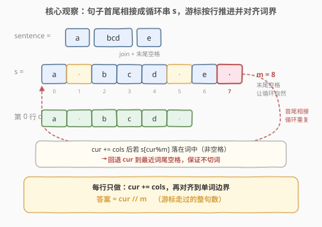
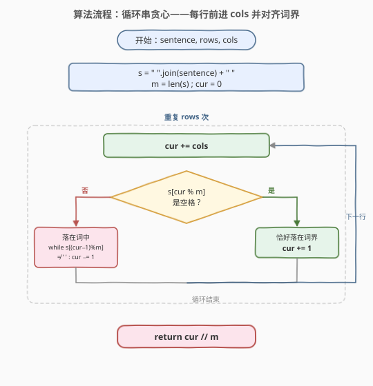

# LeetCode 屏幕可显示句子的数量 题解

## 1. 题目概述

- **标题 / 题号**：屏幕可显示句子的数量（#418，medium）
- **链接**：https://leetcode.cn/problems/sentence-screen-fitting/
- **难度**：中等
- **标签**：字符串、贪心、模拟

**题意**：给定一个 `rows x cols` 的屏幕和一个由**非空**单词列表组成的句子，计算该句子在屏幕上**完整显示**的次数。

- 句子中的**单词顺序必须保持不变**；
- 一个单词**不能拆分**到两行；
- 同一行中两个连续单词之间必须用**一个空格**分隔；
- 行末多余位置用空格填充（不计入句子）。

**示例 1**：

```text
输入：sentence = ["hello", "world"], rows = 2, cols = 8
输出：1
解释：
hello---
world---
字符 '-' 表示屏幕上的一个空白位置。
```

**示例 2**：

```text
输入：sentence = ["a", "bcd", "e"], rows = 3, cols = 6
输出：2
解释：
a-bcd-
e-a---
bcd-e-
```

**示例 3**：

```text
输入：sentence = ["i", "had", "apple", "pie"], rows = 4, cols = 5
输出：1
解释：
i-had
apple
pie-i
had--
```

**约束**：

- `1 <= sentence.length <= 100`
- `1 <= sentence[i].length <= 10`
- `sentence[i]` 由小写英文字母组成
- `1 <= rows, cols <= 2 * 10^4`

> ⚠️ **两个易错点**：① 单词**不能拆行**，行末必须停在词尾空格处；② 句子在屏幕上**循环重复**，跨行时从下一个词继续，而非每行都从头开始。

## 2. 解题思路

### 2.1 暴力思路

逐行逐词模拟：维护当前单词下标 `idx`，对每一行从 `idx` 开始贪心地塞词——若当前词（加上行内已有内容和一个空格）放得下就放，否则换行。每当 `idx` 绕回 `0`，计数 `+1`。

每行最多塞 `O(cols / minlen)` 个词，整体 `O(rows · cols)`，`rows = cols = 2·10^4`、词长为 1 时约 `4·10^8` 次操作，明显偏慢。瓶颈在于「逐词」推进太细。

### 2.2 核心观察：循环串贪心



**关键转换**：把句子用空格拼接、并在**末尾再补一个空格**，得到字符串 `s`。例如 `["a","bcd","e"]` → `s = "a bcd e "`（长度 `m = 8`）。末尾那个空格让句子**自然首尾相接**——`s` 的每个完整周期恰是一句加上词间空格。

于是问题变成：**一个游标 `cur` 在无限循环的 `s` 上前进，每行前进 `cols` 步，但必须停在一个完整词的词尾空格处**（不能把词切断）。走完 `rows` 行后，`cur // m` 就是走过的整句数。

**对齐词界的两种情况**（设 `m = len(s)`，下标对 `m` 取模）：

1. `cur += cols` 后，`s[cur % m]` 恰是空格 → 完美落在词界，`cur += 1`（顺手吃掉这个空格，下一行从新词开头开始）。
2. `s[cur % m]` 是字母 → 落在某个词中间，**回退** `cur`，直到 `s[(cur-1) % m]` 是空格（即退到上一个词的词尾）。

> 💡 **为什么回退不会无限退**：回退的步数不超过一个词的长度（≤10），因为最近的上一个词尾空格就在至多 `maxlen` 步之前。若某个词长度 `> cols`，则该词永远放不进一行，回退会一直退到 `cur = 0`，最终 `cur // m = 0`，自然得到答案 0。

### 2.3 算法流程图



只需一个游标 `cur`，循环 `rows` 次每次 `O(maxlen)` 对齐，最后整除 `m` 即得答案。

### 2.4 示例演算

![示例演算：rows=3, cols=6, sentence=[a, bcd, e]](../images/sentence_screen_walkthrough.svg)

以示例 2 走一遍，`s = "a bcd e "`，`m = 8`，下标 `0..7` 对应 `a · b c d · e ·`：

| 行 | cur 起点 | +cols | s[cur%m] | 对齐动作 | cur 终点 | 屏幕行 |
|----|---------|-------|----------|----------|---------|--------|
| 0 | 0 | 6 | s[6]='e'(词中) | 回退到 s[5]=' ' 停 | 6 | `a-bcd-` |
| 1 | 6 | 12 | s[4]='d'(词中) | 回退到 10，s[1]=' ' 停 | 10 | `e-a---` |
| 2 | 10 | 16 | s[0]='a'(词中) | s[7]=' ' 已是界，不退 | 16 | `bcd-e-` |

最终 `cur = 16`，`m = 8`，**答案 = 16 // 8 = 2** ✓。

- 第 1 行回退了 2 步（12→10），因为 `cols=6` 恰把 "bcd" 切断，必须退到 "a" 后的空格；
- 第 2 行没有回退：`cur=16` 落在 'a'，但 `(16-1) % 8 = 7` 已是空格，说明上一字符就是词尾，本行刚好以 "e " 收尾。

## 3. 参考代码

### C++

```cpp
// 循环串贪心：O(rows * maxlen) / O(L)，L 为句子总字符数
class Solution {
public:
    int wordsTyping(vector<string>& sentence, int rows, int cols) {
        string s;
        for (auto& t : sentence) {
            s += t;
            s += ' ';
        }
        int m = s.size();
        int cur = 0;
        while (rows--) {
            cur += cols;
            if (s[cur % m] == ' ') {
                ++cur;                       // 恰好落在词界，吃掉空格
            } else {
                while (cur > 0 && s[(cur - 1) % m] != ' ') {
                    --cur;                   // 回退到最近词尾空格
                }
            }
        }
        return cur / m;
    }
};
```

### Python

```python
# 循环串贪心：O(rows * maxlen) / O(L)
def wordsTyping(sentence, rows, cols):
    s = " ".join(sentence) + " "
    m = len(s)
    cur = 0
    for _ in range(rows):
        cur += cols
        if s[cur % m] == " ":
            cur += 1                        # 恰好落在词界，吃掉空格
        else:
            while cur > 0 and s[(cur - 1) % m] != " ":
                cur -= 1                    # 回退到最近词尾空格
    return cur // m
```

## 4. 复杂度分析

| 维度 | 复杂度 | 说明 |
|------|--------|------|
| **时间** | `O(rows · M)` | 每行回退不超过最长词长度 `M ≤ 10`，共 `rows` 行；可视为 `O(rows)` |
| **空间** | `O(L)` | `s` 存句子拼接结果，`L = Σ词长 + n`（`n` 为词数） |
| **常数** | 极小 | 单指针 `cur`，无额外数据结构 |

> 💡 **与逐词模拟对比**：逐词模拟 `O(rows · cols / minlen)` 在 `cols` 大、词短时退化到 `O(rows · cols) ≈ 4·10^8`；循环串法把「逐词」压缩成「逐行 + 至多 M 步回退」，快约 `cols / M` 倍。

## 5. 扩展：按词索引的记忆化（O(n + rows)）

当 `rows` 极大而词数 `n` 很小（`n ≤ 100`）时，可把「每行对齐」进一步压缩成 `O(1)` 跳转：

1. **预处理**：对每个起始词下标 `i ∈ [0, n)`，贪心算出「从词 `i` 开始填满一行后，下一行的起始词下标 `nxt[i]`」以及「这一行内完整走过的句子数 `times[i]`」。用词长前缀和 + 取模可 `O(n)` 算完。
2. **模拟**：`idx = 0`，每行 `ans += times[idx]; idx = nxt[idx]`，共 `rows` 行。

整体 `O(n + rows)`，与 `cols` 无关，适合 `cols` 极大的场景。本质上循环串法是把这套跳转「内联」进一个游标——二者等价，循环串法代码更短。

## 6. 面试要点

1. **为什么要在 `s` 末尾补一个空格？**

   - 末尾空格让句子**首尾自然相接**：`s` 的一个完整周期 = 一句 + 所有词间空格。没有它，句末最后一个词和下一句第一个词之间会缺少分隔，`cur // m` 也不再等于句子数。它同时让「落在空格」的判定在词界处统一成立。

2. **回退条件为什么是 `s[(cur-1) % m] != ' '` 而不是 `s[cur % m] != ' '`？**

   - `cur` 指向「下一个要放的字符」。我们要让 `cur` 停在词尾空格**之后**（即下一个词的开头）。所以检查的是 `cur-1` 是否为空格：若是，说明 `cur` 刚好在一个词的开头，可以停；若不是，说明 `cur` 落在词中间，要继续退。

3. **`cur += 1` 那一步可以省掉吗？**

   - 不行。当 `cur += cols` 后 `s[cur % m]` 已是空格，说明本行恰好以一个完整词收尾。`cur += 1` 跳过这个空格，让下一行从新词开头开始；若不跳，下一行会把空格当成本行第一个字符，导致多算一个位置或少算词界。

4. **某个词长度 `> cols` 会怎样？**

   - 回退会一路退到 `cur = 0`（`while cur > 0` 终止），该行没有推进，后续每行同理，最终 `cur = 0`，返回 `0`。正确反映「该词永远放不进一行」。约束下词长 ≤ 10，故仅当 `cols < max(词长)` 时出现。

5. **为什么答案是 `cur // m` 而不是逐词计数？**

   - `m` 恰是一个完整句子在 `s` 中的周期长度（词长和 + 词数个空格）。`cur` 是游标在循环 `s` 上走过的总步数，整除 `m` 即走过的整周期数 = 完整句子数。这是「把计数问题转成位置问题」的经典手法。

## 同类练习题

| # | 题目 | 与本题的关联 |
|---|------|-------------|
| 466 | [统计重复个数](https://leetcode.cn/problems/count-the-repetitions/) | 最接近的循环串+记忆化变体——统计 `S2` 由重复 `S1` 得到的次数，用 `nxt` 跳转表把逐字符推进压成 O(n) |
| 68 | [文本左右对齐](https://leetcode.cn/problems/text-justification/) | 同为「按行贪心填词」，但要求输出对齐后的行，关注空格分配而非计数 |
| 459 | [重复的子字符串](https://leetcode.cn/problems/repeated-substring-pattern/) | 字符串周期性判定——判断 `s` 是否由某子串重复构成，`(s+s).find(s, 1) != n` 的周期技巧 |
| 796 | [旋转字符串](https://leetcode.cn/problems/rotate-string/) | 字符串循环移位判定，同样可用 `s+s` 包含判定的周期思想 |
