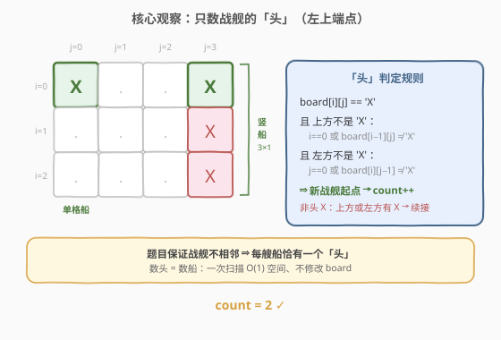
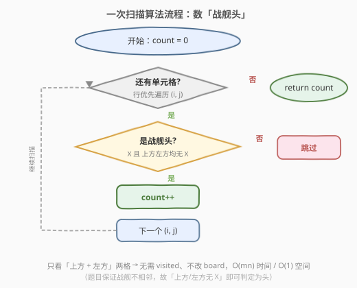
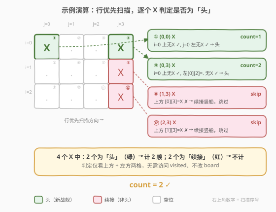

# 棋盘上的战舰

- **题目名称**：棋盘上的战舰
- **链接**：[419. 棋盘上的战舰](https://leetcode.cn/problems/battleships-in-a-board/)
- **难度**：中等
- **标签**：数组、矩阵、一次扫描

## 1. 题目概述

给你一个 `m x n` 的矩阵 `board` 表示棋盘，每个单元格是战舰 `'X'` 或空位 `'.'`。返回棋盘上放置的**舰队数量**。

**舰队**只能水平或垂直放置，形状为 `1 x k`（1 行 k 列）或 `k x 1`（k 行 1 列）。**两个舰队之间至少有一个水平或垂直的空格分隔**（即没有相邻的舰队，战舰不会在对角方向相触以外的方向相邻）。

**示例 1**：

```text
输入：board = [["X",".",".","X"],[".",".",".","X"],[".",".",".","X"]]
输出：2
解释：左上角的 X 是一艘单格战舰；最右列三个 X 是一艘竖直 3×1 战舰。
```

**示例 2**：

```text
输入：board = [["."]]
输出：0
```

**约束条件**：

- `m == board.length`
- `n == board[i].length`
- `1 <= m, n <= 200`
- `board[i][j]` 是 `'.'` 或 `'X'`

**进阶**：能否实现**一次扫描**算法，仅用 `O(1)` 额外空间，且**不修改** `board` 的值？

> ⚠️ **两个关键前提**：① 战舰只能是直线（横或竖），不会是 L 形；② 战舰之间至少隔一个空位（不共边）。这两条保证了「每艘船恰有一个左上端点」，是下面一次扫描解法的根基。

---

## 2. 解题思路

### 2.1 暴力思路：DFS 洪泛标记（仿 200 岛屿数量）

扫到 `'X'` 就计数 +1，然后 DFS/BFS 把同一艘船的所有 `'X'` 改成 `'.'`（或用 `visited` 数组标记），避免重复计数。

- 时间 `O(mn)`，空间 `O(mn)`（`visited` 数组）或 `O(1)`（直接改 `board`，但破坏输入）+ DFS 递归栈 `O(m+n)`。
- 缺点：要么开额外空间，要么修改 `board`，**都不满足进阶要求**。

> 💡 这条路与 [200. 岛屿数量](../0101-0200/200_岛屿数量.md) 几乎一模一样。区别在于本题的「战舰是直线 + 不相邻」结构比岛屿更规整，所以能跳过洪泛、用更轻的判定直接数。

### 2.2 核心观察：只数战舰的「头」（左上端点）



突破口在于题目的两条保证：

1. **战舰是直线**：横船 `1×k` 的所有 X 在同一行连续排列，竖船 `k×1` 的所有 X 在同一列连续排列。
2. **战舰不相邻**：两艘船之间必有空位，不会出现两个 X 分属不同船却共边相邻。

由此推出：**每艘船恰有一个「头」**——

- 横船的头是其**最左端**的 X（左边没有 X）；
- 竖船的头是其**最上端**的 X（上方没有 X）；
- 单格船 `1×1` 既是横船也是竖船的退化，上方、左方都没有 X。

反过来，一个 X 如果**上方不是 X 且左方不是 X**，它就一定是某艘船的头（不可能是续接格）。因为续接格要么是横船的非首格（左方有 X），要么是竖船的非首格（上方有 X）。

> 💡 **为什么只看「上方 + 左方」两格就够？** 因为扫描是行优先从左到右、从上到下。一个 X 的「同船前驱」只可能在它的上方（竖船）或左方（横船）。检查这两格是否为 X 即可区分「头」与「续接」。无需看下方/右方——那是后继，尚未扫描，看了也判定不了当前格是不是头。

**判定式**：

$$
\text{isHead}(i, j) = \text{board}[i][j] = \text{'X'} \;\land\; (i=0 \lor \text{board}[i-1][j] \neq \text{'X'}) \;\land\; (j=0 \lor \text{board}[i][j-1] \neq \text{'X'})
$$

满足则 `count++`。遍历整个棋盘，累加头数即答案。

> ⚠️ **「不相邻」前提不可或缺**。若允许两艘船共边相邻，则一个 X 可能上方、左方都有 X 但分属不同船，此时「上方左方均无 X」就不再等价于「头」。题目保证不相邻，才让这条判定成立。

### 2.3 算法流程图



整体只有一个双重循环：行优先扫描每个 `(i, j)`，若 `board[i][j] == 'X'` 且上方、左方均非 `'X'`，则 `count++`。边界（`i==0` / `j==0`）自然当作「无 X」处理，无需特判数组越界。

### 2.4 示例演算



以 `board = [["X",".",".","X"],[".",".",".","X"],[".",".",".","X"]]` 为例，行优先扫描 12 个单元格，4 个 X 的判定如下：

| 步骤 | (i, j) | 上方 board[i−1][j] | 左方 board[i][j−1] | 判定 | count |
|------|--------|--------------------|--------------------|------|-------|
| ① | (0, 0) | i=0 → 无 | j=0 → 无 | 头 ✓ | 1 |
| ④ | (0, 3) | i=0 → 无 | `.` → 无 | 头 ✓ | 2 |
| ⑧ | (1, 3) | `X` → 有 | `.` → 无 | 续接（竖船非首格）✗ | 2 |
| ⑫ | (2, 3) | `X` → 有 | `.` → 无 | 续接（竖船非首格）✗ | 2 |

最终 `count = 2` ✓。注意 ⑧、⑫ 的左方都是 `.`（非 X），但因为**上方有 X**，仍被判为续接——这正是「只看上 + 左」的正确性来源：竖船的续接格由上方暴露，横船的续接格由左方暴露，二者覆盖所有续接情形。

---

## 3. 参考代码

### C++

```cpp
// 一次扫描 + O(1) 空间 + 不修改 board
class Solution {
public:
    int countBattleships(vector<vector<char>>& board) {
        int m = board.size(), n = board[0].size();
        int count = 0;
        for (int i = 0; i < m; ++i) {
            for (int j = 0; j < n; ++j) {
                if (board[i][j] == 'X'
                    && (i == 0 || board[i - 1][j] != 'X')
                    && (j == 0 || board[i][j - 1] != 'X')) {
                    ++count;
                }
            }
        }
        return count;
    }
};
```

### Python

```python
class Solution:
    def countBattleships(self, board: List[List[str]]) -> int:
        m, n = len(board), len(board[0])
        count = 0
        for i in range(m):
            for j in range(n):
                if (board[i][j] == 'X'
                        and (i == 0 or board[i - 1][j] != 'X')
                        and (j == 0 or board[i][j - 1] != 'X')):
                    count += 1
        return count
```

> 💡 **两个易错点**：
> 1. **短路求值顺序不能反**。`i == 0 || board[i-1][j] != 'X'` 必须先判 `i == 0`，否则 `i=0` 时访问 `board[-1][j]` 越界（C++ 未定义行为，Python 会取到最后一行导致误判）。`j` 同理。
> 2. **三个条件用 `&&` 串联**，缺一不可：先确认是 `X`，再确认上方无 `X`，再确认左方无 `X`。少判一个会把续接格误数成头。

---

## 4. 复杂度分析

| 维度 | 复杂度 | 说明 |
|------|--------|------|
| 时间复杂度 | $O(m \cdot n)$ | 双重循环遍历每个单元格一次，每次 `O(1)` 判定 |
| 空间复杂度 | $O(1)$ | 仅用 `count` 与循环变量，不开 `visited`、不改 `board` |

> 💡 这是该题的最优解：时间已达下界（必须至少看一遍每个单元格才能确认是否为 `X`），空间为常数，且不修改输入。三个进阶要求（一次扫描 / `O(1)` 空间 / 不改 `board`）同时满足。

---

## 5. 扩展：与 DFS 洪泛法的对照

[200. 岛屿数量](../0101-0200/200_岛屿数量.md) 的标准解法是 DFS 洪泛：扫到 `1` 就计数，DFS 把整个连通块标记为已访问。本题暴力解法（2.1 节）正是同一模板——把 `'X'` 当作 `'1'`，洪泛后改成 `'.'`。

| 维度 | DFS 洪泛法 | 一次扫描数头法（本题） |
|------|-----------|----------------------|
| **时间** | $O(m \cdot n)$ | $O(m \cdot n)$ |
| **空间** | $O(m \cdot n)$（visited）或 $O(1)$（改 board）+ 递归栈 | $O(1)$ |
| **是否改 board** | 改（或开 visited） | 不改 |
| **依赖题目结构** | 仅依赖「连通块」概念，通用 | 依赖「战舰是直线 + 不相邻」 |
| **适用场景** | 任意形状连通块计数 | 仅直线型、不相邻物体计数 |

> 💡 **何时能从洪泛降级为数头？** 当物体满足：① 每个物体有唯一的「可识别起点」（如左上端点）；② 起点的判定只依赖局部（已扫描过的邻居）。岛屿不满足（岛屿形状任意，没有唯一的「头」），所以必须洪泛。战舰是直线，头唯一且可由「上 + 左」判定，所以能跳过洪泛。

---

## 6. 面试要点

1. **为什么「上方 + 左方」两格就能判定头？下方和右方不行吗？**

   > 行优先扫描时，一个 X 的同船前驱只可能在上方（竖船）或左方（横船）。下方/右方是后继，尚未扫描，看了也无法判定当前格是否为头——后继格的存在只能说明「这艘船还没结束」，不能说明「当前格是不是头」。而前驱格的存在恰恰说明当前格是续接；前驱都不存在，当前格必是头。

2. **「战舰不相邻」这条保证用在哪里？去掉会怎样？**

   > 它保证「上方有 X 且左方有 X」不会发生（否则两个 X 分属不同船却共角，意味着两船在对角相触——但题目连共边都不允许，共角更不可能出现在同一格的上方+左方同时有 X 且分属不同船的情形）。更准确地说：不相邻 + 直线形状，使得「上方无 X 且左方无 X」与「是头」严格等价。若允许相邻，一个 X 可能上方、左方都有同船 X（L 形）或不同船 X，判定式失效。

3. **短路求值顺序为什么重要？**

   > `(i == 0 || board[i-1][j] != 'X')` 必须先判 `i == 0`：若先访问 `board[i-1][j]`，`i=0` 时下标为 `-1`，C++ 越界未定义，Python 取到最后一行会误判。`j` 同理。这是「边界即无 X」的编码惯例——把越界检查放在数组访问之前。

4. **DFS 洪泛法为什么不满足进阶要求？**

   > 洪泛要么开 `O(mn)` 的 `visited`（空间超标），要么把 `'X'` 改成 `'.'`（破坏 `board`），且 DFS 递归栈最坏 `O(m+n)`。三条进阶要求（一次扫描 / `O(1)` 空间 / 不改 `board`）一条都满足不了。数头法只用局部判定，绕过了洪泛的全部开销。

5. **如果战舰可以是 L 形（拐弯）怎么办？**

   > 「头」不再唯一——一个 L 形物体的拐角格可能上方、左方都有 X（分属同一物体的横段和竖段），判定式会漏数。此时退回 DFS 洪泛法是唯一通解。本题能数头，本质上是利用了「直线形状」这一额外约束。

> 💡 **一句话总结**：419 是「利用题目结构把洪泛降级为局部判定」的招牌题——战舰是直线 + 不相邻 ⇒ 每艘船有唯一的「左上头」⇒ 只看上方 + 左方两格即可计数，$O(mn)$/O(1) 一趟扫完，不改输入。

---

## 7. 同类练习题

- [200. 岛屿数量](https://leetcode.cn/problems/number-of-islands/)（[题解](../0101-0200/200_岛屿数量.md)）：DFS/BFS 洪泛计数的母题，物体形状任意必须洪泛；对比本题利用「直线 + 不相邻」跳过洪泛
- [1254. 统计封闭岛屿的数目](https://leetcode.cn/problems/number-of-closed-islands/)：DFS 洪泛 + 边界接触判定，进一步练习「何时必须洪泛」
- [695. 岛屿的最大面积](https://leetcode.cn/problems/max-area-of-island/)：洪泛时累计面积而非计数，同一模板不同聚合
- [733. 图像渲染](https://leetcode.cn/problems/flood-fill/)：洪泛改色，最纯粹的 DFS/BFS 连通块操作入门
- [289. 生命游戏](https://leetcode.cn/problems/game-of-life/)：同为矩阵原地判定题，用「位编码」记录状态转移，对比本题「不修改 board」的 O(1) 解法
