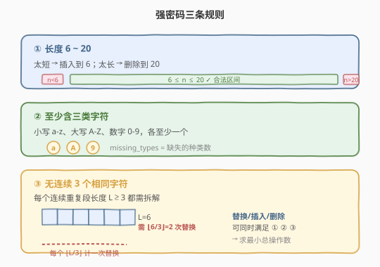
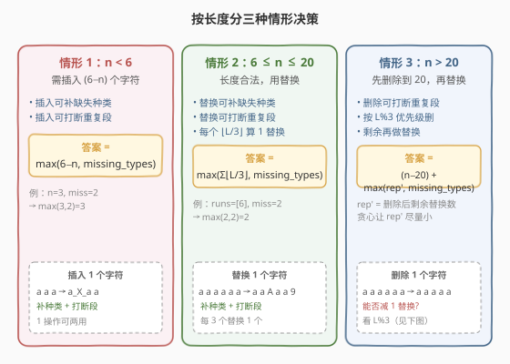
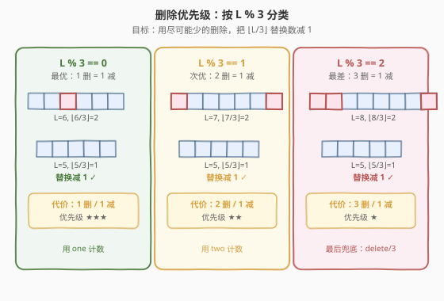
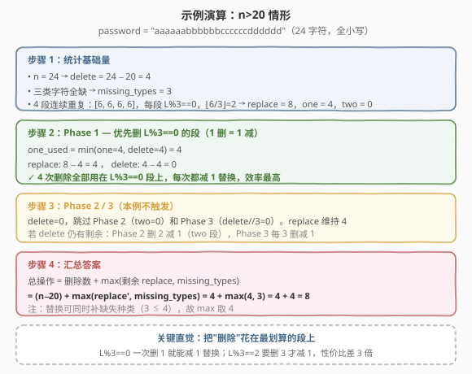

# 强密码检验器

- **题目名称**：强密码检验器
- **链接**：[420. 强密码检验器](https://leetcode.cn/problems/strong-password-checker/)
- **难度**：困难
- **标签**：字符串、贪心、模拟

## 1. 题目概述

一个密码被认为是「强密码」当且仅当满足以下三个条件：

1. **长度在 6 到 20 之间**（含端点）；
2. **至少包含**一个小写字母、一个大写字母和一个数字；
3. **不包含**连续 3 个相同字符（例如 `...aaa...` 是弱的，但 `...aa.a...` 在其他条件满足时是强的）。

给定字符串 `password`，返回使其变为强密码所需的**最少操作次数**。一次操作可以是：**插入**一个字符、**删除**一个字符、或**替换**一个字符。

**示例 1**：

```text
输入：password = "a"
输出：5
解释：长度 1，需插入 5 个字符到长度 6；同时补大写、数字种类。可在插入中同时满足。
```

**示例 2**：

```text
输入：password = "aA1"
输出：3
解释：三类齐全、无三连重复，但长度只有 3，需插入 3 个字符到长度 6。
```

**示例 3**：

```text
输入：password = "1337C0d3"
输出：0
解释：已是强密码，三类齐全、长度 8、无三连重复。
```

**约束条件**：

- `1 <= password.length <= 50`
- `password` 由 ASCII 可打印字符（不含空格）组成

> ⚠️ **难点**：三种操作（插入/删除/替换）各自能同时影响「长度」「字符种类」「三连重复」三类约束，如何**贪心地让一次操作尽量同时满足多个约束**是本题核心。

---

## 2. 解题思路

### 2.1 暴力思路

最朴素的想法：用 BFS / 编辑DP 搜索所有可能的操作序列，第一次得到强密码时返回步数。但密码长度可达 50，字符集可达 90+，状态空间天文数字，完全不可行。必须利用**约束的结构性**：每类约束都可独立量化，再合并。

### 2.2 核心观察：三种约束可独立量化



把三个条件拆开看：

- **长度约束**：缺多少补多少（`n<6` 需插 `6−n` 个，`n>20` 需删 `n−20` 个），数量固定。
- **种类约束**：统计缺失的小写/大写/数字种类数 `missing_types`（0、1、2 或 3）。
- **重复约束**：每个连续重复段长度 $L\ge 3$，需 $\lfloor L/3 \rfloor$ 次操作打断（每次替换段中第 3、6、9... 个字符即可断成多段 ≤2）。

> 💡 **关键**：替换/插入/删除**都能同时改善多个约束**——一次替换既能补缺失种类、又能断三连；一次删除既能减长度、又能缩短重复段。所以**总操作数 ≤ 各约束单独所需之和**，但具体能合并多少取决于长度所处区间。

### 2.3 按长度分三种情形



设 $n$ 为密码长度，`replace` $=\sum \lfloor L_i/3\rfloor$ 为打断所有重复段所需的替换数，`missing_types` 为缺失种类数。

#### 情形 1：$n < 6$（太短）

需要插入 $6-n$ 个字符。**每次插入**既能补缺失种类，也能在重复段中间插一个字符断三连。因此：

$$
\text{ans} = \max(6-n,\ \text{missing\_types})
$$

> 为什么不用单独算 `replace`？因为 $n<6$ 时任意重复段长度最多为 $n\le 5$，`replace` $=\lfloor L/3\rfloor\le 1$，而插入位置若选在段中即可同时断段——插入 $6-n$ 个字符足够覆盖。当 `missing_types` 更大时，多出来的替换/插入也可用来补种类，最终仍由 `max` 决定。

#### 情形 2：$6 \le n \le 20$（长度合法）

只需替换。**每次替换**既能补缺失种类，又能断三连。因此：

$$
\text{ans} = \max(\text{replace},\ \text{missing\_types})
$$

> 若 `replace` ≥ `missing_types`：在每次替换时顺便换成一个缺失种类字符即可。反之同理。

#### 情形 3：$n > 20$（太长）

必须删除 $n-20$ 个字符（**强制**）。删除虽不能补种类，但**能缩短重复段**，从而减少后续所需替换数。我们要**贪心地把删除用在"性价比最高"的段上**，让 `replace` 尽量降低。最终：

$$
\text{ans} = (n-20) + \max(\text{replace}',\ \text{missing\_types})
$$

其中 `replace'` 是经过"聪明的删除"后剩余的替换数。

### 2.4 删除的贪心优先级：按 L % 3 分类



对一段长度 $L\ge 3$ 的连续重复，要让它对 `replace` 的贡献 $\lfloor L/3\rfloor$ 减 1，需要把 $L$ 降到下一个 $3$ 的倍数以下。具体看 $L \bmod 3$：

| $L \bmod 3$ | 原 $\lfloor L/3\rfloor$ | 删几个降到下一档 | 删除效率 |
|-------------|------------------------|------------------|----------|
| **0**（如 $L=6$） | 2 | 删 1 → $L=5$，$\lfloor 5/3\rfloor=1$ | 1 删 = 1 减（最优） |
| **1**（如 $L=7$） | 2 | 删 2 → $L=5$，$\lfloor 5/3\rfloor=1$ | 2 删 = 1 减（次优） |
| **2**（如 $L=8$） | 2 | 删 3 → $L=5$，$\lfloor 5/3\rfloor=1$ | 3 删 = 1 减（最差） |

因此贪心顺序：**先用 `L%3==0` 的段吸收删除（每删 1 减 1 替换），再用 `L%3==1` 的段（每删 2 减 1 替换），最后所有剩余段都退化为 `L%3==2`，每删 3 减 1 替换**。

### 2.5 示例演算



以 `password = "aaaaaabbbbbbccccccdddddd"`（24 字符，全小写，4 段长度 6 的重复）为例：

- 基础量：$n=24$，`delete` $= 4$，`missing_types` $= 3$；4 段都是 $L=6$，$L\%3=0$，`replace` $=4\times 2=8$，`one` $=4$，`two` $=0$。
- **Phase 1**（`L%3==0` 段）：`one_used = min(4, 4) = 4`，`replace` $= 8-4=4$，`delete` $= 4-4=0$。
- Phase 2 / 3 不触发（`delete=0`）。
- 汇总：$\text{ans}=(n-20)+\max(\text{replace}',\text{missing\_types})=4+\max(4,3)=8$。

> 💡 **若不贪心**：4 次删除全花在某个 $L\%3=2$ 段上只能减 1 替换，结果会是 $4+\max(7,3)=11$，多 3 次操作。贪心省下的就是「优先级错配」的代价。

---

## 3. 参考代码

### C++

```cpp
#include <string>
#include <algorithm>
using namespace std;

class Solution {
  public:
    int strongPasswordChecker(string password) {
        int n = password.size();

        // 统计缺失的字符种类
        int missing_types = 3;
        bool has_lower = false, has_upper = false, has_digit = false;
        for (char c : password) {
            if (c >= 'a' && c <= 'z') has_lower = true;
            else if (c >= 'A' && c <= 'Z') has_upper = true;
            else if (c >= '0' && c <= '9') has_digit = true;
        }
        if (has_lower) missing_types--;
        if (has_upper) missing_types--;
        if (has_digit) missing_types--;

        // 找所有连续重复段（长度 >=3 的才贡献 replace）
        int replace = 0;     // 总替换数 = sum(L/3)
        int one = 0, two = 0; // L%3==0 的段数 / L%3==1 的段数
        int i = 0;
        while (i < n) {
            int j = i;
            while (j < n && password[j] == password[i]) j++;
            int L = j - i;
            if (L >= 3) {
                replace += L / 3;
                if (L % 3 == 0) one++;
                else if (L % 3 == 1) two++;
            }
            i = j;
        }

        // 情形 1：n < 6，靠插入
        if (n < 6) {
            return max(6 - n, missing_types);
        }
        // 情形 2：6 <= n <= 20，靠替换
        if (n <= 20) {
            return max(replace, missing_types);
        }
        // 情形 3：n > 20，先删后替换
        int delete_cnt = n - 20;

        // Phase 1：优先删 L%3==0 段，每删 1 减 1 替换
        int used = min(delete_cnt, one);
        delete_cnt -= used;
        replace   -= used;

        // Phase 2：再删 L%3==1 段，每删 2 减 1 替换
        used = min(delete_cnt, two * 2) / 2;
        delete_cnt -= used * 2;
        replace   -= used;

        // Phase 3：剩余每删 3 减 1 替换
        replace -= delete_cnt / 3;

        return (n - 20) + max(replace, missing_types);
    }
};
```

### Python

```python
class Solution:
    def strongPasswordChecker(self, password: str) -> int:
        n = len(password)

        # 缺失的字符种类
        missing_types = 3
        if any('a' <= c <= 'z' for c in password): missing_types -= 1
        if any('A' <= c <= 'Z' for c in password): missing_types -= 1
        if any(c.isdigit() for c in password):     missing_types -= 1

        # 连续重复段：replace = sum(L//3)，one/two 记 L%3==0/1 的段数
        replace = 0
        one = two = 0
        i = 0
        while i < n:
            j = i
            while j < n and password[j] == password[i]:
                j += 1
            L = j - i
            if L >= 3:
                replace += L // 3
                if L % 3 == 0:
                    one += 1
                elif L % 3 == 1:
                    two += 1
            i = j

        # 情形 1：n < 6
        if n < 6:
            return max(6 - n, missing_types)

        # 情形 2：6 <= n <= 20
        if n <= 20:
            return max(replace, missing_types)

        # 情形 3：n > 20
        delete_cnt = n - 20

        # Phase 1：L%3==0 段，1 删 = 1 减
        used = min(delete_cnt, one)
        delete_cnt -= used
        replace -= used

        # Phase 2：L%3==1 段，2 删 = 1 减
        used = min(delete_cnt, two * 2) // 2
        delete_cnt -= used * 2
        replace -= used

        # Phase 3：每 3 删 = 1 减
        replace -= delete_cnt // 3

        return (n - 20) + max(replace, missing_types)
```

> ⚠️ **易错点**：
> - `replace` 在 Phase 3 用 `delete_cnt // 3` 减时**不会减成负数**——因为最多可减的数量受限于 `replace` 本身。若担心，可加 `replace = max(0, replace)` 兜底，但数学上不必。
> - `one`/`two` 统计的是**初始** `L%3` 的段数；进入 Phase 2/3 时段长可能已被前面的删除改变，但**贪心顺序保证**：用完 `L%3==0` 段后，剩下的 `L%3==1` 段还在；用完后所有剩余段都退化成 `L%3==2`，此时「每删 3 减 1」对**所有剩余段**都成立，无需逐段处理。

---

## 4. 复杂度分析

| 维度 | 复杂度 | 说明 |
|------|--------|------|
| 时间复杂度 | $O(n)$ | 一次遍历统计种类 + 一次遍历找重复段，Phase 1/2/3 都是 $O(1)$ 算术 |
| 空间复杂度 | $O(1)$ | 仅用 `missing_types` / `replace` / `one` / `two` 等常数变量 |

> 本题数据范围 $n\le 50$，时间空间都极其宽松，难点纯粹在**贪心策略的设计与正确性论证**，而非复杂度优化。

---

## 5. 扩展：为什么贪心是正确的？

**核心不等式**：在 $n>20$ 情形下，记 $D=n-20$ 为强制删除数、$R$ 为初始 `replace`、$R'$ 为删除后剩余 `replace`。我们要最小化 $D+\max(R', m)$（$m$=`missing_types`）。由于 $D$ 固定，等价于最小化 $\max(R', m)$。又 $m$ 与删除无关（删除不补种类），所以**只需最小化 $R'$**。

**每段 $L$ 对 $R'$ 的贡献是 $\lfloor L'/3\rfloor$**（$L'$ 为该段删后的长度）。对单段：
- 删 $k$ 个字符，贡献从 $\lfloor L/3\rfloor$ 降到 $\lfloor (L-k)/3\rfloor$。
- 减少量 $\Delta=\lfloor L/3\rfloor-\lfloor (L-k)/3\rfloor$，**只依赖 $L\bmod 3$ 和 $k$**，不依赖段本身。

把 $D$ 个删除分配给各段以最大化 $\sum\Delta$，是个**按性价比排序的贪心分配**问题：
- 性价比 $\Delta/k$：$L\%3=0$ 段首删 1 性价比 1，$L\%3=1$ 段首删 2 性价比 1/2，$L\%3=2$ 段首删 3 性价比 1/3。
- 每段**首删**完成后，段长 $L'$ 满足 $L'\%3=2$，后续每删 3 性价比恒为 1/3。

因此贪心顺序 **0 → 1 → 2** 与「逐段首删按性价比排序、之后统一 1/3」完全一致，可由**交换论证**严格证明：若最优解中有"性价比低的删除先于性价比高的"，交换两者不增加 $R'$，故可化为我们的贪心顺序。

---

## 6. 面试要点

1. **为什么 $n<6$ 时答案是 `max(6-n, missing_types)` 而不单独算 `replace`？**
   - $n\le 5$ 时每段长度 $\le 5$，`replace` $\le 1$；插入 $6-n$ 个字符时选在段中即可同时断段。当 `missing_types` 占主导时，多出的插入/替换用于补种类，`max` 已涵盖。

2. **$n>20$ 时为什么强制先删除再替换，能否边删边换？**
   - 删除数 $D=n-20$ 是**硬性**的（最终长度必须 ≤20）。替换不改变长度，所以无论如何都要先做 $D$ 次删除。问题只是「这 $D$ 次删除怎么分配」让后续替换尽量少——这就是贪心所在。

3. **`one` / `two` 统计的为什么是初始 $L\%3$？后续删除改变 $L$ 后不影响正确性吗？**
   - 贪心顺序保证：Phase 1 只动 `L%3==0` 段，每段删 1 后变 `L%3==2`；Phase 2 只动尚未处理的 `L%3==1` 段，每段删 2 后也变 `L%3==2`。Phase 3 时**所有剩余段都是 `L%3==2`**，统一适用「每删 3 减 1」，无需逐段维护。

4. **替换能否同时补种类和断段？为什么最终是 `max(replace, missing_types)` 而非相加？**
   - 能。每次替换可把段中第 3、6、9... 个字符改成**缺失种类的字符**，一箭双雕。所以补种类与断段可共享同一次替换操作，取 `max` 即可覆盖两者。

5. **数据范围 $n\le 50$ 这么小，为什么不用 DP / 搜索？**
   - 状态空间仍是 $O(50\times 4\times 4\times \dots)$ 级别且转移复杂，远不如贪心清晰。本题考的是**把多约束问题拆解量化 + 贪心合并**的建模能力，不是搜索技巧。

---

## 7. 同类练习题

- [22. 括号生成](https://leetcode.cn/problems/generate-parentheses/)（[题解](../0001-0100/22_括号生成.md)）：另一类「按规则约束构造/检验字符串」的题，对照 420 的「规则拆解」思路
- [8. 字符串转换整数 (atoi)](https://leetcode.cn/problems/string-to-integer-atoi/)（[题解](../0001-0100/8_字符串转换整数atoi.md)）：多规则字符串处理 + 边界条件，DFA 状态机解法对照 420 的贪心分类
- [410. 分割数组的最大值](https://leetcode.cn/problems/split-array-largest-sum/)（[题解](410_分割数组的最大值.md)）：同样是「二分答案 + 贪心验证」与 420 的「贪心分配删除」共享贪心思维
- [409. 最长回文串](https://leetcode.cn/problems/longest-palindrome/)：基于字符频次的贪心构造，对照 420 的种类统计
- [316. 去除重复字母](https://leetcode.cn/problems/remove-duplicate-letters/)：贪心 + 单调栈处理字符串，对照 420 的「在多约束下贪心操作」
