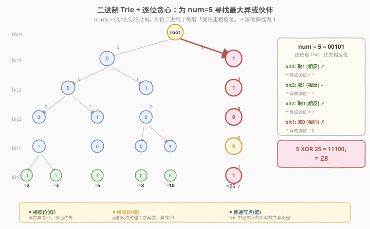
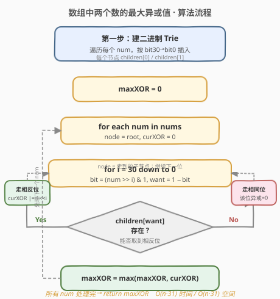
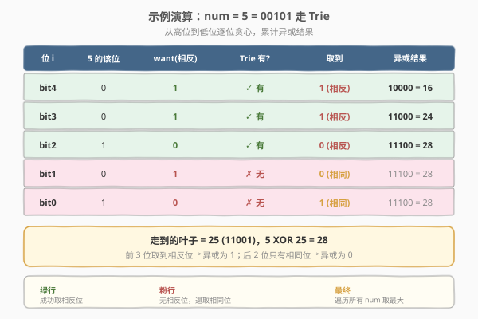

# 数组中两个数的最大异或值

- **题目名称**：数组中两个数的最大异或值
- **链接**：[421. 数组中两个数的最大异或值](https://leetcode.cn/problems/maximum-xor-of-two-numbers-in-an-array/)
- **难度**：中等
- **标签**：位运算、字典树、数组

## 1. 题目概述

给你一个整数数组 `nums`，返回数组中两个元素按位异或（$\oplus$）后的**最大结果**。

**示例 1**：

```text
输入：nums = [3,10,5,25,2,8]
输出：28
解释：5 XOR 25 = 28，即 00101 ⊕ 11001 = 11100。
```

**示例 2**：

```text
输入：nums = [14,70,53,83,84,91,56,65,41,0,76,37,13,10,45,6,64,75,30,5]
输出：34805
```

**约束条件**：

- `1 <= nums.length <= 2 * 10^5`
- `0 <= nums[i] <= 2^31 - 1`

> ⚠️ **两个易错点**：① `n` 可达 $2\times10^5$，暴力 $O(n^2)$ 必然超时；② 所有数非负，最高有效位不超过 `bit30`，用 31 位即可覆盖。

---

## 2. 解题思路

### 2.1 暴力思路

枚举所有数对 $(i, j)$ 计算异或取最大值，时间 $O(n^2)$，$n=2\times10^5$ 时约 $4\times10^{10}$ 次运算，远超时限。必须利用**位运算的逐位独立性**加速。

### 2.2 核心观察：二进制 Trie + 逐位贪心



异或运算有一条关键性质：**每一位互相独立**。要使 $a \oplus b$ 最大，应让结果的高位尽可能为 1——因为高位的一个 1 比所有低位全是 1 还要大（$2^k > \sum_{i=0}^{k-1}2^i$）。

由此得到贪心策略：**从最高位到最低位，逐位让结果尽量取 1**。对于数 $a$ 的第 $i$ 位：

- 若 $a$ 的该位是 $b$，我们**希望伙伴** $x$ 的该位是 $1-b$（相反），这样该位异或为 1；
- 若找不到相反位，只能取相同位，该位异或为 0，但不影响后续低位继续贪心。

> 💡 **为什么「相反位」能让异或为 1**：$0 \oplus 1 = 1$，$1 \oplus 0 = 1$；而 $0 \oplus 0 = 0$，$1 \oplus 1 = 0$。两位不同则异或为 1。

**如何快速判断「是否存在某个数，其第 $i$ 位是指定值」**？把所有数按二进制从 `bit30` 到 `bit0` 插入一棵**二进制 Trie**（每个节点只有 `children[0]` / `children[1]` 两个分支）。查询时沿树下行，每步优先走相反分支即可。这把「在一堆数里找最佳伙伴」从 $O(n)$ 降到 $O(31)$。

**算法两步走**：

1. **建 Trie**：遍历 `nums`，把每个数按 `bit30 → bit0` 逐位插入。
2. **查最大**：对每个数 $a$，从根出发逐位走，优先选 `want = 1 - bit` 的分支；走得到则该位异或为 1（`curXOR |= 1 << i`），否则走相同分支。

### 2.3 算法流程图



### 2.4 示例演算



以 `nums = [3,10,5,25,2,8]` 为例，5 位二进制表示：

| 数 | bit4 | bit3 | bit2 | bit1 | bit0 |
|----|------|------|------|------|------|
| 3  | 0 | 0 | 0 | 1 | 1 |
| 10 | 0 | 1 | 0 | 1 | 0 |
| 5  | 0 | 0 | 1 | 0 | 1 |
| 25 | 1 | 1 | 0 | 0 | 1 |
| 2  | 0 | 0 | 0 | 1 | 0 |
| 8  | 0 | 1 | 0 | 0 | 0 |

对 `num = 5 = 00101` 走 Trie：

| 位 i | 5 的该位 | want | Trie 有? | 取到 | 异或结果 |
|------|----------|------|----------|------|----------|
| bit4 | 0 | 1 | ✓ 有 | 1（相反） | `10000` = 16 |
| bit3 | 0 | 1 | ✓ 有 | 1（相反） | `11000` = 24 |
| bit2 | 1 | 0 | ✓ 有 | 0（相反） | `11100` = 28 |
| bit1 | 0 | 1 | ✗ 无 | 0（相同） | `11100` = 28 |
| bit0 | 1 | 0 | ✗ 无 | 1（相同） | `11100` = 28 |

走到叶子 = 25，$5 \oplus 25 = 28$。前三位成功取到相反位（异或为 1），后两位无相反分支只能取相同（异或为 0）。遍历所有数后取最大，答案仍是 28。

---

## 3. 参考代码

### C++

```cpp
// 二进制 Trie + 逐位贪心，O(n·31) / O(n·31)
class Solution {
public:
    int findMaximumXOR(vector<int>& nums) {
        struct Node {
            Node* child[2] = {nullptr, nullptr};
        };
        Node* root = new Node();
        for (int x : nums) {
            Node* cur = root;
            for (int i = 30; i >= 0; i--) {
                int b = (x >> i) & 1;
                if (!cur->child[b]) cur->child[b] = new Node();
                cur = cur->child[b];
            }
        }
        int ans = 0;
        for (int x : nums) {
            Node* cur = root;
            int val = 0;
            for (int i = 30; i >= 0; i--) {
                int b = (x >> i) & 1;
                int want = 1 - b;
                if (cur->child[want]) {
                    val |= (1 << i);
                    cur = cur->child[want];
                } else {
                    cur = cur->child[b];
                }
            }
            ans = max(ans, val);
        }
        return ans;
    }
};
```

### Python

```python
class Solution:
    def findMaximumXOR(self, nums: List[int]) -> int:
        class Node:
            __slots__ = ('child',)
            def __init__(self):
                self.child = [None, None]

        root = Node()
        for x in nums:
            cur = root
            for i in range(30, -1, -1):
                b = (x >> i) & 1
                if not cur.child[b]:
                    cur.child[b] = Node()
                cur = cur.child[b]

        ans = 0
        for x in nums:
            cur = root
            val = 0
            for i in range(30, -1, -1):
                b = (x >> i) & 1
                want = 1 - b
                if cur.child[want]:
                    val |= (1 << i)
                    cur = cur.child[want]
                else:
                    cur = cur.child[b]
            ans = max(ans, val)
        return ans
```

> 💡 **细节**：`want = 1 - b` 等价于「取反」，但比 `~b & 1` 更直观。`val |= (1 << i)` 只在走通相反位时累加，保证每步贪心只增不减。

---

## 4. 复杂度分析

| 维度 | Trie 方法 | 哈希集合方法（见第 5 节） |
|------|-----------|--------------------------|
| **时间** | $O(n \cdot 31)$ | $O(n \cdot 31)$ |
| **空间** | $O(n \cdot 31)$（Trie 节点，前缀共享后更少） | $O(n)$（每轮一个哈希集合） |
| **可读性** | 直观，贪心路径可视化 | 巧妙，需要理解「试填高位」思想 |
| **适用场景** | 需要查询每个数的最佳伙伴 | 只需最大值，空间受限 |

> ⚠️ **为什么是 31 不是 32**：题目保证 $0 \le nums[i] \le 2^{31}-1$，最高有效位是 `bit30`（`bit31` 恒为 0），枚举 `i = 30 … 0` 即可。

---

## 5. 扩展：哈希集合 + 逐位贪心

不用 Trie 也能做到 $O(n \cdot 31)$。思路是**从高位到低位逐位「试填」答案**：

1. 维护当前答案 `ans`（已确定的高位）和掩码 `mask`（已考虑的位）。
2. 每轮尝试把第 $i$ 位填 1，得 `candidate = ans | (1 << i)`。
3. 取所有数的高位前缀 `p = x & mask` 放入集合，判断是否存在两个前缀异或等于 `candidate`：由 $a \oplus b = c \Leftrightarrow a = b \oplus c$，只需检查是否存在 $p$ 使 $p \oplus candidate$ 也在集合中。
4. 存在则 `ans = candidate`，否则该位填不了 1，`ans` 不变。

```python
class Solution:
    def findMaximumXOR(self, nums: List[int]) -> int:
        ans = 0
        mask = 0
        for i in range(30, -1, -1):
            mask |= (1 << i)
            prefixes = {x & mask for x in nums}
            candidate = ans | (1 << i)
            for p in prefixes:
                if (p ^ candidate) in prefixes:
                    ans = candidate
                    break
        return ans
```

两种方法本质相同——都是「逐位贪心让高位为 1」，只是 Trie 用树结构定位伙伴，哈希集合用「$a = b \oplus c$」的等价变形定位。

---

## 6. 面试要点

1. **为什么从高位到低位贪心是正确的？**

   - 二进制中 $2^k > \sum_{i=0}^{k-1} 2^i$，高位一个 1 的价值超过所有低位全为 1。所以只要高位能取到 1 就必须取，低位不能逆转高位的优势。这正是逐位贪心「优先高位」的理论依据。

2. **`want = 1 - b` 是什么意思？为什么这么写？**

   - 对一位二进制 $b \in \{0,1\}$，$1-b$ 就是取反：$b=0 \to want=1$，$b=1 \to want=0$。比 `~b & 1` 或 `b ^ 1` 更易读，含义是「希望伙伴的该位与 $b$ 相反，从而使异或为 1」。

3. **Trie 的空间最坏是多少？实际会到吗？**

   - 最坏 $n \cdot 31$ 个节点。但由于大量数共享高位前缀（例如同为 0 开头），实际节点数远小于理论上界。若内存敏感，可用第 5 节的哈希集合法把空间降到 $O(n)$。

4. **Trie 法和哈希集合法各有什么优劣？**

   - Trie 法直观、可扩展（能查询每个数的最佳伙伴、支持限制查询如 1707），但需建树占 $O(n\cdot31)$ 空间；哈希集合法空间只需 $O(n)$、代码更短，但「试填 + 等价变形」的思路较巧妙，面试中解释清楚有一定难度。

5. **若 `nums` 含负数怎么办？**

   - 本题保证非负。若推广到负数，需统一用固定位数（如 32 位）的**补码**表示插入 Trie，比较时仍从最高位逐位贪心即可，原理不变。

---

## 7. 同类练习题

- [208. 实现 Trie（前缀树）](https://leetcode.cn/problems/implement-trie-prefix-tree/)（[题解](../0201-0300/208_实现Trie.md)）：字符串 Trie 基础模板，本题把字符换成 0/1 位
- [1707. 与数组中元素的最大异或值](https://leetcode.cn/problems/maximum-xor-with-an-element-from-array/)：本题加查询限制的进阶版，离线排序 + 二进制 Trie
- [1803. 统计异或值在范围内的数对有多少](https://leetcode.cn/problems/count-pairs-with-xor-in-a-range/)：在 Trie 上记录子树大小做计数，困难
- [136. 只出现一次的数字](https://leetcode.cn/problems/single-number/)（[题解](../0001-0100/136_只出现一次的数字.md)）：异或运算的基础性质（自反性、交换律），位运算入门
